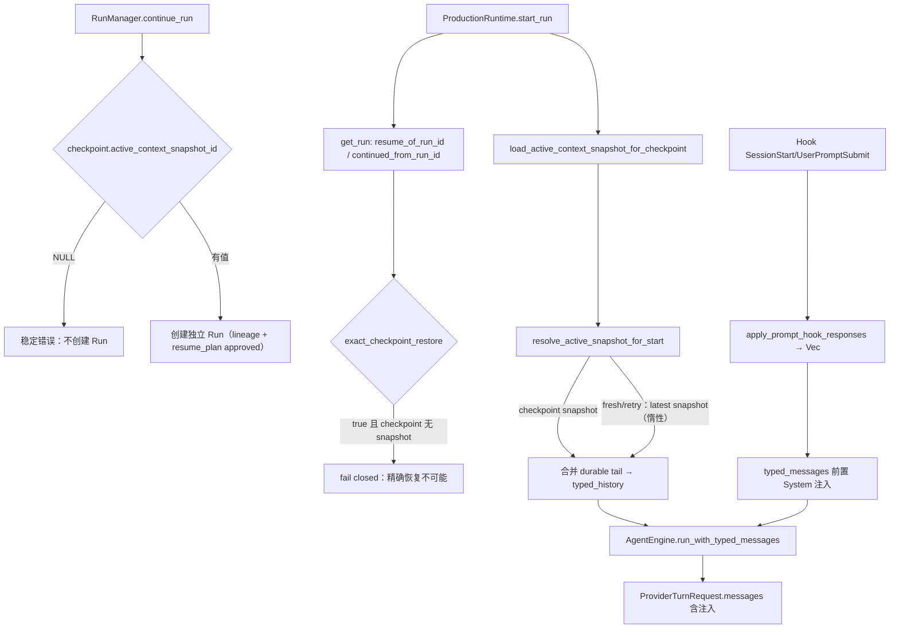

# Agent Core 审计整改实施报告

## 1. 基线

- Worktree：`/Users/ldh/Downloads/project/AiNative/Natives-agent-core-deepening`
- Branch：`feat/agent-core-deepening`
- Start HEAD：`1b78e34104b1a7a5bbd600b689d8bbd1fe33b927`
- End HEAD：本批提交（以当前 Worktree `git rev-parse HEAD` 为准）
- Working Tree：批次 0 提交后干净（独立审计生成的三个文档 `agent-core-sol-independent-audit.md`、`agent-core-sol-remediation-plan.md`、`luna-agent-core-remediation-prompt.md` 为未跟踪文件，保留不动）
- Shared Target：`/Users/ldh/Downloads/project/AiNative/Natives/.cargo-target-shared` 7.5 GiB（<35 GiB 门槛）
- Disk：可用 47 GiB（>20 GiB 测试门槛，>15 GiB Cargo 门槛）
- 本批只实施「批次 0：最低合并门槛」。批次 1–4 未开发。

## 2. P0/P1/P2 状态

| 问题 | 原状态 | 当前状态 | 生产证据 | 测试 |
|---|---|---|---|---|
| P0.1 Typed Hook Inject 静默失效 | `apply_prompt_hook_responses` 写旧 `config.messages`（`Vec<EngineMessage>`），typed 生产分支忽略 | **已修复**：`apply_prompt_hook_responses` 返回注入文本，`run_inner` 把注入内容前置为 typed `AgentMessage::System`，下一次 `ProviderTurnRequest.messages` 必然携带；不再写被旁路的 EngineMessage 列表 | `engine.rs::run_inner` 采集两个 Hook 事件注入并 `splice(0..0, …)` 到 typed transcript | `typed_hook_inject_reaches_provider_turn_request` 先红（请求只有 User）后绿 |
| P0.2 Continue 非精确恢复 | `continue_run` 只在 snapshot_id 为 Some 时校验；None 仍批准；`start_run` 回退 `checkpoint_snapshot.or(latest)` | **已修复**：`continue_run` 对 `active_context_snapshot_id IS NULL` 返回稳定错误且不创建 Run；`start_run` 对 Continue 血统（`resume_of_run_id`/`continued_from_run_id` 任一）只加载 checkpoint 绑定 snapshot，缺失即 fail closed，绝不回退 latest/full history；fresh/retry 保持原 latest 缓存语义 | `run_manager.rs::continue_run` 强制 snapshot 存在；`production.rs::resolve_active_snapshot_for_start` + `exact_checkpoint_restore` 判定 | `continue_rejects_checkpoint_without_active_snapshot` 先红后绿；`continue_without_checkpoint_snapshot_fails_closed_even_with_latest`、`checkpoint_snapshot_wins_over_latest_without_consulting_it`、`fresh_run_falls_back_to_latest_conversation_snapshot` 绿；`continue_creates_lineage_from_durable_checkpoint` 回归绿 |
| P0.3 最终验收门 | 无最终 HEAD workspace/native/frontend 全量绿色退出 | **未完成**：本批只运行精准测试 + 一次受控 check；workspace/native/frontend 全量按批次 4 在最终 HEAD 统一执行 | 不适用 | 见第 7 节；全量命令均「未运行」 |
| P1.1 Snapshot crash gap | event 与 row 延迟投影 | 未开始（批次 2） | — | — |
| P1.2 Typed 无损（Custom/附件/ToolResult MessageId） | 有损 | 未开始（批次 1） | — | — |
| P1.3 `run.resume` + Safe/Confirm/Blocked | 仅骨架 | 未开始（批次 2） | — | — |
| P1.4 Subagent route restart scope | 丢失 | 未开始（批次 2） | — | — |
| P1.5 Gateway per-tool mode/conflict key | 仅 SideEffect 推导 | 未开始（批次 3） | — | — |
| P1.6 Progress 统一与集成测试 | 双路径、缺外部 fixture | 未开始（批次 3） | — | — |
| P2.1–P2.4 | 收口/文档 | 未开始（批次 2–4 与文档报告） | — | — |

uncertain 守卫：`continue_run` 的 `status = 'uncertain'` 拒绝逻辑（`run_manager.rs`）位于 snapshot 校验之后，本次未触碰；retry/continue 的 blocked resume_plan 落库逻辑保持。

## 3. 批次

### 批次 0（本批完成）

- 修改：
  1. `crates/agent-core/src/engine.rs`：`apply_prompt_hook_responses` 返回 `Vec<String>` 注入内容并停止写 `config.messages`；`run_inner` 把 SessionStart + UserPromptSubmit 的注入按序前置为 `AgentMessage::System`；新增测试 `typed_hook_inject_reaches_provider_turn_request`。
  2. `src-agent-daemon/src/run_manager.rs`：`continue_run` 对 `active_context_snapshot_id IS NULL` 返回稳定错误，不创建 Run；新增测试 `continue_rejects_checkpoint_without_active_snapshot`。
  3. `src-agent-daemon/src/production.rs`：抽取 `resolve_active_snapshot_for_start` 纯函数；`start_run` 按 `exact_checkpoint_restore`（`resume_of_run_id`/`continued_from_run_id`）严格恢复 checkpoint snapshot，缺失 fail closed，latest 回退仅保留给 fresh/retry 且保持惰性；新增 `active_snapshot_resolution_tests` 模块（3 测试）。
  4. 四份历史实施/进度报告加「状态纠正」横幅；新建本实施报告。
- 不变量：RunManager 仍是唯一 Run terminal authority；无新增 Turn framework、DB 表、UI 或 Protocol 变更；uncertain 不自动恢复；fresh/retry 的 latest-snapshot 缓存语义不变；legacy `run()` 路径（无 typed transcript）同样获得前置注入（一致性，不再依赖 config.messages 副作用）。
- 测试：见第 7 节。先红后绿：`typed_hook_inject_reaches_provider_turn_request`、`continue_rejects_checkpoint_without_active_snapshot`。

### 批次 1
未开始。

### 批次 2
未开始。

### 批次 3
未开始。

### 批次 4
未开始。

## 4. 生产调用链变化

## 5. 数据库与 Protocol

| 变更 | 兼容策略 | 回滚 |
|---|---|---|
| 无（本批不增表、不改列、不加 migration） | 现有 `checkpoint.active_context_snapshot_id` 与 `context_snapshot` FK 语义直接使用 | 无 DB 回滚面 |
| Protocol：无 | 无 | 无 |

## 6. 修改文件

| 文件 | 原因 |
|---|---|
| `crates/agent-core/src/engine.rs` | 修复 typed Hook Inject 旁路；新增测试 |
| `src-agent-daemon/src/run_manager.rs` | Continue 无 snapshot checkpoint fail closed；新增测试 |
| `src-agent-daemon/src/production.rs` | start_run 精确 checkpoint 恢复，禁止 latest 回退；新增 helper + 测试 |
| `docs/architecture/agent-core-deepening-implementation-report.md` | 状态纠正（独立审计后） |
| `docs/architecture/agent-core-deepening-progress.md` | 状态纠正（独立审计后） |
| `docs/architecture/agent-core-final-integration-report.md` | 状态纠正（独立审计后） |
| `docs/architecture/agent-core-production-integration-report.md` | 状态纠正（独立审计后） |
| `docs/architecture/agent-core-sol-remediation-implementation-report.md` | 本实施报告（新建） |

## 7. 测试真实结果

| 命令 | 退出码 | 结果 | 是否最终 HEAD |
|---|---:|---|---:|
| `cargo test -p agent-core typed_hook_inject_reaches_provider_turn_request -- --test-threads=2`（修复前） | 1 | 红：ProviderTurnRequest 无注入 System 消息 | 否（修复前 HEAD） |
| `cargo test -p agent-core typed_hook_inject_reaches_provider_turn_request -- --test-threads=2`（修复后） | 0 | 绿：1 passed | 是（本批最终工作树） |
| `cargo test -p natives-agent-daemon continue_rejects_checkpoint_without_active_snapshot -- --test-threads=2`（修复前） | 1 | 红：continue_run 接受无 snapshot checkpoint 并创建 Run | 否（修复前 HEAD） |
| `cargo test -p natives-agent-daemon continue_ -- --test-threads=2`（修复后） | 0 | 绿：3 passed（含 `continue_without_checkpoint_snapshot_fails_closed_even_with_latest`） | 是 |
| `cargo test -p natives-agent-daemon active_snapshot_resolution -- --test-threads=2`（修复后） | 0 | 绿：3 passed | 是 |
| `cargo fmt --check`（修复后） | 0 | 格式干净（仅本批两个文件有差异，已定向格式化） | 是 |
| `cargo check -p agent-core -p capability-gateway -p provider-adapters -p assistant-protocol -p natives-agent-daemon` | 0 | 5 crates 编译通过 | 是 |
| `cargo test --workspace -- --test-threads=2` | 未运行 | 批次 4 统一执行 | — |
| `npm run protocol:check` | 未运行 | 批次 4 | — |
| `npm run verify:native-engine` | 未运行 | 批次 4 | — |
| `npm run typecheck` / `lint` / `test` / `perf:check` | 未运行 | 批次 4 | — |

注：`cargo fmt --check` 首次运行报告 4 处差异，全部位于本批新增/修改的两个 Rust 文件，未涉及无关文件；已用 `cargo fmt -- <files>` 定向修复。`continue_` 过滤器匹配到 3 个测试（两个 continue 相关 + `continue_without_checkpoint_snapshot_fails_closed_even_with_latest`），全部绿。

## 8. 未完成与环境阻塞

- 批次 1（Typed Message/Turn 主链）、批次 2（持久化与恢复）、批次 3（工具与输入闭环）、批次 4（Renderer 与最终验收）未开发。
- P0.3 最终验收门未满足：workspace、native verifier、frontend full suite 未在最终 HEAD 运行（按批次 4 统一执行；资源门槛当前满足：磁盘 47 GiB、Target 7.5 GiB）。
- 真实 Provider/Shell/MCP/permission fixture 需要外部服务或凭证，环境未验证；本批未触碰，仍按「未验证」记录。

## 9. 完成标准逐项判定

| Goal | 已完成/部分完成/未完成 | 证据 |
|---|---|---|
| P0.1 Hook Inject 出现在 typed Provider Request | 已完成（本批） | `typed_hook_inject_reaches_provider_turn_request` 绿；`ProviderTurnRequest.messages` 含注入 `System` 消息 |
| P0.2 snapshot_id=None 的 checkpoint 不创建可启动 Continue Run | 已完成（本批） | `continue_rejects_checkpoint_without_active_snapshot` 绿；错误返回且无 approved resume_plan |
| P0.2 旧 checkpoint 与更晚 snapshot 并存时只用旧 checkpoint snapshot | 已完成（本批） | `checkpoint_snapshot_wins_over_latest_without_consulting_it` 绿；`resolve_active_snapshot_for_start` 对 checkpoint snapshot 优先且不咨询 latest |
| P0.2 uncertain guard 保持 | 已完成（本批，结构保持） | `continue_run` uncertain 拒绝代码未触碰；无专门测试覆盖（审计已记录缺 fault injection） |
| P0.3 最终验收全量绿色退出 | 未完成 | 未运行；见第 7 节 |

## 10. Commit

- 本批一个本地提交（以当前 Worktree `git rev-parse HEAD` 为准，提交信息见 `git log`）。未 Push，未开 PR。

## 11. 风险与回滚

- 回滚：整批一个提交，`git revert <batch-0-commit>` 或 `git reset` 到 Start HEAD 即可整体回滚；无 migration 028 改动，无 DB/Protocol 回滚面。
- 行为边界：注入前置为 `AgentMessage::System` 是确定性位置选择（legacy 与 typed 路径一致）；若产品要求注入位置「紧跟当前用户消息之后」，属后续语义决策，不在本批范围。
- 风险：`start_run` 对 `resume_of_run_id`/`continued_from_run_id` 的判定依赖这两个字段只由 `continue_run` 设置（已用全仓 grep 证实仅 run_manager.rs 两处赋值）；未来若新增 Resume 生产路径设置该字段，必须同时保证 checkpoint 绑定 snapshot，否则 start_run 会 fail closed（保守方向正确）。
