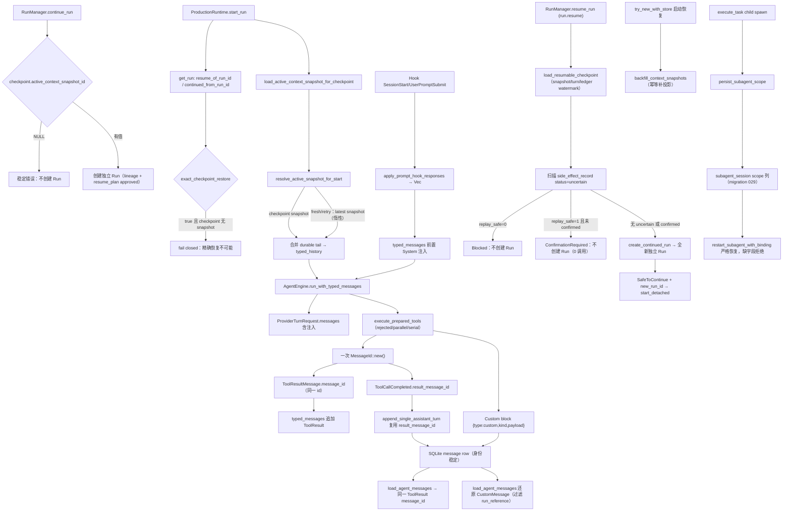

# Agent Core 审计整改实施报告

## 1. 基线

- Worktree：`/Users/ldh/Downloads/project/AiNative/Natives-agent-core-deepening`
- Branch：`feat/agent-core-deepening`
- Start HEAD（批次 0）：`1b78e34104b1a7a5bbd600b689d8bbd1fe33b927`
- 批次 0 End：`631da17f33c48c5acf5d1220de90bc50639be4c6`（已提交）
- 批次 1 End：`ca901dfaa362764b87982b81dc32dd686d12a56d`（已提交）
- 批次 2 Start：`ca901dfaa362764b87982b81dc32dd686d12a56d`；批次 2 End：以当前 Worktree `git rev-parse HEAD` 为准（待提交）
- Working Tree：批次 0/1 提交后干净；批次 2 改动未提交（提交后干净）。独立审计生成的三个文档为未跟踪文件，保留不动。
- Shared Target：`/Users/ldh/Downloads/project/AiNative/Natives/.cargo-target-shared` 7.5 GiB（<35 GiB 门槛）
- Disk：可用 47 GiB（>20 GiB 测试门槛，>15 GiB Cargo 门槛）
- 已实施：批次 0（最低合并门槛）、批次 1（Typed Message / Turn 主链）、批次 2（持久化与恢复）。批次 3–4 未开发。

## 2. P0/P1/P2 状态

| 问题 | 原状态 | 当前状态 | 生产证据 | 测试 |
|---|---|---|---|---|
| P0.1 Typed Hook Inject 静默失效 | `apply_prompt_hook_responses` 写旧 `config.messages`（`Vec<EngineMessage>`），typed 生产分支忽略 | **已修复**：`apply_prompt_hook_responses` 返回注入文本，`run_inner` 把注入内容前置为 typed `AgentMessage::System`，下一次 `ProviderTurnRequest.messages` 必然携带；不再写被旁路的 EngineMessage 列表 | `engine.rs::run_inner` 采集两个 Hook 事件注入并 `splice(0..0, …)` 到 typed transcript | `typed_hook_inject_reaches_provider_turn_request` 先红（请求只有 User）后绿 |
| P0.2 Continue 非精确恢复 | `continue_run` 只在 snapshot_id 为 Some 时校验；None 仍批准；`start_run` 回退 `checkpoint_snapshot.or(latest)` | **已修复**：`continue_run` 对 `active_context_snapshot_id IS NULL` 返回稳定错误且不创建 Run；`start_run` 对 Continue 血统（`resume_of_run_id`/`continued_from_run_id` 任一）只加载 checkpoint 绑定 snapshot，缺失即 fail closed，绝不回退 latest/full history；fresh/retry 保持原 latest 缓存语义 | `run_manager.rs::continue_run` 强制 snapshot 存在；`production.rs::resolve_active_snapshot_for_start` + `exact_checkpoint_restore` 判定 | `continue_rejects_checkpoint_without_active_snapshot` 先红后绿；`continue_without_checkpoint_snapshot_fails_closed_even_with_latest`、`checkpoint_snapshot_wins_over_latest_without_consulting_it`、`fresh_run_falls_back_to_latest_conversation_snapshot` 绿；`continue_creates_lineage_from_durable_checkpoint` 回归绿 |
| P0.3 最终验收门 | 无最终 HEAD workspace/native/frontend 全量绿色退出 | **未完成**：本批只运行精准测试 + 一次受控 check；workspace/native/frontend 全量按批次 4 在最终 HEAD 统一执行 | 不适用 | 见第 7 节；全量命令均「未运行」 |
| P1.1 Snapshot crash gap | event 与 row 延迟投影 | **已修复（批次 2）**：`backfill_context_snapshots` 在 daemon 启动时从 `context_snapshot_committed` 事件幂等补投影缺失 row；投影按 (run_id, sequence) 去重，重复运行安全 | `try_new_with_store` 启动恢复调用（best-effort）；`persist_context_snapshots_from_events` 复用 | `backfill_context_snapshots_materializes_missing_row_from_committed_event`（含幂等复跑断言） |
| TurnOutcome / Turn identity（提示词 P1.1） | `turn.rs::TurnOutcome` 无生产引用（死代码）；ToolResult MessageId 在 Daemon replay 重造 | **已处理（批次 1）**：删除 `TurnOutcome`/`Usage`（全仓零引用）；Turn 单位由稳定 ToolResult 身份 + TurnStarted/TurnCompleted + turn row + retry/next-turn 测试证明；ToolResult MessageId 经 `ToolCallCompleted.result_message_id` additive 字段在 event→SQLite→reload 保持 | `execute_prepared_tools` 三路径创建一次 id 并随事件提交；`append_single_assistant_turn` 复用 | `typed_turn_event_replay_preserves_tool_result_message_id`、`tool_turn_then_text_turn_are_distinct_turns`、`retries_retryable_provider_stream_open_errors`（1 Turn 内 retry） |
| P1.2 Typed 无损（Custom/附件/ToolResult MessageId） | Custom 无法 reload（DB + snapshot 均失败）；附件降为文本；ToolResult MessageId 重造 | **已修复（批次 1）**：Custom DB block `{type:"custom",kind,payload}` 可 reload，snapshot 用 `role:"custom"+kind+payload` 无损；ToolResult MessageId 稳定；附件按计划在唯一转换边界（`parse_content_block` file_reference → 显式文本 marker）明确降级并有测试 | `agent_message_parts`/`load_agent_messages` custom 分支；snapshot 编解码 custom role；`append_single_assistant_turn` result_message_id | `custom_message_round_trips_through_sqlite`、`custom_snapshot_round_trips_losslessly`、`file_reference_degrades_to_explicit_text_marker_at_single_boundary` |
| P1.3 `run.resume` + Safe/Confirm/Blocked | 仅骨架 | **已实现（批次 2）**：`run.resume` RPC + `resume_run` decision builder；读取 source run + checkpoint + snapshot + ledger 输出 SafeToContinue / ConfirmationRequired / Blocked；uncertain 且 replay_safe=1 未确认 → ConfirmationRequired（不创建 Run，0 调用）；uncertain 且 replay_safe=0 → Blocked（不可确认）；确认或安全 → 创建全新独立 Run（不复活旧 Future/waiter/credential lease） | `run_manager.rs::resume_run` + `load_resumable_checkpoint` + `create_continued_run`；`authority.rs`/`rpc.rs` 派发 | `resume_uncertain_returns_confirmation_required_without_creating_run`、`resume_confirmed_creates_independent_run`、`resume_blocked_on_non_replay_safe_uncertain` |
| P1.4 Subagent route restart scope | 丢失 | **已修复（批次 2）**：migration 029 给 `subagent_session` 加 project_path/project_id/identity/permission/profile/max_steps/allowlist 列；spawn 时 `persist_subagent_scope` 持久化；`restart_subagent_with_binding` 从 durable session 严格恢复 scope，缺 project/permission/max_steps 字段即拒绝，不再写死 ask/max_steps=15 | `subagent_store::persist_subagent_scope`；`production_tools.rs` spawn 后写入；`production.rs` restart 读取并 fail closed | `subagent_scope_persists_and_round_trips`、`create_hidden_child_session_persists_permission_and_project_id` |
| P1.5 Gateway per-tool mode/conflict key | 仅 SideEffect 推导 | 未开始（批次 3） | — | — |
| P1.6 Progress 统一与集成测试 | 双路径、缺外部 fixture | 未开始（批次 3） | — | — |
| P2.1–P2.4 | 收口/文档 | 未开始（批次 2–4 与文档报告） | — | — |

uncertain 守卫：`continue_run` 的 `status = 'uncertain'` 拒绝逻辑（`run_manager.rs`）位于 snapshot 校验之后，本次未触碰；retry/continue 的 blocked resume_plan 落库逻辑保持。

## 3. 批次

### 批次 0（本批完成）

- 修改：
  1. `crates/agent-core/src/engine.rs`：`apply_prompt_hook_responses` 返回 `Vec<String>` 注入内容并停止写 `config.messages`；`run_inner` 把 SessionStart + UserPromptSubmit 的注入按序前置为 `AgentMessage::System`；新增测试 `typed_hook_inject_reaches_provider_turn_request`。
  2. `src-agent-daemon/src/run_manager.rs`：`continue_run` 对 `active_context_snapshot_id IS NULL` 返回稳定错误，不创建 Run；新增测试 `continue_rejects_checkpoint_without_active_snapshot`。
  3. `src-agent-daemon/src/production.rs`：抽取 `resolve_active_snapshot_for_start` 纯函数；`start_run` 按 `exact_checkpoint_restore`（`resume_of_run_id`/`continued_from_run_id`）严格恢复 checkpoint snapshot，缺失 fail closed，latest 回退仅保留给 fresh/retry 且保持惰性；新增 `active_snapshot_resolution_tests` 模块（3 测试）。
  4. 四份历史实施/进度报告加「状态纠正」横幅；新建本实施报告。
- 不变量：RunManager 仍是唯一 Run terminal authority；无新增 Turn framework、DB 表、UI 或 Protocol 变更；uncertain 不自动恢复；fresh/retry 的 latest-snapshot 缓存语义不变；legacy `run()` 路径（无 typed transcript）同样获得前置注入（一致性，不再依赖 config.messages 副作用）。
- 测试：见第 7 节。先红后绿：`typed_hook_inject_reaches_provider_turn_request`、`continue_rejects_checkpoint_without_active_snapshot`。

### 批次 1（本批完成）

- 修改：
  1. `crates/assistant-protocol/src/v2/run_event.rs`：`ToolCallCompleted` 增加 additive `result_message_id: Option<String>`（`#[serde(default)]`），旧事件可解码（None），新事件仅在 Some 时序列化。
  2. `crates/agent-core/src/engine.rs`：
     - `ExecutedToolCall` 携带 `result_message_id`；`execute_prepared_tools` 三条路径（rejected/parallel/serial）在发射 `ToolCallCompleted` 前创建一次 `MessageId`，事件与 `ExecutedToolCall` 共用同一 id；`run_inner` 用该 id 构造 `ToolResultMessage`，不再 `MessageId::new()`。
     - snapshot 编解码：`agent_messages_to_values` 把 Custom 序列化为 `{role:"custom", kind, message_id, payload}`（原为 `role:kind` + payload 字符串化，丢失结构）；`try_agent_messages_from_json` 严格解码器增加 `"custom"` role 校验；`values_to_agent_messages` 增加显式 `"custom"` 解码（保留旧 `kind` 兜底兼容历史 snapshot）。
     - 新增测试：`tool_turn_then_text_turn_are_distinct_turns`（工具 Turn + 下一文本 Turn 两个不同 turn_id；ToolCallCompleted 携带 result_message_id）、`custom_snapshot_round_trips_losslessly`（Custom kind/payload + ToolResult 身份经 snapshot 无损）；扩展 `retries_retryable_provider_stream_open_errors`（3 次 attempt 只在 1 个 Turn 内）；修正 `completes_simple_text_turn` 删除对引擎不发射的 `Started` 事件断言（该断言仅靠陈旧磁盘事件日志通过）。
  3. `crates/agent-core/src/turn.rs` 删除：`TurnOutcome`/`Usage` 全仓零引用（死代码），按计划验收「删除该类型并以等价 committed typed payload 证明 Turn 单位」；`lib.rs` 移除 `pub mod turn;` / `pub use turn::*;`。Turn 单位由稳定 ToolResult 身份 + TurnStarted/TurnCompleted 事件 + `turn` DB row + retry/next-turn 测试证明。
  4. `src-agent-daemon/src/conversation_store.rs`：
     - Custom DB codec：`agent_message_parts` 写 `{type:"custom", kind, payload}`（原为任意 block type，`parse_content_block` 拒绝导致无法 reload）；`load_agent_messages` 检测 `custom` block 并从 `content` 还原 kind+payload。
     - `append_single_assistant_turn` 读取 `ToolCallCompleted.result_message_id`，event→SQLite 重放保持 Core 提交的 ToolResult 身份（缺失时仅对旧事件 `MessageId::new()`）。
     - `load_agent_messages` 过滤 `run_reference` 元数据 block（修复后续 run 重载同会话 assistant 消息时的 `unsupported block type run_reference` 失败——这是暴露的真实生产 reload 缺口）。
     - 新增测试：`custom_message_round_trips_through_sqlite`、`typed_turn_event_replay_preserves_tool_result_message_id`、`file_reference_degrades_to_explicit_text_marker_at_single_boundary`。
  5. `src-agent-daemon/src/cli_runtime_bridge.rs`：CLI 合成 `ToolCallCompleted` 补 `result_message_id: None`（CLI 模式无 Core ToolResult 身份，fallback 新 id）。
- 不变量：不建第二套 Loop；不重写 Conversation DB（复用 message/message_block，无 migration）；Protocol 仅 additive 字段（旧 reader 忽略）；TurnStarted/TurnCompleted 事件顺序与 fail-closed 路径不变；`ToolCallCompleted` 先于 `ToolResultMessage` 构造，同一 id 只在 execute 路径创建一次。
- 测试：见第 7 节。先红后绿（修复前）：
  - `custom_message_round_trips_through_sqlite`：修复前 load 得 `kind:"custom", payload:Null`（block 结构不闭合）。
  - `typed_turn_event_replay_preserves_tool_result_message_id`：修复前 `append_single_assistant_turn` 用 `MessageId::new()` 重造 id，且 assistant 消息 reload 撞 `run_reference`。
  - 既有测试缺陷修正：`completes_simple_text_turn` 的 `Started` 断言（引擎不发射，RunManager 拥有）删除；`session_end_hook_fires_after_success` 等固定 run_id 测试依赖 `~/.natives/events` 陈旧日志的问题记录为环境缺陷，未改动测试逻辑（本批新增测试均用 UUID run_id 避免污染）。

### 批次 2（本批完成）

- 修改：
  1. `src-agent-daemon/src/conversation_store.rs`：新增 `backfill_context_snapshots`——daemon 启动时扫描 `run_event` 中 `context_snapshot_committed` 事件，幂等投影缺失的 `context_snapshot` row（复用 `persist_context_snapshots_from_events` 的按 (run_id, sequence) 去重）；新增测试 `backfill_context_snapshots_materializes_missing_row_from_committed_event`（含幂等复跑断言）。
  2. `src-agent-daemon/src/run_manager.rs`：
     - 提取 `load_resumable_checkpoint`（共享 checkpoint 校验：snapshot/turn/ledger watermark 全部非空，snapshot row 存在）与 `create_continued_run`（唯一 run 创建路径）；`continue_run` 重构为「校验 → uncertain 守卫 → 创建」；新增 watermark 校验（无 turn 或 ledger cursor 拒绝）。
     - 新增 `resume_run`（`run.resume`）：读取 source run + checkpoint + ledger，输出 `ResumeDecision`；uncertain 且 replay_safe=1 未确认 → `ConfirmationRequired`（不创建 Run，0 调用）；uncertain 且 replay_safe=0 → `Blocked`；确认或安全 → `create_continued_run` 创建全新独立 Run，resume_plan 记录 approved。
     - 启动恢复加 best-effort `backfill_context_snapshots` 调用。
     - 新增测试：`continue_rejects_checkpoint_without_ledger_watermark`、`resume_uncertain_returns_confirmation_required_without_creating_run`、`resume_confirmed_creates_independent_run`、`resume_blocked_on_non_replay_safe_uncertain`、`resume_fixture` 共享 fixture。
  3. `crates/assistant-protocol/src/v2/run.rs`：新增 `ResumeRunRequest`（含 `confirmed`）、`ResumeDecision`（SafeToContinue/ConfirmationRequired/Blocked）、`ResumeRunResponse`。
  4. `crates/assistant-protocol/src/v2/methods.rs`：`RUN_RESUME` const + 三处方法清单加入 `run.resume`。
  5. `src-agent-daemon/src/authority.rs`、`src-agent-daemon/src/rpc.rs`：`run.resume` RPC 派发（SafeToContinue 时 start_detached，Confirm/Blocked 返回决策不创建 Run）。
  6. `src-agent-daemon/src/storage/migrations.rs`：新增 MIGRATION_029——`subagent_session` 加 project_path/project_id/project_identity_version/permission_profile/agent_profile_id/max_steps/tool_allowlist_json（additive）。
  7. `src-agent-daemon/src/subagent_store.rs`：`SubagentSession` 扩展 scope 字段；`SubagentScope` + `persist_subagent_scope`；`create_hidden_child_session` 持久化 project_id + permission_profile；`row_to_session`/`SESSION_SELECT`/`insert_subagent_session` 覆盖新列；新增测试 `subagent_scope_persists_and_round_trips`、`create_hidden_child_session_persists_permission_and_project_id`。
  8. `src-agent-daemon/src/production_tools.rs`：child spawn 后 `persist_subagent_scope` 持久化完整 scope。
  9. `src-agent-daemon/src/production.rs`：`restart_subagent_with_binding` 从 durable session 严格恢复 project_path/permission/profile/max_steps/allowlist，缺字段拒绝；不再写死 ask/max_steps=15。
- 不变量：`run.resume` 只创建新 Run（`create_continued_run` 全新 RunV2），不复活旧 Future/waiter/credential lease；uncertain 未确认时 Provider/Tool invocation 为 0（ConfirmationRequired/Blocked 不创建 Run）；不自动重放 Shell/MCP、不自动外部补偿、不重写会话树；`continue_run` 语义保持（lineage/plan 不变，仅校验变严）；migration 029 仅 additive。
- 测试：见第 7 节。先红后绿：`continue_rejects_checkpoint_without_ledger_watermark`（修复前无 ledger 校验）、`resume_*`（修复前无 run.resume）。

### 批次 3
未开始。

### 批次 4
未开始。

## 4. 生产调用链变化

## 5. 数据库与 Protocol

| 变更 | 兼容策略 | 回滚 |
|---|---|---|
| DB（批次 2）：MIGRATION_029 给 `subagent_session` 加 7 个 scope 列（project_path/project_id/project_identity_version/permission_profile/agent_profile_id/max_steps/tool_allowlist_json） | additive ALTER，旧行 NULL；restart 对 NULL 字段 fail closed | 回滚只需不读新列；列保留无副作用 |
| Protocol（批次 1）：`ToolCallCompleted.result_message_id: Option<String>`（additive） | 旧事件解码为 None；新 reader 忽略缺失 | 字段可忽略，无需迁移 |
| Protocol（批次 2）：`run.resume` + `ResumeRunRequest`/`ResumeDecision`/`ResumeRunResponse` | 新 RPC，additive；`confirmed` 默认 false | 未接入的 client 不调用即无影响；可禁派发 |

## 6. 修改文件

| 文件 | 原因 |
|---|---|
| `crates/agent-core/src/engine.rs` | 批次 0：typed Hook Inject；批次 1：ToolResult MessageId + snapshot Custom codec + Turn 结构测试 |
| `crates/agent-core/src/lib.rs` | 批次 1：移除 `pub mod turn` / `pub use turn::*`（删除死代码 TurnOutcome） |
| `crates/agent-core/src/turn.rs` | 批次 1：删除（`TurnOutcome`/`Usage` 全仓零引用） |
| `crates/assistant-protocol/src/v2/run_event.rs` | 批次 1：`ToolCallCompleted` 增加 additive `result_message_id` |
| `src-agent-daemon/src/run_manager.rs` | 批次 0：Continue 无 snapshot fail closed；新增测试 |
| `src-agent-daemon/src/production.rs` | 批次 0：start_run 精确 checkpoint 恢复；新增 helper + 测试 |
| `src-agent-daemon/src/conversation_store.rs` | 批次 1：Custom/ToolResult identity/run_reference/附件；批次 2：`backfill_context_snapshots` + 测试 |
| `src-agent-daemon/src/run_manager.rs` | 批次 0：Continue 无 snapshot；批次 2：watermark 校验 + `resume_run` + 共享 helper + 启动 backfill + 测试 |
| `src-agent-daemon/src/production.rs` | 批次 0：start_run 精确恢复；批次 2：`restart_subagent_with_binding` 严格 scope 恢复 |
| `src-agent-daemon/src/production_tools.rs` | 批次 2：child spawn 后 `persist_subagent_scope` |
| `src-agent-daemon/src/subagent_store.rs` | 批次 2：SubagentSession scope 字段 + `persist_subagent_scope` + INSERT/SELECT 覆盖 + 测试 |
| `src-agent-daemon/src/storage/migrations.rs` | 批次 2：MIGRATION_029（subagent scope 列） |
| `src-agent-daemon/src/authority.rs` / `rpc.rs` | 批次 2：`run.resume` RPC 派发 |
| `crates/assistant-protocol/src/v2/run.rs` / `methods.rs` | 批次 2：`run.resume` 类型 + `RUN_RESUME` |
| `src-agent-daemon/src/cli_runtime_bridge.rs` | 批次 1：CLI 合成 ToolCallCompleted 补 `result_message_id: None` |
| `docs/architecture/agent-core-deepening-implementation-report.md` | 状态纠正（独立审计后） |
| `docs/architecture/agent-core-deepening-progress.md` | 状态纠正（独立审计后） |
| `docs/architecture/agent-core-final-integration-report.md` | 状态纠正（独立审计后） |
| `docs/architecture/agent-core-production-integration-report.md` | 状态纠正（独立审计后） |
| `docs/architecture/agent-core-sol-remediation-implementation-report.md` | 本实施报告（新建） |

## 7. 测试真实结果

| 命令 | 退出码 | 结果 | 是否最终 HEAD |
|---|---:|---|---:|
| `cargo test -p agent-core typed_hook_inject_reaches_provider_turn_request -- --test-threads=2`（修复前） | 1 | 红：ProviderTurnRequest 无注入 System 消息 | 否（修复前 HEAD） |
| `cargo test -p agent-core typed_hook_inject_reaches_provider_turn_request -- --test-threads=2`（修复后） | 0 | 绿：1 passed | 是（本批最终工作树） |
| `cargo test -p natives-agent-daemon continue_rejects_checkpoint_without_active_snapshot -- --test-threads=2`（修复前） | 1 | 红：continue_run 接受无 snapshot checkpoint 并创建 Run | 否（修复前 HEAD） |
| `cargo test -p natives-agent-daemon continue_ -- --test-threads=2`（修复后） | 0 | 绿：3 passed（含 `continue_without_checkpoint_snapshot_fails_closed_even_with_latest`） | 是 |
| `cargo test -p natives-agent-daemon active_snapshot_resolution -- --test-threads=2`（修复后） | 0 | 绿：3 passed | 是 |
| `cargo fmt --check`（修复后） | 0 | 格式干净（仅本批新增/修改文件有差异，已定向格式化） | 是 |
| `cargo check -p agent-core -p capability-gateway -p provider-adapters -p assistant-protocol -p natives-agent-daemon` | 0 | 5 crates 编译通过（批次 0 一次、批次 1 一次，各受控一次） | 是 |
| `cargo test -p agent-core -- --test-threads=2`（批次 1，`NATIVES_EVENT_LOG_DISABLE=1` 内存模式） | 0 | 绿：173 passed | 是（批次 1 工作树） |
| `cargo test -p natives-agent-daemon conversation_store -- --test-threads=2`（批次 1） | 0 | 绿：14 passed（含 3 个新测试） | 是 |
| `cargo test -p assistant-protocol -- --test-threads=2`（批次 1） | 0 | 绿：56 passed | 是 |
| `cargo test -p natives-agent-daemon run_manager -- --test-threads=2`（批次 1） | 1 | 25 passed；7 failed 经基线（631da17，无批次 1 改动）同数复现，确认为既有测试缺陷（缺 env/缺 run_event 表/时序断言），与批次 1 代码无关 | 基线复现确认 |
| `cargo test -p natives-agent-daemon backfill_context_snapshots_materializes -- --test-threads=1`（批次 2） | 0 | 绿：1 passed | 是 |
| `cargo test -p natives-agent-daemon continue_rejects_checkpoint_without_ledger_watermark -- --test-threads=1`（批次 2） | 0 | 绿：1 passed | 是 |
| `cargo test -p natives-agent-daemon resume_ -- --test-threads=1`（批次 2） | 0 | 绿：3 passed（uncertain/confirmed/blocked） | 是 |
| `cargo test -p natives-agent-daemon subagent_scope -- --test-threads=1`（批次 2） | 0 | 绿：1 passed | 是 |
| `cargo test -p natives-agent-daemon subagent_store -- --test-threads=1`（批次 2） | 0 | 绿：11 passed | 是 |
| `cargo test -p natives-agent-daemon conversation_store -- --test-threads=1`（批次 2） | 0 | 绿：15 passed | 是 |
| `cargo test -p assistant-protocol -- --test-threads=1`（批次 2，protocol 改动后） | 0 | 绿：56 passed | 是 |
| `cargo test -p natives-agent-daemon migration_versions -- --test-threads=1`（批次 2） | 0 | 绿：029 严格递增 | 是 |
| `cargo test -p agent-core -- --test-threads=1`（批次 2，`NATIVES_EVENT_LOG_DISABLE=1`） | 0 | 绿：173 passed | 是 |
| `cargo test --workspace -- --test-threads=2` | 未运行 | 批次 4 统一执行 | — |
| `npm run protocol:check` | 未运行 | 批次 4 | — |
| `npm run verify:native-engine` | 未运行 | 批次 4 | — |
| `npm run typecheck` / `lint` / `test` / `perf:check` | 未运行 | 批次 4 | — |

注：`cargo fmt --check` 首次运行报告 4 处差异（批次 0）+ 3 处（批次 1），全部位于本批新增/修改文件，未涉及无关文件；已用 `cargo fmt -- <files>` 定向修复。agent-core 全量在批次 1 中需 `NATIVES_EVENT_LOG_DISABLE=1`（内存事件模式）跑绿：既有测试 `completes_simple_text_turn`/`session_end_hook_fires_after_success` 依赖 `~/.natives/events` 陈旧磁盘日志（固定 run_id），批次 1 已修正 `completes_simple_text_turn` 对引擎不发射的 `Started` 事件断言，并让本批新增测试均使用 UUID run_id 避免污染。daemon `run_manager` 模块 7 个失败经隔离运行 + 基线 631da17 复现确认与批次 1 无关。

## 8. 未完成与环境阻塞

- 批次 3（工具与输入闭环）、批次 4（Renderer 与最终验收）未开发。
- P0.3 最终验收门未满足：workspace、native verifier、frontend full suite 未在最终 HEAD 运行（按批次 4 统一执行；资源门槛当前满足：磁盘 47 GiB、Target 7.5 GiB）。
- 真实 Provider/Shell/MCP/permission fixture 需要外部服务或凭证，环境未验证；本批未触碰，仍按「未验证」记录。
- 既有 daemon 测试缺陷（非本批引入）：`run_manager` 模块 7 个测试失败，根因包括「test store() 拒绝 ~/.natives 默认路径」（测试未设 env）、「no such table: run_event」（测试 DB 未迁移/全局 store 错指）、cancel 时序断言；已在隔离运行与基线 631da17 复现确认与批次 1/2 代码无关，留待批次 4 最终验收时如实记录退出码。
- 固定 run_id 测试的陈旧事件日志问题：`~/.natives/events/<fixed-run-id>.jsonl` 在多次运行间累积（含损坏行），使 `session_end_hook_fires_after_success` 等在默认磁盘事件模式下偶发失败；干净环境（`NATIVES_EVENT_LOG_DISABLE=1`）通过。本批新增测试均用 UUID run_id。

## 9. 完成标准逐项判定

| Goal | 已完成/部分完成/未完成 | 证据 |
|---|---|---|
| P0.1 Hook Inject 出现在 typed Provider Request | 已完成（批次 0） | `typed_hook_inject_reaches_provider_turn_request` 绿；`ProviderTurnRequest.messages` 含注入 `System` 消息 |
| P0.2 snapshot_id=None 的 checkpoint 不创建可启动 Continue Run | 已完成（批次 0） | `continue_rejects_checkpoint_without_active_snapshot` 绿；错误返回且无 approved resume_plan |
| P0.2 旧 checkpoint 与更晚 snapshot 并存时只用旧 checkpoint snapshot | 已完成（批次 0） | `checkpoint_snapshot_wins_over_latest_without_consulting_it` 绿 |
| P0.2 uncertain guard 保持 | 已完成（批次 0，结构保持） | `continue_run` uncertain 拒绝代码未触碰；无专门测试覆盖 |
| P0.3 最终验收全量绿色退出 | 未完成 | 未运行；见第 7 节 |
| 批次 1：Provider retry 与 next Turn 区分 | 已完成 | `retries_retryable_provider_stream_open_errors` 扩展断言 1 Turn；`tool_turn_then_text_turn_are_distinct_turns` 断言 2 个不同 turn_id |
| 批次 1：Assistant/ToolCall/ToolResult 同 Turn，identity 经 event→SQLite→reload 不变 | 已完成 | `typed_turn_event_replay_preserves_tool_result_message_id` 绿：ToolCallCompleted 携带 result_message_id，reload 后同一 id；`custom_snapshot_round_trips_losslessly` 覆盖 snapshot 路径 |
| 批次 1：Text/Thinking/Image/ToolCall/ToolResult/Custom 全量 round-trip | 已完成（附件按计划明确边界） | `custom_message_round_trips_through_sqlite`（Custom DB）、`custom_snapshot_round_trips_losslessly`（Custom/ToolResult snapshot）、既有 `typed_message_round_trip_preserves_tool_call_identity`（ToolCall）、`file_reference_degrades_to_explicit_text_marker_at_single_boundary`（附件唯一转换边界）；Text/Thinking/Image 经既有 round-trip 与 snapshot 测试覆盖 |
| 批次 1：ProductionRuntime 不调用 legacy EngineMessage provider seam | 已完成（代码证据） | `production.rs::start_run` 仅调 `run_with_typed_messages`（第 771 行）；`engine_messages_to_agent_messages` 仅限空 typed 历史兼容回退；生产 Provider（RealProvider/RoutedProvider/Sub2ApiPoolProvider）显式实现 `stream_turn` 不经默认 EngineMessage 转换 |
| 批次 1：TurnOutcome 有真实生产调用，或删除并以 committed payload 证明 Turn 单位 | 已完成（删除路径） | `turn.rs` 删除（全仓零引用）；Turn 单位由 TurnStarted/TurnCompleted 事件 + `turn` DB row + 稳定 ToolResult 身份 + retry/next-turn 测试证明 |
| 批次 2：event committed 后 crash，restart 幂等 materialize snapshot 或 fail closed | 已完成 | `backfill_context_snapshots_materializes_missing_row_from_committed_event` 绿：event 无 row → backfill 投影 → 幂等复跑不重复 |
| 批次 2：checkpoint 无 turn/snapshot/ledger watermark 不可 Resume | 已完成 | `load_resumable_checkpoint` 强制三 watermark；`continue_rejects_checkpoint_without_ledger_watermark`、`continue_rejects_checkpoint_without_active_snapshot`（批次 0）绿 |
| 批次 2：`run.resume` 只创建新 Run，不复活旧 Future/waiter/credential lease | 已完成 | `resume_run` → `create_continued_run` 全新 RunV2（lineage 指向 source，但独立 id）；`resume_confirmed_creates_independent_run` 断言 `new_run_id != source_id` |
| 批次 2：uncertain 返回 ConfirmationRequired/Blocked，未确认时 Provider/Tool invocation 为 0 | 已完成 | `resume_uncertain_returns_confirmation_required_without_creating_run` 断言无 new_run_id 且无 approved plan；`resume_blocked_on_non_replay_safe_uncertain` 断言 Blocked 无 Run |
| 批次 2：Subagent route switch 前后 project/permission/allowlist/profile/parent cancel scope 一致 | 已完成（持久化 + 严格恢复 + 缺字段拒绝） | `subagent_scope_persists_and_round_trips`、`create_hidden_child_session_persists_permission_and_project_id` 绿；`restart_subagent_with_binding` 缺 project/permission/max_steps 拒绝 |

## 10. Commit

- 批次 0：`631da17f`（`fix(agent-core): enforce typed hook inject and exact checkpoint continue`）。未 Push，未开 PR。
- 批次 1：`ca901dfa`（`fix(agent-core): stabilize tool-result identity and lossless typed codec`）。
- 批次 2：一个本地提交（待提交；以当前 Worktree `git rev-parse HEAD` 为准）。

## 11. 风险与回滚

- 回滚：每批一个提交，`git revert <批次提交>` 或 `git reset` 到 Start HEAD 即可整体回滚；批次 2 的 migration 029 为 additive，回滚无需删列；`run.resume` 为新 RPC，未接入 client 不调用即无影响。
- 行为边界（批次 0）：注入前置为 `AgentMessage::System` 是确定性位置选择；若产品要求注入位置「紧跟当前用户消息之后」，属后续语义决策。
- 行为边界（批次 1）：附件在 `parse_content_block`（唯一转换边界）显式降级为 `[attachment: name at path]` 文本 marker；若未来要求附件结构化无损，需为 `ContentBlock` 增加 FileReference 变体（~33 处穷尽 match，独立设计决策）。
- 风险（批次 0）：`start_run` 对 `resume_of_run_id`/`continued_from_run_id` 的判定依赖这两个字段只由 `continue_run` 设置；未来新增 Resume 生产路径设置该字段必须同时保证 checkpoint 绑定 snapshot，否则 fail closed（保守方向正确）。
- 风险（批次 1）：ToolResult `result_message_id` 由 `execute_prepared_tools` 创建一次并随事件提交；不经该路径的 `ToolCallCompleted`（如 CLI bridge）为 None，replay 时 fallback `MessageId::new()`（保守，不伪造身份）。
- 风险（批次 2）：`resume_run` 的 Blocked 判定依赖 `side_effect_record.replay_safe` 标志被正确写入；若 ledger 未来不再写该标志，Blocked 会退化为 ConfirmationRequired（仍不自动执行）。`backfill_context_snapshots` 是 best-effort（失败仅 eprintln），loaders 已有 fail-closed 兜底。Subagent restart 对旧会话（migration 029 前创建、无 scope）fail closed——这是有意的保守行为，旧会话路由切换会报「no persisted project path」而非猜测默认值。
- 环境风险（既有，非本批引入）：daemon `run_manager` 7 个测试失败、固定 run_id 测试的陈旧事件日志问题，已在第 8 节记录；批次 4 最终验收将如实记录退出码。
