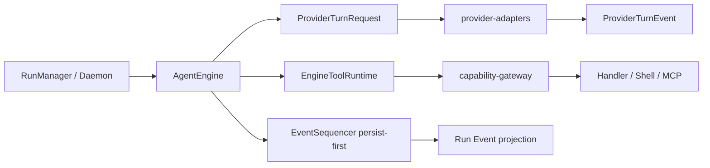

# Natives Agent Core 目标架构（深化实现版）

本文件只描述 `crates/agent-core` 的执行职责。Provider wire 仍属于
`crates/provider-adapters`，工具安全执行仍属于 `crates/capability-gateway`，
Run 装配、Credential、持久化和 RPC 仍属于 `src-agent-daemon`。

## 已落地的最小边界



`EngineProviderContext` 固定携带真实 `run_id` 和 attempt；
`ProviderTurnRequest` 是兼容层，不替换现有 `EngineMessage`。生命周期事件
`TurnStarted/TurnCompleted`、`MessageStarted/Delta/Completed` 已以 additive
Protocol v2 变体存在，RunManager 仍是唯一终态事实权威。

## 稳定的 Core 类型

- `EngineRunId`、`TurnId`、`MessageId`、`ToolCallId`：不可混用的 opaque ID。
- `AgentMessage`、`ContentBlock`、`ToolResultMessage`：provider-neutral 运行期模型；UI projection 不进入 transcript。
- `ToolCapability`：由 Gateway/Daemon 广告执行模式；未知工具默认 `Sequential`。
- `ToolProgressSink`：由 Daemon 生产实现提供，Core 只依赖抽象；生产 sink 负责 8KiB/250ms 合并和 settled late-drop，不改变工具安全策略。
- `EngineInputReceiver`：Steering/FollowUp 只在 Core safe point drain/ack。
- `ActiveContextSnapshot`、`ResumePlan`：运行期恢复模型，存储仍由 Daemon 管理。

## 目标模块（按现有复杂度渐进）

```text
crates/agent-core/src/
├── engine.rs              # 保持现有主循环，逐步抽取 turn_loop
├── message.rs             # opaque IDs 与 typed transcript
├── turn.rs                # TurnOutcome/Usage
├── context.rs             # 现有 assemble/compaction 兼容入口
├── context_snapshot.rs    # FullHistory/ActiveContext/Snapshot
├── input.rs               # Steering/FollowUp receiver 与 safe point
├── lineage.rs             # ResumePlan 与 side-effect safety
├── event_seq.rs           # persist-first / append_checked
└── session_coordinator.rs # 旧队列兼容适配，暂不删除
```

不要提前拆分整个 `engine.rs`；只有当两个独立策略出现时才提取
`TurnPolicy` 或 scheduler trait。

## Core 与外围接口

```rust
#[async_trait::async_trait]
pub trait EngineProvider {
    async fn stream_turn(
        &self,
        request: ProviderTurnRequest,
        cancel: CancellationToken,
    ) -> Result<EngineProviderEventStream, EngineError>;
}

#[async_trait::async_trait]
pub trait EngineToolRuntime {
    async fn list_tool_capabilities(&self) -> Vec<ToolCapability>;
    async fn execute_tool_with_progress(
        &self,
        name: &str,
        input: serde_json::Value,
        cancel: &CancellationToken,
        progress: &dyn ToolProgressSink,
    ) -> ToolExecutionResult;
}
```

Schema 最终校验、Permission、PathScope、SideEffect、Timeout、OutputLimit
必须在 Gateway；Core 只负责 JSON framing、调用排序、配对和上下文回灌。Gateway
不得直接修改 Core Context 或提交 Run terminal event。

## 未完成的目标能力

Conversation/Branch/Run/Turn/Message 的 DB lineage、Active Context artifact
持久化、ProjectionRecovery reducer、完整 progress batching 和 durable queue
lease 仍属于后续阶段，不在本轮伪装成已实现。
