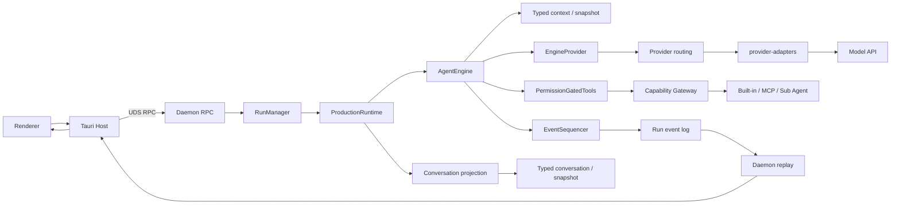
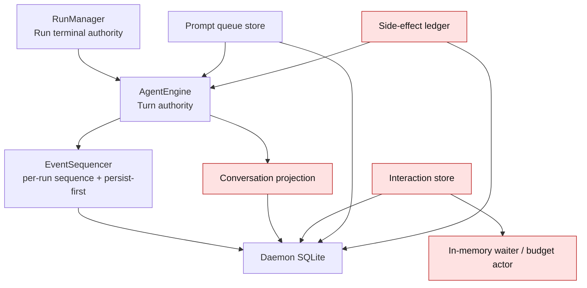
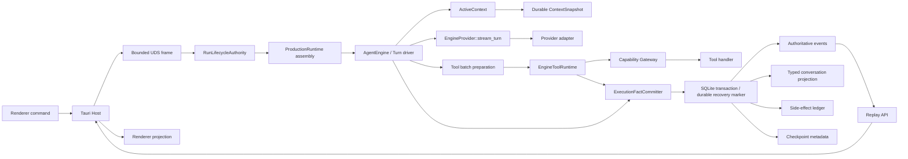
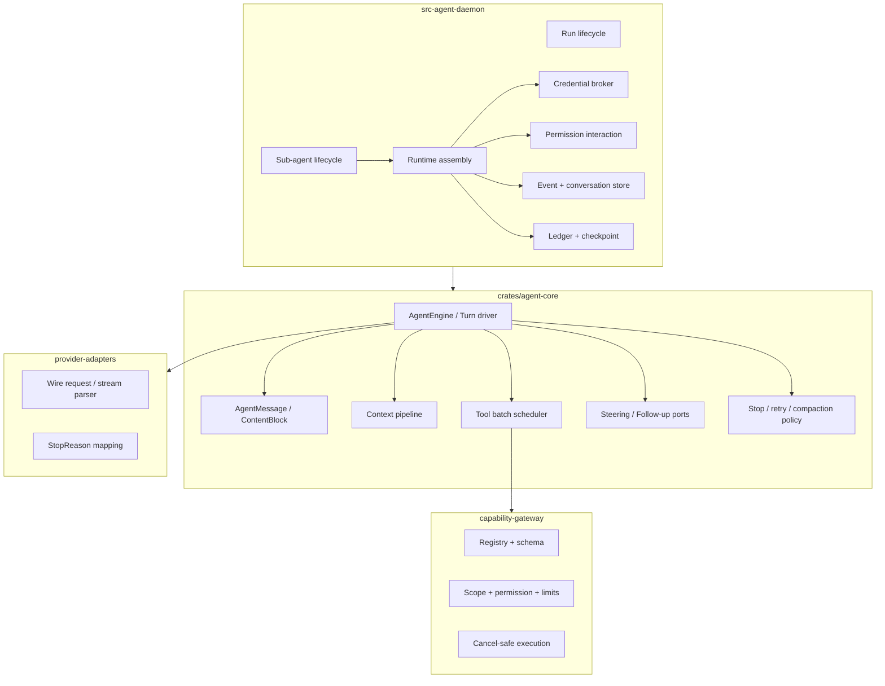
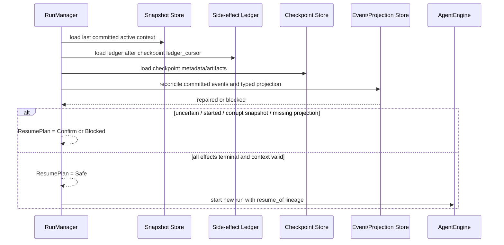
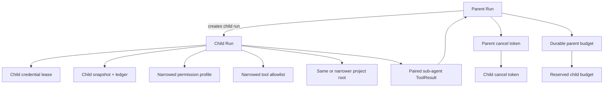

# Natives Agent Runtime 目标架构

> 性质：本文件是本次源码审计形成的整改目标，不是当前生产实现声明。权威约束仍以 `docs/standards/` 和已批准 ADR 为准。

## 1. 目标与边界

目标不是把 Pi Runtime 搬进 Natives，而是在现有 Rust、UDS、Run Event、Capability Gateway 和 Daemon 单一执行权威上，保留已经有效的吸收结果，补齐可靠性闭环。

必须保持的边界：

- `crates/agent-core`：Agent/Turn 循环、上下文、工具批次编排、队列安全点和 Core 事件语义。
- `crates/provider-adapters`：供应商 wire protocol、流解析和统一 Provider 事件映射。
- `crates/capability-gateway`：工具注册、Schema、路径与权限边界、超时、取消、输出限制和 Handler 执行。
- `src-agent-daemon`：Run 生命周期、Credential、SQLite、RPC、持久化投影、Ledger、Checkpoint 和依赖装配。
- `src-tauri`：Daemon 监督与宿主能力；不建立第二套 Agent Loop。
- Renderer：命令提交和事件投影；不产生权威 sequence 或 terminal fact。

## 2. 当前生产调用链



当前正向事实：Native 主链只有一个 `AgentEngine` loop，`ProviderTurnRequest`、`AgentMessage`、Turn ID、统一 Stop Reason、Schema 校验、工具结果配对、durable queue、capability-driven batch scheduler 已进入生产路径。

当前阻断点：

- Tool 成功、Ledger、关键事件与 Conversation Projection 不共享可恢复提交协议。
- Checkpoint 在 Gateway 路径授权前读取候选路径，且 ledger cursor 语义错误。
- Shell 子进程 stdout/stderr 未在 wait 前持续 drain。
- Resume 的安全判断依赖可能遗留 `started` 或漏写 `uncertain` 的 Ledger。
- Progress、SQLite 单连接和 RPC frame 缺少明确资源上限。

## 3. 当前状态权威关系



`RunManager` 的 terminal CAS 是应保留的单一 Run 终态权威。红色节点并非都应迁入 Core；它们需要的是明确的 durable commit/recovery 契约，而不是另一套状态机。

## 4. 目标调用链



`ExecutionFactCommitter` 是职责名，不要求立即新增一个大 Trait。优先把已有 Store 方法组合成少数事务入口；只有出现两个真实实现时再抽象。

## 5. 目标模块边界



### 5.1 保留的现有接口

- `ProviderTurnRequest`：继续作为 Native Provider 唯一请求模型。
- `AgentMessage`：继续作为 Native Core transcript 真相；`EngineMessage` 退到明确 compat 边界。
- `EngineProviderContext`：携带真实 `run_id` 和 attempt；Credential 明文不进入 Core。
- `EngineOutcome`：Core 返回执行结果，RunManager 提交唯一 Run terminal fact。
- `ToolCapability` / execution mode：由 Gateway 声明，Core 编排。
- `CancellationToken`：贯穿 Provider、Gateway、MCP、Shell 和 Sub Agent。

### 5.2 应收紧的接口

Provider 边界只负责一次模型调用：

```rust
trait EngineProvider {
    async fn stream_turn(
        &self,
        context: EngineProviderContext,
        request: ProviderTurnRequest,
        cancel: CancellationToken,
    ) -> Result<ProviderEventStream, ProviderError>;
}
```

Tool 边界分工：Core 组装候选调用与确定顺序；Gateway 完成注册查找、Normalizer、Schema、权限和实际执行。

```rust
trait EngineToolRuntime {
    async fn capabilities(&self) -> Result<Vec<ToolCapability>, ToolRuntimeError>;
    async fn execute(
        &self,
        call: FinalToolCall,
        context: ToolExecutionContext,
        cancel: CancellationToken,
    ) -> ToolExecutionResult;
}
```

本阶段不建议再拆 `prepare_tool_call` 公共 Trait。当前 Gateway 已有单一可信入口；先修复其前后的 checkpoint/ledger 顺序更小、更安全。

## 6. Tool 执行目标时序

```mermaid
sequenceDiagram
    participant C as AgentEngine
    participant D as Daemon Tool Runtime
    participant G as Capability Gateway
    participant S as Durable Store
    participant H as Tool Handler

    C->>D: FinalToolCall(run, turn, call_id)
    D->>G: prepare: lookup + normalize + schema + scope + permission
    G-->>D: Prepared or Rejected
    alt Rejected
      D->>S: commit paired ToolResult(error)
      S-->>C: committed result
    else Prepared side-effecting
      D->>S: transaction: ledger planned + ToolCallPrepared
      S-->>D: durable preparation token
      D->>H: execute(cancel)
      par bounded output drain
        H-->>D: progress chunks
        D->>S: coalesced progress (best effort)
      and handler completion
        H-->>D: success/error/cancel/timeout
      end
      D->>S: commit result + ledger terminal + critical event/projection
      alt commit succeeds
        S-->>C: exactly one paired ToolResult
      else outcome cannot be committed
        D->>S: durable uncertain marker via recovery-safe path
        D-->>C: fail closed; never report success
      end
    end
```

关键不变量：

1. 未经过 Gateway 路径作用域验证，不允许读取 checkpoint 候选文件。
2. Handler 开始前必须存在 durable `planned/started` 事实。
3. 每个 final tool call 恰好一个同 ID result。
4. 成功事实未持久化时不得向模型回灌成功。
5. `uncertain` 的落盘不能依赖同一条已失败的普通写路径；否则 Resume 必须保守阻断。
6. Shell 同时 drain stdout/stderr，取消后 kill 并 wait/reap；输出按字符边界截断。

## 7. Crash Resume 目标时序



`ledger_cursor` 必须是单调的 ledger cursor，不得复用 event sequence。恢复只从提交成功的 typed snapshot 进入 Provider Context；坏 JSON、缺块或 dangling tool pair 必须显式阻断或修复，不能静默跳过。

## 8. Parent / Sub Agent 目标关系



约束：

- Child 使用自己的 run ID、credential lease、event stream、snapshot 和 ledger。
- Project root、permission profile 和 allowlist 只能继承或收紧，不能放大。
- child session、run row、预算 reservation 的创建需要可补偿；任何中途失败不得留下可执行孤儿。
- token settle 失败必须可见并可恢复；预算不能只由进程内 Mutex 作为长期 authority。
- `FailurePolicy` 要么接入 watcher/父级控制流并测试，要么删除，不能保留为误导性声明。

## 9. Pi 设计吸收结论

### 已正确吸收并应保留

- Typed agent message 到 provider message 的显式转换边界。
- 一次 Provider 调用对应一次 Turn attempt，Provider retry 不伪造新 Turn。
- Partial assistant message、final stop reason 和不完整 tool call fail-closed。
- Tool batch 能力驱动调度、结果按源顺序回灌。
- Steering/Follow-up 在安全点消费，而非 UI 直接改写 Context。
- Turn 后可做压缩、队列消费和停止判断。

### 需按 Natives 架构重新实现或补强

- Pi 的进程内 queue/progress 语义需要 Natives 的 durable lease、限流和重启恢复。
- Pi 的 Session 属于上层 coding-agent，不可替代 Natives Conversation/Branch/Run/Turn。
- Extension、CLI/TUI、RPC mode 不进入 Agent Core。
- Natives 的 side-effect ledger、permission、checkpoint 和 Run terminal authority 必须继续由 Daemon/Gateway 边界保障。

## 10. 最小演进顺序

1. P0：先封住 checkpoint 越界读取、Shell 管道死锁/Unicode panic、Ledger `uncertain` 失真和 event/projection crash-gap。
2. P1：增加 bounded RPC/progress、interaction 幂等事务、sub-agent 创建补偿和真实预算结算。
3. P1：定义 Context overflow 一次性 compaction retry，收紧 queue drain 契约。
4. P2：隔离 legacy message/CLI compatibility，删除未接线的 `FailurePolicy` 等误导接口。
5. 最后才考虑物理拆分巨型文件；不在可靠性修复中顺带重构目录。

详细批次、文件范围、测试和回滚见 `docs/roadmap/natives-agent-runtime-upgrade-plan.md` 与 `docs/roadmap/natives-agent-upgrade-tasks.md`。
