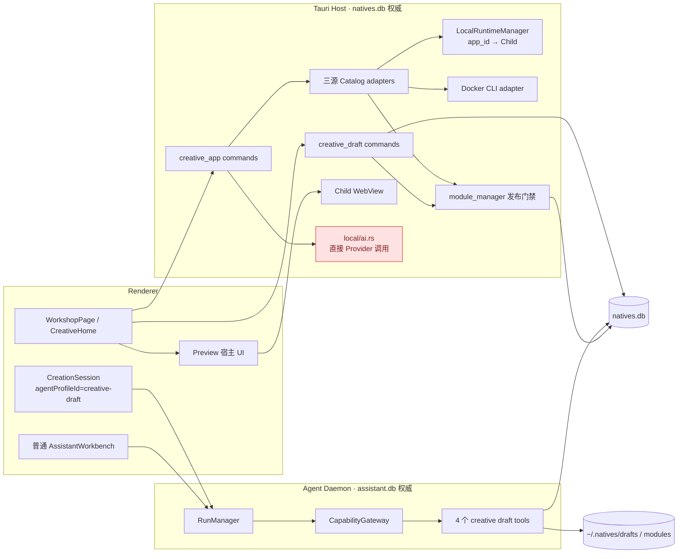

# 个人创意模块独立审计报告

> 审计日期：2026-08-03
> 审计性质：代码、生产调用链、宿主 SQLite 与示例项目静态审计；未修改生产代码，未启动 Docker 或 Freqtrade。
> 权威边界：以 `docs/standards/`、ADR-0013、ADR-0014 和当前代码为准；文档中的“已完成”未被直接采信。

## 1. 审计基线

- Worktree：`/Users/ldh/Downloads/project/AiNative/Natives`
- Branch：`deploy`
- HEAD：`1b4b1792932e2e24160091c7700a2c092d01e5f2`
- Working Tree：非干净；存在新增/修改文件及 6 个未合并路径（`SettingsPage.tsx`、`Sidebar.tsx`、`settings-navigation*`、`src/i18n/en.ts`、`src/i18n/zh.ts`）。本报告覆盖 HEAD 与当前可见工作区内容，不覆盖尚未选择的 index stage。
- 相关最近提交：`1b4b1792 fix(usage): preserve dated Codex rollouts`；最近 20 个提交主要为 Native Canvas/引擎体验改动，不是个人创意 Runtime 收敛提交。
- Worktree 列表：当前 `deploy`，另有一个可清理的 `/private/tmp/Natives-personal-overview`、一个 detached agent-core worktree 和 `fix/agent-core-p0`；本次未创建新 worktree。
- macOS/Tauri：Tauri v2 macOS 客户端；Renderer 为 Next.js 15 static export；Host 为 `src-tauri`；Agent 执行权威为 UDS 后的 Agent Daemon。
- 宿主 SQLite：`/Users/ldh/.natives/natives.db`。相关表均存在，但本次查询时 `modules`、`external_creative_apps`、`local_creative_apps`、`creative_drafts`、`creative_draft_revisions` 均为 0 行，故没有可供运行态交叉验证的真实实例。
- 示例项目：`/Volumes/UNTITLED/本人材料/project/freqtrade`，分支 `develop`，HEAD `02ff7c4a2c63308df8fa7221e3a52bce3d286ef9`；工作区有大量用户文件与 AppleDouble 文件，本次未修改。
- 验证：`cargo check -p natives` 通过；未运行 workspace 全量测试。

## 2. 总体结论

- 助理创建应用：**未形成普通助理闭环**。普通助理只有通用文件/终端工具，没有创建草稿、注册 Application、发布模块或启动预览工具。个人创意页面内的专用 `creative-draft` 会话可以生成草稿并由用户发布，但这是另一个入口。
- 本地项目导入：**部分实现**。系统文件夹选择、扫描、路径去重、结构化 `LaunchPlan`、SQLite 写入、HTML/Vite/Vue 启停已接线；Python、Dockerfile、Compose、多服务和通用 URL 发现未实现。
- Docker：**仅 GitHub Release 外部应用轨真实可用**；现有本地目录不会进入 Docker Runtime。Compose 使用稳定 project name，但模型不足、取消/日志 follow/运行实例所有权不完整。
- Freqtrade：**当前不能由本地导入器正确识别或启动**。静态证据会得到 `unknown` 且没有 rule plan；默认 Compose 命令是 `trade`，未读取用户配置前不能证明是 dry-run，禁止自动启动。
- WebUI：HTML/Vite 的显式 URL 可打开；FreqUI 未形成导入、服务选择、端口发现、健康检查闭环。
- 内置浏览器：**有真实 Tauri child WebView**，不是占位 iframe；能承载 localhost、WebSocket、Cookie 和前端路由，但与 RuntimeInstance 无绑定、跨应用复用同一存储、导航后 URL 不回写、关闭错误被吞掉。
- 样式：复用了主题变量、Modal、ConfirmDialog、EmptyState、Toast 和助理组件，但页面仍是 2,277 行大组件，保留旧模板创建流，按钮/像素/状态样式重复，产品心智与组件层级未收敛。
- 资源回收：普通受管 Node 进程的正常路径有进程组、TERM、5 秒宽限、KILL 和 `wait`；但没有 Runtime Owner/CancellationToken，日志 reader 和健康任务无显式句柄，孤儿强杀不 wait/验证，Stop 可在停止失败后仍写 `installed_stopped`。
- 整体完成度：**基础设施多于产品闭环；关键验收场景未通过，属于部分实现。**
- 是否可以正式使用：**否**。可在受控环境试用内部静态应用与简单 HTML/Vite 项目，不应承诺通用本地项目、Compose/Freqtrade 或可靠资源回收。

## 3. 当前真实架构



关键事实：统一的是 Catalog 投影和生命周期 façade，不是统一领域存储。内部模块、GitHub 外部应用、本地项目仍分别存于 `modules`、`external_creative_apps`、`local_creative_apps`。

## 4. 助理创建应用调用链

### 普通助理真实链

```text
AssistantWorkbench
→ conversation.create / run.start
→ Tauri Host UDS façade
→ Agent Daemon production.rs
→ CapabilityGateway::register_builtins()
→ read_file / write_file / apply_patch / run_terminal / …
→ 最多修改当前 project_path 内文件
```

断点：

1. `crates/capability-gateway/src/tools/creative_draft.rs` 明确将四个草稿工具排除在 `builtin_tools()` 外。
2. `src-agent-daemon/src/production.rs:1480-1501` 仅当 `agent_profile_id` 为 `creative-draft` 时注册草稿 allowlist。
3. 普通 `AssistantWorkbench` 不传该 surface，也没有 `create_application`、`register_application`、`publish_application`、`start_application` 或 `open_preview` Tool。
4. 通用 `write_file` 的成功结果没有 `application_id`、`startup_plan_id` 或 Catalog 变更事件；“写出文件”不是“创建应用”。
5. 没有普通助理结构化应用结果卡片；消息流只能显示通用文本和 Tool 活动。

### 创作台专用链（真实、但不是普通助理入口）

```text
CreativeHome.createDraft
→ Host create_creative_draft
→ creative_drafts 行
→ CreationSession 创建普通 conversation
→ run.start(agent_profile_id=creative-draft, message=[draft:<id>])
→ Gateway 仅注册 write/read/rollback/lint_draft_module
→ Daemon 写 ~/.natives/drafts/<draftId>/rev-N.html + natives.db 修订指针
→ Renderer 在 run 结束后 reload draft
→ 用户点击 publish
→ Host publish_creative_draft
→ module_manager::write_generated_module
→ modules / module_contracts + 文件原子发布
→ db-state-changed(module/creative-draft)
→ Catalog reload
```

该链已完成草稿隔离、同一 Contract Linter、用户发布门禁和 Catalog 刷新，但仍有三处产品缺口：

- 首次发送要求存在全局 `active_project_path`，即使草稿实际位于 `~/.natives/drafts`；没有选择项目目录时创作台会被阻断。
- `draft.state` 没有由引擎驱动，Renderer 以 `isStreaming` 旁路表示 generating；数据库状态不是运行阶段真源。
- WorkshopPage 顶部“添加 → 创建”仍打开旧 `createTemplate()`，生成硬编码 HTML，与新的一句话创作入口并存。

## 5. 本地项目导入调用链

```text
WorkshopPage.pickLocalFolder
→ Tauri dialog.open(directory=true)
→ creative_app_inspect_local
→ canonicalize + 深度≤3/条目≤2000 扫描
→ 识别 HTML / Vue / Vite + npm/pnpm/yarn
→ rule/user/AI LaunchPlan
→ creative_app_create_local
→ local_creative_apps + local_creative_env（同一 transaction）
→ db-state-changed(creative-app)
→ useCreativeAppCatalog.reload
→ 用户显式 creative_app_start
```

已完成：系统目录选择、中文/空格路径由 `PathBuf` 与 argv 传递、canonical path 去重、目录逃逸检查、敏感文件名跳过、加密 env、移除记录不删除项目源码。

未完成：

- 没有 macOS security-scoped bookmark、授权 blob 或卷重新定位信息；只持久化绝对路径。未沙箱化 Host 当前可直接读取 `/Volumes`，但应用重启、卷名变化、沙箱签名或权限收紧后没有持续访问保证。
- 扫描矩阵只识别 `index.html`、`package.json`、Vite/Vue、三类 lockfile；不识别 Dockerfile、四种 Compose 文件、Makefile、Python、`pyproject.toml`、requirements、多服务或 WebUI 服务。
- `LaunchPlan` 只有 `static_http` 和 `node_dev_server`，没有 services、preflight 列表、URL strategy、stop/restart strategy、日志策略或 Docker 字段。
- AI 分析是生产 UI 可调用路径，但 `src-tauri/src/creative_app/local/ai.rs:405-510` 在 Host 内直接解密 Provider Key 并调用 `provider-adapters`，绕过 Daemon、Gateway、Run 事件、取消和供应商路由权威，违反 R-T1。

## 6. Runtime 启动调用链

### 静态 HTML

`start_app` 验证 entry file 后直接把 Host 已有 HTTP server URL 标为 running。它没有独立 RuntimeInstance，也没有对该 URL 发 HTTP 健康请求；“文件存在 + Host port”即 running。

### Node/Vite

```text
creative_app_start（持全局 MutationLock）
→ LocalRuntimeManager.start_node_dev
→ 固定 argv、env_clear、安全继承 env
→ setpgid(0,0)
→ stdout/stderr reader task
→ HashMap<app_id, LiveLocalProcess>
→ TCP + HTTP 200..499 轮询
→ DB running / start_failed
```

优点：不走 shell、固定 host `127.0.0.1`、动态端口、进程组、PID start time/executable/cwd/fingerprint 身份、健康通过后才写 running。

缺口：

- 健康检查只支持单个 HTTP path，2xx–4xx 均视为健康；无 TCP-only、日志、Docker health、多 URL 或 degraded。
- 健康循环无 CancellationToken；启动命令在整个超时期间持全局 mutation lock，用户 Stop 无法抢占。
- 超时后故意保留进程并写 `start_failed`；没有自动补偿策略或独立 cleanup 状态。
- app_id 既是 Application 又是运行键；没有重复运行历史、实例 ID、CAS 或幂等键。全局锁只能避免同 Host 进程内并发，不能表达跨重启实例所有权。

## 7. Runtime 停止和回收调用链

正常受管 Child 路径：

```text
DB stopping
→ 从 HashMap 移除 LiveLocalProcess
→ SIGTERM(-PGID)
→ 最多等待 5 秒
→ SIGKILL(-PGID)
→ child.wait()
→ DB installed_stopped
```

这是当前最扎实的生命周期实现，但外围语义会破坏其可信度：

1. `local/lifecycle.rs::stop_app` 对 `runtime.stop(...).await` 使用 `let _ =`，忽略错误，随后无条件清空 URL/port/process identity 并写 `installed_stopped`。
2. Supervisor 丢失 Child 时，`force_kill_identity` 仅 TERM、睡 500ms、KILL；不 wait/reap、不验证进程组消失或端口释放。
3. 身份不匹配但 PID 存活时，仅写 warning，仍清空身份并标 stopped；之后失去可靠恢复锚点。
4. stdout/stderr task 没有 JoinHandle/CancellationToken；依赖管道关闭自然退出。Health/URL 轮询也没有实例级取消树。
5. 正常窗口关闭会 `shutdown_all`，但崩溃/强退只能在重启后标 orphan；无法重新接管 reader、健康任务或 Preview。
6. 静态应用 Stop 只改 DB；共享 Host HTTP server 始终存在，路由仍可按数据库 project root 取文件，需验证 stopped 后请求是否确实被拒绝（当前 handler 只查路径记录，不查 state）。

## 8. 内置浏览器调用链

```text
getOpenTarget（要求 DB running + localhost URL）
→ WorkshopPage.browserShow
→ Tauri WebviewBuilder::add_child
→ 单一 label creative-app-browser
→ 页面关闭时 browserClose
```

审计答案：

1. localhost：支持 `http/https://127.0.0.1|localhost` 初始 URL。
2. CSP：主窗口允许 `connect-src` localhost HTTP/WS 和 `frame-src` localhost；child WebView 自身遵循目标站点 CSP。
3. X-Frame-Options：外部应用走 child WebView，不受 iframe 嵌入限制。
4. WebSocket：child WebView 原生支持，主 CSP 也允许 localhost WS。
5. Cookie：支持，但单一可复用 WebView 没有每应用数据分区/清理。
6. 前端路由：支持；back/forward 通过 `eval(window.history.*)`。
7. Docker 端口：仅使用已存 `host_port/open_url`，不动态 inspect 映射。
8. Origin：初始 URL必须 local；`on_navigation` 却允许任意 HTTP/HTTPS，local app 可把 WebView 导向公网。
9. Base Path：仅靠 `open_path` 字符串。
10. 项目停止：从 Workshop UI Stop 前会 close；Host/其他调用者 Stop 不会绑定关闭 Preview。
11. 多项目隔离：同一 label 串行复用，无 cookie/storage 分区。
12. 缓存：无显式隔离或清理。
13. 关联：BrowserState 只保存 app_id/url，不保存 runtime_instance_id。

`browser_close` 忽略 `wv.close()` 错误并仍清空 BrowserState，无法证明 WebView、WebSocket 和 Listener 已释放。

## 9. 能力矩阵

| 能力 | 当前状态 | 生产入口 | 后端实现 | 持久化 | UI 消费 | 资源回收 | 测试 | 结论 |
|---|---|---|---|---|---|---|---|---|
| 助理创建应用 | 缺失 | 普通 Assistant | 通用文件工具 | 无应用结果 | 无结果卡 | 无 | 无 | 未完成 |
| 创作台 AI 草稿 | 已接线 | CreativeHome | 4 个 Gateway Tool | draft + revisions | 会话/预览 | run 订阅有清理 | 工具/Preview | 部分完成 |
| 应用注册 | 内部模块可用 | 用户 publish | Host module gate | modules | Catalog reload | 不适用 | store tests | 仅内部轨 |
| 助理结果卡片 | 缺失 | 无 | 无结构化结果 | 无 | 无 | 无 | 无 | 未完成 |
| 选择本地项目 | 已接线 | Tauri dialog | Host | 路径保存 | 四步向导 | 无长期授权 | TS helper | 部分完成 |
| 外置磁盘访问 | 临时可读 | dialog path | Rust fs | 绝对路径 | 路径丢失错误 | 无 bookmark | path tests | 部分完成 |
| 项目扫描 | 有限 | inspectLocal | HTML/Vue/Vite | 不保存扫描快照 | 可修改 plan | 不适用 | 3 个扫描测试 | 部分完成 |
| HTML 启动 | 已接线 | start | Host HTTP | state/url | 打开/停止 | DB-only | 无 E2E | 部分完成 |
| Vite/Vue 启动 | 已接线 | start | 进程组 + HTTP health | PID/PGID/url | 日志/预览 | 正常 Child 较完整 | 无真实进程 E2E | 部分完成 |
| Python 启动 | 缺失 | 无 | 无 | 无 | 无 | 无 | 无 | 未完成 |
| Dockerfile | 本地轨缺失 | 无 | GitHub 轨仅镜像/Release | 分轨 | 无本地导入 | 分轨 | probe 单测 | 未完成 |
| Docker Compose | 本地轨缺失 | 无 | GitHub 轨可用 | external config | GitHub 向导 | project stop/down | 无 Docker E2E | 部分完成 |
| 多服务 | 缺失 | 无 | 单 service 字段 | 有限 | 不可选组合 | 无 | 无 | 未完成 |
| URL 发现 | 有限 | plan/open_url | 显式 host port/path | open_url | WebView | 清空字段 | 无矩阵 | 部分完成 |
| 健康检查 | 有限 | start | 单 HTTP 200..499 | 仅结果 | 粗状态 | 无取消 | 无超时 E2E | 部分完成 |
| 日志 | 本地/按需 Docker | logs | ring+rotation / `logs --tail` | 文件/实时内存 | 搜索/复制/暂停滚动 | reader 无句柄 | 日志单测 | 部分完成 |
| 停止 | 有缺陷 | stop | 进程组 / compose stop | state | 按钮 | 可假 stopped | 无强杀 E2E | 高风险 |
| 重启 | 已接线 | restart | stop→start | state | 按钮 | 继承 stop 缺陷 | 无 E2E | 高风险 |
| 内置浏览器 | 已接线 | browserShow | child WebView | 内存状态 | 工具栏 | close 不验证 | 无 Host E2E | 部分完成 |
| Freqtrade | 缺失 | inspectLocal | 扫描为 unknown | 无 | 无方案 | 无 | 未测试 | 未完成 |

## 10. 样式与设计系统

| 样式能力 | 当前状态 | 公共组件复用 | 深色模式 | 状态完整性 | 结论 |
|---|---|---|---|---|---|
| 个人创意首页 | 创作优先 + 目录 | Modal/Empty/Toast | 多数 token | 两套创建入口 | 部分一致 |
| 项目卡片 | 三源分组 | 自写卡片 | 多数 token | 粗 state + detail | 部分一致 |
| 创建流程 | 新 composer + 旧模板弹窗 | 助理输入组件/Modal | 混用 neutral/dark class | 状态真源分裂 | 未收敛 |
| 导入流程 | GitHub/本地/ZIP 三套 | Modal | 基本支持 | 步骤多但错误保留有限 | 部分完成 |
| 运行状态 | dot + label | 自写 | 支持 | 无 building/waiting/degraded/cleanup | 不完整 |
| 日志 | Modal + pre | Modal | 固定 zinc terminal | 无虚拟化、时间格式弱 | 部分完成 |
| 内置浏览器 | 工具栏较完整 | 自写按钮 | token | 无连接/停止覆盖层 | 部分完成 |
| 助理结果卡片 | 无 | 无 | 无 | 无 | 缺失 |
| 空状态 | 有 | EmptyState | 支持 | 可创建/导入 | 基本完成 |
| 错误状态 | 有 toast/detail | classifyError/Toast | 支持 | 多数仍是模糊 start_failed | 部分完成 |

主要问题：

- `WorkshopPage.tsx` 2,277 行，仍拥有大量 wizard、browser、logs、delete 和模板状态；`CreativeHome` 只是嵌入其中，没有真正替代旧流。
- 导入了 `SPACING/FONT_SIZE/BORDER_RADIUS` 却未使用；页面主要依赖重复 Tailwind 字符串和任意 `text-[11px]`、固定 `h-[460px]`、Modal width 数字。
- `CreationComposer` 使用 neutral/dark 调色，Catalog/Workshop 使用全局 token，视觉词汇不完全一致。
- 主操作冲突：页面内一句话“生成应用”与顶部“添加→创建模板”都被称为创建。
- 状态只覆盖存储枚举；构建、等待健康、清理、missing、orphaned 没有一等状态，仅塞入 `statusDetail` 或 `start_failed`。
- 日志字符串在 Renderer 中持续拼接，无上限；Host ring/file 有界不等于 UI 内存有界。
- 可访问性有基本 `role=alert`、iframe title 和 button type，但大量图标按钮只依赖 title，菜单没有完整 menu/keyboard 语义，状态点仍偏颜色表达。

## 11. Runtime 资源所有权

| 资源 | 所有者 | 持久化 | 停止机制 | 异常恢复 | 泄漏风险 | 结论 |
|---|---|---|---|---|---|---|
| 主进程 Child | LocalRuntimeManager map | PID identity | TERM/KILL/wait | 重启只识别 orphan | 中 | 正常路径可用 |
| 进程组 | LocalRuntimeManager | PGID | kill(-PGID) | identity 强杀 | 中高 | 缺验证 |
| Docker Compose | GitHub external app | project/file | compose stop/down | ps reconcile | 中 | 无 RuntimeInstance |
| 容器 | Docker Engine | name/config | docker stop/rm | inspect | 中 | GitHub 轨可追踪 |
| Network | Compose project | Docker | down 时清 | reconcile 不列 network | 中 | Stop 保留 |
| 日志流 | detached Tokio task / Docker CLI | 本地轮转文件 | pipe EOF / 单次命令 | 不恢复 follow | 中 | 无取消句柄 |
| 健康检查 | start command future | 无 | 超时结束 | 不恢复 | 中 | Stop 不能抢占 |
| URL 发现 | 无独立任务 | open_url | 清字段 | 无 | 低 | 能力缺失 |
| 端口 | 子进程/容器 | current_port | 依赖资源退出 | 未验证释放 | 高 | Stop 可信度不足 |
| WebView | Tauri label | BrowserState 内存 | close | 无恢复 | 中 | 与 runtime 解耦 |
| 临时文件 | GitHub app_dir/runtime_dir | 路径约定 | delete/partial cleanup | best effort | 中 | 无实例 ledger |
| 外置卷句柄 | 短时 fs 调用 | 仅绝对路径 | 调用结束 | 无 bookmark/relink | 中 | 不可持久授权 |
| Runtime 记录 | 无独立实体 | app 行内字段 | 清字段 | reconcile | 高 | 无唯一实例 |

## 12. 资源泄漏风险

| 资源 | 泄漏表现 | 当前行为 | 风险 |
|---|---|---|---|
| Node 子进程 | UI stopped 但树仍活 | stop 错误被忽略；身份可被清空 | P0 |
| Docker 容器 | start health 失败仍运行 | GitHub start 标 start_failed，保留容器供日志 | P1 |
| Docker Network | stop 后保留 | stop 用 compose stop，不 down | P2（预期但需展示） |
| Docker Logs | `logs -f` 残留 | 当前只执行 `--tail`，无 follow | 低 |
| Health Task | Stop 无法及时取消 | 无 token，且全局锁阻塞 Stop | P1 |
| URL Scanner | 无 | 尚未实现 | 能力缺口 |
| WebView | State 已清但 close 失败 | close 错误被吞 | P1 |
| Event Listener | 页面重挂重复 | React cleanup 已实现 | 低 |
| File Handle | 外置卷不能弹出 | 扫描/读取是短时句柄，无持久 reader | 低至中 |
| Temp File | partial install 残留 | cleanup best effort，无 ledger | P1 |
| Port | 停止后仍占用 | 不验证端口释放 | P0/P1 |
| Runtime Record | 假 stopped / 永远 failed | reconcile 粗粒度，无 cleanup_status | P0/P1 |

## 13. Freqtrade 专项

### 静态事实

- 根目录存在 `docker-compose.yml`、`Dockerfile`、`pyproject.toml`、requirements、`docs/freq-ui.md` 和多份辅助 Compose。
- 根 Compose 单服务 `freqtrade`，镜像 `freqtradeorg/freqtrade:stable`，bind mount `./user_data:/freqtrade/user_data`，端口 `127.0.0.1:8080:8080`。
- 默认 command 是 `trade --config /freqtrade/user_data/config.json --strategy SampleStrategy`；仓库内存在 `user_data/config.json`，本次未读取其内容。
- 官方项目文档说明 UI 默认 URL 为 `http://127.0.0.1:8080`，前提是 API/FreqUI 配置已启用。
- FreqUI 可随 `trade`（dry-run 或 live）运行，也支持非交易的 `webserver` mode；UI 自身可执行敏感交易操作。

### 当前项目正确启动方式

- **不能无条件给出“安全正确”的默认启动命令。** 原仓库的 `docker compose up -d` 会运行 `trade`；真实/模拟取决于用户配置。未审核 `dry_run`、API bind、认证和策略前，Natives 必须拒绝自动执行。
- 面向本次“只看 WebUI/API”的安全验收，应由 Natives 生成位于自身临时目录的 Compose override，把 command 改为官方 `webserver --config ...` 或由用户明确确认的 dry-run 方案；使用唯一 project name、仅绑定 `127.0.0.1`、不改用户 compose/config、不删除 volume。

### Natives 当前识别方式与断点

- 扫描器看到根目录没有受支持的 root `package.json/index.html` 组合，会归类 `unknown`。
- Compose、Dockerfile、Python 和 `pyproject.toml` 完全不参与分类，因此 `rule_plan=None`。
- AI 规划输出 schema 也只允许 HTML/Vite/Vue + internal/npm/pnpm/yarn/node，无法合法返回 Compose Runtime。
- 即使手工导入，本地 `LaunchPlan` 枚举也无法表达 compose file、service、project name、profiles、port mapping 或 safe command override。

### 正确 URL、风险与安全验收

- 预期宿主 URL：`http://127.0.0.1:8080/`，但必须以 Compose port/inspect 与 HTTP health 实测为准，不能只信文件。
- 真实交易风险：**高**。默认 command 是 `trade`；未读取的 config 可能是 live。FreqUI 还能发起交易相关操作。
- 安全验收：静态识别危险 command → 默认阻断 → 用户选择 `webserver`/已审计 dry-run → Natives-owned override + unique project → `docker compose config` 预检 → 只启动选定服务 → inspect 宿主端口 → HTTP health → 打开 WebView → stop/down 当前 project（默认保留 volume）→ 验证容器、日志进程、端口均释放。

## 14. 数据模型

当前不是目标关系：

```text
modules                         （内部 Workshop Application）
external_creative_apps          （GitHub Docker Application + runtime config）
local_creative_apps             （本地 Application + LaunchPlan + 当前运行字段）
creative_drafts                 （发布前草稿）
```

缺失：统一 `Application` 身份表、版本化 `StartupPlan`、独立 `RuntimeInstance`、`PreviewTarget`、`CreationOrigin`/run 关联、cleanup status、实例心跳和资源 ledger。

建议保留现有三源业务表作为 source detail，新增最薄统一身份与运行实体；不要再建第二套运行器。迁移后 Catalog 从统一 Application 读身份，再 join source detail；RuntimeInstance 是唯一资源 Owner。

## 15. Agent Tool

已完成：`write/read/rollback/lint_draft_module` 有 schema、handler、side effect、path scope、permission class、timeout、output limit、cancellable 和生产 allowlist；工具结果结构化，且有较多单元测试。

缺失：

- 普通助理没有“创建草稿/注册应用”的受控 Tool，也没有将用户意图转交到 Creative surface 的产品路由。
- 发布只能由 Renderer Host command 触发，这符合安全门禁；但普通助理没有结构化 handoff/card 让用户完成该授权。
- 本地项目 AI 分析绕过 Gateway；应改成 Daemon 受控分析 Tool/Run，Host 只提供脱敏扫描和最终校验/持久化。
- 无 `application_changed` 结构化 Tool Result 供普通助理消息卡消费。

## 16. Runtime/Docker

- GitHub Docker 轨使用 argv 而非 shell，Compose project name 由 app id 派生，端口只绑定 `127.0.0.1`，Stop 失败会返回错误；这些基础应复用。
- Local Process 轨的进程组实现也应复用。
- 两轨缺少共同 RuntimeInstance Owner；不要把 Docker 能力复制进新的本地 runner。应把现有 adapters 收敛为同一 Runtime service 的两种 driver。
- Compose `up --remove-orphans`、stop/down 都有稳定 `-p` 和 `-f`；但本地现有 Compose 导入、profiles/services/build/override/env-file/随机端口/health status 未建模。
- Docker start health 失败保留容器，但没有 `degraded/cleanup_pending`；部分失败补偿只在 install path best effort 执行。

## 17. Browser

建议继续 child WebView，不退回 iframe：它能避免 X-Frame-Options、支持 Cookie/WebSocket/SPA。整改集中在 Runtime 绑定、导航 local-only、每应用数据分区或显式清理、close 结果验证、地址回写和停止覆盖层；Workshop iframe 继续保持 `allow-scripts allow-forms`，不得把 Bridge 给 Embed。

## 18. P0/P1/P2

### P0：安全与真实状态

1. Local Stop 忽略 runtime stop/kill 错误并无条件写 stopped、清身份，可能留下危险进程与占用端口。
2. Host `local/ai.rs` 直接解密 Provider Key 并调用 Provider，绕过 Agent Daemon/Gateway/Run 权威。
3. Freqtrade 默认 Compose 是 `trade`；若未来通用导入器无危险 command 门禁，会有实盘风险。该门禁必须先于 Compose 上线。
4. child WebView 初始 local-only，但后续导航允许任意 HTTP/HTTPS；需要收紧并隔离跨应用存储。

### P1：核心功能断链

1. 普通助理不能创建/注册/启动应用，也没有结构化应用结果卡。
2. 本地扫描不识别 Compose/Python/Dockerfile/多服务，Freqtrade 无 plan。
3. 没有 RuntimeInstance、实例锁/CAS、取消树、cleanup 状态或可恢复资源 ledger。
4. Health 与日志 task 无实例级取消；启动期间 Stop 被全局锁阻断。
5. static start 未做真实 HTTP health，static stop 后 HTTP 路由是否拒绝未验证。
6. Browser 与 Runtime 解耦，close 失败不可观测，Cookie/Storage 跨应用复用。
7. Daemon/Host 崩溃后只能标 orphan，不能重新关联日志/健康/Preview；强杀不验证端口释放。

### P2：体验与扩展性

1. 新创作台与旧硬编码模板创建并存，产品语义冲突。
2. 页面/向导过大，公共 Button/Badge/Tabs 不成体系，固定尺寸和调色混用。
3. 状态枚举和视觉缺少 building/waiting/degraded/cleanup/missing/orphaned。
4. Renderer 日志字符串无界增长，缺服务筛选、时间格式和虚拟列表。
5. 导入向导无法编辑 services、URL strategy、health type、stop strategy。
6. 草稿生成依赖 active project，错误与创作域无关。

## 19. 占位和死代码

- `WorkshopPage` 的 `void onInstall`：prop 有调用方形态但实际被丢弃。
- `createTemplate()`：旧硬编码 HTML 创建流仍有真实 UI 入口，与 ADR-0014 主流程重复。
- `localStartAfterSave` 同时保存在 state；后端明确忽略 `request.start_after_save`，实际启动由前端另调 start，字段应删除或只留 UI 局部语义。
- Draft DB 的 `generating/publishing` 状态存在，但当前 generating 由 Renderer `isStreaming` 旁路驱动。
- Local Runtime 注释称 exit watcher，实际只写日志，真正监督依靠全局 2 秒 poll。
- `CreativeAppService` 内又持锁，但 commands 直接调用 adapters 并自行持锁，形成未使用的重复 façade 方法。

## 20. 测试缺口

已有测试集中在纯函数、Store、扫描、plan、日志脱敏、草稿工具和 adapter state matrix。缺少以下最小可信证据：

1. 真实 Child 忽略 TERM → KILL PGID → wait/reap → 端口释放。
2. Stop 内部失败时 DB 不得变 stopped、不清 process identity。
3. 健康检查取消与启动中 Stop；不得等满 300 秒。
4. static stopped 后 `/local-projects/<id>/...` 返回不可用。
5. 重复 start 只创建一个 RuntimeInstance；跨窗口/Agent/UI 并发 CAS。
6. Daemon/Host crash 后 orphan 核实、停止、端口释放。
7. Compose 部分失败补偿、唯一 project 隔离、不影响其他容器/network/volume。
8. child WebView close、切换应用、停止后销毁和 local-only 导航。
9. 普通助理 → 结构化创建 handoff/card → publish → Catalog 同一 ID。
10. Freqtrade webserver/dry-run 安全门禁；确认任何 `trade` 方案默认阻断。
11. 外置卷断开/重挂、中文空格路径和 bookmark 恢复。

## 21. 是否建议继续当前架构

**建议继续现有四进程边界、三源 Catalog adapters、Workshop 发布门禁、LocalRuntimeManager 的进程组逻辑和 Tauri child WebView；不建议推倒重写。**

最小正确演进是：

1. 先修 Stop 诚实性和 Host Provider 越权。
2. 在现有 Host Runtime façade 内引入统一 `Application / StartupPlan / RuntimeInstance`，让 RuntimeInstance 成为资源 Owner。
3. 把 Local Process 与现有 Docker adapter 作为 driver 接入，不创建第二套运行器。
4. 普通助理只新增“创建草稿/交给个人创意”的受控接缝；正式发布仍由用户 Host 命令授权。
5. 资源 Owner 和取消树完成后，再增加 Compose/Python/Freqtrade。

这是比新增更多扫描 if/else 更小、也更安全的根因整改路径。
