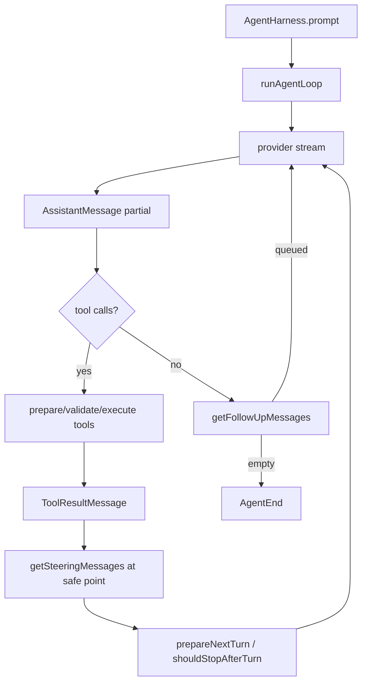
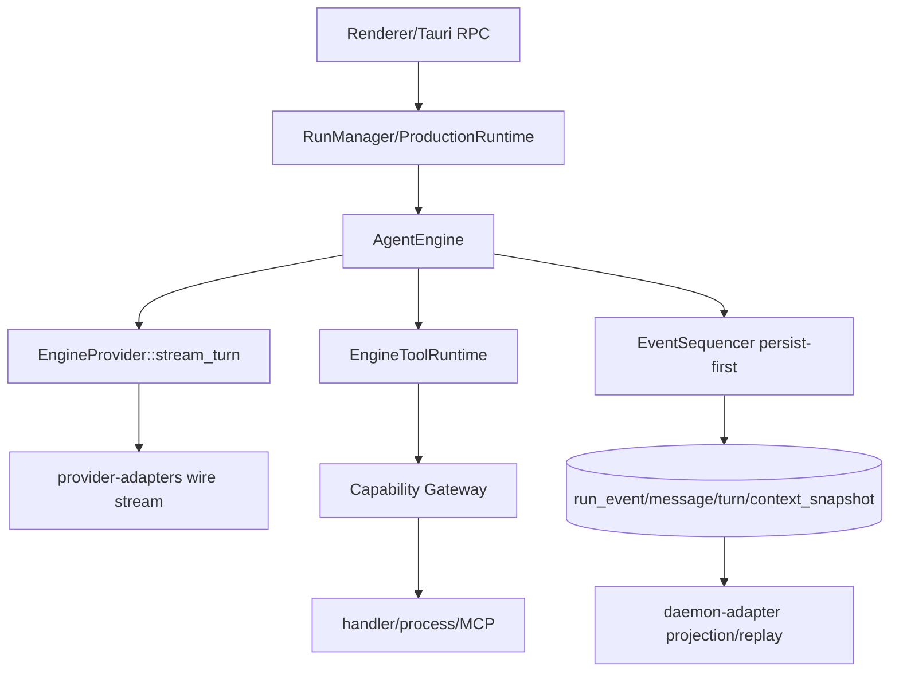

# Natives Agent Core 与 Pi Agent Core 代码对比

## 版本与边界

- Natives：`feat/agent-core-deepening`，当前提交见 `git log -1`。
- Pi：`583f153d502aa8e958eefdb9af0fbd3344e68f95`（`References/pi`）。
- Pi 仅作为执行循环设计参考；不嵌入 TypeScript Runtime，也不替换 Natives 的 Run Authority、Gateway 或 Provider Adapter。

## Pi 的真实执行链

代码证据：`packages/agent/src/agent-loop.ts:95-304` 以 `AgentMessage[]` 驱动循环，先消费 steering，再在工具批次后调用 `prepareNextTurn`、`shouldStopAfterTurn`，结束前消费 follow-up；`agent-loop.ts:279-304` 才把 AgentMessage 转换为 Provider LLM Message。`packages/agent/src/harness/agent-harness.ts:197-226,472-538` 持有 steering/follow-up 队列和 one-at-a-time/all 模式。Session/树持久化在 harness 层，不属于低层 loop。

## Natives 的当前生产链

`crates/agent-core/src/engine.rs` 是唯一 Agent loop；`src-agent-daemon/src/production.rs` 负责装配和历史加载；`src-agent-daemon/src/production_tools.rs` 把 Gateway 安全边界接入 Core。Provider/Gateway/UI 不得各自建立第二套 loop。

## 逐项结论

| 能力 | Pi 代码行为 | Natives 当前行为 | 决策 |
|---|---|---|---|
| Turn 生命周期 | loop 内天然按 provider turn 分段，支持 turn policy | Core 已发 `TurnStarted/Completed`，仍保留兼容 EngineMessage 边界 | 吸收生命周期事实，不复制类型体系 |
| 类型化消息 | AgentMessage、AssistantMessage、ToolResultMessage、ContentBlock | Core typed transcript，daemon typed block 持久化；legacy 只在边界 | 继续收敛，禁止主循环反复转换 |
| 工具调度 | 工具批次可并行，结果按源顺序回灌 | Core 根据 Gateway capability；存在非并行工具时整批顺序 | 采用 capability-driven 规则 |
| Steering/Follow-up | safe point 消费，one-at-a-time/all | durable SQLite lease/ack，Core safe point 注入 | 保留 Natives Run/Queue authority |
| Context transform | AgentMessage→LLM Message 前独立 transform/compaction | Core compaction 产生 typed snapshot，daemon 可重放 active context | 采用分层 pipeline，不把 Session tree 搬入 Core |
| Progress | 工具事件流和 partial message 事件 | daemon sink 有 call/turn/message identity、限流和 late-drop | 继续补 handler 实时 chunk |
| Session tree | coding-agent/harness 层能力 | Natives Conversation/Run/Checkpoint 属 daemon | 不吸收 Pi session runtime |
| RPC/CLI/TUI | coding-agent 外围 | Natives UDS/assistant-protocol/Renderer | 不吸收 |

## 必须保留的 Natives 边界

- Credential、Run 终态、持久化和子 Run 树继续由 daemon/RunManager 权威维护。
- Provider Adapter 只做 wire 协议；Gateway 只做 schema、权限、路径、超时、输出和副作用执行。
- Pi 的 Session Tree、CLI/TUI、RPC mode、TypeScript Runtime 不进入 `crates/agent-core`。

## 主要代码风险与状态

- `AgentEngine` 的生产兼容 provider 仍可在 Provider 边界转换旧 `EngineMessage`；这是兼容 seam，不是第二个 loop。
- Active context snapshot 已持久化并可重放；生产启动使用 snapshot 基线并按 `input_message_ids` 追加之后写入的完整消息。
- Gateway 底层 MCP/网络 handler 的实时进度与取消清理仍要求 handler 合作；Shell supervisor 已执行 kill+wait。
- Retry 会对不确定副作用 fail closed；Continue/Fork/Replay 的产品 RPC 仍由 daemon 后续演进，不由 Pi Session 替代。
