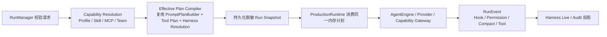

# Cindy / Goose Harness 能力调研与 Natives 增强建议

> 调研日期：2026-07-29  
> 调研对象：Cindy、Goose、Natives 当前工作树  
> 目标：识别可复用的 Harness 机制，增强 Natives Harness 工程与配套工具；不引入第二套执行、权限或配置权威。

## 0. 调研边界与版本

用户给出的两个源码路径均为 Cindy。结合目标文档名与同级仓库，本轮按以下对象调研：

- Cindy：`/Volumes/UNTITLED/本人材料/project/cindy`
- Goose：`/Volumes/UNTITLED/本人材料/project/goose`
- Natives：当前仓库

本轮开始时，指定的
`docs/harness/cindy-goose-harness-research-2026-07-29.md`
在当前工作树、Git 历史及相邻项目中均不存在，`docs/harness/` 目录也不存在。因此无法在原记录上逐段保留批注；本文按指定路径重建，并以源码复核结果为准。

复核基线：

| 项目 | Git commit | 说明 |
| --- | --- | --- |
| Natives | `d9601e1b91422b0f6c22f65fef7946a6c9a73849` | 当前工作树包含未提交的 Harness 改动；本文分析的是实际工作树，而不只是 HEAD |
| Cindy | `e2173a4a7445d172c539a9fccda7eea873afeb8d` | 本地工作树 |
| Goose | `021b0db8dbee8d6c7e9ffbab580a4143598a3560` | 本地工作树 |

术语统一使用 **Harness**。本文中的“借鉴”指复用机制和约束，不指复制对方的宿主架构或大段实现。

## 1. 结论先行

### 1.1 三个项目各自最强的部分

| 项目 | 最值得参考的能力 | 不应直接照搬的部分 |
| --- | --- | --- |
| Cindy | Claude Code / Codex 的统一会话契约；权限与交互归一化；版本能力探测；断线、恢复、孤儿事件处理；长期 Worker Session | 4K–6K 行的运行时适配器、Electron Host 依赖、对厂商私有协议的深绑定 |
| Goose | 工具调用风险检查流水线；渐进式上下文压缩；Recipe 运行包；大输出外置；插件 Hook 生态 | 安全检查器和阻塞 Hook 的 fail-open；把临时文件路径直接作为长期输出协议；将 Recipe 混入 Harness 配置权威 |
| Natives | Daemon 单一执行权威；固定拓扑；版本化 Blueprint；运行前不可变快照；模型可见工具冻结；安全 Hook fail-closed；Host/Daemon 协议单源 | 当前完整 Prompt 仍在生产路径二次拼装；外部运行时检查器还只是窄启发式读取 |

### 1.2 推荐方向

Natives 不需要再造一个 Cindy 式“统一 Agent SDK”，也不需要复制 Goose 的 `ToolInspectionManager`。最小且正确的增强路线是：

1. **先把已有 `PromptPlanBuilder` 接入真实 Run 启动路径**，让快照、预览和 Provider 使用同一个编译结果。
2. **在现有 Capability Gateway / Permission / Hook 链路上增加类型化风险事实**，而不是增加第二个权限裁决器。
3. **把外部运行时 Inspector 做成诚实、结构化、逐文件的只读事实层**，借鉴 Cindy 的 capability-gating，不推断未观测值。
4. **增强现有压缩与任务输出能力**：渐进压缩、结果感知循环证据、Daemon 管理的 Artifact。
5. **把 Goose Recipe 的优点放到 Capability Hub / Workbench 的 Run Template**，不要塞进 Harness Blueprint。

## 2. Natives 当前真实基线

设计文档中的部分“尚未接线”状态已经被当前未提交代码超越。以下判断来自当前工作树的真实调用链。

### 2.1 已经存在，不要重复建设

| 能力 | 当前实现证据 | 判断 |
| --- | --- | --- |
| Run 启动时解析 Harness | `src-agent-daemon/src/run_manager.rs:1556` 调用 `resolve_run_with_tool_plan` | 已接入生产路径 |
| 解析时机 | capability resolution 之后、MCP acquire / Provider 之前 | 插入点正确 |
| 模型可见工具冻结 | `run_manager.rs:1498-1554` 从同一 Gateway、allowlist、MCP 选择和 Plan Mode 计算 schema | 已经优于“按配置猜工具” |
| 工具证据 | `crates/harness-core/src/snapshot.rs` 保存名称、来源、schema digest 和 canonical hash | 已有不可变证据 |
| Hook 编译同源 | `RunHarnessPlan::compile` 从同一 `Resolution` 编译，不二次发现 | 已满足单次解析 |
| Hook Trace | `crates/agent-core/src/hooks.rs:249-350` 发送 started/completed；`repository.rs:1336` 从 `run_event` 投影 | 已接通，不是缺口 |
| Hook Trace 安全性 | `AgentEngine::with_hooks` 注入持久化 EventSequencer；关键遥测持久化失败产生失败结果 | 比 Goose fail-open 更严格 |
| Hook 安全默认 | `production_hooks.rs:263` 启用 security fail-closed | 必须保留 |
| 上下文压缩 | `agent-core/context.rs` 与 `agent-core/compaction.rs` 已有机械压缩和模型摘要 | 不应再建 Context Manager |
| 循环检测 | `agent-core/doom_loop.rs` 已检测工具与文本周期 | 不应复制 Cindy / Goose detector |
| 权限和 Plan Mode | Capability Gateway、Permission Manager、ToolPolicy、Plan Mode latch | 不应复制 Goose PermissionInspector |
| 固定拓扑与版本化 Blueprint | `crates/harness-core/src/topology.rs`、`blueprint.rs`、`snapshot.rs` | 是 Natives 的核心优势 |

### 2.2 当前最关键的真实缺口

#### 缺口 A：完整 Prompt Plan 没有成为执行单一事实源

`crates/harness-core/src/prompt_plan.rs` 已经有纯函数式 `PromptPlanBuilder`，能够生成：

- 分层来源；
- 每层 digest、字符数、脱敏预览；
- 最终 `effective_prompt_hash`；
- 仅内存存在的 `effective_full_text`。

但仓库范围内除自身测试外没有生产调用。当前存在三条不同路径：

1. `harness.prompt.preview` 只列 Harness Prompt Block 和一个内建 Surface；
2. `resolve_run_with_tool_plan` 的快照只统计 Harness Block / Replacement 的 digest 与估算 token；
3. `production.rs:590-632` 又独立拼接 Profile、instruction files、Skill catalog、Harness blocks、内建 surface、team roster、child directive。

因此当前只能证明“某些 Harness prompt 来源被选中”，不能证明 Provider 实际收到的完整 Prompt 与预览、快照一致。

这是本轮唯一 P0。现有 Builder 已经足够，不需要新建 Prompt 编译框架。

#### 缺口 B：External Inspector 是单文件、启发式事实层

`src-agent-daemon/src/harness/external_inspector.rs` 已经做到：

- 只读；
- 目录为空时不伪造 Hook；
- parse error 显式；
- 支持/不支持事件分开。

但仍有边界：

- Claude 的 `hooks.json` 与 `settings.json` 同时存在时只读取前者；
- Codex 使用逐行 substring 判断，不是结构化 TOML 语义；
- 只识别少数 Hook 名，不报告来源层、有效配置、版本能力或冲突；
- 目录存在但没有配置文件时仍以 `active` 报告 source；
- 没有 capability/version probe，无法区分“运行时不支持”和“本文件未配置”。

这不是执行适配器，应继续保持只读 Inspector；增强目标是“观测更真”，不是让 Harness 代管 Claude/Codex。

#### 缺口 C：已有安全裁决，缺少可解释的风险事实

Natives 已有：

- 路径与 symlink 边界；
- command injection 检查；
- permission class；
- Plan Mode 硬闩；
- Hook deny / permission aggregate；
- 超时、取消、输出上限。

但在需要用户确认时，系统尚缺一份统一、类型化的解释，例如：

- 将向哪些域名、仓库、包注册表或远程主机发送数据；
- 命令是否包含 destructive scope；
- 工具返回内容是否含 prompt-injection 特征；
- 风险来自静态规则、MCP annotation 还是 Hook；
- finding 的置信度和稳定 id。

这里应增加“风险事实”，不应增加新的最终 Allow 权威。

## 3. Cindy 深度分析

### 3.1 统一运行时会话契约

核心证据：

- `packages/maker-core/src/agents/base-agent.ts:689`：`AgentSessionHandle`
- `packages/maker-core/src/agents/base-agent.ts:948`：统一 `startSession`
- `packages/maker-core/src/agents/claude-code/index.ts:753`
- `packages/maker-core/src/agents/codex/index.ts:2039`

`AgentSessionHandle` 不只封装 `send`，还统一了：

- `send` 与 in-flight `steer` 的不同状态语义；
- `abort`、`close`、可选 `detach`；
- 事件流和 usage snapshot；
- permission / ask-user / plan-review 的统一 interaction resolver；
- 模型、effort、permission、plan、fast mode、extra dirs 的运行时变更；
- rewind、fork、后台任务与上下文使用情况；
- 能力缺失时显式不提供接口，而不是模拟成功。

**可迁移价值：**  
Natives 的外部 Runtime Bridge 可借鉴“公共事件/交互语义 + 能力矩阵”，但只在真实执行某个外部 runtime 时采用。不要把这套 TypeScript Session Handle 移入 Daemon；Natives 已有 Run、RunEvent、InteractionHub、ExecutionRegistry。

### 3.2 Host-owned 依赖与权限策略

`AgentDeps` 将 MCP、远端 transport、凭据切换协调、能力附加、Claude SDK Hook、统一 MCP 审批策略等交给 Host 注入。两个适配器共享上层审批语义，但分别映射到厂商能力。

Codex 的权限映射见：

- `packages/maker-core/src/agents/codex/index.ts:311`
- `supportsCodexApprovalsReviewerProtocol` 的版本下限探测

典型行为：

- `ask` → `on-request + workspace-write`
- `auto` 只有在 app-server 版本和凭据路由已验证时才启用 reviewer；
- 不支持时回退到 `untrusted + workspace-write`；
- `bypass` 才映射到 `never + danger-full-access`。

**可迁移价值：**

- 能力必须由运行时握手/版本事实决定；
- 未验证字段不发送；
- 不支持时降级并显式报告；
- 模型审核器只能替换“谁审批”，不能扩大 sandbox。

这适合增强 Natives 的 External Runtime Inspector 和未来 Bridge，不应改变 Native Engine 的 Capability Gateway 权威。

### 3.3 Prompt 层稳定与缓存

Cindy 的 Claude / Codex 适配器按确定顺序组合：

- 产品固定 prompt；
- memory rules；
- runtime system prompt；
- memory index；
- user prompt；
- Claude 侧还包含 preset。

会话启动后保存稳定快照，避免同一 Session 内因为配置重读导致 prompt cache 抖动。重复 MCP 名称使用确定的 first-win，实际注册名参与权限解析。

**可迁移价值：**

- Prompt 层顺序必须是协议；
- Run 开始后不重读；
- 预览 hash 必须等于 Provider 消费 hash；
- 动态信息需采用稳定时间桶或移出可缓存前缀。

Natives 已有 Blueprint version + Run snapshot，当前只差把 `PromptPlanBuilder` 真正接入。

### 3.4 恢复和异常状态是 Harness 能力

Cindy 对以下边界有大量显式处理：

- invalid resume 自动恢复；
- stale daemon / dead handle；
- start/resume RPC deadline；
- orphan turn event 暂存与重新归属；
- late interaction 在 turn 结束后拒绝；
- background task 在 abort / close 时按语义清理；
- upstream 长时间无响应 watchdog；
- auto-continued turn 状态修复；
- rewind/fork 后 transcript 与历史一致性。

**可迁移价值：**  
将这些作为 Natives 的 Run/Interaction conformance cases，而不是复制异常分支。尤其要检查：

- Run 终态后 permission / elicitation 是否有统一 tombstone；
- Provider 已返回但迟到事件是否还能修改 Run；
- 恢复后相同 turn id 是否会重复计费或重复工具执行；
- steer/cancel 是否在 safe point 生效。

### 3.5 多 Agent 是长期 Session，而非一次嵌套调用

Cindy Orca 的 Worker 是完整 Session：

- 自己的 model、effort、tools、context；
- 状态持久化；
- 可聚焦、恢复和拆分展示；
- 可绑定 worktree；
- Lead 通过受限 MCP 协调 Worker；
- fork provenance 可审计。

**可迁移价值：**  
当 Natives 的 `task` 子运行需要跨 turn 持续协作时，可把“长期 Worker Session + worktree + provenance”作为演进目标。当前不要先扩 Blueprint；先用现有 Run / parent_run_id / SubAgentManager 证明需求。

### 3.6 Cindy 不足

- Claude Hook 依赖 SDK 注入，Codex 没有同等厂商无关 Hook runtime；
- 运行时适配器过大，错误恢复、协议翻译、权限和会话状态高度交织；
- 远端 Claude 与 Codex 路径能力不对称；
- 依赖厂商私有 app-server/SDK 行为，升级成本高。

Natives 的 Native Engine + Daemon Hook authority 在这一点更干净，不应退回到 Adapter-owned Harness。

## 4. Goose 深度分析

### 4.1 工具检查流水线

核心证据：

- `crates/goose/src/tool_inspection.rs`
- `crates/goose/src/agents/agent.rs:660`
- `crates/goose/src/security/security_inspector.rs`
- `crates/goose/src/security/egress_inspector.rs`
- `crates/goose/src/security/adversary_inspector.rs`
- `crates/goose/src/permission/permission_inspector.rs`

默认顺序：

1. Security
2. Egress
3. Adversary
4. Permission
5. Repetition

每个 finding 统一包含：

- `Allow / Deny / RequireApproval`
- reason
- confidence
- inspector name
- finding id

Egress Inspector 会识别 HTTP URL、Git SSH、S3、GCS、SCP、SSH、容器仓库和包发布等出站目标；Security Inspector 检测工具请求中的恶意或注入模式。

**可迁移价值：**  
统一 finding 形状和用户确认解释很有价值。

**不能复制：**  
`ToolInspectionManager` 在 Inspector 出错时记录日志后继续，Adversary 失败也允许继续；Goose blocking Hook 的 spawn、timeout、序列化等失败同样按 Allow 处理。Natives 的五项安全防线要求安全关键点 fail-closed，不能接受这种语义。

正确做法是在现有 Natives Permission 流程里加入 `RiskFinding`，最终执行仍必须通过：

`Plan Mode → Capability Gateway → ToolPolicy/Permission → Hook aggregate → handler`

任何 finding 只能收紧或解释，不能绕过这些门。

### 4.2 Hook 生态

`crates/goose/src/hooks/mod.rs` 支持：

- PreToolUse
- PostToolUse / PostToolUseFailure
- SessionStart / SessionEnd
- UserPromptSubmit
- BeforeReadFile / AfterFileEdit
- BeforeShellExecution / AfterShellExecution
- Stop

Hook 由插件 `hooks/hooks.json` 声明，支持 regex matcher、command、timeout、stdin JSON、`${PLUGIN_ROOT}`。exit code 2 或结构化 JSON 可阻断。

**对 Natives 的判断：**

- 事件名覆盖可作为兼容映射参考；
- command hook 打包方式适合外部来源 Inspector；
- Natives 已支持更丰富的 Native Hook adapter 和真实 trace，不需要复制 Goose Hook runtime；
- 对未知事件/action 应显式 `unsupported`，不能静默忽略；
- 安全事件的 timeout / spawn failure 必须遵循 Blueprint failure policy，不能默认 Allow。

### 4.3 渐进式上下文管理

核心证据：

- `crates/goose/src/context_mgmt/mod.rs:26`
- `compute_tool_call_cutoff`
- `summarize_tool_call`
- `maybe_summarize_tool_pairs`

Goose 的策略不是一步删历史：

1. 根据真实 context limit 和默认 0.8 阈值判断；
2. 保护当前 turn 的最近工具调用；
3. 分批摘要最老的 tool request/response pair；
4. 必要时对旧前缀做完整模型摘要；
5. 如果摘要请求本身超长，逐级移除 0/10/20/50/100% 的中段 tool response 后重试；
6. 保留最新 agent-visible user text，并给出继续执行指令。

**可迁移价值：**  
Natives 已有机械 tool-output 压缩与模型摘要，建议增加一个“旧 tool pair 分批摘要”阶段，不新建 Context Manager。目标是降低完整摘要频率、保留最近工作集、让压缩行为可在 trace 中解释。

### 4.4 大输出外置

`crates/goose/src/agents/large_response_handler.rs` 在文本超过 200,000 字符时写入权限受限的临时文件，并给模型返回路径。

**可迁移价值：**  
不要把巨量结果硬塞入上下文。

**不能直接复制：**

- 临时路径生命周期不稳定；
- 路径会绕开 Natives 的 ProjectIdentity / capability scope；
- 无稳定 hash、TTL 和 Run provenance；
- Renderer 与模型可能得到不同可见性。

Natives 应复用 Daemon 已有 task output / 本地文件权威，返回：

- bounded preview；
- artifact id；
- content hash；
- byte length；
- MIME/type；
- TTL / retention；
- 可分页读取或搜索的受限工具。

### 4.5 Recipe 运行包

核心证据：

- `crates/goose/src/recipe/mod.rs`
- `crates/goose/src/recipe/validate_recipe.rs`
- `crates/goose/src/recipe/recipe_extension_adapter.rs`

Recipe 可声明：

- version、title、description；
- instructions / initial prompt；
- provider、model、temperature、max turns；
- extensions；
- parameters；
- JSON response schema；
- sub-recipes；
- retry。

参数支持 string、number、boolean、date、file、select；验证包含：

- prompt / instructions 至少一个；
- 参数引用完整；
- optional 必须有 default；
- duplicate key 拒绝；
- JSON Schema 检查；
- file 参数禁止默认值，避免隐式导入敏感文件。

**可迁移价值：**  
这是很好的“可复现 Run 输入包”。

**归属判断：**  
它不属于 Harness Blueprint。Harness 负责执行语义和 Hook；Recipe 同时选择模型、工具、扩展、输入和输出契约，应该落在 Capability Hub / Workbench 的 `RunTemplate`。启动后只把 template id/version/hash 记入 Run snapshot。

### 4.6 子 Agent 与控制协议

Goose 的 Subagent 创建完整 Agent，可有独立 provider、model、extensions、system prompt、session 和 max turns；`summon` 支持后台委派和跨 `.goose` / `.agents` / `.claude` 发现配置。ACP 又将 session、permission、recipe、provider/model 暴露为外部控制平面。

**对 Natives 的判断：**

- 独立预算、工具面和输出 schema 值得对照现有 `task` 子运行；
- 后台任务必须有父 Run 生命周期、取消树和结果存储；
- ACP 只有出现真实第三方客户端时才值得实现，当前不为“可能兼容”新增协议。

## 5. 能力对比矩阵

图例：`强` = 可作为主参考；`有` = 已实现但范围较窄；`弱` = 存在明显缺口。

| 能力 | Natives | Cindy | Goose | Natives 决策 |
| --- | --- | --- | --- | --- |
| 单一执行权威 | 强 | Host + adapter 分散 | Agent 中央对象 | 保持 Daemon 权威 |
| 版本化 Harness 配置 | 强 | 弱 | 插件/Recipe 文件 | 不改变 |
| 固定拓扑和可解释插入点 | 强 | 弱 | 弱 | 不改变 |
| Run 前不可变快照 | 强 | Session snapshot | Session 持久化 | 扩充完整 Prompt hash |
| 模型可见 Tool Plan | 强 | Adapter 构建 | Extension Manager | 保持现有冻结 |
| 完整 Prompt 单源编译 | 弱 | 强 | 有 | 接入现有 Builder |
| Hook 覆盖与适配器 | 强 | Claude 强、Codex 弱 | command hook 强 | 保持 Native Hook |
| Hook Trace | 强 | 事件/日志分散 | 日志为主 | 保持 run_event 投影 |
| 多 runtime 能力诚实度 | 有 | 强 | Provider trait | 增强 External Inspector |
| 权限硬边界 | 强 | 强 | 有，但部分 fail-open | 保持 Gateway |
| 风险解释 / egress finding | 弱 | 有 | 强 | 只移植 typed finding |
| 上下文渐进降级 | 有 | Auto Compact | 强 | 补 tool-pair 阶段 |
| 结果感知循环检测 | 有 | 强 | 有 | 增量增强现有 detector |
| 大输出 Artifact | 有基础 | 各 adapter 自理 | 临时文件 | 复用 Daemon 输出权威 |
| 可复现 Run Template | 有分散能力 | Maker/Orca 配置 | Recipe 强 | 放 Capability Hub |
| 长期 Worker Session | 有子 Run | 强 | 强 | 需求出现后演进 |
| 外部控制协议 | UDS v2 | 厂商协议 | ACP | 无消费者则不做 |

## 6. 建议路线图

### P0：让 Effective Prompt 成为单次编译结果

**目标：** Provider 消费、Run snapshot 和 Prompt Inspector 全部来自同一个 `CompiledPromptPlan`。

最小改法：

1. 复用 `PromptPlanBuilder`，不要建新 Builder；
2. 在 capability resolution 完成、Provider 启动前收齐真实层：
   - builtin surface / replacement
   - profile system prompt
   - instruction files
   - skill catalog
   - Harness prompt blocks
   - team roster
   - child directive
3. 一次 build：
   - `effective_full_text` 只留在内存，交给 `ProductionRuntime`；
   - snapshot 保存 layers、digest、char/token estimate、redacted preview、effective hash；
4. 删除 `production.rs` 的第二套字符串拼装；
5. `harness.prompt.preview` 对无 Run 场景使用相同 Builder，对具体 Run 直接读 snapshot。

**验收：**

- Provider 请求中的 system prompt hash 等于 snapshot `effective_prompt_hash`；
- 相同输入产生相同层顺序和 hash；
- 发布新 Blueprint 不改变已启动 Run；
- snapshot 和 Renderer 不包含完整 prompt 或 secret；
- child directive、team roster、skill catalog 缺任一层时测试失败。

### P1-A：增强 External Runtime Inspector

最小改法：

- Claude 同时枚举并解析 `settings.json`、`hooks.json`、插件 Hook 来源；
- Codex 使用已有 TOML 能力做结构化解析；若当前依赖树没有 TOML parser，再保留窄解析器，不为 Inspector 单独引依赖；
- 每个 source 单独返回：
  - path、scope、digest、parse status；
  - observed events；
  - unsupported fields；
  - conflicts / shadowed source；
- runtime capability 只有通过实际版本/握手观测才标 `supported`，否则标 `unknown`；
- 保持 read-only，不写外部配置、不将其导入 Harness。

**验收：**

- 两个 Claude 文件同时存在时都可见；
- 目录存在但无配置不会标为 active configuration；
- malformed 文件有独立 parse_error，不吞掉其他来源；
- 没有观测到的能力不得显示为已支持；
- 同一 source digest 在内容不变时稳定。

### P1-B：给现有权限卡增加 `RiskFinding`

建议字段：

```text
finding_id
kind: egress | destructive_scope | prompt_injection | provenance | repetition
severity
source: gateway | hook | mcp_annotation | static_analyzer | model_reviewer
summary
evidence_redacted
confidence
```

约束：

- finding 不是新的 Allow/Deny 权威；
- 静态检查先于模型 reviewer；
- reviewer 失败不能扩大权限；
- 高风险边界的分析失败按现有 failure policy fail-closed；
- 结果进入既有 RunEvent / permission interaction，不另建日志数据库；
- evidence 必须脱敏、限长。

首个切片只做确定性 egress target 提取和 destructive scope；Adversary LLM reviewer 等有误报/延迟数据后再决定。

### P1-C：渐进上下文压缩

在现有 `agent-core::compaction` 增加一个阶段：

1. 使用 Provider 的真实 usage；没有时才使用现有估算；
2. 保护当前 turn 和最近 N 个 tool pair；
3. 对最老 tool pair 分批摘要；
4. 仍超预算才做现有完整前缀摘要；
5. 摘要失败退回现有机械压缩；
6. 每次压缩记录策略、输入/输出 token、删减 pair 数和 summary hash。

不要引入用户可自由配置的复杂策略树。先保留一个阈值和一个 recent-pair 保护数。

### P1-D：Daemon 管理的大输出 Artifact

触发点沿用现有 tool output 上限。超限时：

- 原始内容写入 Daemon 管理的 artifact/task-output store；
- 工具结果返回 preview + metadata；
- 通过受限的 read-range / search 工具继续读取；
- 继承 Run、ProjectIdentity、取消和清理语义；
- 文件权限、TTL、总容量和单 Run 配额由 Host/Daemon 权威控制。

不要返回任意 `/tmp/...` 路径。

### P2-A：结果感知 Doom Loop

Natives 已有周期检测，只建议补两项而非替换：

- 将 tool result digest 纳入“完全相同调用”证据，降低轮询误判；
- 增加每 turn tool-result 硬上限作为成本兜底。

保持现有周期检测；不要再实现 Cindy 的独立 `ToolLoopGuard` 类。

### P2-B：Run Template（借鉴 Goose Recipe）

放在 Capability Hub / Workbench，而不是 Harness：

- template version；
- prompt / instructions；
- capability profile、provider/model 偏好；
- 参数 schema；
- output schema；
- max turns / retry 上限；
- 子模板引用；
- 启动时解析为普通 RunStart 输入。

安全约束：

- file 参数无默认值；
- secret 只保存引用；
- template 不能绕过 ToolPolicy、Plan Mode 或 ProjectIdentity；
- Run snapshot 记录 template id/version/hash，不持久化 secret。

只有出现两个以上真实重复工作流时再实现。

### P2-C：长期 Worker Session

当现有 `task` 子 Run 出现“需要跨多个 parent turn 保持上下文”的真实需求后，再扩展：

- stable worker/session id；
- parent/team provenance；
- 独立预算与 tool surface；
- worktree binding；
- attach/detach/recover；
- 明确的 idle reaping。

不要先把 Orca/Goose 的团队模型塞进 Harness Blueprint。

## 7. 推荐目标数据流



关键不变量：

- `C` 只执行一次；
- `D` 成功后才能进入 `E`；
- `E` 不重新发现、不重新拼 Prompt；
- `F` 的最终工具执行权仍在 Capability Gateway；
- `H` 只投影 `run_event`，不建第二条 trace 权威。

## 8. 明确不做

1. 不复制 Cindy 的巨型 Claude/Codex Adapter 到 Harness Core。
2. 不把 External Inspector 变成外部 CLI 配置编辑器。
3. 不增加第二个 permission manager 或 tool execution path。
4. 不采用 Goose Inspector / blocking Hook 的 fail-open 安全语义。
5. 不把 LLM reviewer 的 Allow 当作越过 sandbox 的授权。
6. 不把临时文件绝对路径作为稳定 Artifact 协议。
7. 不把 Recipe、调度器、provider selector 塞进 Harness Blueprint。
8. 没有真实 ACP 消费者前，不增加 ACP 协议。
9. 不重新实现已有 Prompt builder、DoomLoopDetector、compaction、RunEvent trace。

## 9. 最小实施顺序

| 顺序 | 切片 | 预期收益 | 主要风险 |
| --- | --- | --- | --- |
| 1 | `PromptPlanBuilder` 接入真实 Run | 消除预览、快照、执行漂移 | prompt 层顺序变化影响缓存 |
| 2 | External Inspector 多来源诚实解析 | 工具台显示可信外部事实 | 厂商格式变化 |
| 3 | 确定性 `RiskFinding` | 权限卡可解释、可审计 | 误报导致确认疲劳 |
| 4 | tool-pair 渐进摘要 | 降低完整 compact 频率 | 摘要遗漏关键结果 |
| 5 | Daemon Artifact 输出 | 保留大结果且不挤爆上下文 | 生命周期与容量治理 |
| 6 | Doom Loop 结果 digest / hard cap | 更少误判并限制成本 | 阈值需真实运行数据 |
| 7 | Run Template | 重复任务可复现 | 容易越界到 Harness 权威 |

第一阶段只建议做顺序 1。它复用现有代码，改动最集中，同时为后续 Inspector、Audit 和回放提供可信基线。

## 10. 源码索引

### Natives

- `src-agent-daemon/src/run_manager.rs:1498-1567`
- `src-agent-daemon/src/production.rs:590-632`
- `src-agent-daemon/src/harness/control_plane.rs:650-700`
- `src-agent-daemon/src/harness/control_plane.rs:821-990`
- `src-agent-daemon/src/harness/external_inspector.rs`
- `src-agent-daemon/src/harness/repository.rs:1336`
- `crates/harness-core/src/prompt_plan.rs`
- `crates/harness-core/src/snapshot.rs`
- `crates/agent-core/src/hooks.rs:249-350`
- `crates/agent-core/src/compaction.rs`
- `crates/agent-core/src/doom_loop.rs`
- `crates/capability-gateway/src/policy.rs`
- `crates/capability-gateway/src/plan_mode.rs`

### Cindy

- `packages/maker-core/src/agents/base-agent.ts`
- `packages/maker-core/src/agents/claude-code/index.ts`
- `packages/maker-core/src/agents/codex/index.ts`
- `packages/maker-core/src/agents/shared/auto-compact-controller.ts`
- `packages/maker-core/src/agents/shared/loop-guard.ts`
- `packages/orca-workflow/`
- `docs/dev-rules/maker-core-and-agent-behavior.md`
- `docs/dev-rules/orca-team-architecture.md`

### Goose

- `crates/goose/src/agents/agent.rs`
- `crates/goose/src/agents/tool_execution.rs`
- `crates/goose/src/tool_inspection.rs`
- `crates/goose/src/security/`
- `crates/goose/src/permission/permission_inspector.rs`
- `crates/goose/src/hooks/mod.rs`
- `crates/goose/src/context_mgmt/mod.rs`
- `crates/goose/src/agents/large_response_handler.rs`
- `crates/goose/src/recipe/`
- `crates/goose/src/agents/subagent_handler.rs`
- `crates/goose/src/agents/platform_extensions/summon.rs`
- `crates/goose/src/acp/`
