# AtomCode Agent 工程复核

> 复核日期：2026-08-10  
> 仓库：`/Volumes/UNTITLED/本人材料/project/atomcode`  
> 固定版本：`4677ddfa68a84897a0154fe56af3e3e3b173410f`  
> 研究范围：Agent Harness、Tool Runtime、权限与沙箱、Prompt/Context、压缩、Hook、Session、Subagent、事件与模块设计。  
> 结论性质：源码静态复核；未启动应用、未执行全仓测试。仓库中的大量 `._*` 是外置盘 AppleDouble 未跟踪文件，不纳入评价。

## 1. 结论

AtomCode 最值得吸收的不是整套产品路径，而是正在从旧引擎中提炼出来的几个内核不变量：冻结的 mounted tool surface、三阶段工具执行、读写 barrier 下的有界并发、按模型调用顺序结算、统一 terminal funnel，以及 compaction 的 `prepare -> durable checkpoint -> commit`。

但它还不是完成态。CLI 默认 v2 仍通过 bridge 对外说 v1 协议，`atomcode-core`、新 kernel/capabilities/coding 和 bridge 三套结构并存。权限模型也存在一条需要明确拒绝的授权放大链：Claude-compatible `PreToolUse allow` 会短路其后的工作区写入、Bash 范围检查和通用审批；若被放行的是 worker `task`，子 Agent 又会在 `AutoRespond::AllowAll` 下获得 Bash。这个行为可以用于兼容受信 Hook，不能成为 Natives 的安全默认。

综合评价：

| 维度 | 评价 | 依据 |
| --- | --- | --- |
| Kernel loop | 强 | 终止原因、fuse、取消、工具三阶段、统一 `turn_complete` 均有显式合同 |
| Tool runtime | 强 | mounted surface、中央输出上限、并发 barrier、ordered settlement |
| 权限与 sandbox | 中偏弱 | 工作区/敏感路径策略细，但 Kernel 无 OS sandbox，Hook `allow` 有越过后续审批的能力 |
| Prompt/context | 强 | session-start 固定块、resume 原位 reconcile、请求尾部动态提醒、cache epoch |
| Compaction | 强 | sacred floor、配对修复、net-loss guard、anchor、防注入、手动压缩先落盘后提交 |
| Hook/extension | 中偏强 | 生命周期合同清楚；外部 command Hook 对超时/启动失败 fail-open，panic 无隔离 |
| Session/recovery | 中 | snapshot 可恢复；raw transcript/metadata 是 best-effort，不是事务事件日志 |
| Subagent | 中 | 独立上下文、工具裁剪、并发/超时/取消；权限快照和 durable child lifecycle 不足 |
| Event/replay | 中 | typed live event 丰富；缺少统一、持久、可完整 replay 的事实日志 |
| 模块深度 | 中 | Kernel seam 有深度；迁移期 bridge、超大 `agent.rs`/builder 扩大了理解面 |

## 2. 证据口径

本报告把证据分为三类，避免把目标架构写成现状：

| 标记 | 含义 |
| --- | --- |
| **默认路径** | 从当前 CLI/Daemon 入口可追到的实际调用链 |
| **已实现可选** | 源码和测试存在，但受 feature/env/入口限制，不一定默认启用 |
| **目标态** | 文档、TODO 或迁移计划描述的未来形态 |

`docs/target-architecture.md:3-6` 明确声明其内容是方向性目标，当前仍是旧引擎、新栈和 bridge 并存。`docs/v5.0.0-retire-bridge-core-progress.md:91-105` 也把驱动协议迁移列为主要未完成项。以下评价以调用链为准，而不是以“v2”名称或北极星文档为准。

## 3. 默认执行入口与真实调用链

### 3.1 CLI 默认路径

```mermaid
flowchart LR
    CLI["atomcode-cli main"] --> Bridge["spawn_bridged_runtime_with_control"]
    Bridge --> Prepare["coding::prepare_with_plugin_hooks"]
    Prepare --> Parts["CodingParts: tools, hooks, session, grants"]
    Parts --> Assemble["coding::assemble"]
    Assemble --> Agent["kernel::Agent"]
    Agent --> Adapter["KernelRuntimeAdapter"]
    Adapter --> V1["core AgentCommand / AgentEvent"]
    V1 --> Driver["TUI / headless driver"]
```



- **默认路径**：`crates/atomcode-cli/src/main.rs:1644` 创建 bridged runtime；新会话切换也在 `:1657` 重建 bridge。
- **默认路径**：bridge 在 `crates/atomcode-bridge/src/runtime.rs:389` prepare，在 `:431` assemble，再把 kernel 事件/命令适配为 core 协议。
- **局部直连**：daemon 的 helper 在 `crates/atomcode-daemon/src/kernel_runtime.rs:94-97` 可直接 `prepare -> assemble -> spawn`，但同文件 `:1492` 仍保留 bridge 启动路径。
- **目标态**：删除 `atomcode-core`、`atomcode-bridge` 和 legacy protocol；当前尚未达成。

因此，“CLI 默认使用 v2 kernel”成立；“生产链已经没有 bridge/core”不成立。bridge 仍承担协议翻译和约 15 个驱动级能力，迁移风险真实存在。

### 3.2 分层判断

AtomCode 的三层定义是合理的：

- L0 Kernel：中立 loop、Provider/Tool/Hook/Message/Event 合同。
- L1 Capabilities：文件、Bash、MCP、Session、Memory、Compaction 等可组合能力。
- L2 Coding：persona、装配顺序、权限模式和产品策略。

优点是安全策略没有被伪装成 Kernel 自带能力，Kernel 文档明确“挂载 Tool 等于授予宿主 authority”。缺点是迁移期间 L2、bridge 和旧 core 都还保留行为知识，实际产品语义尚未收敛到一个 composition root。

## 4. Agent Loop 不变量

### 4.1 已确认的 loop 合同

- 每个用户输入分配单调 `turn_id`，每次 LLM 调用分配单调 `request_id`；resume 从 snapshot 高水位继续。
- `StopReason` 区分正常停止、round/continuation fuse、Provider 错误、超时、取消、Prompt 拒绝和限流，不把错误折叠为空成功。
- 默认 `max_continuations = 50`；stream/request timeout 默认不设，必须由 Coding 层显式注入。
- 取消是 cooperative token。工具中途取消会生成 `cancelled - side effects unknown` 语义，无法证明外部副作用是否已发生。
- 所有真实 turn terminal 经过 `finish_turn -> LifecycleHooks::turn_complete`；Snapshot、Transcript 和 telemetry 可以挂在同一 terminal funnel。
- mid-turn `SendMessage` 进入队列，在 round boundary 折入当前 turn；历史不会在 provider call 中途被改写。

### 4.2 优点

最有价值的是“停止原因属于执行事实，而不是 UI 推断”。这使 headless、TUI、测试和 session persistence 使用同一 terminal vocabulary。另一个优点是对空响应、stream idle、429、context overflow 分设预算，避免一种重试吞掉另一种故障的 fuse。

### 4.3 缺点

- `crates/atomcode-kernel/src/agent.rs` 约 3,700 行，loop、命令 actor、Provider retry、compaction、tool scheduler 和 builder 集中在一个文件，修改的认知半径偏大。
- `AgentBuilder` 暴露 Provider、tools、persona、middleware、hooks、compaction、timeouts、chat options、cwd、cancel、session、clock 等宽配置面；L2 可组合性强，但无效组合也多。
- 工具/Hook/middleware panic 不隔离；workspace `panic=abort` 时会终止宿主进程。对内建 Rust 能力尚可，对插件/外部扩展不够。
- cooperative cancel 没有 operation journal，取消后的自动重试只能依赖上层保守判断。

## 5. Tool Interface、Registry 与结算

### 5.1 Tool 合同

`crates/atomcode-kernel/src/tool.rs:168` 的 `Tool` 暴露名称、描述、JSON Schema、`risk(args)`、`parallel_safe(args)` 和 async `execute(args, ToolContext)`。`ToolContext` 在 `:141` 只携带 cwd、cancel token 和 progress sink。

优点：

- Tool surface 在 `ToolRegistry -> MountedTools` 处冻结，只有 mounted tool 可见且可执行。
- `ToolRegistry` 使用 `BTreeMap`，模型看到的工具定义顺序稳定，有利于 prompt cache 和确定性测试。
- `risk` 与 `parallel_safe` 都可以按参数判断，而不是只按工具名静态分类。
- Kernel 在 `agent.rs:33` 统一设置默认 64 KiB Tool result cap，输出在写历史、发事件、回模型前统一截断。

缺点：

- `arguments` 仍是 raw JSON string。Schema 约束是给模型看的描述，Kernel 不拥有统一 decode/validation；具体工具可能采用不同修复策略。
- `RiskLevel` 是 advisory metadata，不是不可绕过的执行权限。
- `ToolResult` 主要是字符串、error flag 和 images，不是 typed model result / UI result / artifact reference 的分离合同。

### 5.2 三阶段执行

工具调用在 `crates/atomcode-kernel/src/agent.rs:2280-2550` 附近分为：

1. **Classify**：同批去重、mounted lookup、middleware gate、确定 `parallel_safe`。
2. **Execute**：默认最多 4 个并发；read-safe 持 RwLock read lock，副作用工具持 write lock形成独占 barrier。
3. **Apply**：按模型调用顺序执行 after middleware、输出 cap、Hook、事件、history append。

`FuturesOrdered` 使执行可并发、结果仍 deterministic settlement。这个设计比“全部并发后按完成顺序写回”更适合 LLM API 的 tool-call/result 配对要求。

仍需注意：barrier 只表达进程内工具间互斥，不是文件锁、事务或 OS sandbox；两个独立 Agent/进程仍可能并发修改同一资源。

## 6. Permission、Hook 与 Sandbox 顺序

### 6.1 生产装配顺序

`crates/atomcode-coding/src/parts.rs:677-737` 的关键 `before` 顺序是：

```text
Tool telemetry
  -> PlanModeGate                    hard gate
  -> SensitivePathGate              hard gate for otherwise-safe reads
  -> CCExternalHooks PreToolUse      may rewrite / deny / ask / allow
  -> OpenFileWorkspaceGate           convenience allow
  -> WriteApprovalGate               workspace/sensitive/path-scoped policy
  -> BashWorkspaceGate               out-of-workspace destructive target policy
  -> ApprovalMiddleware              generic risky-tool approval
  -> execute
```

Kernel 对 `BeforeOutcome` 的折叠规则在 `crates/atomcode-kernel/src/agent.rs:2372-2388`：`Deny` 阻断，`Allow` 立即跳过剩余 middleware，`Ask` 当前只继续走正常 approval，并没有强制弹窗语义。

由此得到两个精确结论：

- CC Hook `allow` **不能**越过已经先执行的 PlanModeGate 和 SensitivePathGate。
- CC Hook `allow` **可以**越过后续 WriteApprovalGate、BashWorkspaceGate 和 ApprovalMiddleware。这是源码注释明确选择的 Claude Code 兼容语义，不是偶然顺序。

### 6.2 外部 Hook 的失败策略

`crates/atomcode-capabilities/src/cc_hooks.rs:264-348` 把 command Hook 运行结果建模为可选值：spawn 失败或 timeout 返回 `None`。Prompt 和 PreToolUse 路径在 `:539`、`:627` 对 `None` 直接 continue。只有 exit code 2 且带“刻意阻断理由”，或 JSON 明确 deny/block 才阻断；命令找不到、Python 文件不存在、ModuleNotFound 等被识别为 broken hook 并继续。

这适合作为非安全自动化 Hook 的可用性策略，但不适合 Natives 的 security-critical Hook：部署错误本身就意味着安全检查没有执行，应 fail-closed 并生成结构化失败事实。

### 6.3 Sandbox 结论

- Kernel 没有 OS/process sandbox；Tool 是宿主内受信代码。
- file write policy 对 workspace、temp、敏感路径、`..` 和 symlink 使用 canonicalization，并为可能卡死的文件系统探测设有有界 off-thread 路径，这是优点。
- BashWorkspaceGate 自行做 quote-aware shell token/redirect/destructive-command 扫描。这能覆盖常见命令，但无法等价于 shell AST、解释器内部行为、动态 expansion 或系统级隔离。
- `ApprovalMiddleware` 对 request timeout、driver disconnect、cancel 返回的 Null 选择 fail-closed，这一点比外部 Hook 更严格。

### 6.4 主要风险

**高风险授权放大链：**一个被信任边界不清晰的 CC Hook 可以对 `task(worker)` 返回 `allow`，从而越过主 Agent 的 generic approval。worker 子 Agent 随后在 `AutoRespond::AllowAll` 下执行，且 `DenySensitivePaths` 只检查文件工具参数，Bash 明确保留父调用授予的 authority。结果是一次 Hook allow 可间接授予 child Bash 的广泛副作用能力。

这不是说 AtomCode 当前一定可被外部攻击，而是说明其安全性依赖“能返回 allow 的 Hook 本身完全受信”这一隐含前提。该前提需要在产品配置、签名/来源和 UI 中显式化。

## 7. Prompt、Context 与 Compaction

### 7.1 Prompt/Context

Coding 层的 Hook 注册顺序在 `crates/atomcode-coding/src/parts.rs:370-440` 固定为 SessionContext、Memory、Snapshot、Transcript、StatusReminder 等：

- persona 由 Agent 建立时注入。
- `SessionContextHook` 在 session start 生成环境、项目指令和 Git snapshot；resume 时按 header 原位 reconcile，而不是每次追加。
- Memory 使用相同的 leading-system insertion/reconcile 规则。
- 动态日期/状态提醒只在 `pre_request` 的临时消息副本尾部注入，不污染持久历史前缀。
- Provider 与 session id 绑定，以维持 gateway/prompt cache affinity。
- persona/model 变化会替换旧身份并增加 `cache_epoch`。

这套设计把“稳定基线”和“每次请求动态尾巴”分开，值得吸收。但它还不是一个完整 typed source algebra：persona、instructions、memory、status、plugin Hook context 仍由多个 Hook 依顺序改写 Conversation，缺少统一的 source id/revision/digest 快照。

### 7.2 Compaction

AtomCode 的 compaction 是本仓最成熟的深模块之一：

- `StubCompaction`（`compaction.rs:40`）只永久折叠旧 Tool result，保留 active/recent turn，并默认不折叠 `read_file`。
- `OverflowCompaction`（`:190`）按真实 provider overflow 逐级 aggressive stub、hard truncate、drain+summary。
- 自动压力达到较高水位后可 drain+summary；manual `/compact` 保留约 25% 最近 token 的完整 turn。
- summary 输入对 Tool output 做 head+tail 上限，输出硬限制 64 KiB，LLM 调用硬超时 180 秒。
- prior anchor 采用 sentinel，重新压缩时 update 而非反复摘要；delimiter 被中和，summary 插入前附“reference only” framing，降低工具输出 prompt injection 被洗入摘要的风险。
- Kernel 的 `Conversation::prepare_plan`（`message.rs:540`）重校验 sacred floor、修复 tool-call/result pairing、计算 wire-byte proxy，只有严格缩小时才准备新 epoch。
- 手动压缩在 `agent.rs:824-905` 先生成 candidate snapshot，调用 checkpoint 保存成功后再 `commit_prepared`；保存失败时 live conversation 和 epoch 不变。

不足：

- `CompactionCheckpoint::save` 是同步接口，且在 Agent actor 独占 conversation 时调用；慢盘可阻塞命令处理。
- 只有 manual compaction 走显式 checkpoint-before-commit；auto/overflow 依赖 turn terminal 的 snapshot persistence，崩溃窗口语义不同。
- summary Provider 复用当前模型。模型质量、费用、数据边界与主对话绑定，没有独立的 summarizer policy snapshot。

## 8. Session 持久化与恢复

AtomCode 使用三个不同用途的文件：

| 文件 | 角色 | 一致性 |
| --- | --- | --- |
| `<id>.snapshot` | compacted working set，resume 来源 | sibling temp + rename 原子覆盖；每 terminal best-effort 保存 |
| `<id>.meta` | session list、名称、turn stats | 原子覆盖；损坏时跳过更新，避免覆盖旧文件 |
| `<id>.jsonl` | 每回合 raw transcript，供 recall | append-only；best-effort，未 fsync，失败静默 |

优点：

- 恢复工作集和长期 recall 分离，compaction 不删除 raw transcript。
- SnapshotHook 在所有 terminal 保存，并用 live `TurnCtx` 补齐“没有 assistant message”的 turn/request 高水位。
- snapshot/meta 有 schema version；unsupported snapshot 在 Coding prepare 时拒绝复用同一 session id，防止静默空启动后覆盖新格式。
- snapshot 写入是原子替换，损坏 meta 不会被“ fresh default”覆盖。

缺点：

- SnapshotHook 的常规 per-turn save 在失败时只 `eprintln!`；本次 turn 仍向用户表现为完成，恢复点可能落后。
- Transcript 明确保存 raw prompt、reasoning、Tool args/result，且“no redaction”；它是敏感数据放大面。
- Transcript append 失败被忽略；没有 fsync、checksum、sequence 或 snapshot/transcript 原子一致性，因此不能称为 durable event sourcing。
- `undone` 字段只是预留，实际 `/undo` 标记尚未实现。
- recall 遍历项目桶内所有 JSONL，适合个人本地工具，但多租户/共享机器需要更强 namespace、ACL 和保留策略。

## 9. Subagent / Multi-agent

`task` 工具在 `ATOMCODE_SUBAGENT` 非空时启用，默认关闭（`parts.rs:253,831`）。

已实现能力：

- `explore` 只挂载 read/search/list 工具；`worker` 额外挂载 edit/write/bash/search-replace。
- 每个 child 创建独立 Agent、conversation、Tool mount 和 cancel child token；不挂 `task`，所以不能递归派发。
- simple/hard 可路由 fast/capable Provider；默认同父 Provider，tier Provider 延迟创建并能随 model swap reset。
- 默认并发 3、每任务总超时 900 秒；超时后 cancel 并给 5 秒 grace，尽量保留 partial output。
- batch 中部分 child 失败不把整个 Tool 标成失败，只有全部失败才 `is_error=true`；结果按 label 排序，避免调度顺序影响模型输入。
- progress 从 child Hook 汇总到 parent ToolProgress；父 cancel 传播到 child。

缺点：

- child 没有独立 durable session/run identity、event log、permission snapshot 或 resumable lifecycle；它是“Tool 内组合 Agent”，不是可恢复子 Run。
- worker 使用 `AutoRespond::AllowAll`。其能力边界主要依赖挂载工具清单和一个敏感路径 middleware，而不是 parent permission 与 task policy 的不可变交集。
- `DenySensitivePaths` 不检查 Bash；“父 task 调用已获批”等价于给 worker Bash 广泛 authority。
- child panic 在 `panic=abort` 下仍会杀死宿主；JoinError 分支无法提供真正隔离。
- child 使用相同工作目录，多个 worker 只靠 prompt 要求 non-overlapping scope，没有资源锁或文件 ownership。
- progress 是 ephemeral；child 完成/partial/unknown side effect 没有 durable operation journal。

## 10. Event、观测与 Replay

`AgentEvent`（`crates/atomcode-kernel/src/event.rs:85-209`）覆盖 Turn、文本/思考流、Tool streaming/start/progress/result、batch、Request、Usage、Snapshot、RateLimit、Steer、Compaction 和 terminal/error。这是清晰的 typed perception protocol。

但需要区分三层：

1. `AgentEvent`：在线观察/驱动协议；TextDelta、ToolProgress 等天然短暂。
2. `.snapshot`：可恢复状态，但只保存当前 working set。
3. `.jsonl`：raw recall 材料，但不是完整事件序列，也不具备严格耐久性。

所以 AtomCode 能恢复 conversation，能召回旧回合，也能实时观察执行，却不能从单一 durable log 精确重放 permission request/decision、Hook outcome、每个 retry attempt、progress 和 child lifecycle。bridge 还要把 kernel event 映射成 core event，进一步增加事件语义漂移面。

## 11. 模块深度、测试面与 Git 演进

### 11.1 深模块

较好的深模块：

- `ToolRegistry/MountedTools`：小接口封装工具可见面与确定性顺序。
- `LifecycleHooks/HookChain`：生命周期、可变性、顺序、短路合同集中。
- `CompactionStrategy + Conversation::prepare_plan`：策略只提案，Kernel 维护历史不变量。
- `SessionManager`：只负责三类文件的 IO，不夹 Agent 行为。

偏浅或过宽的模块：

- `Agent/AgentBuilder`：配置面和 loop 责任过宽。
- `atomcode-bridge/src/runtime.rs`：约 3,500 行，承担协议翻译、驱动功能和迁移兼容。
- `atomcode-core`：约 76,981 行，仍是迁移债务和双实现来源。

### 11.2 测试与演进证据

选定 kernel/session/compaction/CC Hook/task/coding 范围内约有 205 个 `#[test]` / `#[tokio::test]` 标记。测试重点不是只有 happy path，还覆盖：

- tool-call/result pairing、dedup、ordered parallel settlement、cancel；
- snapshot 版本、高水位、损坏 meta 不覆盖；
- compaction sacred floor、net-loss、anchor、防注入、超时和输出上限；
- Hook exit code、broken command、matcher、arg/result rewrite；
- subagent timeout、partial output、并发和敏感文件工具拒绝。

近期 Git 历史也能解释设计来源，例如：

- `577d8cbf`：read-only tool 并发与 RwLock barrier；
- `cc09cbcc`：Tool 输出上限降到 64 KiB；
- `03ca6caa`：arg-aware `parallel_safe`；
- `994b3a68`：工作区外破坏性 Bash 审批；
- `6189a0ad`：idle manual compaction 先持久化再成功；
- `28f2b6c5`：anchored summary prompt-injection hardening。

现实差距同样清晰：目标文档记录 bridge/core 尚待退役，daemon kernel path 也有 subagent tier/goal/loop 等 deferred 注释。这些不能当作已完成能力评分。

## 12. 优点清单

1. **内核责任诚实**：Kernel 明确不声称提供 sandbox/approval，L1/L2 才拥有策略。
2. **工具执行不变量集中**：mounted surface、dedup、并发 barrier、ordered settlement、输出上限都在单一路径。
3. **Hook 合同清楚**：lifecycle 与 around-tool 分离，顺序、短路、临时/永久修改均有文档和测试。
4. **终止事实可解释**：StopReason 与统一 `turn_complete` 让失败、持久化和 UI 不依赖猜测。
5. **缓存意识强**：稳定 prefix、request-tail 动态内容、cache epoch、单调 stub 和 anchor update 是系统级设计。
6. **压缩提交协议严谨**：策略提案、Kernel 重校验、严格 net loss、manual durable checkpoint 后提交。
7. **Session 防损坏细节扎实**：原子覆盖、schema version、高水位、corrupt meta 不重置。
8. **子 Agent 基本隔离成立**：独立上下文、工具裁剪、取消、超时、partial result 和有界并发。
9. **演进证据可审计**：Git 历史、迁移文档和回归测试能解释多数关键取舍。

## 13. 缺点清单

1. **架构迁移未完成**：默认 v2 仍通过 bridge/core 协议，行为权威没有完全收敛。
2. **没有 OS sandbox**：Kernel Tool 拥有宿主进程 authority，Bash policy 仍是启发式。
3. **Hook allow 可放大权限**：会短路后续写/Bash/通用审批，并可间接放行 `AutoRespond::AllowAll` worker。
4. **security Hook fail-open**：spawn、timeout、broken command 和多数非零退出码继续执行。
5. **Ask 合同未完成**：Kernel `BeforeOutcome::Ask` 当前不强制审批，只依赖后续 middleware。
6. **Tool 边界仍是 raw JSON/string output**：缺少统一 typed decode、structured result 和 artifact identity。
7. **取消后的副作用未知**：没有 operation journal，不能证明重试安全。
8. **Session 不是单一 durable log**：snapshot、meta、transcript、live event 的一致性级别不同。
9. **raw transcript 敏感**：reasoning、Tool args/result 无 redaction，保留/访问策略不足。
10. **子 Agent 不可恢复**：没有 durable child run、least-authority assignment snapshot 和资源 ownership。
11. **panic 隔离不足**：内建 Tool、middleware 或 Hook panic 可终止整个宿主。
12. **核心文件过大**：Agent、bridge 和旧 core 提高变更半径，目标架构尚未兑现。

## 14. Natives 可吸收设计

下表只映射到 Natives 现有权威，不建议新建第二套 Run、Permission、Capability、Trace 或 Prompt 系统。

| 优先级 | AtomCode 机制 | Natives 目标 module/seam | 吸收方式 | 必须改造/拒绝 |
| --- | --- | --- | --- | --- |
| P0 | 三阶段 Tool loop | `crates/agent-core/src/engine/engine_tools.rs` + `EngineToolRuntime` | classify/gate、execute、ordered apply 分相；事件和 history 只在 apply 结算 | 不能只用进程内 RwLock 表示资源冲突；并发分类应落到 Capability Gateway 的资源集合 |
| P0 | mounted tool surface | `src-agent-daemon/src/harness/control_resolve.rs` 的 `RunHarnessPlan` + `model_visible_tool_schemas` | Run admission 时冻结 tool identity/schema digest；模型可见面与最终 executable surface 同源 | 不允许活动 Run 因 MCP/配置热变化漂移 |
| P0 | 中央 Tool output cap | `src-agent-daemon/src/tools/gated/gated_execute.rs` + `tools/artifact.rs` + `artifact_store.rs` | Gateway 统一 preview 上限；完整输出进入现有 ArtifactStore；RunEvent 只记 stable reference 和摘要 | 不复制字符串硬截断后丢失原文；不把本地临时路径当 identity |
| P0 | terminal funnel | `AgentEngine` + `EventSequencer` + `event_log` | 所有 terminal 先持久化 typed reason，再驱动 projection、checkpoint、Hook terminal | 不采用 SnapshotHook 的 best-effort 静默失败 |
| P0 | compaction prepare/commit | `crates/agent-core/src/engine/engine_compaction.rs` + `src-agent-daemon/src/checkpoint.rs` | 生成候选、验证 pairing/size/sacred sources、持久化 checkpoint/RunEvent 后原子切换 context revision | I/O 应 async/off-actor；auto/manual/overflow 使用同一耐久合同 |
| P0 | Hook 阶段合同 | `crates/agent-core/src/hooks.rs` + `production_hooks_frozen.rs` | 明确每阶段是 observer/mutator/gate、顺序、短路、超时、输入输出 digest；冻结到 Run snapshot | security-critical Hook 一律 fail-closed；Hook `allow` 只是 finding，不能越过 Gateway policy |
| P0 | cancellation backstop | `EngineToolRuntime` + Capability Gateway | ToolStarted 前落 operation identity；terminal 标记 completed/failed/cancelled/unknown | 不透明重试 `unknown`；吸收 cancel token，不接受“side effects unknown”后自动重跑 |
| P1 | cache epoch +稳定/动态分离 | `crates/harness-core/src/prompt_plan.rs` + `context_snapshot.rs` | Prompt source algebra 生成 source id/revision/digest；稳定 baseline 与 request-tail 分开 | 不继续依靠多个 Hook 对 Conversation 的隐式顺序拼接 |
| P1 | typed StopReason/fuse | `assistant-protocol` RunEvent + `AgentEngine` | 分离 logical round、provider attempt、stream retry、continuation 和 overflow budget；terminal reason 可回放 | 不把 warning/empty output 推断为成功 |
| P1 | Tool read/write barrier | Capability Gateway / tool scheduler | Tool schema 提供结构化 resource reads/writes；无冲突可并发，结果按 call order 结算 | 不以 `read_only_hint` 单布尔值替代路径、进程、网络等资源冲突 |
| P1 | summary anchor 防注入 | `agent-core` compaction | summary 作为 synthetic reference context，带 provenance；previous anchor delimiter 中和；输入/输出有界 | summary Provider、模型、revision、费用策略需写入 Run snapshot |
| P1 | snapshot/meta/transcript 分工 | `event_log` + checkpoint + projection | 保留“事件事实、恢复 checkpoint、可丢弃 projection”三层，但统一由 Daemon SQLite sequence 关联 | 不复制三个松散文件和 raw no-redaction transcript |
| P2 | subagent-by-composition | `src-agent-daemon/src/tools/subagent*.rs` + child Run | child 仍走 `RunManager.create/start`；冻结 parent ∩ task ∩ profile ∩ host 权限和 tool snapshot；progress/terminal 是 child RunEvent | 不采用 `AutoRespond::AllowAll`；不共享 ambient Bash authority；不把 child 仅视为 Tool future |
| P2 | provider tier routing | `production_routing.rs` + child Run snapshot | 在 child admission 时选择 fast/capable route并固化证据 | 不让 model swap 静默改变正在运行的 child |

### 14.1 最优先吸收的五个不变量

1. **模型看到什么，执行面就冻结什么**：Tool name/schema/source/revision 进入 Run snapshot。
2. **工具可以并发，结算必须确定**：资源无冲突才并发，Tool result 按 call order 写入模型历史。
3. **所有历史改写先准备、再耐久、后提交**：不仅 manual compaction，auto/overflow 也一致。
4. **所有 terminal 走一个持久漏斗**：Run terminal、Hook terminal、child terminal 和 checkpoint 不能各写一套 best-effort 文件。
5. **安全 gate 没有可绕过的 Allow**：Hook 只能收紧或提出 finding；最终 Allow/Deny 仍由 Capability Gateway 权威裁决。

### 14.2 明确不吸收

- 不引入 AtomCode 的 bridge/core 兼容层。
- 不把 raw JSON string 继续作为 Natives 新 Tool contract。
- 不采用 command Hook 的超时/启动失败 fail-open。
- 不采用 `BeforeOutcome::Allow` 短路后续权限门的语义。
- 不使用 shell 字符串扫描替代 sandbox、PathScope、egress 和显式 capability。
- 不复制 `.snapshot/.meta/.jsonl` 三文件为第二套持久化权威。
- 不采用 Tool 内 `AutoRespond::AllowAll` 子 Agent；Natives child 必须是可恢复、可审计的独立 Run。

## 15. 对 Natives 的直接启示

AtomCode 证明了 Natives 当前 P0 方向是对的：Prompt placement/cache、冻结 Hook Dispatcher、真实 Safe Point、durable child directive 都应落在现有 Daemon 权威内，而不是再造一个通用 Kernel 或 bridge。它同时给出两个很有价值的反例：

1. 一个看似灵活的 `Allow` 只要能短路后续 middleware，就会让装配顺序变成隐含安全边界。
2. session 能恢复、能 recall、能直播事件，并不等于已经具备 durable replay；只有统一 sequence、persist-first 和可重建 projection 才成立。

因此，Natives 吸收 AtomCode 时应优先移植“不变量”，而不是移植接口形状。具体实施仍以 `Renderer -> Tauri Host -> UDS -> Agent Daemon`、Daemon 单一执行权威和现有 RunEvent/EventSequencer 为边界。

## 16. 关键源码索引

| 主题 | 证据 |
| --- | --- |
| 目标态与现实 | `docs/target-architecture.md:3-6`；`docs/v5.0.0-retire-bridge-core-progress.md:91-105` |
| CLI/bridge 入口 | `crates/atomcode-cli/src/main.rs:1644-1657`；`crates/atomcode-bridge/src/runtime.rs:389-431` |
| Tool contract | `crates/atomcode-kernel/src/tool.rs:141-250` |
| Middleware allow/deny | `crates/atomcode-kernel/src/middleware.rs:30-91`；`crates/atomcode-kernel/src/agent.rs:2367-2390` |
| Tool 三阶段/并发 | `crates/atomcode-kernel/src/agent.rs:2280-2550` |
| Hook contract | `crates/atomcode-kernel/src/hook.rs:153-430` |
| CC Hook 失败语义 | `crates/atomcode-capabilities/src/cc_hooks.rs:264-348, 539-681` |
| Coding 权限顺序 | `crates/atomcode-coding/src/parts.rs:677-737` |
| Compaction 策略 | `crates/atomcode-capabilities/src/compaction.rs:40-610` |
| Compaction 提交 | `crates/atomcode-kernel/src/message.rs:509-705`；`crates/atomcode-kernel/src/agent.rs:824-912` |
| Session store | `crates/atomcode-capabilities/src/session/manager.rs:80-230` |
| Snapshot/transcript | `crates/atomcode-capabilities/src/session/snapshot.rs:33-140`；`transcript.rs:25-230` |
| Subagent | `crates/atomcode-capabilities/src/tools/task.rs:20-390`；`crates/atomcode-coding/src/parts.rs:249-315` |
| Event protocol | `crates/atomcode-kernel/src/event.rs:85-209` |

