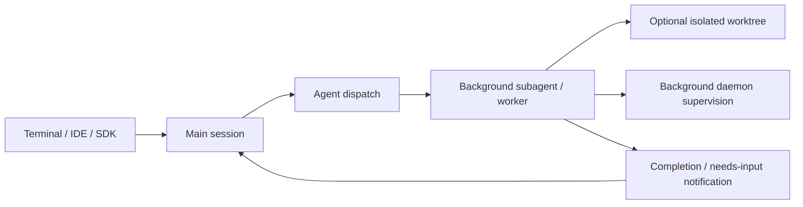

# Claude Code Agent 工程复核

> 复核日期：2026-08-10  
> 仓库：`/Volumes/UNTITLED/本人材料/project/claude-code`  
> 固定版本：`c39cb0f14bfe8bb519bae5bfc55add6867c5e2ab`  
> 仓库版本：CHANGELOG 顶部 `2.1.211`  
> 研究范围：Agent Harness、Tool Runtime、权限与沙箱、Prompt/Context、压缩、Hook、Session、Subagent、事件与模块设计。  
> 结论性质：公开材料静态复核；未启动 Claude Code。仓库不包含核心 Agent loop、Tool runtime、Permission engine 或 Session runtime 源码，因此内部实现只标记为不可证实。外置盘 `._*` AppleDouble 和 file-mode 噪声不纳入评价。

## 1. 结论

Claude Code 最值得 Natives 吸收的是长期运行 Agent 产品的边界条件，而不是一个可复制的核心 loop：后台 Agent 默认异步、结果通知而非父 Agent 轮询；长任务跨进程停止、更新和 daemon 重启恢复；子 Agent 权限请求回传主会话；worktree、MCP、Tool output、prompt cache 和 transcript 都有专门的有界化与恢复规则；Plugin 又把 command、agent、skill、hook、MCP 组合成可分发单元。

它同时提供了非常有价值的反面证据。CHANGELOG 长期反复修复后台状态误判、冷恢复空白、stale prompt 重跑、worktree Git 越界、symlink 逃逸、managed deny 被 Hook 降级、parallel tool pairing 丢失和 prompt cache 失效。这说明“后台 Agent + 自动权限 + 隔离工作区 + 可恢复会话”是一个需要 generation fencing、不可变权限快照、durable delivery、tool-pair 不变量和明确 terminal 状态的整体系统，不能靠几个功能开关拼装。

综合评价：

| 维度 | 评价 | 依据与证据边界 |
| --- | --- | --- |
| Agent loop | 不可证实 | 核心源码未公开；只能确认外部状态和故障修复 |
| Tool runtime | 中偏强（行为） | 并行调用独立结算、大输出外置、Tool Search、MCP 生命周期成熟；内部 registry/settlement 不可审计 |
| 权限与 sandbox | 强（产品行为）/不可审计（内部） | managed deny、Hook floor、自动模式、Bash sandbox 和危险命令兜底持续强化；真实排序与系统调用边界不可源码证明 |
| Prompt/context | 强（行为） | cache 稳定化、工具定义预算、resume 配对、compaction circuit breaker 有明确演进证据 |
| Hook/extension | 强 | 事件面、插件分发、agent-scoped Hook、`asyncRewake` 和持久状态丰富 |
| Session/recovery | 强（行为）/不可审计（事务） | background worker、跨版本恢复、失败消息递送、transcript/checkpoint 有界化成熟；事务边界不可见 |
| Subagent | 强（行为） | 默认后台、5 层深度、权限回传、partial/error、worktree isolation 和可恢复 worker |
| Event/replay | 中 | stream-json/Hook/OTel 可观测面丰富；不存在可核查的单一 durable replay schema |
| 模块深度/测试性 | 不可评价核心 | 仓库只含 216 个公开材料文件且没有测试文件；不能据此评价闭源核心模块 |

## 2. 证据口径

### 2.1 可证实与不可证实矩阵

| 结论类型 | 可否证实 | 可使用的证据 |
| --- | --- | --- |
| CLI/后台 Agent 的用户可见行为 | **可证实** | `CHANGELOG.md` 的版本化行为与修复记录 |
| Agent/Hook/Plugin 配置合同 | **可证实** | `plugins/plugin-dev/skills/`、manifest、`hooks.json` |
| 官方示例插件的实际失败策略 | **可证实，但只代表该插件** | `plugins/hookify/`、`plugins/security-guidance/`、`plugins/ralph-wiggum/` |
| 核心 Agent loop 状态机和终止漏斗 | **不可证实** | 仓库没有对应实现 |
| 核心 Tool interface、registry、scheduler 数据结构 | **不可证实** | CHANGELOG 只能证明行为，不证明内部结构 |
| Permission、Hook、sandbox 的完整内部调用顺序 | **不可完全证实** | 可确认若干优先级回归结果，不能还原所有分支 |
| Session 恢复的事务、fsync、checkpoint/event 一致性 | **不可证实** | 只能确认故障症状和产品修复 |
| OTel/stream-json 是否等于 durable event sourcing | **不能成立** | 两者是输出/观测合同，不是已证明的恢复权威 |

因此，本报告会说“当前版本保证 managed deny 不被 Hook allow 覆盖”，不会说“内核使用某个 ordered middleware 数组”；会说“后台 worker 可在 daemon 重启后恢复”，不会虚构内部 journal 或数据库 schema。

### 2.2 仓库现实

- `README.md` 只介绍安装、入口和公开插件，并把详细能力指向线上文档。
- 固定版本只有约 216 个 tracked 文件，主体是 13 个公开插件、示例、README 和 5,007 行 CHANGELOG；没有核心 runtime 源码，也没有 tracked 测试文件。
- `LICENSE.md` 是 Anthropic proprietary 条款，不是可直接复用的开源实现许可。
- 外置盘 `.git/objects/pack/._*.idx` 会产生 `non-monotonic index` 警告；本轮通过 `git show HEAD:<path>` 固定读取提交内容，不使用污染后的工作树状态推断行为。

## 3. 默认执行入口与真实调用链

公开仓库只能确认用户运行 `claude`，并可在 terminal、IDE、GitHub 和 headless/SDK 场景使用。它不能提供从 CLI 到核心 Agent loop 的源码调用链。

可观察的后台执行关系是：

- `CHANGELOG.md:332` 声明 subagent 默认后台运行，父 Agent 继续工作并在结束时收到通知。
- `:392-393` 声明长命令/工作流可跨进程停止、重启、升级存活，daemon 重启杀死的 worker 可恢复。
- `:90` 声明递送失败的用户回复先保存，并在 session 重启后递送。
- `:382` 声明 Remote session 在 server restart 后由下一个 worker 自动恢复。

这足以确认“持久 supervisor + 可恢复 worker + 通知回流”是产品合同，但不能确认 admission、worker lease、checkpoint 和 result delivery 是否共享一个事务。

## 4. Agent Loop 不变量

### 4.1 可从外部行为确认的不变量

- 子任务错误不会再伪装为成功：rate limit/server error 要返回 parent，partial work 也要保留（`:307-309`）。
- 后台 Agent 被用户 kill 后不能自动重生，恢复 worker 不能重跑旧 prompt（`:27`）。
- 打开刚停止或冷恢复的 session 不能在同一 id 下产生空对话（`:18`、`:376`）。
- parallel tool batch 中一个 Bash 失败不会取消其他调用，每个工具独立返回结果（`:844`）。
- API partial response、network retry、stream watchdog 和 max retry 各有显式产品语义，而非统一吞成“继续尝试”。
- structured output/schema 失败有次数上限；Workflow agent 连续校验失败 5 次终止（`:511`）。
- auto-compaction 连续失败 3 次触发 circuit breaker（`:2733`）。

这些是 Natives 可直接转化为验收条件的 loop 行为。不能从中继续推断 Claude Code 内部是否拥有单一 `StopReason`、统一 terminal funnel、operation journal 或 exactly-once event commit。

### 4.2 复杂度信号

后台 Agent 的“完成”至少曾出现以下互相独立的错误：实际仍运行却被父 Agent 编造结果、结束但一直显示 Working、StructuredOutput 缺失导致不终止、cold reopen 空白、killed 后 respawn、revived 后重跑 stale prompt、daemon 新旧版本互相拉起错误 worker。这说明 terminal status 必须是有 generation/owner/sequence 的执行事实，不能由 transcript 尾行、进程是否存在或 UI heartbeat 单独推断。

## 5. Tool Interface、Registry 与结算

### 5.1 可确认的 Tool 行为

- parallel tool calls 要各自结算，resume 必须恢复完整 `tool_use/tool_result` 配对；CHANGELOG 多次修复 orphan/missing pair（`:2605`、`:2983`、`:3612-3623`）。
- 大 Tool result 不再截断丢失，而是持久化到磁盘，模型得到文件引用；阈值从 100K 降到 50K chars（`:3139`、`:3706`）。
- Hook output 超过 50K 同样外置，返回 path + preview（`:2368`）。
- MCP tool 可用 `_meta["anthropic/maxResultSizeChars"]` 调整结果持久化阈值，最高 500K（`:2158`、`:2289`）。
- MCP tool description 和 server instructions 各有 2KB cap（`:2458`）。
- MCP 描述超过上下文 10% 时默认 deferred，通过 `MCPSearch` 按需发现（`:3606`、`:3630`）。
- 高 MCP 数量下缓存 tool-pool assembly，公开记录最高约 7x 的 tool round CPU 改善（`:117` 附近）。
- MCP capability discovery、OAuth、dynamic tool list、reconnect、startup retry、request timeout 和 stderr 64MB 上限都有独立处理。

### 5.2 优点

这里真正成熟的是“工具面也消耗预算”的系统意识：schema、description、server instructions、result、stderr、tool-pool 组装和 prompt cache 都被分别有界化。Tool Search 不是额外搜索功能，而是工具定义物化策略：只有在上下文预算允许时全量挂载，否则把 discovery 本身变成工具。

### 5.3 不足与未知

- 仓库不能证明核心 Tool 参数是否统一 schema decode、工具身份如何版本化、同名 MCP tool 如何解决冲突。
- 磁盘外置对外暴露的是 file path 行为；公开材料没有 stable artifact id、hash、TTL、quota、ACL 和 provenance 的完整合同。
- tool result pairing 的修复记录证明产品在维护不变量，但不能证明 result 持久化和模型 history commit 是一个事务。
- 大输出阈值可由 MCP metadata 提高到 500K，仍需宿主拥有不可被插件抬高的硬 ceiling。

## 6. Permission、Sandbox 与安全顺序

### 6.1 已确认的优先级结果

公开版本演进能确认以下优先级，而不需要猜内部数据结构：

1. `permissions.deny` 高于 PreToolUse `allow`；enterprise managed deny 不能被 Hook 绕过（`:2676`）。
2. deny 也高于 Hook `ask`；Hook 不能把 deny 降级成 prompt（`:2096`）。
3. auto mode 中，针对 unsandboxed Bash 的 Hook `ask` 至少保持为 prompt（`:7`）。
4. `PermissionRequest.updatedInput` 必须重新检查 deny；`setMode: bypassPermissions` 仍受 managed `disableBypassPermissionsMode` 限制（`:1989`）。
5. 子 Agent 发来的消息只是任务指令，绝不等价于用户批准（`:363`）。
6. “always allow” 存储在 repo root，跨 session/worktree 复用（`:35`）。

其中第 1、2、4 项尤其重要：Hook 是 policy 输入，不是高于组织策略的授权权威。

### 6.2 Sandbox 边界

公开记录把 sandbox 明确绑定到 BashTool（`:4182`），并持续修复 sandboxed/unsandboxed Bash 的路径、网络、credential、TMPDIR、symlink 和 permission 组合。`examples/settings/settings-bash-sandbox.json` 的严格示例为：

- `sandbox.enabled = true`；
- `autoAllowBashIfSandboxed = false`；
- `allowUnsandboxedCommands = false`；
- Unix sockets、本地监听和外部域名默认不允许；
- `allowManagedPermissionRulesOnly = true`。

这不应被解释为 Read/Write/Web/MCP/Hook 都处在同一个 OS sandbox 中。Natives 仍需让文件、进程、网络、credential 和扩展分别经过现有 Host/Capability Gateway 防线。

### 6.3 Defense in depth

- 即使在 `--dangerously-skip-permissions` 和 auto mode 中，`rm -rf ~` 一类 catastrophic removal 仍强制 prompt，并覆盖 `$()`、backticks、process substitution 等包装形式（`:125`）。
- permission preview 会中和 bidi override、zero-width 和仿引号字符，避免展示内容与真实执行参数不一致（`:6`）。
- worktree/sandbox 持续修复 late symlink、symlink parent escape 和主仓 write allowlist 过宽。
- managed settings 可禁止 bypass、限制 Hook 来源、强制 permission rules，并限制 marketplace 的 host/path。

缺点是安全组合面极大，且大量能力依赖不断追加的特殊修复。Natives 不能复制其 shell matcher 规则库作为最终安全权威；应把 command、cwd、resolved path、network destination 和 credential scope 转成结构化 capability 请求。

## 7. Prompt、Context 与 Compaction

### 7.1 Prompt cache 是显式架构约束

CHANGELOG 记录的 cache 修复包括：

- 将日期移出 system prompt，提高 prefix 稳定性（`:3312`）。
- tool schema bytes 在长会话中保持稳定（`:2348`）。
- tool description/input schema 变化必须使 cache 正确失效（`:3430`）。
- MCP instructions 晚连接不能无谓 bust cache（`:2914`）。
- `--resume` 不应因 deferred tools、MCP 或 custom agents 造成首请求 full miss（`:2309`）。
- 避免每轮 stringify MCP schemas，并缓存 tool-pool assembly（`:2318` 和当前版本性能记录）。

优点是把 prompt cache 当作结构设计，而不是 Provider 账单优化。缺点是仓库没有公开 source algebra、cache key、Context Epoch 或 effective prompt snapshot，无法证明哪些动态源在 Run 中冻结。

### 7.2 Context 与 compaction

- Tool definitions 超过上下文 10% 后 deferred，避免“可用工具越多，任务上下文越少”。
- compaction 继承 session 的 extended thinking 配置（`:339`），并保留 image 以复用 cache（`:2932`）。
- auto-compaction 连续失败 3 次停止，避免无限重试（`:2733`）。
- session transcript 会裁剪 superseded file-history backup，`2.1.208` 版本记录 edit-heavy session 最多缩小 79x，并使 checkpoint disk 有界。
- resume 和 compaction 都持续修复 tool pair/orphan result 问题。

不可证实项包括：summary sacred sources、压缩前 checkpoint、摘要防注入 framing、summary Provider policy、candidate commit 原子性，以及自动/手动/overflow 是否共享一致的事务边界。

## 8. Hook 与 Extension

### 8.1 Plugin 分发单元

Plugin 可组合 commands、agents、skills、hooks、MCP servers，并由 `.claude-plugin/plugin.json` 描述。manifest 文档要求 component path 使用 `./` 相对路径、禁止绝对路径和 `../`，默认目录可自动发现。marketplace 提供插件元数据和来源；managed policy 可以限制安装、更新、refresh 与 autoupdate。

`${CLAUDE_PLUGIN_DATA}` 为插件提供跨升级保留的持久目录，卸载时要求确认删除（`:2642`）。这个设计把“可替换代码”和“用户/插件状态”分开，值得吸收。

### 8.2 Hook 合同

公开材料和 CHANGELOG 合并后可确认的事件至少包括：

`PreToolUse`、`PostToolUse`、`PostToolUseFailure`、`PermissionRequest`、`UserPromptSubmit`、`Stop`、`StopFailure`、`SubagentStart`、`SubagentStop`、`SessionStart`、`SessionEnd`、`PreCompact`、`Setup`、`WorktreeCreate`、`WorktreeRemove`、`ConfigChange`、`InstructionsLoaded`、`CwdChanged`、`FileChanged`、`Notification`、`TeammateIdle`、`TaskCompleted` 和 `MessageDisplay`。

Hook 可为 command、prompt 或 agent/MCP tool 形态；agent frontmatter 也可以声明自身生命周期 Hook。公开 plugin-dev 文档声明 matching Hook 并行执行、不得依赖顺序，且 Hook 在 session start 加载。CHANGELOG `2.1.69` 又加入 `/reload-plugins`，说明“配置冻结”已有局部动态刷新入口；报告不能再绝对化为“只能新 session 生效”。

文档存在明显漂移：

- plugin-dev Hook 文档示例仍以 60 秒 command timeout 为基线，CHANGELOG `:3684` 已把 tool Hook 默认 timeout 改到 10 分钟。
- agent-development 文档只稳定描述 `name/description/model/color/tools`，CHANGELOG 已增加 `disallowedTools`、`permissionMode`、`mcpServers`、`effort`、`maxTurns`、`isolation: worktree` 和 agent-scoped hooks。
- `plugins/README.md` 仍把 security-guidance 描述成 PreToolUse 的 9-pattern warning，但实际 `hooks.json` 是 UserPromptSubmit、PostToolUse、Stop 与 `asyncRewake`；marketplace 条目仍标 1.0.0，插件 manifest 已是 2.0.0。

这说明扩展合同必须有机器可验证 schema/capability revision，不能让 Agent 只靠说明文档猜版本。

### 8.3 `asyncRewake` 与 security-guidance

`plugins/security-guidance/hooks/hooks.json` 展示了一个很好的异步监督模式：commit、push 和 Stop 审查在后台运行；只有发现问题时通过 `asyncRewake` 把结果重新注入会话，主 Agent 不轮询审查进度。

插件本身还实现了：

- UserPromptSubmit 时用 `git stash create` 捕获 baseline，并单独记录 pre-existing untracked files；
- PostToolUse 记录 touched path，Stop 在同一文件锁下 snapshot-and-clear，解决下一轮 prompt 与后台 Stop 的竞态；
- transient API 失败后恢复未审路径，避免基线越过未审变更；
- 最多 3 次 Stop firing、默认最多 30 个 diff 文件、path risk priority 和 rolling rate limit；
- investigate -> self-refute 两阶段 LLM review，off-diff finding 需要更严格的 diff anchor；
- repo-local reviewed SHA log 做 commit/push 去重；
- 项目自定义 guidance 只允许追加检查，不能压制 built-in finding；regex 有 ReDoS 启发式检查和长度/数量 cap。

这是本仓最有实现价值的公开源码，但它仍是补充审查器，不是安全门禁：JSON 无法解析、无凭证、API 不可达、pathological diff、状态锁失败等多条路径最终 exit 0；Hookify 的 PreToolUse 更明确在 import/运行异常时 allow，并在 `finally` 永远 exit 0。Natives 的 security-critical Hook 不能采用这种可用性优先策略。

### 8.4 Stop-loop 示例

`ralph-wiggum` 用外部状态文件、iteration、max iteration、completion promise 和 Stop block 构造重复执行。状态损坏、transcript 缺失或 JSON 解析失败时会删除状态并停止，而不是无限循环。这适合说明“循环必须有 durable state + exit condition + corruption behavior”，但 completion promise 仍由模型文本声明，不能成为 Natives Goal 完成的唯一事实。

## 9. Session 持久化与恢复

### 9.1 已确认的恢复行为

- background session/worker 可在进程停止、CLI 更新和 daemon restart 后恢复。
- user reply 递送失败时保存，session 重启后再次递送。
- mid-turn server restart 后由新 worker 自动恢复。
- background session 可 attach，冷启动时先显示 transcript，随后再 warm worker。
- resume 保留完整 parallel tool pairs；orphaned background tasks 被折叠成单一 summary。
- transcript cleanup、file history pruning 和 checkpoint disk 有界。
- worktree lock 的 owner process 消失后由 periodic sweep 清理。

### 9.2 需要保守解读的地方

- “从原处恢复”是产品行为，不证明 provider stream 能从 token offset 恢复；更可能是从最近可恢复边界继续，仓库无法区分。
- “reply 保存后递送”不证明 exactly-once；没有公开 message id、ack、dedup 或 outbox schema。
- transcript 能显示不等于执行状态已一致；CHANGELOG 曾多次修复 transcript probe 误判、空 session 和 stale prompt 重跑。
- OTel、stream-json 和 transcript 都不能自动升级为恢复权威。

对 Natives 的关键启示是：Run admission、worker generation、pending user input、last durable safe point、terminal 和 delivery ack 必须分别建模，并由 Daemon 单一事件权威关联。

## 10. Subagent / Multi-agent

### 10.1 已确认能力

- Subagent 默认后台运行，父 Agent 继续处理任务。
- foreground/background subagent 都有 5 层深度上限；resume 恢复原 spawn depth，fork 也计入上限（`:474`、`:564`、`:677`）。
- Agent 定义逐步支持 `tools`、`disallowedTools`、`permissionMode`、`mcpServers`、`effort`、`maxTurns`、`isolation: worktree` 和 scoped hooks。
- `Agent(type)` deny 和 `Agent(x,y)` allowed-types 约束 named spawn；空/未知 tool list 要显式报错。
- background subagent 的 permission prompt 回传 main session，并显示请求 Agent；Esc 只拒绝该工具（`:517`）。
- Agent 消息不能批准 pending action；间接 prompt injection 有专门 hardening。
- partial output、error、completed/failed/needs-input 状态向 parent 和 Agent view 显式传播。
- `--forward-subagent-text` 默认关闭；只有显式开启才把 child text/thinking 放入 stream-json。这是隐私、噪声与上下文隔离边界。

### 10.2 Worktree isolation

`isolation: worktree` 已是声明式 Agent 能力，并有 WorktreeCreate/Remove Hook。但 CHANGELOG 揭示了其真正验收面：

- Git mutation 必须始终作用于 child worktree，不能落到 main checkout（`:47`）。
- resume 要恢复 cwd，不能复用 stale worktree。
- shared `.git` 只能开放必要目录，hooks/config 仍需 deny。
- kill/crash 后释放 owned worktree lock；删除前识别 unpushed commits，不能破坏用户工作。
- symlink/junction cleanup 不能越过 worktree root。
- cold reopen、renamed branch、non-git VCS 和 version skew 都有显式状态。

因此 worktree 不是“创建一个目录”，而是带 repo identity、root binding、generation、owner、cleanup disposition 和 unpushed-work 检查的资源租约。

### 10.3 不足与未知

- 无法证明 child permission 是 parent ∩ task ∩ agent ∩ managed policy 的不可变快照，还是运行时动态解析。
- 无法证明 child 是独立 durable Run，或者只是主 session 下的 worker record。
- team mailbox 曾因 malformed message crash-loop，说明 multi-agent message schema 和 poison-message quarantine 仍是复杂边界。
- 5 层深度是防爆 fuse，不是 least-authority、budget、资源冲突或收敛保证。

## 11. Event、观测与 Replay

### 11.1 公开观测面

- headless `stream-json` 有 init/result/tool/progress 等可观察行为；公开仓库未包含完整 schema 实现。
- `parent_tool_use_id` 可标识 subtask message；`--forward-subagent-text` 控制 child text/thinking 是否转发。
- Hook input 已包含 `tool_use_id`、`agent_id`、`agent_type`、`agent_transcript_path` 等关联字段。
- OTel tool span 有 `agent_id`、`parent_agent_id`，并修复 parent span，使 background subagent 挂到 dispatching Agent tool 下。
- OTel `tool_result/tool_decision` 有 `tool_use_id`；敏感 prompt、tool details、tool content 和 raw API body 需要显式 opt-in。
- subprocess 默认不继承 CLI 的 `OTEL_*`，避免用户命令误发到 Claude Code telemetry endpoint。

### 11.2 为什么这不是 durable replay

OTel 可以重建观测树，stream-json 可以驱动客户端，transcript 可以恢复对话，但公开材料不能证明其中任意一个包含 permission revision、Hook outcome、provider physical attempts、Tool operation unknown outcome、worker generation 和完整 terminal commit。报告因此只给“观测强、replay 不可证实”的评价。

Natives 可以吸收其 correlation vocabulary：`run_id/agent_id/parent_agent_id/tool_use_id` 和隐私 opt-in；不能把 OTel 反向作为 RunEvent 权威。

## 12. 模块深度、测试面与 Git 演进

### 12.1 核心模块不可评价

由于核心源码缺失，本报告不评价 Claude Code 的内部 module depth、dependency direction、composition root 或单元测试覆盖。用产品成熟度替代代码结构评分会制造虚假确定性。

### 12.2 公开插件的模块信号

- security-guidance 已把 session state、git diff state、LLM review、git util 和 extensibility 拆分，但主 `security_reminder_hook.py` 仍约 2,192 行，commit/push/Stop 多种流程集中，认知半径较大。
- `session_state.py` 的 file lock + snapshot-and-clear 是一个较深的小模块，但 Windows 无 `fcntl` 时退化为无锁，保存失败也只记录 debug。
- plugin-dev 文档与 validator 提供扩展作者体验，却没有随产品字段/事件完全同步。
- 固定提交没有 tracked tests；源码注释多次引用 monkeypatch/test 约束，但测试不在公开仓，无法复核回归面。

### 12.3 Git/CHANGELOG 演进价值

本仓最大的工程证据不是某个类，而是修复历史揭示的失败空间：

- 权限优先级必须覆盖 Hook 修改后的 input 和 managed deny；
- background recovery 需要 generation fencing、durable input delivery 和 stop/respawn arbitration；
- worktree isolation 必须连 Git cwd、shared `.git`、symlink、lock、cleanup 和 unpushed commits 一起验收；
- prompt cache 依赖稳定 schema bytes、静态 prefix 和 resume 后一致的 tool surface；
- tool pair 在 parallel execution、stream failure、resume 和 compaction 四个环节都要维护。

这些修复适合转成 Natives 回归矩阵，但不能转成对 Claude 内部实现的猜测。

## 13. 优点清单

1. **后台 Agent 产品化完整**：异步执行、通知、attach、回复递送、跨进程/版本恢复和 daemon supervision 形成闭环。
2. **Subagent 约束面丰富**：工具裁剪、权限模式、模型/effort/maxTurns、深度上限、MCP、Hook 和 worktree isolation 都是声明能力。
3. **权限优先级持续硬化**：managed deny 不被 allow/ask/updatedInput/bypass mode 绕过。
4. **危险操作有最后兜底**：catastrophic removal 即使在 bypass/auto 仍 prompt。
5. **审批展示也视为安全边界**：中和 bidi、zero-width 和 look-alike quote，降低 preview spoofing。
6. **工具与上下文全面有界**：Tool result、Hook output、MCP description/instruction、stderr、LSP、file cache、transcript backup 都有 cap 或外置策略。
7. **Prompt cache 意识强**：动态日期、schema bytes、MCP 晚连接、resume 和 tool pool 都围绕稳定 prefix 设计。
8. **Plugin 分发单元完整**：command、agent、skill、hook、MCP、manifest、marketplace、managed policy 和 persistent data 配套。
9. **Hook 生命周期广**：覆盖 Tool、Permission、Session、Compact、Subagent、Worktree、Config、Instruction 和多 Agent 事件。
10. **异步事件驱动监督**：`asyncRewake` 让后台审查完成后再唤醒 Agent，不消耗模型轮询。
11. **可观测关联充分**：agent/parent/tool id 贯穿 Hook、stream-json 和 OTel，并对敏感 telemetry 采用 opt-in。
12. **版本历史诚实暴露故障面**：可把真实回归直接转成竞品验收清单。

## 14. 缺点清单

1. **核心不可审计**：Agent loop、Tool registry、Permission engine、Session transaction 和模块结构均无法源码复核。
2. **产品行为强版本依赖**：许多安全保证来自近期修复，旧版本和文档可能不具备相同语义。
3. **后台状态机复杂**：blank reopen、stale prompt、respawn race、wrong status、version skew 和 corrupt record 都曾发生。
4. **Worktree 隔离不是天然可靠**：Git mutation 曾落入 main checkout，symlink、shared `.git`、lock 和 cleanup 需要持续补丁。
5. **Sandbox 不是全 Tool 隔离**：公开能力集中于 BashTool，不能视为整个 Agent 的 OS sandbox。
6. **扩展文档漂移明显**：Hook timeout、Agent fields、security-guidance 事件和 marketplace version 与实际版本不一致。
7. **官方示例大量 fail-open**：Hookify 和 security-guidance 在 import、JSON、API、锁或配置失败时通常继续，不能承担强制安全门禁。
8. **大输出外置缺少公开 Artifact 合同**：file path + preview 不等于 content-addressed、可授权、可回放的 artifact。
9. **恢复事务不可证实**：能 resume 不等于 input、tool settlement、checkpoint 和 terminal exactly-once。
10. **并行 Tool pairing 曾多次回归**：resume、stream sibling failure、compaction 都可能产生 orphan result。
11. **Subagent least-authority 不可证实**：字段丰富不等于已有不可变 authority intersection。
12. **公开代码测试不可复核**：tracked tree 没有测试文件，无法验证示例插件声称的边界。
13. **许可不可直接复用**：仓库受 Anthropic proprietary 条款约束，只吸收设计，不复制实现。

## 15. Natives 可吸收设计

下表只强化 Natives 现有 `Renderer -> Tauri Host -> UDS -> Agent Daemon` 权威，不新建第二套 Run、Permission、Provider、Capability、Prompt 或 Trace 系统。

| 优先级 | Claude Code 机制/教训 | Natives 目标 module/seam | 吸收方式 | 必须改造/拒绝 |
| --- | --- | --- | --- | --- |
| P0 | managed deny 高于 Hook allow/ask | `crates/agent-core/src/hooks.rs` + Capability Gateway policy | 保持 `PermissionVerdict::Allow` 只跳过低于 profile ceiling 的确认；modified input 必须重新 materialize/schema/policy；Ask 是 prompt floor | Hook 不得授予 profile/managed policy 没有的 capability；不能按插件顺序偶然决定安全 |
| P0 | 后台 worker 跨进程恢复 | `src-agent-daemon` RunManager/start/resume + RunEvent/EventSequencer | worker 持久化 `run_id/generation/owner/last_safe_point/terminal`；daemon lease 交接后只恢复未终止 generation | 不从 transcript 尾行或进程存在性猜完成；stop 与 respawn 必须原子仲裁 |
| P0 | 失败回复延迟递送 | Daemon session actor / durable input seam | 用户输入先以 idempotency key 持久化 pending delivery，再投递 worker；ack 后标记 delivered | 不允许 restart 后重跑已 ack prompt；不把消息到达等价为用户批准 |
| P0 | parallel tool 独立结算与 pairing | `crates/agent-core/src/engine/engine_tools.rs` + `EngineToolRuntime` | 每个 call 有 stable id、prepared/started/settled/uncertain；batch sibling 独立 terminal，按 call order 写回 model history | 不因单个失败丢 sibling result；resume/compact 必须重校验 pair |
| P0 | 大 Tool/Hook output 外置 | `src-agent-daemon/src/artifact_store.rs` + `tools/artifact.rs` | 现有 ArtifactStore 作为唯一 authority，返回 artifact id/hash/bounded preview；Gateway 设不可上调 hard ceiling | 不暴露裸路径为协议 identity；MCP metadata 只能在 Host ceiling 内调低/建议，不能放大 |
| P0 | worktree isolation 回归面 | child Run assignment + Host filesystem/Git adapter + Capability Gateway | assignment 冻结 repo identity、worktree root、branch/base、owner generation、cleanup disposition；每次 Git/file capability 复核 resolved cwd/root | 不只依赖 prompt 或 `cwd` 字符串；不自动删除含 unpushed work 的 worktree |
| P0 | approval preview spoofing 防护 | `assistant-protocol` PermissionRequested + Renderer approval UI | Daemon 保存 canonical structured input/digest；Renderer 显示 escaped/normalized preview 和 immutable identity；response 绑定 digest | UI preview 不是执行输入；禁止 bidi/zero-width 造成显示与真实参数分叉 |
| P1 | Tool Search/context budget | `RunHarnessPlan` + `model_visible_tool_schemas` + prompt plan | Run admission 计算 tool-definition budget；全量、deferred、unavailable 都写入 frozen snapshot；按 stable identity 物化 | 不让 MCP 晚连接静默改变活动 Run 的 schema bytes；未知能力显示 unknown |
| P1 | prompt cache 稳定化 | `crates/harness-core/src/prompt_plan.rs` + context snapshot | source id/revision/digest 排序稳定；动态日期/状态放 request-tail；schema/config 变化显式增加 Context Epoch | 不依赖 JSON map 偶然顺序；resume 不重新发现并覆盖原 snapshot |
| P1 | `asyncRewake` | existing RunEvent + session actor/continuation seam | 后台 Hook/child terminal 先持久化事件，再提交 typed continuation/wake reason；投影从事件重建 | 当前 `HookDecision::Rewake` 明确拒绝是正确的；未建立 durable wake 合同前不得用 Hook stdout 模拟 |
| P1 | 插件代码/状态分离 | Extension Host + Extension manifest/store | bundle 只声明 command/agent/skill/hook/tool provider/MCP；状态使用 versioned plugin data namespace；卸载显式处置 | Extension 不直连 Daemon SQLite，不直接注册第二套 Tool/Hook runtime，不持有 credential 明文 |
| P1 | Hook capability revision | `RunHarnessPlan.resolution` + `production_hooks_frozen` | 编译时记录 Hook schema version、event support、timeout、failure policy、source digest；运行中 refresh 产生新 revision/新 Run | 不让文档字段代替 runtime handshake；security event 缺失必须 capability-unsupported/fail-closed |
| P1 | telemetry privacy/correlation | RunEvent -> OTel exporter projection | 复用 run/parent/tool/hook invocation id；敏感 prompt/tool content 默认 redacted，导出需显式策略 | OTel 只做可丢弃 projection，绝不成为恢复权威 |
| P2 | Subagent 权限请求回传 | child Run + parent interaction/permission inbox | child permission 是独立 durable interaction，展示 child identity、assignment 和 call digest；父 UI 只路由人类 response | parent Agent 文本、child message、webhook/notification 均不能批准；不自动 deny 丢失上下文 |
| P2 | 递归深度与预算 | subagent reservation/lineage | depth、fan-out、token/time/cost、maxTurns 与 failure policy 写入 immutable assignment；resume 恢复原 depth | 5 层只作参考；不能用 depth cap 替代 least-authority 和资源预算 |

### 15.1 最优先吸收的六个不变量

1. **所有授权有不可越过的 ceiling**：managed/profile deny 高于 Hook、Agent、saved allow 和 auto mode。
2. **后台执行由 generation + durable safe point 恢复**：不能因 daemon 重启重跑旧 prompt 或复活已 kill worker。
3. **用户输入先持久化再递送，并有 ack/dedup**：delivery failure 不丢，restart 不重复。
4. **Tool pair 横跨并行、失败、resume、compaction 始终完整**：每个 call 独立 terminal，unknown outcome 不透明重试。
5. **worktree 是资源租约，不是一个路径**：identity、root、owner、Git target、cleanup 和 unpushed state 都要验证。
6. **后台结果用事件唤醒，不让模型轮询**：child/Hook completion 先成为 RunEvent，再生成 continuation。

### 15.2 明确不吸收

- 不把 CHANGELOG 行为倒推出 Claude Code 内部类、表或 transaction 设计。
- 不复制 proprietary 插件代码；只复现机制和验收条件。
- 不采用 Hookify/security-guidance 的 security fail-open 作为 Natives 默认。
- 不把 Bash sandbox 宣称为全 Agent sandbox。
- 不把 file path + preview 当 ArtifactStore 合同。
- 不把 OTel、stream-json 或 transcript 当 RunEvent/replay 权威。
- 不允许 Plugin/Extension 直接越过 Tauri Host、UDS、Daemon 或 Capability Gateway。
- 不用 completion promise 文本替代 Goal/Run 的结构化完成条件。
- 不在 active Run 中因 `/reload-plugins`、MCP reconnect 或配置变化静默改变 effective Tool/Hook/Prompt surface。

## 16. 对 Natives 的直接启示

Claude Code 对 Natives 的最大价值是补全“已经有执行内核之后，还会在哪里坏”的清单。Natives 当前已有若干比公开 Claude 合同更明确的基础：`RunEventV2` 规定 persist-before-push，`EngineToolRuntime` 有 stable call id 和 uncertain outcome seam，Hook Runtime 区分 infrastructure failure、permission verdict 与 observer，`RunHarnessPlan` 从同一 Resolution 生成 snapshot 和 executable hooks，ArtifactStore 已做原子写与 hash。

下一步不应另造 Claude-compatible supervisor，而应强化现有边界：

1. 把 background worker generation、pending input delivery/ack 和 worktree lease 纳入现有 Run/child Run 事实链。
2. 把 tool definition budget、deferred discovery 和 cache epoch 纳入 `RunHarnessPlan` 冻结证据。
3. 把 `asyncRewake` 的产品价值实现为 durable event-driven continuation；当前显式拒绝未实现的 `rewake`，比 silent no-op 更安全。
4. 把 Claude CHANGELOG 中 permission/worktree/resume/tool-pair 的回归逐条转成 Natives fault-injection/contract tests。

Claude Code 不提供可复用的内核蓝图，却提供了很强的生产验收蓝图。对 Natives 来说，这一类证据比猜它的内部架构更有价值。

## 17. 关键证据索引

| 主题 | 固定版本证据 |
| --- | --- |
| 仓库/许可边界 | `README.md`；`LICENSE.md`；tracked tree 只有公开插件、示例和 CHANGELOG |
| 后台 Agent 默认与恢复 | `CHANGELOG.md:332, 376, 382, 392-393` |
| reply durable delivery | `CHANGELOG.md:90` |
| 后台 terminal/partial/error | `CHANGELOG.md:27, 31, 307-310, 390` |
| Subagent 深度/权限 | `CHANGELOG.md:474, 498, 517, 564, 677` |
| Agent 字段演进 | `CHANGELOG.md:1819, 1858, 2643, 3156, 3739, 4059, 4139` |
| Worktree isolation | `CHANGELOG.md:47, 68, 124-125, 475, 1075, 1769, 2853, 2990, 3149` |
| Permission 优先级 | `CHANGELOG.md:7, 35, 1989, 2096, 2676` |
| Bash sandbox 严格示例 | `examples/settings/settings-bash-sandbox.json` |
| preview spoofing/catastrophic guard | `CHANGELOG.md:6, 125` |
| Tool output/MCP budget | `CHANGELOG.md:2158, 2289, 2368, 2458, 3139, 3606, 3630, 3706` |
| Tool pair/resume/compaction | `CHANGELOG.md:2605, 2733, 2983, 3612-3623` |
| Prompt cache | `CHANGELOG.md:2309, 2318, 2348, 2914, 3312, 3430` |
| Plugin manifest/path | `plugins/plugin-dev/skills/plugin-structure/references/manifest-reference.md` |
| Hook 并行/冻结文档 | `plugins/plugin-dev/skills/hook-development/SKILL.md:383, 495-516, 574-587` |
| Hook 事件演进 | `CHANGELOG.md:1035, 2492, 2641, 2955-2956, 3149, 3196, 3377, 3596, 4062` |
| Hook timeout 漂移 | `plugins/plugin-dev/skills/hook-development/SKILL.md:50`；`CHANGELOG.md:3684` |
| Plugin persistent data/policy | `CHANGELOG.md:1825, 2642, 2960` |
| security-guidance 配置 | `plugins/security-guidance/hooks/hooks.json` |
| security-guidance 状态/竞态 | `plugins/security-guidance/hooks/session_state.py`；`diffstate.py:74-190` |
| security-guidance Stop/review | `plugins/security-guidance/hooks/security_reminder_hook.py:1700-1972`；`review_api.py` |
| 示例 Hook fail-open | `plugins/hookify/hooks/pretooluse.py:25-70`；`security_reminder_hook.py:2019-2053` |
| Stop-loop corruption/exit | `plugins/ralph-wiggum/hooks/stop-hook.sh:13-177` |
| OTel/关联/隐私 | `CHANGELOG.md:853, 909, 1140, 1373, 1565, 1742, 2088, 2423` |
| stream-json child 隔离 | `CHANGELOG.md:5, 94, 848, 4757` |
