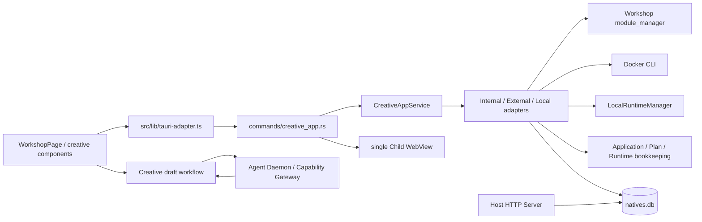
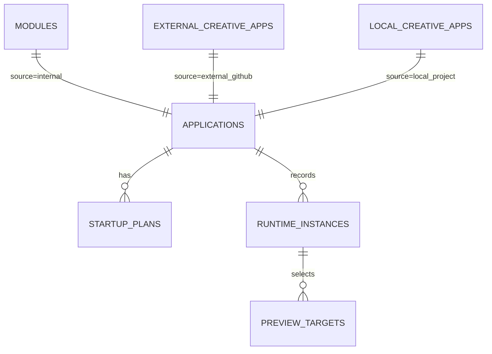

# Creative OS 源码地图

> 审计基线：`deploy@9584c3c2`（2026-08-04）。本文件只描述当前生产代码，不把 ADR 中的计划当作已实现事实。

## 1. 边界与权威

Creative App 的生产路径仍遵循 `Renderer → Tauri Host → UDS → Agent Daemon`。应用目录、SQLite、进程、Docker、HTTP Server 与 Child WebView 由 Host 掌握；Agent 生成草稿经 Daemon/Gateway，正式 Workshop 发布仍走 `module_manager`。三类来源共用只读 Catalog，但保留各自 detail 表与 runtime adapter。



## 2. 后端模块职责

| 模块 | 当前职责 | 关键证据 | 边界/债务 |
|---|---|---|---|
| `model.rs` | Catalog DTO、三类 Source、五类 Runtime、状态、LaunchPlan、Docker config | `CreativeAppSource` 42–46；`CreativeAppRuntime` 50–56；`LaunchPlan` 445 起 | 无 Attached/Remote/Python/Binary、无多 surface/service/window/profile |
| `service.rs` | Catalog/lifecycle facade、全局 MutationLock、loopback URL/navigation 校验 | 14–58、66–105 | stop/delete/restart/install 仍跨 await 持全局锁 |
| `commands/creative_app.rs` | Tauri IPC、连接池/事件/Browser 与本地项目命令接线 | 46–210、328–415、425–817 | Browser 身份解析绕过 adapter；DB/WebView 非原子 |
| `adapters/mod.rs` | 三源 resolve、列表合并、start 两阶段、runtime row 镜像 | 78–314 | RuntimeInstance 仍在 driver 操作外侧记账；stop 结果语义依赖下层 |
| `adapters/internal.rs` | Workshop module enable/disable/open/delete 投影 | 全文件 | Workshop 无独立进程 Runtime；应继续复用现有内核 |
| `adapters/external.rs` | GitHub Docker start/stop/delete/open/log 接口 | 全文件 | 资源仍以 source app id/稳定容器名管理 |
| `adapters/local.rs` | Local lifecycle/store/runtime 的薄适配 | 全文件 | 资源 owner 没有 runtime id |
| `install.rs` / `github.rs` | Release 检测、下载、安装、恢复 | `install.rs` 全文件 | 网络/健康在全局变更锁内；无 Operation journal |
| `docker.rs` | argv-only Docker/Compose CLI、loopback publish、health/log/inspect | 1–525 | Compose `ps` 非零被折叠为“未运行”；无 service-instance ledger |
| `store.rs` | 外部应用 CRUD/env/state | 1–约 330 | UPDATE/DELETE affected rows 未验证 |
| `runtime_store.rs` | `applications`、plan、runtime、preview 的 CRUD/镜像 | 40–399 | check-then-insert 非 DB CAS；状态更新忽略 affected rows；preview replace 非事务 |
| `browser.rs` | 固定 label Child WebView、导航/尺寸/显示/关闭 | 12–125 | 单例；只有 `active_app_id/current_url`；无 profile/window model |
| `local/scan.rs` | 安全扫描、HTML/Node/Compose/Python/Makefile 证据与风险 | 75–130 等 | Python 等仅 evidence；不是 driver |
| `local/plan.rs` | 结构化 LaunchPlan 校验、路径/argv/cwd 门禁 | 全文件 | 单进程、单 URL/health 结构 |
| `local/lifecycle.rs` | Local static/node/compose start/health/stop/delete/reconcile | 150–976 | cleanup failure 返回成功摘要，外层会把 instance 写 stopped |
| `local/runtime.rs` | Node Child、PGID、cancel flag、日志 task、健康等待、强制清理 | 56–117、144–209、436–519 | registry/log/task 均以 source app id 为键，不是 runtime id |
| `local/logs.rs` | 按应用日志文件、脱敏、轮转 | 321–362 | 不隔离每次运行 |
| `local/ai.rs` | 脱敏扫描、UDS AI 建议/诊断、Host plan 校验 | 1–约 390 | Host 直调 Provider 的旧问题已淘汰；仍需保持 Host 最终裁决 |
| `http_server.rs` | Workshop asset/Bridge/local static route | 14–127、374–510、561–580 | static route 只查 source root；64 MiB 截断而非拒绝；每请求线程 |
| `db.rs` | schema/migration/backfill | 892–1090、1204–1397 | v12–v14 增量存在；缺 active partial unique index；Compose backfill owner 误分 |
| `lib.rs` | 初始化 HTTP/manager、启动 reconcile、2 秒 watchdog、退出 shutdown | 282–440 | watchdog 也拿全局锁；自然退出依赖轮询；Browser 未纳入退出清理模型 |

## 3. 前端模块职责

| 模块 | 当前职责 | 现状 |
|---|---|---|
| `WorkshopPage.tsx` | 创作、GitHub 安装、本地导入、配置、Catalog、浏览器、日志、删除对话 | 2,012 行且有大量局部状态；跨多个业务域 |
| `CreativeHome.tsx` | 个人创意首页与创作/目录组合 | 已实际接线，不是占位 |
| `CreativeCatalog.tsx` | 三源分组、卡片与 action | 使用后端 summary/actions；保持统一投影 |
| `AppBrowserPanel.tsx` | Browser chrome、bounds、back/forward/reload/close | UI panel 与唯一 Child WebView 对应，不是 Window Manager |
| `AppLogsPanel.tsx` | 日志展示/刷新 | 展示 source-app 聚合日志 |
| `CreationComposer/Session/DraftPreview` | Creative draft 描述、会话、沙箱预览 | 复用 Agent draft/publish 安全路径 |
| `useCreativeAppCatalog.ts` | list、事件刷新、每 app `busyIds`、操作后 reconcile | 前端是 app 级 busy，后端仍是全局锁 |
| `creative-app.ts` / `local-creative.ts` | DTO、IPC wrapper | 不拥有状态权威 |
| `tauri-adapter.ts` | 集中 Tauri invoke adapter | 约 2,000 行全产品 adapter；Creative 只是其中一域 |

Browser 打开处先更新 Renderer panel 状态，再通过 `requestAnimationFrame` fire-and-forget 调 Host；因此 Host 失败不能可靠回滚 UI。日志字符串已限制为 200,000 字符，旧“无限增长”结论已过时。

## 4. 当前数据模型



| 实体/表 | 已有字段作用 | 真实性 |
|---|---|---|
| `applications` | 跨三源稳定 identity，唯一 `(source, source_id)` | 已存在；Browser 命令会制造错误 source identity |
| `startup_plans` | `plan_json/plan_version/is_active` | 已存在；没有每 app 单 active 的唯一约束，也没有完整版本历史语义 |
| `runtime_instances` | status、owner kind、PID/PGID/port/URL/ledger/heartbeat | 已存在；资源 manager 实际仍按 source id 持有 |
| `preview_targets` | runtime → URL/kind/selected | 已存在；与 WebView 操作无事务/补偿 |
| source detail tables | Workshop、GitHub Docker、Local Project 的真实配置与 UI 状态 | 继续保留，迁移不可破坏 |
| `WindowInstance` / `BrowserProfile` / `Operation` / `ServiceInstance` / `RuntimeEndpoint` / `ApplicationSurface` | 无表、无领域类型 | 伪 OS 目标尚未具备真实数据基础 |

## 5. 核心调用链

### 5.1 Catalog 与注册/安装

```text
List: WorkshopPage → creativeApp.list → command → service.list
  → adapters.list_all → internal/external/local list → runtime_store.attach_identity

Install GitHub: Wizard → creative_app_install_github → global lock
  → install_release → Docker pull/create/up + health → external row
  → find_or_create_application(external) + startup plan → event → Catalog reload

Register Local: Wizard → creative_app_local_create → global lock
  → scan/validate plan/path → local store insert/env → application/plan upsert → event
```

### 5.2 Start

```text
Start → service.start
  → [global lock] adapters.spawn_start
      → resolve source → has_active_instance → create_instance(starting)
      → Local Static: write running + Host HTTP URL (no owned per-run server)
      → Node: LocalRuntimeManager.start_node_dev(app_id), Child/PGID/log tasks
      → Compose/External: docker compose/run + health
  → [Node only, lock released] await_start_ready
  → mirror PID/PGID/port/URL to RuntimeInstance running
```

Local Static URL is `/local-projects/{source-id}/...`; HTTP lookup only resolves `canonical_project_root`, so stop clears row fields but does not revoke route access.

### 5.3 Stop / Restart / Delete

```text
Stop → [global lock] adapters.stop
  → runtime row stopping → source driver stop/verify
  → Ok => runtime row stopped; Err => cleanup_failed

Restart → [same global lock] stop → spawn_start → await_ready
Delete → [global lock] source adapter delete resources/detail
  → runtime_store.delete_application (plans/instances/previews/application)
```

Local `stop_app` persists `cleanup_failed` when resource verification fails but returns `Ok(summary)`; adapter therefore marks the RuntimeInstance `stopped`, and restart can continue. Window/preview is not part of stop/delete orchestration.

### 5.4 Browser

```text
Open → Renderer selects browser app → Host browser_show
  → find_or_create(LocalProject, source_id) [always succeeds]
  → optional preview DELETE+INSERT
  → create/reuse fixed-label Child WebView → navigate/bounds/show

Close → read singleton BrowserState → clear preview in DB
  → close Child WebView → clear BrowserState
```

DB 与 WebView 的顺序在失败时分叉；GitHub source 会先得到一条伪 LocalProject application row。

### 5.5 恢复与自然退出

```text
Host startup → external reconcile_all → local reconcile_local_apps
2s watchdog → [global lock] poll_and_reconcile_exits
  → LocalRuntimeManager.try_wait(app_id) → source state/runtime row heartbeat or exit
normal Host close → LocalRuntimeManager.shutdown_all
crash → 下次启动仅凭 DB identity + OS/Docker inspect 做 stopped/orphaned 收敛
```

进程正常路径有 TERM→KILL→wait/reap 和 PGID/port 验证；但 ownership 没有跨 Host crash 的可重建句柄，Compose/local backfill ledger 不完整，真实恢复仍需故障注入验证。

## 6. 资源归属现状

| 资源 | 当前主键/权威 | 应有主键 | 串实例风险 |
|---|---|---|---|
| PID / PGID | `LocalRuntimeManager.procs[app_id]`，DB 镜像 | `runtime_instance_id` | 高 |
| Docker container | 稳定 app label/name | runtime + service id（并保留 app label） | 中高 |
| Compose project | app id + plan seed | runtime id 对应的不可复用 owner identity | 高 |
| Port / URL | source row + RuntimeInstance 镜像 | RuntimeEndpoint(runtime id) | 高 |
| Logs | registry/file 按 app id | runtime/service id | 高，历史运行混合 |
| Health task | task_handles/app cancel flag | runtime root cancellation | 高 |
| Window/WebView | 固定 label + singleton state | window id → app/profile/optional runtime | 必然单例 |
| Static route | source id | capability/token 绑定 runtime id | 必然跨停止存活 |

## 7. 已有架构优点与应保护能力

- 三源 adapter seam 已真实接线，不需要重造 Catalog 或通用插件框架。
- Workshop iframe 与 Embed WebView 信任域分离，Child 不在 `default.json` 的 `main` capability scope。
- LaunchPlan 使用 program/args/cwd 分离并在 Host 校验；AI 建议经 UDS，Host 不直调 Provider。
- Node 有 Child ownership、PGID、可取消 health、日志脱敏/轮转与 TERM→KILL→reap。
- Docker CLI 不经过 shell，端口绑定 loopback，env value 不进 argv。
- migration/backfill 是增量且幂等，已有 source detail 和用户配置可保留。
- Renderer 有 per-app busy、事件刷新和有界日志；不应倒退为假状态或轮询假数据。

## 8. 技术债热点

优先热点是 `commands/creative_app.rs` 的 Browser identity/补偿、`runtime_store.rs` 的 DB invariant/CAS、`local/lifecycle.rs` 的 stop 语义、`local/runtime.rs` 的 app-id owner、`http_server.rs` 的静态路由授权与 body/thread 限制、`browser.rs` 的单例模型，以及 `WorkshopPage.tsx` 的跨域编排。详细逐项结论见 `creative-os-issue-verification.md`。
