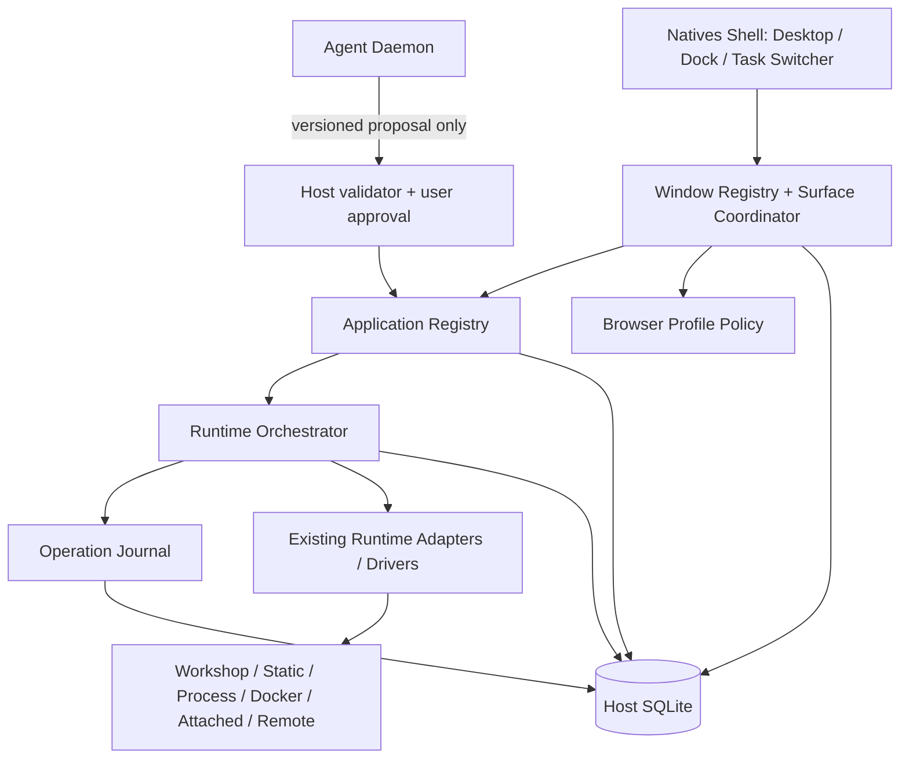
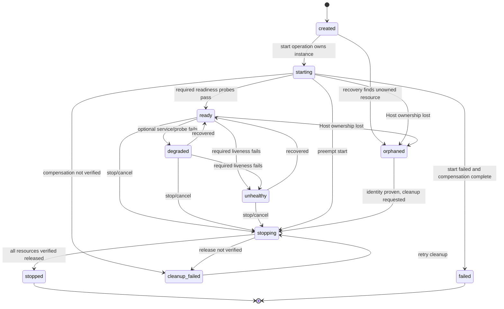
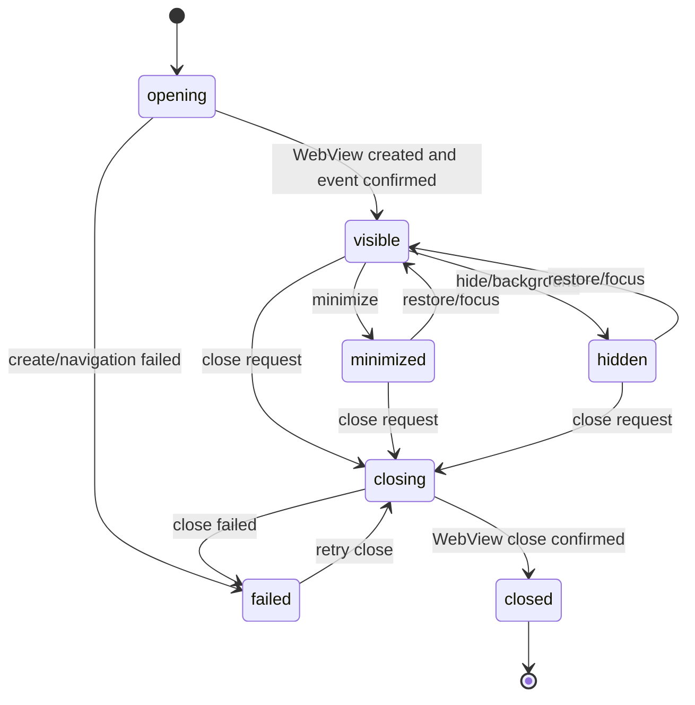
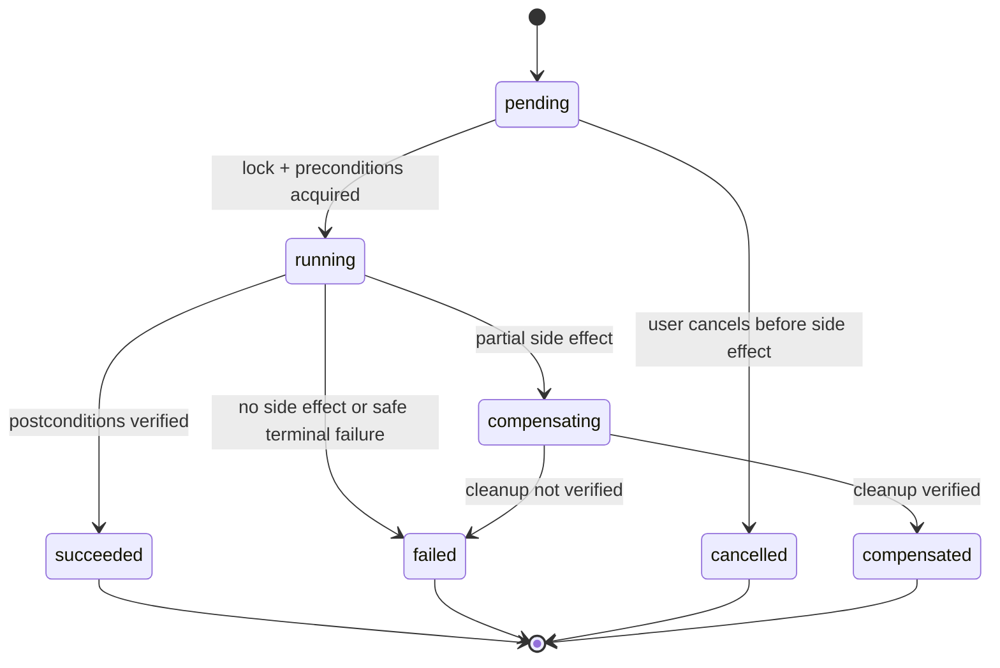

# Creative OS 目标架构

## 1. 结论

题设分层方向适合当前项目，但不应新造一套“OS 内核”。最小演进路径是：保留三源 adapter、source detail 表、Workshop 内核与现有 Host/Daemon 权威；在 Host 内把现有 `applications/runtime_instances/preview_targets` 补成可信 Registry/Orchestrator，再增加 Window/Profile/Operation。`Surface Manager` 是 ApplicationSurface、RuntimeEndpoint、WindowInstance 的薄协调层，不是万能服务。



## 2. 目标领域对象取舍

| 对象 | 当前替代物 | 是否新增/复用 | 优先级 | 迁移成本与原则 |
|---|---|---|---|---|
| Application | `applications` + source detail | **复用并强化** | P0 | 保留 id/source/source_id；修幽灵 identity，不改用户 source row |
| ApplicationVersion | `applications.version`、module version、plan JSON | **后置新增** | P2 | 只有需要可回滚 artifact/config 时才建；不为 static source 预造空版本 |
| LaunchProfile | `startup_plans` | **重命名可后置，先强化现表** | P0/P1 | schema version、单 active 约束、driver kind、ownership mode；旧 JSON 可升级读取 |
| RuntimeInstance | `runtime_instances` | **复用并升为真实 owner** | P0 | registry/driver/event 全改用 runtime id；source id 只用于 registry lookup |
| ServiceInstance | 无；Compose project/单 service 字段 | **多服务 driver 落地时新增** | P2 | Node/static 单 service 可生成一行；不阻塞第一批可信化 |
| RuntimeEndpoint | `open_url/current_port/resolved_urls_json` | **新增** | P1 | 先 web_main 一条；地址按 runtime 生灭，停止后 revoke |
| ApplicationSurface | `OpenTarget`/单 Preview | **新增稳定定义** | P1/P2 | Main/Admin/Docs 等稳定入口映射 endpoint；先只支持 Main |
| WindowInstance | singleton BrowserState/bounds | **新增** | P1 | window id、app/surface/profile、状态与 bounds；runtime_id 可空以支持 Remote |
| BrowserProfile | WebKit 默认 data store | **实验后新增** | P1 | profile id/policy 元数据；cookie 本体不进 SQLite；平台 data dir 由 Tauri/WebKit 管理 |
| Operation | source transient state/last_error | **新增** | P0 | 最小 journal：kind/phase/status/target/error/compensation；敏感参数不落库 |

关系：Application 有多个 LaunchProfile/RuntimeInstance/Surface；某次 RuntimeInstance 有若干 ServiceInstance/RuntimeEndpoint；WindowInstance 打开 ApplicationSurface，并选择 BrowserProfile，可选绑定当前 RuntimeInstance。关闭窗口不等于停止 runtime，停止 runtime 会撤销 endpoints 并让窗口显示离线态或按策略关闭。

## 3. 数据表草案

仅列第一批需要的最小字段；不复制 source detail。

```sql
-- 强化现有表
applications(id, source, source_id, title, version, created_at, updated_at)
startup_plans(id, application_id, plan_version, schema_version,
              driver_kind, ownership_mode, plan_json, is_active, ...)
runtime_instances(id, application_id, plan_id, status, cleanup_status,
                  owner_kind, owner_identity_json, resource_ledger_json,
                  last_heartbeat, failure, created_at, updated_at)

operations(id, application_id, runtime_instance_id NULL,
           kind, phase, status, actor, redacted_input_json,
           error_code, error_message, started_at, finished_at, updated_at)

runtime_endpoints(id, runtime_instance_id, service_instance_id NULL,
                  kind, scheme, host, port, path, status, capability_token_hash NULL, ...)

application_surfaces(id, application_id, stable_key, kind, title,
                     endpoint_selector_json, is_default, ...)

window_instances(id, application_id, surface_id, runtime_instance_id NULL,
                 browser_profile_id NULL, webview_label, state,
                 x, y, width, height, z_order, focused_at, ...)

browser_profiles(id, application_id NULL, name, persistence_policy,
                 platform_store_key, created_at, cleared_at NULL, ...)

-- 多服务批次才加入
service_instances(id, runtime_instance_id, stable_key, driver_ref,
                  status, resource_identity_json, ...)
```

数据库不变量优先于 app lock：

- active runtime：每 application 对 active status 建 partial UNIQUE index；
- active plan：每 application 仅一个 `is_active=1`；
- live window label 唯一；
- default surface 每 application 至多一个；
- Operation/Runtime 状态更新必须带 expected status 并检查 affected rows；
- PreviewTarget 可迁移为 Window/Surface 投影；兼容期保持旧 API 双读，不能长期双写两套权威。

## 4. Runtime 状态机

推荐保留最少但足够表达资源事实的状态：



`created` 只用于 operation/runtime row 原子建立后、driver 尚未执行的短状态；若 insert 能直接进入 starting 可省略。`ready` 取代含混的 running。`degraded/unhealthy` 只有持续 probe 真正实现后启用；否则不要提前在 UI 造状态。`cleanup_failed/orphaned` 必须算 active-like，禁止创建下一实例，直到资源被证明释放或用户显式完成外部接管。

迁移发起方与失败：start 由 Host Operation 发起，失败走 compensating 后 failed/cleanup_failed；probe 只能改 ready/degraded/unhealthy；stop 可从 starting/ready/degraded/unhealthy/orphaned/cleanup_failed 发起，幂等重试；reconcile 只能基于 driver identity proof 收敛，不能凭 DB 期望写 stopped。

## 5. Window 状态机



每次迁移由 Window Coordinator 发起，并以 Tauri event/结果确认；失败保留记录和错误，允许 retry。应用的“关闭窗口后继续后台运行”由 policy 决定，但不隐式 stop。

## 6. Operation 状态机



start/install/delete 的每个外部副作用推进 phase；重试新建 Operation 并关联前一项，不复活终态记录。failed 必须记录“资源未知/仍存在”并使 runtime 进入 cleanup_failed/orphaned。日志和输入持久化前脱敏。

## 7. Runtime Driver 接口评估

题设接口方向可用，但 `prepare` 不应强制所有 driver 制造中间资源，`logs` 也不应只返回一次性 `Vec`。建议复用现有 adapter，最小契约如下：

```rust
trait RuntimeDriver {
    fn kind(&self) -> RuntimeKind;
    async fn inspect(&self, app: &Application, plan: &LaunchProfile) -> Result<Inspection>;
    async fn start(&self, ctx: &RuntimeContext) -> Result<RuntimeResources>;
    async fn probe(&self, ctx: &RuntimeContext, resources: &RuntimeResources) -> Result<Health>;
    async fn stop(&self, ctx: &RuntimeContext, resources: &RuntimeResources) -> Result<CleanupReport>;
    async fn reconcile(&self, ctx: &RuntimeContext, ledger: &ResourceLedger) -> Result<ReconcileResult>;
}
```

- `RuntimeContext` 必带 runtime id、root cancellation、validated plan、secret resolver、resource event sink；不得给 driver 任意 SQLite。
- `prepare` 仅在 Docker pull/build、dependency install 等确有独立可恢复阶段时作为 Operation phase/helper，不放入所有 driver 的强制 trait。
- Static 必须有 start：它创建/授权 instance-scoped route/endpoint；不需要子进程。
- Attached Local URL 与 Remote URL 都是 non-owning driver：inspect/probe/open，stop 幂等返回 `not_owned`，不能伪造 stopped resource cleanup。
- Compose start 返回多个 service resources/endpoints；stop 必须幂等并以 project/label/compose file 三重身份验证。
- logs 用独立 stream/query service，key 为 runtime/service；driver 只提供 attach descriptor，避免生命周期 trait 变胖。
- reconcile 只接受持久 ledger 并重新 inspect；PID 必须校验 start time/executable/PGID，Docker 校验 labels/project，不能只凭 pid/name。

## 8. API 与事件草案

命令保持按 application id 的用户入口，但 mutation 返回 operation id，具体资源命令使用 runtime/window id：

```text
application.list/get/register/update
runtime.start(application_id, profile_id) -> operation_id
runtime.stop(runtime_instance_id) -> operation_id
runtime.restart(runtime_instance_id) -> operation_id
runtime.inspect/runtime.logs(runtime_id, cursor)
surface.list(application_id)
window.open(application_id, surface_id, profile_id?) -> window_id
window.focus/minimize/restore/close(window_id)
browser_profile.list/create/clear(profile_id)
operation.get/cancel(operation_id)
```

事件使用既有广播基础设施，payload 统一带 `sequence_id` 与实体 version：`application.changed`、`runtime.changed`、`runtime.endpoint.changed`、`operation.changed`、`window.changed`、`browser_profile.cleared`、`log.appended`。Renderer 收到 gap 走 snapshot reconcile，不从事件文本推断事实。

## 9. 浏览器/窗口方案比较

| 方案 | 优点 | 风险 | 结论 |
|---|---|---|---|
| A 多个 Child WebView | 可保持主窗口内伪 OS、复用现有 bounds panel | 坐标同步、遮挡、焦点、WebKit data store/profile API、平台差异；主窗口重绘耦合 | **推荐产品形态**，但必须先做 profile/多 child spike |
| B 每 app 一个 WebviewWindow | 原生多窗、最小坐标同步、minimize/focus/close 更可靠 | 与主窗口 Dock/层级、macOS 原生 Dock、多 window UX；cookie/data dir仍需实验 | **可靠备选**，若 Child 多实例/profile 不可控则选它 |
| C 单 Child 多标签 | 当前代码改动最小 | 仍单任务表面、跨 app storage 风险、不能满足真实多窗口 | 仅可作为短期兼容，不是目标架构 |

验证实验必须在独立 fixture 做：两个 labels/windows 同 origin cookie/localStorage 隔离；重启持久化；清 profile；OAuth popup/callback；download/upload；10 个窗口内存/焦点/resize；Child close failure；macOS sleep/restore。实验前不得声称 cookie 一定隔离。建议先保留现有单 Child 为 compatibility driver，同时实现 Window Registry；实验通过后再将 render backend 换成多 Child 或 WebviewWindow。

## 10. 安全边界

- Agent 只能生成 versioned LaunchProfile proposal；Host 校验、用户授权、注册和启动。
- executable/args 分离；cwd canonical 后限制授权 root；环境只引用 secret key，value 不进 Renderer/日志/journal。
- Docker inspect/plan 校验 privileged、host network、devices、bind mounts、socket、volume；高风险必须逐项批准。
- Workshop iframe 不变；Embed 无 Bridge/Session Token/Tauri capability；Remote URL 也无 capability。
- OAuth 只在临时授权 surface 按 app/domain allowlist；普通 navigation 继续 loopback/目标 origin fail closed。
- static route 绑定 runtime token；stop 首先 revoke。上传、下载、clipboard、新窗口各自权限与审计。
- BrowserProfile 清理必须删除平台 data store 并有完成/失败结果；SQLite 不存 cookie 内容。
- Operation journal 记录高风险动作与批准，但必须脱敏并有保留上限。

## 11. 兼容与渐进迁移

1. 不改三源 source id/detail 表；先修 identity resolver，并写只读检测+显式修复 migration。
2. 现有 `startup_plans` 作为 LaunchProfile v1；读取旧 JSON 时升级到内存结构，保存新版本时才写新 schema。
3. 现有 `runtime_instances` 增加 invariant/ledger；旧 active row先 reconcile，无法证明的置 orphaned，不能静默 stopped。
4. PreviewTarget API 在 WindowInstance 上线前兼容；新窗口稳定后迁移数据并移除双写。
5. 当前单 Child 是 legacy window backend；Window API 先包住它，不立刻推翻 Browser UI。
6. ApplicationSurface 初始为每 app 自动生成 `main`；RuntimeEndpoint 从旧 open_url backfill，但 active 与否必须重新 inspect。
7. 每批 additive migration、feature flag/read fallback、可独立回滚；绝不要求用户重新注册项目。
