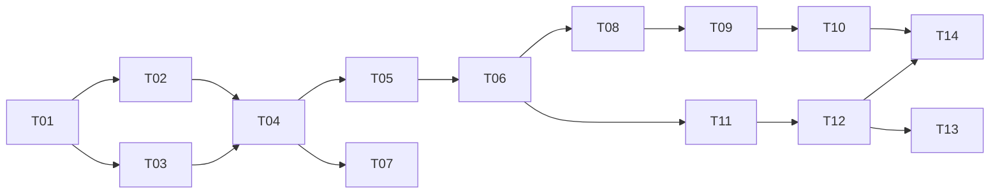

# Creative OS 渐进式升级计划

## 1. 原则与批次

- 先让现有运行语义可信，再做窗口视觉；UI 永远投影真实 Application/Runtime/Window/Operation。
- 保留 Workshop、Agent draft/publish、Local Project、GitHub Docker、现有 SQLite/source id/config；只做 additive migration。
- 沿用三源 adapter，先把 runtime id 贯穿现有 manager/driver，不引入插件框架、第二套 Catalog 或第二个 DB 权威。
- DB invariant、资源释放证明、安全边界不可用“全局锁/按钮禁用/动画”替代。
- 每批有 feature flag/兼容读、精准失败注入和独立 commit；未通过 postcondition 不进入下一批。

| 批次 | 目标 | 进入条件 | 退出条件 |
|---|---|---|---|
| 0 / P0 | 运行语义可信化 | 当前基线 | 六个 P0 根因关闭，重复 start/cleanup/static revoke 可证明 |
| 1 / P1 | Window 与 Surface 真实化 | 批次 0 | 多 WindowInstance、Dock/Focus/Minimize/Restore/Task switch 由真实事件驱动 |
| 2 / P1 | Browser 会话与登录 | Window backend spike 完成 | profile 隔离/持久/清除/OAuth/文件能力有实验证据 |
| 3 / P1–P2 | Runtime Driver 扩展 | owner/operation/endpoint 稳定 | Compose 多服务、Python/Binary/Attached/Remote 按真实语义运行 |
| 4 / P2 | Agent 驱动注册与体验收敛 | Host validators 和 drivers 稳定 | proposal→用户批准→注册→启动→窗口全链路，UI 不膨胀 |

## 2. 任务依赖

## 3. 任务明细

### T01 身份解析与幽灵 Application 收敛

- 问题来源/核查结论：#01 **CONFIRMED P0**。
- 目标：所有入口按真实 source/application id 解析；read/open/close 不创建 identity。
- 涉及模块/文件：Host command/adapter/store；`commands/creative_app.rs`、`adapters/mod.rs`、`runtime_store.rs`、`db.rs`。
- 数据结构变化：先加只读检测 query；migration 仅删除无 source row、无 runtime/plan/preview 的伪 local identity，冲突行留审计记录。
- API/前端变化：Browser show 接收 `application_id` 或由 source resolver 获取；Renderer DTO 已有 applicationId，无视觉改动。
- 后端变化：唯一 resolver；find-or-create 只用于注册事务。
- 兼容/迁移：source detail/id 不变；对旧 client 暂时允许 source id，但 Host resolve。
- 风险：误删真实 local row；必须用 source existence 和引用检查双重门禁。
- 测试/验收：GitHub/local 同 source_id fixture；show/close 不增行；已有幽灵行安全分类；Catalog/Preview 同 application id。
- 依赖：无；工作量：**S**；优先级：**P0**。

### T02 Runtime 数据库 invariant 与 CAS

- 问题来源/核查结论：#06/#07/#34，**CONFIRMED/PARTIAL P0–P1**。
- 目标：DB 保证单 active runtime/plan，状态冲突可见。
- 涉及模块/文件：`db.rs`、`runtime_store.rs`、adapter lifecycle tests。
- 数据结构变化：active runtime/plan partial unique indexes；必要的 revision/expected-status；修 Compose backfill owner。
- API/前端变化：typed `conflict/not_found` 错误，UI reload 后提示；无新页面。
- 后端变化：check+insert 合并为事务/CAS；所有 guarded update 检查 affected rows。
- 兼容/迁移：升级前扫描重复 active；按 resource inspect 选择 owner，其他置 orphaned，不能任意删除。
- 风险：SQLite partial index 与历史脏数据；migration 必须先报告后约束。
- 测试/验收：两个连接并发 start 仅一条成功；0-row transition 返回 conflict；历史 DB fixtures 幂等升级。
- 依赖：T01；工作量：**M**；优先级：**P0**。

### T03 Stop/Restart/Static URL/Preview 补偿

- 问题来源/核查结论：#02/#03/#08/#09，均 **CONFIRMED P0/P1**。
- 目标：资源、endpoint、preview/window 未验证完成时绝不写 stopped/成功。
- 涉及模块/文件：`local/lifecycle.rs`、`adapters/mod.rs`、`http_server.rs`、`commands/creative_app.rs`、`browser.rs`、`runtime_store.rs`。
- 数据结构变化：static endpoint token/revoked 状态；短期可放 Runtime ledger，T05 后迁表。
- API/前端变化：show/close 返回可观察错误；stop outcome 区分 cleanup failed；UI 不 fire-and-forget。
- 后端变化：static route 检查 active runtime token；WebView 成功后提交 Preview，失败补偿；restart 只在 verified stopped 后继续。
- 兼容/迁移：旧 static URL 在升级后不再是永久链接；运行中的旧 row启动时生成新 token/URL。
- 风险：旧 bookmark 失效（这是正确的停止语义）；close/DB 双失败需 Operation 记录。
- 测试/验收：stop 后旧 URL 404/410；WebView create/navigate/close/DB 四类故障矩阵；cleanup fail 阻断 restart。
- 依赖：T01；工作量：**M**；优先级：**P0**。

### T04 Application 锁与最小 Operation Journal

- 问题来源/核查结论：#04/#25/#31，**PARTIAL/CONFIRMED**。
- 目标：不同 app 可并行，同 app 排他；部分副作用可恢复/补偿/审计。
- 涉及模块/文件：`service.rs`、commands、install/local/docker lifecycle、`db.rs`、Catalog hook。
- 数据结构变化：`operations` 最小表；application lock registry；有界 install/Docker semaphore 是内存结构。
- API/前端变化：mutation 返回 operation id；兼容期仍可 await summary；新增 operation changed event。
- 后端变化：锁只包原子 phase，不跨无关 health；watchdog 不被另一 app 长任务阻塞。
- 兼容/迁移：旧 transient source 状态映射为 recovery operation；不搬迁历史日志。
- 风险：过度工作流化；只记录真实外部副作用 phase，不建通用 DAG 引擎。
- 测试/验收：A 长 health 时 B stop < 目标延迟；同 app 双 start 冲突；每个失败 phase 有 compensation/postcondition。
- 依赖：T02、T03；工作量：**L**；优先级：**P0/P1**。

### T05 Runtime Owner 贯穿与崩溃恢复

- 问题来源/核查结论：#05/#10/#22，**CONFIRMED/PARTIAL**。
- 目标：每个资源和异步 task 只属于一个 runtime id；reconcile 用身份验证恢复。
- 涉及模块/文件：`local/runtime.rs`、`local/logs.rs`、docker/install/local adapters、`runtime_store.rs`、`lib.rs`。
- 数据结构变化：完善 resource ledger/owner identity；日志目录按 runtime；旧 app 日志只读兼容。
- API/前端变化：logs(runtime_id,cursor)，Catalog 可继续聚合；事件带 runtime id。
- 后端变化：manager maps/cancel/task handles 全以 runtime id；PID start-time/executable/PGID，Docker label/project/file 验证。
- 兼容/迁移：旧 active row先 inspect；不可证明归属则 orphaned；不杀未知资源。
- 风险：PID reuse、Host crash 后无 Child reap 权；fail closed 并提供用户修复。
- 测试/验收：start-stop-immediate restart 无串日志/晚 health；TERM ignore；SIGKILL Host；Docker restart；所有 task/port/PGID 清零证据。
- 依赖：T04；工作量：**L**；优先级：**P0/P1**。

### T06 Endpoint、Surface 与 WindowInstance

- 问题来源/核查结论：#11/#12/#32/#33，均 **CONFIRMED P1**。
- 目标：稳定 surface、运行 endpoint 和窗口状态分离；关闭窗口不等于 stop。
- 涉及模块/文件：`db.rs`、Creative model/commands/browser、frontend creative components/hook。
- 数据结构变化：`runtime_endpoints`、`application_surfaces`、`window_instances`；每 app 自动 main surface。
- API/前端变化：surface.list、window.open/focus/minimize/restore/close；事件驱动 Dock/task switcher。
- 后端变化：Window registry 使用 window id/dynamic label；PreviewTarget 兼容读后退役。
- 兼容/迁移：当前 single child 包成 legacy backend；已有 open_url backfill为 main endpoint但需 active inspect。
- 风险：DB state 与 Tauri event 顺序；所有迁移必须由实际 create/close ack 确认。
- 测试/验收：两 app 同时可见；focus/minimize/restore/close 恢复；stop 后窗口离线且 runtime/window状态一致。
- 依赖：T05；工作量：**L**；优先级：**P1**。

### T07 HTTP/Embed 安全硬化

- 问题来源/核查结论：#26/#28/#29，**PARTIAL/CONFIRMED/NOT_REPRODUCED**。
- 目标：端点级 body 上限和有限并发；每信任域 CSP；动态 child 继续无 capability。
- 涉及模块/文件：`http_server.rs`、capabilities、Browser builder、security tests。
- 数据结构变化：可选 surface origin policy；不存 response body。
- API/前端变化：413/429 typed error；无正常 UI 变化。
- 后端变化：Content-Length/chunked 超限拒绝；bounded workers；Local/Workshop policy 分离。
- 兼容/迁移：先观测 body size，再降低；必要端点独立配额，不设万能 64 MiB。
- 风险：大附件功能回归；附件应走流式专用接口而非 Bridge JSON。
- 测试/验收：64MiB+ 请求不分配完整 body且返回 413；并发有界；恶意 child invoke 拒绝；traversal回归继续过。
- 依赖：T04；工作量：**M**；优先级：**P1**。

### T08 多 WebView / WebviewWindow 技术验证

- 问题来源/核查结论：#11/#13/#14/#15，含 **NEEDS_RUNTIME_VERIFICATION**。
- 目标：以 macOS/目标平台实验证据选择 Window backend 和 profile 策略。
- 涉及模块/文件：仅独立 fixture/审计记录，之后才改 `browser.rs`。
- 数据结构变化/API/前端/后端变化：本任务无生产变化；输出选择 ADR 与指标。
- 兼容/迁移：保留 legacy single child 直至新 backend 通过。
- 风险：把平台猜测写成架构；必须测 cookie/localStorage/service worker/OAuth/popup/download/upload/重启/清理/10窗资源。
- 测试/验收：实验可复现、记录 Tauri/WebKit/OS 版本；选 A 多 Child，失败则 B WebviewWindow；C 仅兼容。
- 依赖：T06；工作量：**M**；优先级：**P1**。

### T09 BrowserProfile 与 OAuth/文件能力

- 问题来源/核查结论：#13/#14/#15。
- 目标：可选择隔离/持久 profile，可证明清除；OAuth 与下载/上传/new-window 显式授权。
- 涉及模块/文件：Browser/window coordinator、`db.rs`、settings/permissions UI、i18n。
- 数据结构变化：`browser_profiles` 元数据和 capability grants；cookie 本体不进 SQLite。
- API/前端变化：profile create/list/clear；OAuth临时窗口；文件权限 prompt/下载记录。
- 后端变化：按 T08 选定平台 API 配置 data store；普通 child 不放宽公网导航。
- 兼容/迁移：现有默认 store 作为 legacy shared profile，提示迁移/清除，不假装已隔离。
- 风险：平台无法 per-profile data dir；必要时以 WebviewWindow/process boundary 降级。
- 测试/验收：两个 app 登录态隔离；重启持久；clear 后不可恢复；OAuth allowlist；popup/download/upload拒绝与批准路径。
- 依赖：T08；工作量：**L**；优先级：**P1**。

### T10 最小 Dock 与 Task Switcher

- 问题来源/核查结论：#30/#31/#32。
- 目标：UI 只投影真实 Window/Runtime/Operation；支持 focus/minimize/restore/background。
- 涉及模块/文件：新/现有 creative UI、`WorkshopPage.tsx`、Catalog hook、i18n/styles。
- 数据结构变化：无（复用 T06）。
- API/前端变化：订阅 window/runtime/operation snapshots；按真实 domain 拆 WorkshopPage controller。
- 后端变化：无新权威，仅补 event reconcile。
- 兼容/迁移：Catalog/创作台入口保留；旧 Browser panel 在 feature flag 下 fallback。
- 风险：先做动画再补状态；验收直接从 DB+Tauri event 对照。
- 测试/验收：键盘切换、双 app、后台运行、窗口关闭不 stop、runtime stop 离线、event gap snapshot；ARIA/小窗/深色/i18n。
- 依赖：T09；工作量：**L**；优先级：**P1/P2**。

### T11 ServiceInstance、Endpoint 与健康/日志

- 问题来源/核查结论：#18/#21/#22/#23，**CONFIRMED**。
- 目标：多服务/多 endpoint 可观测；健康与日志按 runtime/service 隔离。
- 涉及模块/文件：model/db/runtime store/docker/local logs/probe/frontend logs。
- 数据结构变化：`service_instances`，强化 endpoints；可选即时 resource snapshot，不先存全量 metrics history。
- API/前端变化：service/endpoint list、log cursor/filter、health event；Task manager 按需 snapshot。
- 后端变化：HTTP/TCP/Docker probe；readiness/liveness；redirect 限域；Compose inspect 生成服务资源。
- 兼容/迁移：旧单服务 plan 自动 stable_key=`main`；旧日志 app 聚合只读。
- 风险：状态过多；degraded/unhealthy 仅在持续 probe 上线时暴露。
- 测试/验收：frontend/backend/worker fixture，多 endpoint、单服务故障 degraded、required故障 unhealthy、日志不串运行。
- 依赖：T06；工作量：**L**；优先级：**P1/P2**。

### T12 Runtime Driver 收敛与端口租约

- 问题来源/核查结论：#16/#17/#19/#24，**CONFIRMED/PARTIAL**。
- 目标：复用 adapters 形成最小 driver contract；统一 resource/endpoint/cleanup；防端口 TOCTOU。
- 涉及模块/文件：adapters、local runtime/docker/plan/model/service/db。
- 数据结构变化：LaunchProfile schema v2 的 driver/ownership；短期 `port_leases` 或同 Operation 的租约记录。
- API/前端变化：plan preview/approval 显示 ownership 与风险；Attached/Remote 不显示 stop。
- 后端变化：先迁现有 Static/Node/Docker；stop/reconcile 幂等；prepare 仅真实阶段使用。
- 兼容/迁移：旧 plan parser 转 v2 内存模型；保存才升级；driver kind 映射现有 enum。
- 风险：造“大一统 trait”；只有共同行为进入 trait，install/log stream 保持独立。
- 测试/验收：现有五 runtime 行为不退化；并发端口分配；Attached/Remote不清理外部资源；driver contract matrix。
- 依赖：T05、T11；工作量：**L**；优先级：**P1**。

### T13 Python、Binary、Attached、Remote 增量 driver

- 问题来源/核查结论：#16/#17/#19。
- 目标：按场景逐个增加，绝不把 Remote 伪装 managed。
- 涉及模块/文件：scanner/plan/driver registry/Host permissions/UI wizard/i18n。
- 数据结构变化：LaunchProfile 各 driver versioned payload；复用 runtime/service/endpoint。
- API/前端变化：导入向导按 evidence 给候选；Binary executable/hash、Python interpreter、Attached/Remote ownership 明示。
- 后端变化：Python/Binary 复用 Process owner；Attached/Remote 只 inspect/probe/open。
- 兼容/迁移：不改已有 app；每 driver 独立 feature flag。
- 风险：任意 shell/二进制供应链；argv-only、cwd、hash、用户批准、secret引用不可省。
- 测试/验收：每 driver 一个安全 fixture和故障 cleanup；Remote无 capability，Attached stop action不存在，Python/Binary PGID释放。
- 依赖：T12；工作量：每 driver **M**（合计需拆分）；优先级：**P1/P2**。

### T14 Agent 提案到应用/窗口闭环

- 问题来源/核查结论：#20 与产品目标，**PARTIALLY_CONFIRMED**。
- 目标：Agent 产出受限 proposal，用户批准后 Host 注册/启动/建窗；正式 Workshop 发布路径不变。
- 涉及模块/文件：Daemon/Gateway creative tools、assistant protocol、Host validators/commands、result card、Creative UI。
- 数据结构变化：versioned proposal 可作为 Operation redacted input；正式实体仍由 Registry 创建。
- API/前端变化：结构化 result card、review/edit/approve；失败可返回草稿/提案重试。
- 后端变化：Daemon 无 SQLite/Docker/WebView 权限；Host 校验 profile/permission/source，创建 Application→Runtime→Window。
- 兼容/迁移：Creative draft/publish 继续；普通 Assistant 可 handoff，不复制 Provider/对话 UI。
- 风险：把 `write_file` 当 app 创建或让 Agent 自动批准；必须有人类 Host gate。
- 测试/验收：静态 Workshop、Node、本地导入三条；恶意 cwd/shell/privileged Compose拒绝；ID从 result/Catalog/runtime/window一致。
- 依赖：T10、T12；工作量：**L**；优先级：**P2**。

## 4. 验证总计划

每批先跑精准测试，再按项目门禁扩到 `typecheck/lint/test/perf:check/cargo fmt/cargo test --workspace/protocol:check`。资源类场景必须在测试开始、运行中、结束后记录 PID/PGID、Child wait、port、container/network/project、log/health task、endpoint token、window label、runtime/operation row；禁止测试结束后用全局 prune 掩盖泄漏。

最终场景：跨 source Browser identity；并发双 start；启动中 stop；cleanup failure restart；static revoke；WebView 四类故障；Host crash；Docker部分失败；多窗口/后台；profile隔离与清除；OAuth；多服务 degraded；Python/Binary cleanup；Attached/Remote不可 stop；Agent恶意 proposal拒绝。

## 5. 建议提交批次

1. `fix(identity): resolve creative browser application without writes`（T01）
2. `fix(runtime): enforce active-instance CAS and transition conflicts`（T02）
3. `fix(lifecycle): make stop, preview and static endpoint outcomes truthful`（T03）
4. `feat(runtime): add per-application operations and locking`（T04）
5. `feat(runtime): bind resources and logs to runtime instances`（T05）
6. `feat(windows): add surfaces, endpoints and window instances`（T06）
7. 之后每个 Browser/driver/UI 任务独立提交，不把 migration、runtime、UI 大爆炸混在一个 commit。

建议首先实施 **批次 0 的 T01→T02/T03→T04→T05**。在这批验收前不要开始 Dock 动画或 Python/Remote 扩类型。
