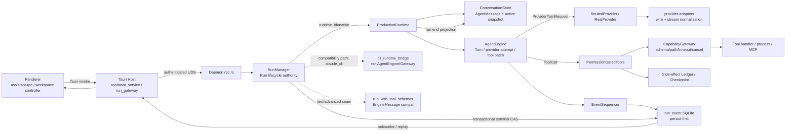

# Natives Agent Runtime 问题核实报告

> 性质：源码审计快照，不替代 `docs/standards/`、ADR 或 `NATIVE_ENGINE_FULL_REMEDIATION.md` 的规范权威。  
> 总体结论：`NOT_READY_FOR_PRODUCTION`。原生主链已经吸收 Pi 的关键循环思想，但 Checkpoint 路径信任边界、Side-effect 恢复事实和 Conversation 投影 crash-gap 仍存在 P0。

# 执行摘要

当前 Natives 更接近 **Agent Platform**，不是可独立发布的 Agent SDK：它已经具有 Daemon Run authority、UDS、SQLite、Credential broker、Capability Gateway、Permission、Event replay、Durable Queue、Checkpoint 和 Sub Agent。原生 `native` runtime 的生产链已基本收敛到 `ProductionRuntime → AgentEngine → ProviderTurnRequest / CapabilityGateway`，RunManager 是唯一 Run 终态提交者，Renderer 不再伪造 sequence 或 terminal event。

对 Pi 的吸收不是“未做”，而是已经覆盖了大部分循环语义：Typed Message、真实 Turn、Provider attempt、partial assistant、stop reason fail-closed、tool result pairing、并行/顺序工具、progress late-drop、steering/follow-up safe point、prepare-next-turn 等价策略接缝。Natives 还增加了 Pi Core 不负责的 durable Run、persist-first event、permission、checkpoint 和 side-effect ledger。

但“类型和接口存在”不能等同生产可靠。三个阻塞项是：

1. `production_tools.rs` 在 Gateway 路径校验前调用 Checkpoint，绝对路径可被读取并写入快照（N01）。
2. Tool 成功后的 completed/uncertain 都可能因同一个 DB 故障写失败，Resume 仍可能看不到未知副作用；Checkpoint 的 `side_effect_ledger_cursor` 实际还是 event sequence（D04、G01）。
3. Assistant Turn 在 Engine 完成后才从 Event 二次投影到 Conversation，分多事务写入，启动只回填 Snapshot；崩溃后 Provider history 可永久缺 Turn（N02、F02）。

因此当前不应继续扩展插件/SDK/新 Agent 功能，应先完成可靠性升级。

# 审计范围

- Natives worktree：`/Users/ldh/Downloads/project/AiNative/Natives-agent-runtime-audit-20260804-123205-32419`
- Branch：`codex/agent-runtime-audit-20260804-123205-32419`
- HEAD：`9584c3c263c1e83b1066e4208e1ab2d678a9deeb`
- Remote：`https://github.com/Wcof/Natives.git`
- 原始 `deploy` worktree：`/Users/ldh/Downloads/project/AiNative/Natives`，同一 HEAD；审计未修改原始 worktree。
- Pi：`/Users/ldh/Downloads/project/AiNative/References/pi`
- Pi HEAD：`583f153d502aa8e958eefdb9af0fbd3344e68f95`
- 历史基线：`1b4b1792932e2e24160091c7700a2c092d01e5f2`；到当前 HEAD 共 135 个文件、约 21k 新增行/2k 删除行，包含 P0、deepening 和 final integration 合并。
- `Natives-vs-Pi-Agent-source-audit-2026-08-04.md`：本地未找到。
- 审计覆盖：`agent-core`、`assistant-protocol`、`capability-gateway`、`provider-adapters`、`harness-core`、Daemon、Host 和 Agent Renderer projection；普通页面不在范围。

# 当前 Commit 与环境

| 项目 | 结果 |
|---|---|
| Working tree | 审计开始和写文档前均无生产代码修改；仅新增本任务要求的审计/路线文档 |
| 可用磁盘（开始） | 32 GiB |
| 共享 Cargo target | `/Users/ldh/Downloads/project/AiNative/Natives/.cargo-target-shared`，7.8 GiB |
| 并发构建 | 开始时检测到原项目另一个 Agent 的 Cargo 任务，等待其结束后才使用共享 Target 执行一次 workspace check；未并发构建 |
| 巨型文件行数 | run_manager 6043；engine 5717；production_tools 4434；rpc 3564；conversation_store 3424；production 3422；mcp_runtime 2644 |

# 真实生产执行链



## 权威和旁路结论

| 问题 | 结论 | 证据 |
|---|---|---|
| 是否唯一生产主链 | `native` runtime 是唯一原生主链；仓库仍有 `claude_cli` compatibility runtime | `run_manager.rs:1900-2065` |
| 是否有第二套 Agent Loop | Native 没有；CLI 子进程有自己的外部 loop，不能宣称 Native Core 不变量 | `cli_runtime_bridge.rs`；`run_manager.rs:1900-2033` |
| 测试与生产同链 | 部分。核心精确测试大量 Fake；Daemon/Renderer 有集成测试，但真实 Provider/kill/DB fault 不足 | `engine.rs:3200-5717`；Renderer controller tests |
| Typed/Legacy | Native 优先 Typed；Legacy 仍在公共 API、fallback 和 seam | `production.rs:688-778`；`engine.rs:289-420` |
| Run authority | RunManager 的 `RunLifecycleAuthority::commit_transition` | `run_manager.rs:2602-2695` |
| Turn authority | AgentEngine | `engine.rs:1016-1815` |
| Tool Call/Result | Core 产生事件与上下文配对；Daemon 在 Run 结束后投影 Conversation | `engine.rs:1599-2050`；`conversation_store.rs:1298-1494` |
| Event persistence | EventSequencer → EventLog；terminal status/event 由 RunManager 单事务 | `event_seq.rs:178-299`；`run_manager.rs:2602-2695` |
| Renderer 权威 | 不合成 sequence/terminal；缺权威终态时标 projection incomplete | `projection.ts:3-71`；`daemon-adapter.ts:153-175` |
| Gateway 旁路 | Native local/MCP 无直接调用；`mcp.call` RPC 已禁用；CLI runtime 是明确例外 | `production_tools.rs:1147-1151,2470-2610`；`rpc.rs:1968-1986` |
| Provider 旁路 | Native Turn 使用 `ProviderTurnRequest`；legacy trait/default seam 仍公开 | `engine.rs:1044-1057`；`production.rs:1384-1646` |

# 问题核实总表

风险分是八维总和，细分见 `natives-agent-issues.json`。

| 编号 | 问题 | 状态 | 优先级 | 风险分 | 关键证据 | 核实结论 |
|---|---|---|---|---:|---|---|
| A01 | 巨型控制器 | CONFIRMED | P2 | 17 | `run_manager.rs` 6043 行；`engine.rs` 5717 行；`production_tools.rs` 4434 行 | 问题来自跨状态域耦合，不是行数本身 |
| A02 | 多重状态权威 | PARTIAL | P1 | 21 | `interaction_store.rs:225-297` | Run 已收敛；Interaction/Queue/Checkpoint 仍多阶段结算 |
| A03 | 生产/测试链分离 | PARTIAL | P2 | 14 | `run_manager.rs:1900-2156` | Native 收敛；CLI/legacy seam 例外 |
| B01 | Legacy Message 双轨 | PARTIAL | P2 | 15 | `production.rs:688-778`; `routing.rs:240-315` | Typed 是 native 主链但非唯一公共内部模型 |
| B02 | 旧兼容分支 | PARTIAL | P2 | 13 | `conversation_store.rs:1426-1505` | 分散且没有删除门槛 |
| C01 | Turn 边界 | RESOLVED | P3 | 0 | `engine.rs:1016-1815` | 真执行单位，不只是标签 |
| C02 | Steering/Follow-up | PARTIAL | P1 | 16 | `prompt_queue_store.rs`; `engine.rs:771-817,1460-1495` | Durable lease/ack 已生产，混合 one/all 需收紧 |
| C03 | Context/Compaction | PARTIAL | P1 | 17 | `context.rs:190-260`; `engine.rs:2061-2295` | Snapshot 可恢复；估算/overflow 不完整 |
| C04 | 截断 Tool Call | RESOLVED | P3 | 0 | `engine.rs:1328-1580` | Length/unknown/no-final fail closed |
| D01 | 参数校验 | PARTIAL | P2 | 12 | `capability-gateway/lib.rs:335-400` | JSON/Schema 已执行；重复工具名未拒绝 |
| D02 | Tool Scheduler | PARTIAL | P1 | 18 | `capability-gateway/lib.rs:244-370`; `engine.rs:1840-1994` | 单批能力驱动；无跨 Run Exclusive lease |
| D03 | Side-effect Ledger | PARTIAL | P0 | 26 | `side_effect_ledger.rs:74-191` | 生产已接，但无真实 cursor/idempotency/external ref |
| D04 | 成功后事件失败 | CONFIRMED | P0 | 28 | `engine.rs:1960-1981`; `production_tools.rs:502-518` | uncertain 第二次写仍可失败且结果被丢弃 |
| D05 | Hook | PARTIAL | P2 | 15 | `hooks.rs:249-345`; `engine.rs:1945-1958` | Pre 可阻断；Post 结果被忽略，无稳定幂等 ID |
| E01 | 子 Agent 权限继承 | RESOLVED | P3 | 0 | `subagents.rs:15-119` | profile/allowlist 只能收紧 |
| E02 | 子 Agent 预算 | CONFIRMED | P1 | 21 | `subagents.rs:181-380`; `production_tools.rs:3221-3239` | 内存 ledger；token settle 错误被忽略 |
| E03 | 子 Agent 失败策略 | CONFIRMED | P1 | 16 | `subagents.rs:122-176` | Enum/parse 存在，production watcher 不消费 |
| E04 | 子 Agent 孤儿创建 | NEW_FINDING | P1 | 19 | `production_tools.rs:2892-3041` | hook/budget 失败可留 session 或 queued run |
| F01 | SQLite 单连接同步 Mutex | CONFIRMED | P1 | 19 | `storage/mod.rs:103-136`; `event_seq.rs:178-220` | async worker 内同步 SQL；WAL 不解决单连接串行 |
| F02 | 事务边界 | PARTIAL | P0 | 24 | `conversation_store.rs:1428-1494`; `event_log.rs:110-214` | Run terminal 正确；Turn/usage 投影不原子 |
| F03 | Event Sequence | RESOLVED | P3 | 0 | `event_seq.rs:178-299` | per-run persist-first + unique DB constraint |
| F04 | DB 故障测试 | PARTIAL | P1 | 18 | 测试搜索 | 有精确 persistence fake，缺系统 fault matrix |
| G01 | Checkpoint 完整性 | NEW_FINDING | P0 | 25 | `production.rs:801-818`; `run_manager.rs:45-115` | ledger cursor 是 event sequence |
| G02 | Resume 安全 | PARTIAL | P0 | 25 | `run_manager.rs:2354-2478` | 新 Run+uncertain gate 已有，但依赖不可靠 ledger |
| G03 | Continue/Retry/Resume | PARTIAL | P2 | 14 | `production.rs:690-735` | API 分开；Retry 不 exact snapshot，需明确契约 |
| G04 | Fork | PARTIAL | P2 | 14 | `conversation_store.rs:405-587` | Transcript 安全复制；resource/usage 契约不足 |
| H01 | Event 定义 | PARTIAL | P1 | 15 | `engine.rs:1018-1312` | critical checked，usage/progress/attempt 可丢 |
| H02 | 事件事实一致性 | PARTIAL | P1 | 21 | `event_log.rs:110-214`; `production.rs:787-829` | event 与 projection 非同一事务 |
| H03 | Progress 背压 | CONFIRMED | P1 | 14 | `production_tools.rs:1097-1136` | terminal unbounded channel |
| H04 | OTel/指标 | CONFIRMED | P2 | 13 | 全局源码搜索 | 无结构化 runtime metrics sink |
| I01 | Provider 统一协议 | PARTIAL | P2 | 14 | `production.rs:1384-1646`; `routing.rs:240-315` | 事件/StopReason 统一；block 映射仍有损 |
| I02 | Provider Retry | PARTIAL | P2 | 12 | `engine.rs:1033-1312` | 有界、Retry-After、abort；缺 request id 审计 |
| I03 | Context Overflow | CONFIRMED | P1 | 15 | `engine.rs:1033-1368` | 无统一 overflow-compaction retry |
| J01 | 工具旁路 | PARTIAL | P2 | 14 | `production_tools.rs`; `rpc.rs:1968-1986` | Native 无旁路；CLI compatibility 除外 |
| J02 | Shell 安全/可靠性 | NEW_FINDING | P0 | 20 | `process_supervisor.rs:130-165,311-342` | pipe 未并发 drain；UTF-8 字节切片 panic |
| J03 | MCP | PARTIAL | P1 | 18 | `production_tools.rs:2470-2610` | Gateway/Ledger 已接；阻塞取消/late update best effort |
| J04 | Permission | PARTIAL | P1 | 22 | `interaction_store.rs:225-297` | 持久决策、事件、waiter 不原子；重复响应非幂等 |
| K01 | 独立 Agent Core API | CONFIRMED | P2 | 9 | `agent-core/Cargo.toml`; `lib.rs` | 内部 crate，不是可发布 SDK |
| K02 | Pi 易用性差距 | CONFIRMED | P2 | 10 | Pi `agent.ts:171-470` | 缺薄 facade；不应复制 Session Runtime |
| L01 | 全量验证 | PARTIAL | P1 | 16 | 资源命令记录 | fmt/workspace check 通过；测试与前端依赖环境未完整验证 |
| L02 | 测试层级 | PARTIAL | P1 | 17 | `engine.rs` tests/Daemon/Renderer tests | Fake/逻辑强，真实 crash/fault 弱 |
| L03 | 发布成熟度 | CONFIRMED | P2 | 10 | `agent-core/Cargo.toml` | 无 SDK 发布/semver/SBOM/smoke contract |
| N01 | Checkpoint 路径越界读取 | NEW_FINDING | P0 | 25 | `production_tools.rs:1049-1065,1535-1565`; `checkpoint.rs:164-196` | Gateway deny 前可读取绝对路径 |
| N02 | Conversation 投影 crash-gap | NEW_FINDING | P0 | 23 | `production.rs:787-829`; `conversation_store.rs:1428-1494` | committed Turn 可不进入 reload/provider history |
| N03 | run- 前缀 FK 猜测 | NEW_FINDING | P2 | 12 | `conversation_store.rs:2016-2028` | 生产按 ID 命名猜 fixture |
| N04 | RPC 无帧大小上限 | NEW_FINDING | P1 | 16 | `rpc.rs:164-291` | `read_line` 可无界增长 |
| N05 | child project_id/Scope 错写 | NEW_FINDING | P1 | 18 | `production_tools.rs:2920-2935` | path 写入 project_id，错误被忽略 |
| N06 | Snapshot backfill 静默降级 | NEW_FINDING | P1 | 19 | `conversation_store.rs:1767-1814`; `run_manager.rs:187-198` | 坏 event 跳过，回填失败仅日志 |

# P0 问题

## N01：Checkpoint 先于 Gateway 读取路径

调用顺序是 `extract_write_paths → CheckpointManager::capture_before → side-effect started → gateway.execute`。`extract_write_paths` 只排除字符串 `..`，接受 `/etc/passwd` 这类绝对路径；Rust `project_root.join(absolute)` 返回 absolute 本身。因此即使 Gateway 随后通过 canonical path scope 拒绝 handler，Checkpoint 已经读取项目外文件，并可能把 UTF-8 内容写入 `checkpoint.snapshot_json`。

这是信任边界错误，不是普通路径校验缺陷。修复应复用 Gateway 的 canonical resolver，让 Checkpoint 只接收已验证的 project-relative path，且任何 I/O 都必须发生在 scope validation 之后。

## D04 / G01 / G02：副作用恢复证明链不闭合

生产路径确实在工具前写 `started`，成功后写 `completed`，ToolCompleted 事件失败时尝试写 `uncertain`，Resume 也阻止 `uncertain && !replay_safe`。但：

- `mark_tool_call_uncertain` 返回 `()`，Daemon 丢弃 Ledger 写入错误。
- completed 更新失败后第二次 uncertain 写同一 DB，仍可能失败。
- `side_effect_ledger_cursor` 填的是最后 Event sequence，不是 Ledger 水位。
- idempotency_key/external_reference 永远为 NULL。
- 通用 cancel 对部分 side-effect handler 记为 `cancelled`，并不总能证明外部没有完成。

这意味着“Resume 会阻止不确定副作用”只在 Ledger 本身成功持久化时成立。目标不是无限重试，而是：副作用 intent 必须先持久；完成事实、ToolCompleted 和 checkpoint watermark 必须可关联；无法写 durable uncertain 时 Run/Checkpoint 必须成为不可自动恢复。

## N02 / F02：Event 与 Conversation 恢复不一致

Core 的 Turn/Message/Tool Result event 是 persist-first。可是 `ProductionRuntime` 直到 Engine Future 返回后才 replay 全部事件并调用 `append_assistant_turn_from_events`。该投影又按 `turn → assistant message → N tool result` 分多个事务。任何进程 kill 都可能留下完整 event、部分或空 conversation projection。

启动只调用 `backfill_context_snapshots`，不投影 assistant turn。固定 message id 加普通 `INSERT` 还使部分重试可能先撞 assistant 唯一键，无法继续补 Tool Result。结果是 Renderer 当时看见成功，但下次 `load_agent_messages`/Provider context 缺失该 Turn。

## J02：Shell pipe 死锁和 Unicode panic

`LocalProcessSupervisor` 只在 `try_wait()` 已退出后读取 piped stdout/stderr。输出填满 OS pipe 的进程会阻塞写入，永远无法退出，supervisor 又永远不读。`append_capped` 和 `tail` 还按任意 byte offset 对 `str` 切片，多字节字符边界会 panic。

# P1 问题

- F01：同步单连接 SQLite 在 async 路径串行并阻塞 executor。
- A02/J04：Interaction 的 DB 决策、事件和 waiter 不是一个幂等提交。
- E02/E03/E04/N05：Sub Agent 配额/失败策略/创建补偿/项目身份存在生产缺口。
- H03：Progress 无界 channel；即使 sink 有 8 KiB/250 ms batching，上游仍可积压。
- I03：Provider Context Overflow 没有标准恢复分支。
- N04：UDS request frame 无大小上限。
- N06：快照回填损坏事件静默跳过。

# P2 问题

- Typed/Legacy 双轨和有损 provider conversion。
- 跨 Run conflict/exclusive lease 缺失。
- Hook post semantics、compatibility runtime 能力标注、工具名冲突。
- 缺稳定 Agent facade、发布元数据和 OTel sink。
- `run-`/`turn-` 前缀猜 fixture。

# P3 问题

已解决历史项只作为回归门：真实 Turn、截断 fail-closed、schema boundary、Tool Result pairing、Run terminal authority、Renderer authoritative sequence、子 Agent 权限收紧。

# 未确认问题

- 真实外部 Provider 的计费/idempotency 行为：没有使用真实 key 发请求。
- macOS/Linux 下所有 MCP transport 的远端取消效果：静态只能确认 token/abort/stop server 路径。
- SQLite disk full、WAL checkpoint failure、corrupted row 的完整进程级结果：没有在审计期间执行破坏性 fault injection。
- 多 Daemon 实例同时打开 assistant.db 的全部行为：没有启动第二实例复现。
- Symlink 竞态（校验后替换）是否在所有文件工具中防住：Gateway canonical 检查存在，但未做 TOCTOU 攻击测试。

# 已解决历史问题

| 历史问题 | 当前代码证据 | 状态 |
|---|---|---|
| Credential 固定 `provider-stream` | `EngineProviderContext.run_id` → `RealProvider` credential broker | RESOLVED |
| 请求时 `NATIVES_OPENAI_API` 全局切换 | API mode 已进入 adapter/request scoped 配置 | RESOLVED |
| Provider length 仍执行 tool | `engine.rs:1328-1580` | RESOLVED |
| malformed JSON → `{raw}` 执行 | Core parse + Gateway schema validation | RESOLVED |
| Hook deny/unknown/invalid 不配 Tool Result | preparation rejection 转同 ID ToolResult | RESOLVED |
| Gateway cancel 只等 timeout | `capability-gateway/lib.rs:402-470` 同时 select handler/timeout/cancel | RESOLVED（资源级语义仍 PARTIAL） |
| Renderer 合成 terminal sequence | `projection.ts` / `daemon-adapter.ts` | RESOLVED |
| ProductionRuntime 二次提交 Run terminal | `production.rs:843-849` 明确只返回 EngineOutcome | RESOLVED |

# 新发现问题

1. N01：Checkpoint 在 Gateway path scope 前读取绝对路径。
2. N02：完整 Turn event 到 Conversation 的 crash-gap 没有 assistant projector recovery。
3. G01：Side-effect Ledger cursor 名称与事实不符，实际是 event sequence。
4. J02：Shell stdout/stderr pipe 不并发 drain；UTF-8 cap/tail 会 panic。
5. E04：Sub Agent hook/budget 失败可留下 session 或 queued run。
6. N05：child scope 把 project path 写进 project_id 并忽略写失败。
7. N04：UDS JSON line 没有最大帧限制。
8. N03：按 `run-`/`turn-` 名称猜 fixture，可能丢真实 FK。
9. N06：snapshot backfill 跳过损坏事件且失败仅记录日志。

# 与 Pi Agent 对比

| 设计 | Pi 证据 | Natives 当前 | 吸收判断 |
|---|---|---|---|
| AgentMessage 主循环 | Pi `agent-loop.ts:1-23,155-275` | Native 主链用 AgentMessage，但 legacy API 未收敛 | 继续收敛 compat，不重写类型 |
| Turn lifecycle | Pi `agent-loop.ts:109-116,175-224` | Natives 有持久 TurnId 和 Provider attempts | 已吸收且更强 |
| Partial assistant | Pi `agent-loop.ts:314-370` | Natives 累积 delta 并发 MessageDelta/Completed | 已吸收 |
| Context transform | Pi `agent-loop.ts:281-312` | Natives assemble/compaction/snapshot 分散在 Engine | 吸收明确 pipeline/overflow policy，不复制 TS callback 任意性 |
| Truncated tool fail closed | Pi `agent-loop.ts:374-405` | Natives stop reason gate + paired errors | 已吸收 |
| Tool prepare/validate/hook | Pi `agent-loop.ts:600-663` | Natives Core JSON + Gateway Schema/permission/hook | 已吸收且安全边界更强 |
| Parallel completion/source ordering | Pi `agent-loop.ts:489-553` | Natives Result 源序；Completed 目前也源序 | 可吸收“Completed 按完成序、Result 按源序” |
| Progress late update | Pi `agent-loop.ts:666-706` | Natives settled set + sink batching，但 upstream unbounded | 语义已吸收，补 bounded backpressure |
| Steering/follow-up | Pi `agent.ts:123-157,276-321`; `agent-loop.ts:166-274` | Natives durable lease/ack + safe point | 已吸收且 durable 更强；不要退回内存 queue |
| prepareNextTurn/stop policy | Pi `agent-loop.ts:226-257` | Natives compaction/safe point/doom/max step 内置，尚无统一 policy object | 只抽取最小 TurnPolicy，避免万能 callback |
| Agent facade | Pi `agent.ts:171-470` | Natives 需 Daemon/RPC 多层 | 可靠性完成后吸收薄 facade |
| Session tree | Pi coding-agent（不属于低层 Agent Core） | Natives Run/Conversation/Checkpoint 是平台权威 | 不直接吸收，不用 Pi Session 替代 Run |
| CLI/TUI/runtime | Pi coding-agent | Natives Rust/Tauri/UDS | 不吸收，不集成 Pi Runtime |

Pi 在本次参考 Commit 同样是 in-memory Agent core：Queue persistence、Run authority、SQLite crash recovery、Permission 和 Ledger 属于 coding-agent/上层或不存在。因此 Pi 适合作为 loop behavior oracle，不适合作为 Natives 的恢复/安全权威。

# 测试执行情况

## 本次实际命令

| 命令 | 结果 | 说明 |
|---|---|---|
| `git status/branch/rev-parse/remote/worktree` | PASS | 固定上述基线 |
| `df -h .` | PASS | 审计开始可用 32 GiB |
| `du -sh .../.cargo-target-shared` | PASS | 7.8 GiB |
| `pgrep -afil cargo\|rustc...` | 发现外部任务 | 原 worktree 正运行 `cargo check/test -p natives` |
| `jq` 风险矩阵结构、量表与总分校验 | PASS（exit 0） | 45 项均满足字段要求、单维上限和总分公式 |
| `cargo fmt --check` | PASS（exit 0） | 使用共享 Target 环境；未修改代码 |
| `cargo check --workspace --jobs 2` | PASS（exit 0） | 8 crates compiled；42.93 秒；共享 Target |
| `cargo test --workspace` | NOT RUN | 审计禁止反复/全量构建；不能写成通过 |
| `cargo clippy --workspace --all-targets -- -D warnings` | NOT RUN | 同上 |
| `npm run typecheck` | FAIL（exit 127） | 独立审计 worktree 未安装 `node_modules`，`tsc: command not found`；不是代码诊断结果 |
| `npm run lint` | FAIL（exit 127） | 同上，`eslint: command not found` |
| `npm run test` | NOT RUN | 同一依赖缺失已确认，不重复启动必然失败命令 |

## 测试可信度分层

| 层级 | 当前证据 | 结论 |
|---|---|---|
| 单元类型测试 | message、stop reason、schema、run state 很多 | 强，但不能证明生产接线 |
| 核心逻辑测试 | AgentEngine FakeProvider/FakeTool、Pi conformance | 强 |
| Store 测试 | conversation/snapshot/queue/checkpoint/ledger 有 SQLite fixture | 中；缺 kill-between-writes |
| Daemon 集成测试 | RunManager/RPC/Production 部分路径 | 中；大量全局/fixture seam |
| Renderer 投影测试 | gap recovery、authoritative terminal、reducer | 强 |
| 真实 Shell 测试 | 未发现大 pipe/Unicode/cancel-reap 系统覆盖 | 缺失 |
| MCP fixture | 有协议/runtime fixture | 中；远端 late-success/cancel 缺失 |
| Crash recovery | 有 restart/uncertain 单测 | 弱到中；缺真实进程 kill 10 点矩阵 |
| 真实 Provider | 本审计未运行外部服务 | 环境未验证 |

# 总体结论

## 15 个问题的明确回答

1. 定位：当前是 **Agent Platform**，不是稳定 SDK。
2. 最有竞争力：Daemon 单一 Run authority；Capability Gateway 安全边界；durable event/queue/checkpoint/lineage 组合。
3. 最危险：Checkpoint 路径越界读取；副作用事实/ledger cursor 不可靠；Conversation 投影 crash-gap。
4. 被证实的旧结论：大控制器、Legacy 双轨、SQLite 单连接、Progress 无界、Sub Agent failure policy/预算未完整生产化。
5. 已过时结论：真实 run_id、OpenAI 全局 mode、截断 Tool、Schema、Tool Result pairing、Renderer synthetic terminal 已修复。
6. 新发现：N01–N06、G01、J02、E04，详见上文。
7. 新功能前必须修：N01、D04/G01/G02、N02/F02、J02；随后 F01/H03/J04/E02。
8. 可暂缓：公开 SDK、插件生态、OTel adapter、机械大文件拆分、跨 Provider 高级 thinking round-trip。
9. 值得吸收的 Pi 设计：单一 Typed loop、prepare/validate/execute/finalize、completion/source 双序、bounded late progress、薄 Agent facade、明确 Turn policy。
10. 不适合照搬：内存 Queue、Session 文件树替换 Run/SQLite、TypeScript Runtime、CLI/TUI、任意 extension callback 进入安全边界。
11. 不建议直接集成 Pi Agent。
12. 建议继续自研 Rust Agent Core；当前已经形成平台差异化资产。
13. 最终产品定位：**本地优先、可恢复、受 Capability Gateway 约束的 Agent Runtime Platform**；SDK 是后续 facade。
14. 第一轮：TASK-001 路径边界、TASK-002 durable side-effect commit、TASK-003 Turn projector、TASK-004 shell drain。
15. 第一轮门槛：P0 crash/security tests 全通过；任何 unknown side effect 均 Blocked；拒绝路径无 checkpoint I/O；kill 后 conversation/provider history 可由 event 收敛。

## 最终判断

```text
NOT_READY_FOR_PRODUCTION
```

理由不是 Agent Loop 未吸收 Pi，而是平台新增的持久化和副作用恢复能力尚未形成可证明的原子闭环。修完 P0 后，状态可提升为 `NEEDS_RELIABILITY_UPGRADE`；完成 P1 fault/backpressure 后才进入 `READY_FOR_FEATURE_DEVELOPMENT`。
