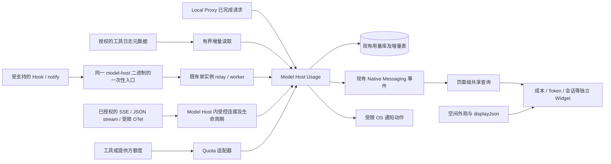

# 空间 AI 效能组件实施方案：独立组件、多 Agent 统计、空间可视化规范

修订：2026-09-11，本轮按用户三项要求重新收口。状态：**更新后的引擎执行方案；工作区已有部分实现，本轮仅修订方案，未验收实现**。ADR-0030 在当前工作区已标记 accepted，开发时复用已接受边界，不重新把全部工作视作从零开始。

面向用户：个人开发者，多工具并用，优先解决用量、费用、归因和任务提醒。完整首版强制覆盖用户明确指定的 AtomCode、Claude Code、Codex、ZCode、Pi、Cursor、Harness，以及当前 `model-host/internal/agentclients/registry.go` 与 `BuildChangesWithModels` 已支持配置注入的全部工具：Claude Desktop、DeepSeek Harness（注册 ID `deepseek-harness`）、OpenCode、Grok Build、Kimi Code、OpenClaw、Hermes。工具名单是“用户明确名单 ∪ 源码注册表”的并集；新增注册工具自动进入覆盖矩阵。首个完整验收平台为当前 macOS + Chromium；CLI、IDE、桌面端和网页端必须逐项标注兼容性，不能沿用另一形态的验收结论。

本文是开发输入，不取代 [Standards](../standards/README.md)、[ADR-0020](../adr/0020-ai-native-personal-workspace-rearchitecture.md)、[ADR-0028](../adr/0028-ai-performance-usage-widget-regression.md) 或 [ADR-0030](../adr/0030-ai-usage-ledger-and-collection-boundaries.md)。当前实现以源码为准；实施证据回写既有领域文档。用户补充的“Harmony”按其澄清指 Hermes Agent 或 Pi，二者都在强制范围，不新增或合并一个 Harmony 身份。

**本轮必须同时满足的三个交付条件：**

1. “AI 效能”是目录分类，下面直接提供 **AI 成本、Token 用量、会话活跃、调用统计** 等独立组件。每种有独立注册 key、名称、默认指标和实例配置；不能再用一个“AI 效能”组件加“视图模式”下拉框交差。
2. 默认统计全部已授权、已接入 Agent 来源。Model Host 是归一、存储与查询的权威，Local Proxy 只是其中一种采集渠道；不经过 Proxy 的 Claude Code、Codex、ZCode、AtomCode、Hermes Agent、Pi 等也必须接入。目录列出工具或标注待实现不算完成统计。
3. 组件及其 **数字、趋势、排行、热力图、时间线、表格** 全部消费空间解析后的外观。文字颜色、字体、字号、字重、背景、图形色阶随空间和卡片设置即时变化；不能直接拿 Files/模型设置页面的变量盖过空间外观。具体执行契约见 §5。

## 1. 产品判断与建议

现在的“AI 效能”更接近一个可配置的用量图表。它能回答“用了多少”，还不能稳定回答个人开发者最关心的四件事：

1. **我额外花了多少钱，主要花在哪里？**
2. **还能用多久，会不会突然撞上额度或预算？**
3. **哪个任务正在等我，什么时候需要回去处理？**
4. **下一步怎样少花钱、少等待，同时不降低交付质量？**

“AI 效能”分类固定提供七个可独立添加的组件：**AI 成本、Token 用量、会话活跃、调用统计、额度与预算、任务提醒、降本建议**。前四项是本轮核心。工具与账户目录、统一用量账本、账单对账继续作为完整的数据管理和钻取能力，复用既有设置/用量详情入口；它们不能取代成本、Token 和会话组件。公共查询、指标归一和图表函数继续复用，产品身份必须独立。

“效能”必须有完成质量或用户确认的结果作为分母。Token 数、调用次数、会话跨度、代码行数都不能单独换算为节省时间、有效产出或效率分。

完整首版保留此前的全部范围：13 个基线工具、账单/用量/活动三层口径、Skill/MCP/插件/子代理归因、预算与提醒、连接器回滚和真实工具验收。开发未完成、尚未取得 fixture、未安装工具，必须记为交付缺口；不能先写 `unsupported` 就宣布完整支持。仅经证据确认某工具版本没有某项能力时，才记录该项产品限制；有账单但无 session 的来源不能被宣传为会话已支持。各阶段是实施顺序，不是缩减为 MVP。

## 2. 需求依据：哪些是证据，哪些仍是判断

本轮做了源码检查、公开文档和公开用户反馈检索，没有做访谈或产品用户行为实验。以下材料证明需求确实存在，不能代表需求在人群中的普遍程度；优先级是结合你确认的使用场景作出的产品判断。

| 需求 | 外部证据 | 对 Natives 的含义 |
|---|---|---|
| 分清订阅额度和额外 API 支出 | ccusage 的真实用户明确提出：自己同时使用订阅与 API，想分别知道套餐消耗和额外费用。[用户讨论](https://github.com/ccusage/ccusage/discussions/619) | 两种数字必须分开，不能把订阅 Token 折算价格当账单，也不能用价格反推套餐剩余额度。 |
| 找到昂贵的项目与会话 | ccusage 把项目、会话和时间维度的本地用量分析作为核心功能。[项目文档](https://ccusage.com/guide/) | “费用去向 → 某个会话 → 可采取的动作”比再增加一种图表有价值。 |
| 提前知道额度和恢复时间 | CodexBar 分别处理用量窗口、本地成本和缺失额度；没有数值时明确显示不可用。[Claude 接入说明](https://github.com/steipete/CodexBar/blob/main/docs/claude.md) | 额度卡必须有来源、获取时间和工具形态，不能因 HTTP 成功就显示 100%。 |
| 离开终端后知道何时回来 | Claude Code 的公开需求反馈集中在完成、等待许可及不同 IDE 的通知差异。[用户反馈](https://github.com/anthropics/claude-code/issues/29928) | 提醒是真实需求，但历史 Issue 不是当前所有版本仍有缺陷的证明；必须实测指定版本。 |
| 降低上下文和工具开销 | Claude Code 官方建议管理上下文、匹配模型、减少 MCP 开销等。[官方成本指南](https://code.claude.com/docs/en/costs) | 建议应基于可观察证据；没有 Prompt/MCP 明细时不能声称找到了具体浪费来源。 |
| 估价不等于实际扣款 | Claude Code 官方明确指出本地成本数字是估计，权威计费要看提供方账单。[官方用量说明](https://code.claude.com/docs/en/monitoring-usage) | 首屏明确区分“已确认支出”“API 用量估算”“订阅用量折算参考”。 |

上线前做一个轻量验证：以你为首位用户，补充 3–5 名同类开发者，展示他们自己最近 7 天的记录，请他们完成“找到最贵任务、判断额度、处理一次提醒、执行一次降本动作”四个任务。记录是否需要解释、是否采取动作；不要用“喜欢图表吗”替代需求验证。数据契约修复和本地采集不必等待访谈才能推进。

### 2.1 完整覆盖基线：工具、来源和诚实状态

配置注入能力不等于用量能力。当前注册表只有检测、版本和配置变更资产，不能据此猜测日志、账单、额度或任务事件。每个工具都要有独立的 `historicalUsage`、`liveEvent`、`billing`、`quota`、`attribution`、`notification`、`privacy` 状态，以及来源版本、最近成功时间和失败原因。

| 工具 | 当前识别/注入来源 | 首版必须核验的真实来源 | 计划状态 |
|---|---|---|---|
| AtomCode | 用户明确指定；不在当前注册表 | 安装版本的会话/用量、账单或导出、任务事件；先冻结脱敏 fixture | adapter 必须落地；来源待核验 |
| Claude Code | `claude-code` | 项目日志、官方 OTel metrics/logs/可选 traces、Notification/Stop hooks、Provider 账单 | 重点实现；估算与账单分开 |
| Codex | `codex` | sessions/archived sessions、App Server `account/usage`/`rateLimits`/`notify`、OpenAI Admin usage（组织权限） | 重点实现；CLI 与 App Server 分开验收 |
| ZCode | `zcode` | 安装版本真实会话/导出/事件/账单；无结构化来源也要给出审计结论 | 配置已支持；计量 source 待核验 |
| Pi | `pi` | session JSONL、JSON stream、extension `agent_settled` 等事件、Provider 计价 | 本地用量可实现；无通用额度时显式 unknown |
| Cursor | 用户明确指定；当前不在注册表 | 个人账户 dashboard/账单导入；Teams/Enterprise API 仅在权限具备时接入 | 个人端不承诺实时逐请求 |
| DeepSeek Harness（Harness） | `deepseek-harness` | 安装版本真实 session/usage/event/billing fixture | 配置已支持；source 审计后标注 |
| Claude Desktop | `claude-desktop` | 本机可授权的结构化活动、账户账单；不能把 Claude Code 日志套用过来 | 配置已支持；source 待核验 |
| OpenCode | `opencode` | `stats`/`export`/本地 DB、server/SSE、plugin events、Provider 价格 | 部分可实现；版本化 fixture |
| Grok Build | `grok-build` | 安装版本真实 usage/quota/billing/event source | 配置已支持；source 待核验 |
| Kimi Code | `kimi-code` | sessions、server API、OAuth usage/wallet、事件；冻结 wire schema | 部分可实现；计费版本化 |
| OpenClaw | `openclaw` | 安装版本真实 session/usage/event/billing source | 配置已支持；source 待核验 |
| Hermes Agent | `hermes` | 已授权 profile 的 `state.db` 白名单 session/usage 字段；账单另核验 | 已找到官方结构化来源；适配器必须实现并实测 |

表中的“source 待核验”是待完成事项。适配器交付状态（未实现/开发中/已验证/有证据的限制）与数据可用状态（未授权/未安装/断连/部分/就绪）分别记录；`unsupported` 不能表示“还没来得及做”。Provider 账单可补账户支出，不能凭它制造客户端 Token、会话活跃或 Skill 归因。注册表新增工具要有逐指标验收结果，禁止把硬编码的工具数量测试作为覆盖证明。

### 2.2 三层完整性和统一计量边界

完整性拆成三层，不能用一个覆盖率数字混在一起：

1. **账单完整性**：Provider billing account 的服务费、订阅费、税、充值、credits、退款、折扣和第三方工具账单，回答“实际花了多少”。
2. **用量完整性**：Provider/模型/API 的 token、多模态和非 token 单位，回答“消耗了什么”。
3. **活动归因完整性**：客户端、会话、任务、Skill、MCP、插件、工具调用和子代理的真实关系，回答“由什么造成”。

Skill、MCP、插件和子代理不是天然独立的收费项：模型请求因其说明、schema 或工具结果增加的 token 属于请求成本；第三方 MCP、浏览器、搜索、代码执行、容器和存储的外部费用单独记录；只有知道“参与过”而没有可验证分量时，只显示关联金额，不把它汇总成该项的总成本。父会话、子代理和 Skill 只能汇总唯一计费原子，不能重复相加。

### 2.3 可直接落地的官方能力证据

- [Claude Code Monitoring](https://code.claude.com/docs/en/monitoring-usage) 提供 OTel metrics/logs/可选 traces；`claude_code.cost.usage`、`claude_code.token.usage` 可按 `skill.name`、`plugin.name`、`agent.name` 归因，`skill_activated` 记录 Skill 来源和触发方式。官方同时说明成本是近似值，权威账单仍在 Claude Console、Bedrock 或 Vertex；prompt、tool input 等详细字段默认不上传。
- [Claude Code hooks](https://code.claude.com/docs/en/hooks) 支持 permission/idle/Stop/StopFailure 等生命周期事件；[Claude costs](https://code.claude.com/docs/en/costs) 明确订阅场景的本地 Total cost 不是实际账单。
- [Codex 配置参考](https://learn.chatgpt.com/docs/config-file/config-reference) 定义 `notify` JSON；[Codex App Server](https://learn.chatgpt.com/docs/app-server) 定义 `account/rateLimits/read`、`account/usage/read`、`thread/tokenUsage/updated` 等能力，但新建 App Server 不代表能观察其他进程。
- [OpenAI Admin usage](https://developers.openai.com/api/reference/python/resources/admin/subresources/organization/subresources/usage) 和 [Anthropic Usage/Cost API](https://platform.claude.com/docs/en/manage-claude/usage-cost-api) 都受组织权限/账户类型限制，个人账户必须提供本地估算、账单导入或不可用状态。
- [OpenCode CLI](https://opencode.ai/docs/cli)、[server](https://opencode.ai/docs/server)、[plugins](https://opencode.ai/docs/plugins) 提供 stats/export/DB、SSE 和 permission/session/tool 事件；[Pi sessions](https://pi.dev/docs/latest/sessions)、[JSON stream](https://pi.dev/docs/latest/json) 提供 session/usage/cost/extension 线索；[Kimi Code sessions](https://github.com/MoonshotAI/kimi-code/blob/main/docs/en/guides/sessions.md) 与 [server API](https://github.com/MoonshotAI/kimi-code/blob/main/docs/en/reference/server-api.md) 需要按版本冻结 schema。
- [Cursor pricing](https://docs.cursor.com/account/pricing) 当前个人端主要是 dashboard/订阅展示；组织管理 API 的权限和页面随版本变化，不能在没有凭据和实测前宣称个人逐请求实时计量。

这些链接是实现前的能力证据，不是把外部工具依赖引入 Natives；适配器必须以已安装版本的脱敏 fixture 和用户授权为准。

本轮补查的 [Hermes 官方存储文档](https://hermes-agent.nousresearch.com/docs/developer-guide/session-storage) 明确提供 session、Token、计费字段和模型用量表；不能继续将 Hermes 笼统列为“没有来源”。[Pi 官方 session 格式](https://github.com/earendil-works/pi/blob/main/packages/coding-agent/docs/session-format.md) 作为 Pi parser 的版本核验入口。实现细则：Hermes 只读打开用户授权的 profile DB，固定字段投影、不执行迁移、不查询正文/FTS；按安装版本检查实际列，不能只复制活动 SQLite 主文件而遗漏 WAL。Pi 核验 session header、entry ID、分支和 usage 桶，累计值/分支复用不能重复计费。Hermes 的父 session 还可能表示压缩续接，不可自动当作子代理关系。

## 3. 当前代码的真实落差

### 3.1 可以直接复用的资产

| 资产 | 现有位置 | 使用方式 |
|---|---|---|
| Widget 配置、注册、销毁和主题 | `extension/ai-performance/`、`extension/plugins/widgets/index.js` | 原地扩展；继续 build-time 内置普通 JS renderer，不新增运行时或前端框架。 |
| 用量库、聚合、价格和保留期 | `model-host/internal/usage/` | 唯一用量 authority；复用 `usage_events`、`model_prices`、`usage_metadata`。 |
| Proxy 请求记账与变更事件 | `usage/plugin.go` | 复用 `NativesUsagePlugin`、`model_usage_updated`。 |
| Native Messaging API | `extension/model-settings-api.js`、`host/usage_handlers.go` | 扩展现有协议，不开另一套查询服务。 |
| 用量详情与导入页面 | `extension/model-usage-view.js`、`model-usage-controller.js` | 承接钻取、数据接入、价格和预算设置。 |
| 工具配置与检测 | `model-host/internal/agentclients/` | 复用识别和配置变更资产；逐条核验是否满足 inspect/plan/backup/apply/verify/rollback。 |
| 额度查询 | `model-host/internal/quota/client.go`、`extension/model-quota-view.js` | 复用展示和领域入口；修复解析、来源和诚实状态后再进入新卡片。 |
| 单实例与本机转发 | `model-host/main.go`、`process.go`、`internal/singleinstance/` | 一次性工具事件上报复用现有 worker/relay，保持一个 DB owner。 |

路径相对仓库根；本节是本方案的修改定位，不是第二份架构权威。

### 3.2 本轮源码复核与必须修复的问题

| 问题 | 核验结果与用户影响 | 开发要求 |
|---|---|---|
| 目录只有一个 AI 组件 | `space-catalog.js` 的 ai 分类只有 `widget/aiPerformance`，`widget.js` 再用 view/metric 下拉切换。 | 七个独立注册项、独立添加/删除/筛选；不能只添加 view。 |
| 字体和颜色覆盖空间外观 | `space-dashboard.js:applyWidgetDisplayStyles` 给容器设置 colour/fontSize/fontWeight，但 `.ai-perf` 又指定 `var(--text)`，内部使用 10–12px 固定字、28px display font 和 `--accent`。 | 统一空间外观解析，内部消费局部角色变量；字体、字重、颜色切换作用到所有形态。 |
| Shadow DOM 与 SVG 取色位置错误 | `charts.js:accentColor` 把探针放到公共 shadowRoot，读不到单张 Widget 外观；`heatShades` 固化色阶。公共 `.Widgets svg` 还施加 drop-shadow。 | 在当前卡片根消费 CSS 变量/currentColor；不快照公共主题色；图表取消不适用的公共滤镜。 |
| 图表语义串线 | `tableChart` 固定显示 requests/tokens；费用表仍可能拿 Token 用金额 formatter；时间线同样混用当前 metric 的 formatter。 | 列与序列带明确 unit/metric，成本形态只显示对应金额列；见 §5.4 兼容矩阵。 |
| 会话活跃仍是请求次数 | `metrics.js:session_duration` 仍取 `totalRequests`，没有独立 session 聚合查询。 | 新建真实 session 指标，旧请求活跃配置诚实映射为调用统计。 |
| 13 项来源不等于 13 项采集 | `sources.go` 有基线矩阵，`collector.go:CollectSources` 实际只遍历 Claude/Codex；Pi/Hermes/ZCode 等大量标 unsupported。 | 逐工具补成本、Token、session 来源及联调，未实现必须留作交付缺口。 |
| 原生日志已经有部分代码但不等于完整 | 已有 `native_log.go`；Codex 的累计序列状态仅在单次 parser 调用内，采集分批时需要跨 checkpoint；实际采集路径未包括 archived_sessions。 | 复用并修复 parser，测试分批/重启/归档；不要重写第二套导入器。 |
| 读取接口有隐式采集和假账单 | `usage_view_handlers.go` 查询 sources/billing 会调用 CollectSources；`seedBaselineBillingIfEmpty` 写入固定 $20 订阅、$50 充值并标 actual_charge。 | 查询与授权采集分离；停止生产示例写入，已受影响账单按 §7.5 隔离核验；空账户必须为空。 |
| 更新/销毁仍需按视图统一 | 当前已有共享查询和事件订阅；但非 usage 视图独立 render 后，事件回调仍调用 usage 的 load，可能把内容换成旧指标。 | 按当前组件统一 refresh/dispose，异步结果受当前实例与请求版本约束；外观变化不重新查数据。 |
| 早期契约修复已有部分实现 | 当前成功率前端按 0–100、明细读 requestedAt、共享 client 有 onEvent；旧版计划的全部缺陷不能当成仍未修。 | 保留真实 Host fixture 回归，逐个核验缓存、缺价、桶完整性和 UI null，不重复已通过且未变更的修复。 |

本轮为静态源码复核和方案修订，没有读取用户私有会话、启动采集、运行账单写入或重新做浏览器视觉验收。已有测试文件和注释中的“完成”不代替本方案要求的真实多工具与空间外观证据。

## 4. 组件方案与优先级

### 4.1 分类下的独立组件与注册身份

以下 key 为本轮拟定的稳定产品身份，实现前核对冲突后统一冻结。每项独立注册到 Widget Catalog，均可多次添加、单独设置/排序/删除；下拉选择图表仅改变该组件的可视化形态，不能把 Token 卡变成成本卡。

| 目录名称 | 注册 key | 默认内容与形态 | 本组件可改的设置 |
|---|---|---|---|
| **AI 成本** | `widget/aiCost` | 当前范围的模型用量估算金额、币种、未计价范围；数字＋小趋势。实际账单/订阅折算分区 | 计费口径、币种、工具/账户/模型/项目、时间、兼容图形 |
| **Token 用量** | `widget/aiTokens` | 输入、输出、缓存与规范化总量；数字＋小趋势 | 总量/输入/输出/缓存读取/写入；工具/模型等筛选、时间、图形 |
| **会话活跃** | `widget/aiSessions` | 有真实活动的去重会话数、活跃天数、最近活动；默认日历热力图 | 会话数/活跃天数/有证据的执行时段；工具/项目/会话角色、时间、图形 |
| **调用统计** | `widget/aiRequests` | 已观察请求数、成功/失败/未知结果、可选延迟；默认数字＋趋势 | 请求数/成功率/错误数；工具/模型、时间、兼容图形 |
| **额度与预算** | `widget/aiLimits` | 账户窗口、credits、预算与订阅账期；列表＋进度条 | 账户、预算口径、阈值、订阅到期提醒 |
| **任务提醒** | `widget/aiAttention` | 等待许可/输入、错误、本轮结束；列表/事件时间线 | 工具/会话、事件类型、静音、安静时段 |
| **降本建议** | `widget/aiSavings` | 可核验的证据、建议动作、后续验证；建议列表 | 工具/项目、规则、采用/忽略/验证结果 |

“数据源管理”“统一账本”“账单与对账”从以上组件的详情/设置进入，仍须完整交付，保留已有 `views.js` 的可复用内容。它们属于支撑页面，不占据成本、用量、会话三个核心组件的身份。普通卡片不展示 `billingAtom`、adapter 状态码等实现字段，诊断页才显示。

每张卡片展示当前来源范围和更新时间。默认 `all_connected` 表示全部已授权来源，不能固化成首次发现的工具列表；支持固定 `toolIds` 多选，也支持账户、模型、项目过滤。工具名别名统一为 `zcode`、`atomcode`、`hermes`、`pi` 等内部 ID；展示保留正式名称。Host/Proxy 显示为采集渠道，不和 Claude Code 等客户端混作互斥分类。

### 4.1.1 指标定义与跨工具查询

| 指标 | 统一定义 | 不能采用的替代值 |
|---|---|---|
| Token 用量 | 区间内唯一计量记录的互斥输入/缓存/输出桶；遵循 §7.2 | 累计快照直接相加、把缓存再次计入输入 |
| 模型成本 | 同币种、同计费口径、同覆盖范围的唯一收费原子；价格缺失仍展示 Token | 所有零成本都当免费、API 标价当订阅扣款 |
| 活跃会话数 | 区间内至少有一次可信交互/模型/工具活动的 distinct `(toolId, sourceInstanceId, nativeSessionId)` | `COUNT(requests)`、文件数、所有历史 session 总数 |
| 活跃天数 | 当前时区下有可信会话活动的 distinct 日期数 | 按 UTC 截字符串、补齐缺失采集日期为零 |
| 会话跨度 | 已知首次到末次活动的时间差，明确标“跨度” | 工作时长、AI 执行时间或节省时间 |
| 执行活跃时长（有来源才显示） | 经工具明确 start/end 形成的执行区间与查询范围求交，再对并发区间求并集；缺端点保留不完整 | 简单累加请求延迟、依据无写入推测任务完成 |
| 请求/成功率 | 仅 request 记录计请求数；成功率分母为已知结果请求并同时显示未知结果数 | JSONL 行数、turn_delta 数量、没有 result 默认成功 |

会话归属统一区分 `root/subagent/continuation/unknown`。默认会话数包含真实独立 session，主会话/子会话在详情分列，不能称为“完成任务数”；压缩续接仅在工具明确提供关系时合并为逻辑会话。每日会话数是 distinct，**不能将每天的数值相加当整个范围的去重会话数**。没有 session ID 的记录进入“未归属用量”，保留 Token/成本，不造一个会话。

同一 `scope + range + timezone + metric + billingMode + currency` 必须贯穿数字、趋势、排行、表格与详情。会话过滤不能通过前端只过滤最近 8 条明细实现；聚合在 Model Host 完成。共享请求缓存 key 必须包含这些条件，切换工具后不得继续复用全局总数。

### 4.2 费用与去向：先把账算清楚

按三个独立区块展示，不默认相加：

- **已确认支出**：用户录入或提供方账单证明的订阅费/API 扣款。标明周期、币种、来源和更新时间。
- **API 用量估算**：经过已接入渠道的 token × 对应价格；可用于用户自定的估算预算，不叫“实际扣款”。
- **订阅用量折算参考**：套餐内调用按 API 标价的参考值；不计入额外费用，不宣称“省了这么多钱”。

已确认支出与估算覆盖同一账期时不能再相加。完整首版应优先接入存在官方只读接口的 Provider 账单/用量（例如 OpenAI Admin、Anthropic Admin，以及具备组织权限时的 GitHub/Cursor 管理接口），个人账户或网页服务没有接口时提供 CSV/账单快照/手动确认回退，并明确证据等级。计费方式无法从日志证明时默认 `unknown`，让用户按工具账户/时段指定，不能仅凭模型名或 OAuth 推断整段历史。账单只有账期总额时显示“已报告未归因支出”，不能平均分给项目、Skill 或 MCP。

默认按工具分组；有可信项目/session 标识再显示前三项。缺失项目归入“未归属”，不能凭 Token 大小猜项目。点击卡片打开已有数据与用量界面并携带相同时间、来源、币种、计费口径和项目筛选。

### 4.2.1 账单、用量和活动的对账层级

所有金额和单位都带 `evidenceLevel`：`actual_charge`（Provider/账单已确认）、`provider_reported_usage`（Provider 报告用量但未必是发票金额）、`local_estimate`（本机用量 × 价格快照）、`activity_only`（只知道发生过活动）。界面分别展示“已确认支出”和“估算暴露”，绝不把不同等级直接相加；真实账单覆盖同一请求时，估算只作为被覆盖记录保留。

账务事实至少区分：服务消耗、固定订阅、现金支付、充值、credits 余额变化、退款、折扣、税费和预付余额到期。充值是现金流和余额变化，不是重复的服务消耗；套餐内 API 等价折算只作参考。BYOK 归到实际 Provider 账户，不归到调用它的客户端；多币种分别对账，不猜汇率。

计价规则不能只用 `(provider, model)`，至少包含 endpoint、region、service tier、modality、cache TTL、context tier 和生效时间。收费组件覆盖文本/缓存/reasoning、图片、音频/视频、web search/fetch、code execution、container/storage、premium request/AI credit 和第三方 MCP 收费；数量或价格不明确时金额为 `null`，状态为 `partial/unpriced`。

每个收费组件拥有稳定 `billingAtom`。同一个 atom 可以被 session、agent、subagent、Skill、plugin、MCP server/tool 和 project 关联，但只有一个 `direct_owner` 进入金额总和；`association` 只证明参与过，`allocation` 只有在有可验证分量或用户明确分摊规则时才建立。父子树只求唯一 atom 的和，禁止父会话和子代理重复计费。

### 4.3 额度与预算：两种不同的限制

**额度**来自提供方或工具报告；可以有多个互相重叠的窗口，每个分别显示剩余百分比和 resetAt。不得把短周期和周周期相加，也不得假定所有账户都使用五小时窗口。到达 resetAt 只显示“预计已重置，待更新”，刷新成功前不改成 100%。

Codex 官方 App Server 文档提供 `account/rateLimits/read` 及更新事件；接入时必须使用已安装工具实际支持的协议和认证模式，并做有界的一次性查询。新启动一个 App Server 并不等于订阅了用户其他 Codex 进程的任务状态。[官方协议](https://learn.chatgpt.com/docs/app-server)

Claude 额度优先使用经核验的工具/账户输出；现有 OAuth 查询仅作为版本化兼容适配器。没有可靠窗口时保留费用和历史分析，显示“额度暂不可获取”，不读取浏览器 Cookie 来填满卡片。

**预算**是用户规则：完整首版支持每天/每月的 API 估算预算、Provider credits 预算和账单/订阅费用；金额按币种分别计算。默认提醒阈值 80% 和 100%，可调整；预算变化、补价及新记录触发重新评估，每个预算周期/阈值只产生一次提醒，历史导入不批量弹窗。

订阅续费/credits 到期属于该组件的完整交付：从已确认账单或用户录入取得日期，显示来源，默认提前 7/3/1 天的卡内提醒可调整。随页面恢复或允许的运行事件评估并去重；系统没有运行中的受支持调度路径时不能承诺关机/休眠/关闭全部进程后的定时通知。

完整首版是提醒，不是硬性拦截。对于直连工具，Natives 没有请求执行权。后续如需 Proxy 硬预算，必须另做“并发预留 → 放行 → 结算/释放”、未知价格策略、失败恢复及在途请求说明，不能用卡片上的进度条假装已阻止超支。

### 4.4 待我处理：提醒到人，不接管执行

提醒顺序：等待许可 > 等待输入 > 错误 > 本轮结束。卡片默认仅显示未查看条目，最多五项，详情分页；为同一 session/turn 合并更新。

| 工具输入 | 展示含义 | 不能推导的含义 |
|---|---|---|
| Claude `Notification:permission_prompt` | 需要许可 | 已被批准 |
| Claude `Notification:idle_prompt` | 工具报告等待输入 | 整个任务完成 |
| Claude `Stop` / 支持版本的 `StopFailure` | 本轮结束 / 本轮错误 | 代码通过测试、目标已达成 |
| Codex `notify` 的已验证结束事件 | 本轮结束 | 该工具所有事件均可观察 |
| 版本化原生元数据的明确开始/结束事件 | 最近一次观测的状态 | 长时间没写日志 = 已完成 |

Claude 官方提供 Notification/Stop/StopFailure 等 hook；Codex 官方配置有 `notify`，但事件覆盖要按实际版本验证。不能把 CLI 验收结论自动扩展到 VS Code、JetBrains 或桌面端。[Claude Hooks](https://code.claude.com/docs/en/hooks)、[Codex 配置](https://learn.chatgpt.com/docs/config-file/config-reference)

默认只提醒“等待许可/输入、错误”；本轮结束通知由用户开启。用户可静音某工具/会话，设安静时段；离线历史导入不发过去的通知。同事件重复送达不重复入箱。没有实时来源时显示“最后观测于……，当前状态未知”。

完整首版的确定动作是“标记已查看”和“复制恢复指令”。恢复指令必须由 Host 对工具 ID、session ID 和参数模板生成，不拼接任意 shell。仅在原工具有已验证深链时显示“打开原会话”，否则如实显示“复制恢复指令”；不自动批准、不发送消息、不续跑任务。

### 4.5 降本建议：每条建议都有证据和退出条件

默认用确定性规则生成，**不额外调用模型分析用户对话**。一次最多三条，按可验证的影响排序。下列阈值是初始产品参数，不是行业定律；上线后用真实采纳结果调整。

| 规则 | 触发条件（同来源、同口径） | 建议动作与验证 |
|---|---|---|
| 长上下文成本上升 | 同模型同会话 ≥10 个有可靠输入桶的请求，后 5 次输入中位数 > 前 5 次的 2 倍 | 提醒检查是否跨任务复用对话，提供原工具上下文说明；由用户决定压缩/另开会话。比较后续同类任务的成本和验收结果，不自动清上下文。 |
| 高费用会话集中 | 至少 5 个可归属会话，某会话占本期已知费用 >30% | 展示该会话、费用和轮次，提示查看是否反复返工；没有日志证据时不称“死循环”。 |
| 缓存收益变化 | 同提供方/模型/服务层且 ≥20 次可计价请求，缓存读占比相对可比前期下降 ≥20 个百分点 | 展示对比；提示检查工具配置/上下文变化。缓存低本身不是故障，不能据此承诺可省金额。 |
| 失败调用增加 | 15 分钟窗口内 ≥10 次已知结果请求，失败率 ≥20%，或同账户连续 3 次已知鉴权错误 | 提示检查连接/凭据，关联真实失败记录；仅记录到成本的失败调用进入费用合计，不把所有失败都当付费。 |
| 可以试验更低价模型 | 用户主动选择任务类型与候选模型，候选能力匹配且价格有效 | 生成试验计划；同样本验收通过后比较每个通过任务的费用。不能默认把低价模型作为全局替换。 |

缓存取决于提供方的匹配与计费规则，Natives 无法仅靠观测元数据保证缓存命中。[OpenAI Prompt Caching](https://developers.openai.com/api/docs/guides/prompt-caching)

“预计节省”只用于条件完整的同量改价模拟，并同时显示“假设 token 数和质量不变，未实际验证”。“实际节省”必须有采用动作后的可比任务和质量证据；换模型还会改变 token 数，不能直接拿单价差作为实测收益。

### 4.6 完整首版之后的真正可选扩展

| 候选组件 | 价值与推荐方式 | 进入条件 |
|---|---|---|
| 项目/会话成本榜 | 先作为费用卡钻取视图，避免多一张重复卡 | 用户确实每天需要跨项目分配预算，再提供独立卡片 |
| 任务结果复盘 | 用户标注完成/返工和验收结果，统计每个通过任务成本 | 有足够项目/session 关联数据和愿意做结果标注的用户 |
| 上下文状态卡 | 展示当前工具明确报告的 context 使用比例 | 有可靠实时字段；不能用累计 token 当上下文长度 |
| 模型服务健康 | 展示实际请求错误率、TTFT/延迟分位数、样本量 | 接入 Proxy 或有真实延迟数据；不额外定时花钱探测所有模型 |

首版不做 Prompt 商店、万能 Agent、自动切号、自动重试、自动省钱路由、团队排行榜或统一 OTel 平台。它们不能补救当前最主要的数据与行动缺口。

## 5. 空间可视化 UI：必须与目录拆分一起验收

### 5.1 用户流程与设置分工

1. 打开“添加组件 → AI 效能”，直接看到七个独立条目，添加成本、Token、会话三张后同时可见，无需进入 Inspector 改核心指标。
2. 每张卡默认统计全部已授权接入来源、跟随空间时间范围；未接入显示“接入 Agent 工具”，打开来源管理。读取范围预览和已有授权复用，不要求逐卡再次授权。
3. 本组件设置只显示相关的“工具范围/指标口径/可视化形态/局部时间范围”；字体、颜色、字重、背景、缩放复用空间的外观设置。禁止另设 AI 主题切换器。
4. 共享“同步数据”和时间范围按空间交互规范去重更新；局部覆盖在卡头可见并能恢复跟随。原生日期控件仅在 Host 确实支持范围时开放。
5. 点击金额/图形进入带原筛选的真实账本、会话或账单详情；提醒单独启用并用不消耗模型额度的测试事件验证。

### 5.2 外观权威和实际接线位置

**Model Host 负责数据，不拥有空间视觉；Files/模型设置页的外观不能覆盖画布内的 Widget。** 全局主题偏好仍由 ADR-0022 的既有权威管理，不新增空间主题持久库。画布最终外观在空间层解析：已授权的卡片外观覆盖 → 空间当前外观/Surface Policy → 空间默认值；数据源或 Agent 品牌不能决定字体和颜色。

本仓库当前落点是 `.Widgets` / `.Slot` / `.Widget` 和 `displayJson`，不是历史 `src/` 中的 React WidgetShell。复用 `space-dashboard.js:applyWidgetDisplayStyles`、`space-dashboard-styles.js` 与 `space-widget-settings.js`，在空间层补齐数据卡的局部语义角色。下列 `--space-widget-*` 是拟新增的**解析结果别名**，没有独立主题配置；若已有同义角色，直接复用。

| 视觉对象 | 唯一取值入口 | 对 AI renderer 的要求 |
|---|---|---|
| 主文字、标题、数值 | 空间解析 `colour/useAccentColor` 和前景角色 → `--space-widget-text` | 容器继承；禁止 `.ai-perf { color: var(--text) }` 抢回全局值 |
| 次文字、单位、时间 | 空间 secondary 角色 → `--space-widget-text-secondary` | 必要数据不能用全局 `--muted` 再叠 opacity 压暗 |
| 字体、字重 | `displayJson.fontFamily/fontWeight` → 空间 font 角色 | 不用 `font:` shorthand 覆盖空间设置；数值 tabular-nums，中文标签仍用 UI 字体 |
| 字号与行高 | 空间密度和本组件外观 → body/meta/metric size 角色 | 见 §5.3；不让 10–120 的自由字号直接传染全部表格和标签 |
| 背景、边界、材质 | 空间 `surfacePolicy` 与背景 → surface/border/shadow 角色 | 外壳只铺一层；不复制 Files 的 `--surface-2/3` 或灰底卡片 |
| 普通趋势、网格、顺序色阶 | 空间解析 chart-line/grid/volume-0…8 → 局部角色 | 不直接消费全局 `--accent`，不保存第一次渲染时的颜色 |
| 警告、错误、焦点 | 空间派生的 warning/danger/focus 角色 | 删除 `#faad14`、`#ff4d4f` 等局部固定色；兼具图标/文字语义 |

普通图表继续遵守现有数据可视化语义规范：体量为 0＋8 级顺序色阶，多系列用标签和线型，状态色只表达状态。空间角色负责把这些语义落到当前卡片可读的背景上；不要让整张图变成强调色。用户的显式颜色覆盖保留；若导致低对比度，在现有外观预览给出就地提示和“恢复空间默认”，不静默更改用户配置。

### 5.3 字体、层级、布局与风格切换

按 [空间交互规范 §6 / R-U17](../standards/ui-ux/02-interaction.md) 的数据 Widget 密度，默认标题 12px/600、正文 13px/400–500、辅助 12px、主指标 20–24px/600，行高 1.4–1.5。这些值在空间共用结构令牌中定义一次，AI CSS 只引用。不得再用 10px 正文、11.5px 表格、28px 全局 display font 另起一套层级。

现有 Inspector 默认把所有卡片字号展示为 32px，需为数据组件声明空间默认密度并显示实际生效值。AI 组件的旧 `displayJson.fontSize` 明确映射为“主指标字号”，不能全盘放大标签；增补的正文密度采用空间共用档位、辅助文字不低于 12px。显式保存的旧值不删除，兼容预览说明含义；字重和字体通过空间角色同步到数字、单位、图例、行标签、按钮。字号变大导致空间不足时换行/缩略数字并提供完整值，不能无界缩小正文。

- 沿用空间单层 `Header → Summary（可选）→ Body → Footer（可选）`。内部不再套一整张有相同边框、阴影的卡片，ready/loading/empty/error 占用一致区域。
- 数字与单位分层，数值使用 tabular-nums；货币符号、K/M/B 和说明文字不与主值同字号。数字完整值可经可聚焦入口读取。
- 普通字体/字重/颜色变更只更新样式和必要图形布局，不触发采集/用量查询，不改变卡片 ID、数据筛选或位置。
- SVG 使用当前卡片根的 CSS 角色与 `currentColor`；删除公共 shadowRoot 的 `accentColor` 探针。DOM/CSS/SVG 自动响应外观变化；确需 JS 取色时仅从该卡片根读取并随空间通知更新，不能逐卡永久轮询。
- AI 图表不得继承 `.Widgets svg` 的装饰性 drop-shadow；文字描边/阴影按空间的文本角色作用于主指标，不能让整个表格、SVG 刻度被粗描边吞掉。按钮有正常焦点环。
- 背景颜色/图片/材质与前景共同验收。自动外观下的数据卡使用空间已有可读表面；bare 是显式外观选项，复杂壁纸下可由用户切回空间数据表面，不允许 renderer 自行盖一块 Files 深色底。
- 图表 Body `min-width:0; min-height:0` 并填充可用区域。SVG 几何随容器，标签维持文本尺寸；空间布局层独占 transform，AI 不再叠 scale。改变容器大小使用现有 resize 生命周期并清理观察者。

### 5.4 每种“可视化形态”的具体要求

| 形态 | 适用核心组件 | 布局/外观要求 | 数据要求 |
|---|---|---|---|
| 数字 | 成本/Token/会话/调用 | 主值＋单位＋口径；可附小趋势；不用强调色盖掉用户文字色 | 每个字段独立 formatter；unknown 为“未计价/暂无数据”，不伪装 0 |
| 趋势 | 成本/Token/会话/调用 | 主线、网格、轴、Tooltip 都继承空间角色；最多 3 主线，线型区分 | 同一 scope/metric；缺失桶断线，单点显示点而非误报为空；费用多币种不共用一条总线 |
| 排行 | 成本/Token/会话/调用 | 标签和数值清晰，不靠色辨别；横条自适应 | 按当前指标排序，最多 6 类，超出合并“其他”；真实零条宽为 0，不做 2% 假条 |
| 热力图 | Token/会话/请求数；成本可选金额热力图 | 使用空间顺序色阶 0…8；日期/图例可读；不固定 18 周 | 显示查询区间；零、未采集、未来各不同；会话按日 distinct，费用必须写“费用分布”，不叫会话活跃 |
| 时间线 | 会话/调用/任务提醒 | 时间、来源、事件说明对齐；窄卡折行 | 使用真实 session/turn/事件；时间线不能把 Token 用美元 formatter，也不能把末次请求当任务完成 |
| 表格 | 成本/Token/会话/调用 | 列由指标定义，数字右齐，辅助字不缩成 10px；窄卡先收起次要列再内部滚动 | 成本列显示币种/估算，Token 列只显示 Token，会话列为去重数/最近活动；不硬编码 requests/tokens 两列 |

每个注册项声明 `allowedCharts` 与允许子指标，不再全局任意配对。成功率不能用费用/Token 热力图语义；待处理/预算/建议保留自己的列表和进度形态。切换形态保留相同数据范围和外观，禁止自动回退到另一指标；遗留不合法组合展示兼容说明与修复入口。

### 5.5 必交的空间视觉验收矩阵

| 维度 | 必测样本 | 通过标准 |
|---|---|---|
| 空间外观 | 当前空间实际支持的全部预设；至少深/浅、纯色/浅色图片/深色图片、已支持的表面与裸卡 | 字体、颜色、边界、图例和空态一致；不把不存在的风格先加到产品里 |
| 全局与局部冲突 | 全局深＋空间浅背景/深文字；全局浅＋空间深背景/浅文字；相邻两张卡不同 colour | 局部空间外观生效；一张卡不串色到另一张，切 Files 主题不覆盖显式设置 |
| 字体设置 | 默认/自定义字体、默认/加大主数字、400/600/700、强调色开关、描边开关 | 六种图形形态与其图例都响应；密集文本可读，单位不被放大挤掉 |
| 图形与状态 | 六种形态 × ready/empty/partial/error，另测 loading/stale、零、缺价、缺采集 | 状态有文字，不能只靠红绿；缺失不冒充零；无表格金额单位串线 |
| 布局 | 空间当前定位与自由布局；默认/最小支持尺寸；1440×900、960×600，浏览器 100%/125%/200% | 无截断重要金额、轴/图例重叠、页级横滚；只在允许的 body 内滚动 |
| 动态切换 | 外观往返切换、图形切换、切工具范围、切空间后返回 | 无旧色快照、重复 CSS、残留监听、异常闪色；样式改变不发数据请求 |

正文和必要辅助信息对比度至少 4.5:1，大号文字与必要图形至少 3:1，评估的是合成后的实际空间背景。为核心三卡的六种兼容形态保存标明“测试数据”的基准截图，并给出真实工具数据的默认深/浅截图；测试 fixture 不能进入生产数据。必须在加载真实 Space 样式、Shadow DOM、displayJson 的浏览器里验证，DOM mock 或全局设置页截图不能证明可读性。

## 6. 架构落点与生命周期



### 6.1 所有权保持不变

- `model-host/internal/usage`：用量、计费口径、预算、会话元数据和 AI 提醒状态的唯一写入 authority；范围限 AI 使用，不新增通用任务系统。
- `model-host/internal/quota`：只做额度适配和规范化，持久快照由上述单一 Host 管理。
- `model-host/internal/agentclients`：工具检测、授权的日志根定位、hook 配置事务及受控恢复参数。
- Extension：Widget 轻量投影、数据状态和用户操作；不扫描文件、不解析私有日志、不取 Secret、不直接调用提供方。
- Files Host：只保留既有 Workspace 配置存储职责，不写用量/预算副本。无需把这些 AI 视图打成 managed app，更不创建独立安装记录。
- Service Worker：保持无 Native Port、无轮询、无保活。`newtab.html` 保持静态；只在 `space.html` 等既有 owner 页面消费查询。

### 6.2 本地采集：增量读取，不默认运行后台扫描

首次用户触发导入；用户选择“打开空间时更新”后，在页面可见恢复、明确点击更新或支持的工具结束事件上增量读取。没有授权的目录不扫描。

默认按 adapter 识别 13 个基线工具各自声明的真实来源：Claude Code 项目日志/官方 OTel，Codex sessions/archived_sessions 与已验证 App Server 数据，Pi/Kimi/OpenCode 的版本化 session/export/stream，Cursor/AtomCode 等工具的账单或脱敏导入。自定义根只能通过 AI Tool Integration 显式登记并校验；配置注册表本身不是用量来源。数据根的内部路径不传给 Widget。采集器仅保留用量、model、时间、session/turn、agent/subagent、Skill/MCP/plugin 不透明标识等允许字段，不持久化 Prompt、代码、工具参数、全文摘要或凭据。

每个 adapter 先写 source contract 和脱敏 fixture，再实现 parser；没有结构化来源的能力需有审计证据，不得把未开发标成“已处理”。优先级是原生用量/会话文件或只读 DB → 官方导出/接口 → 已授权的 Hook/telemetry → Provider 账单补费用；用户当前直连模式必须仍可统计，不能要求全部工具改走 Natives Proxy。Claude OTel 仅按 ADR-0030 的现有允许范围开启，默认关闭 prompt/tool detail，不建立通用 OTel 平台。

每个工具至少完成三列独立交付：`tokenUsage`、`tokenCost`、`sessionActivity`。能力矩阵区分客户端安装/接入状态与这三列是否真的可查，聚合响应返回每列的 included/excluded 来源。没有原生 Token/会话来源时，Provider 总账只填费用列；项目与工具归属缺失记为未归属，不能按照模型名反推客户端。`collectorKind=proxy` 与 `toolId=claude-code` 可同时存在，不把同一调用当两个工具。

每来源同一时刻最多一次扫描；普通前台增量请求建议上限 2 秒/10 MiB，超限返回 checkpoint 与 partial，由下一次显式动作继续。历史导入分块执行，有进度和取消，不能在 UI 下发一个无界目录遍历。半行不提交 offset，截断/轮转重建指纹，拒绝 symlink 越界与非普通文件。目录不存在、没权限、格式不支持分别返回。

### 6.3 一次性事件上报：复用现有单实例机制

拟在同一已安装 `model-host` 二进制增加受限命令模式，例如 `tool-event --source claude-code`。参数名是提案，不是已有可运行命令。来源可以是 Claude Hook、Codex notify、OpenCode SSE/plugin event、Pi JSON/extension、Kimi server event，以及经核验的其他工具入口；没有可靠结束/等待事件的工具不制造提醒。

一次性流程：读取有上限的 hook/notify 输入 → 立即只提取白名单元数据 → 用现有单实例 relay 提交受限 ingest 方法 → 唯一 worker 幂等写入 → 建立可验证关联 → 评估提醒 → 返回 → 关闭客户端。SSE/JSON stream 的持续连接与 OTel 接收器分别受页面/显式常驻生命周期约束，不能塞进一次性命令后偷偷留下后台进程。

Claude OTel 如需精细归因，只能在用户明确开启并允许 Model Host resident 后启用 loopback、Claude-only 的受限接收器：白名单 `service.name=claude-code` 的 metrics/logs/可选 traces，拒绝远程地址、未知信号、任意 attributes、过大 body 和原始 payload 落盘；默认不保存 prompt、代码、路径、邮箱、tool arguments、headers 或输出。已有外部 OTLP 配置不得静默覆盖，安装必须 inspect → plan → backup → apply → verify/rollback，关闭时逐字恢复用户原配置。未开启 resident 时不能承诺页面关闭后的 OTel 实时完整性。

已有 worker 时复用；没有时临时启动同一 worker，最后一个连接关闭且未开启常驻时退出。复用 `process.go`/singleinstance，不创建第二个数据库写进程、消息代理、spool authority 或后台 collector。一次性调用不得打开模型代理、发起模型请求、修改 resident 或接受任意 RPC 转发。需要在实现前核验并约束 `Restore` 路径，尤其不能让一次提醒恢复用户已停止的服务。

事件上报总时限建议 3 秒，无无限重试；若失败，不阻塞/取消原 AI 工作，错误显示在集成诊断中。不得伪造上报成功；下一次本地日志更新可以补账，但无法保证补齐工具未持久化的即时许可事件。

### 6.4 页面生命周期与查询合并

扩展共享现有 `ai-performance/client.js`，用 `(method, normalizedFilter, usageRevision, priceRevision)` 合并查询。相同参数的 20 个 Widget 在一个刷新周期只发 1 次相应聚合查询；不同筛选不是同一查询。

复用 `model_usage_updated`；写入事务完成后递增 revision 并广播，包括导入、价格变化和迁移。现有“一秒内只发第一个事件”需补 trailing 通知或等价机制，确保最后一次写入可见。页面级一次短合并计时可用，不做每 Widget 的重复 timer 或永久轮询。

隐藏时暂停渲染、扫描和额度查询，释放本页 AI 订阅/Port；pagehide 立即销毁。回到可见状态重连、检查 revision、只补一次查询。一个 Widget 销毁不能中止其他 Widget 共用的查询；最后一个订阅者取消后释放上游操作与 Port。缓存建议最多 32 组，失效按 revision，登出/换账户清理，绝不把陈旧数据标成实时。

### 6.5 关闭页面时究竟还能做什么

| 场景 | 用量 | 提醒 |
|---|---|---|
| 页面打开且可见 | 读取本地增量、接收 Proxy 事件、按需额度刷新 | 卡片即时更新，按用户设置请求系统通知 |
| 页面隐藏/关闭，未开启常驻 | 不持续扫描/刷新额度；已有原工具日志下次补读 | 已安装的工具 hook 可触发一次性 Host 上报与系统通知；无 hook 的形态不承诺即时提醒 |
| 用户显式开启 Model Host 常驻 | 既有 Proxy 请求持续记账 | 随实际用量/工具事件判断阈值；不因此新增定时全盘扫描或任意调度 |
| 浏览器关闭，但支持的 CLI 仍运行 | hook 可调用一次性入口 | macOS 系统允许时发通知，下一次打开空间看持久收件箱；须通过真实验收 |
| 系统休眠、工具退出、无任何运行进程 | 无事件处理 | 不承诺按时提醒重置/续费；恢复后补查并标记过期 |

系统通知首个验收平台为 macOS：复用已有通知适配器（如存在）；否则用系统原生能力的短命令调用，固定程序/固定脚本加独立 argv，禁止把外部文本拼成 AppleScript 或 shell。可先验证 `/usr/bin/osascript` 的固定 `display notification` 路径；通知身份、用户权限与系统专注模式在真机验收。不得创建独立 `.app`、托盘或 LaunchAgent 绕过问题。

通知记录区分 queued/submitted/failed，不把系统接受请求说成“用户已看到”。全局事件 ID 和 Host 唯一决策防止多页重复弹窗；系统调用与 SQLite 不能原子提交，崩溃边界不宣称 exactly-once。建议 stable notification ID（系统支持时）并避免未知结果盲重发，收件箱保留可查看记录。

如果原生通知在目标系统无法可靠工作，本轮通知 Spike 判失败，保留收件箱但不能宣布“后台通知已完成”；继续解决受支持的原生投递路径或提交单独架构决策。不得静默降级后把完整首版标绿。

### 6.6 必须先完成的决策同步

当前工作区的 ADR-0030 已承接 ADR-0028 的自动采集、一次性提醒与 Claude OTel 边界，复用该决定，不重复要求批准同一范围。本轮独立 Widget 身份、真实 session 定义、空间视觉投影需同步 ADR-0028 D2/D3/D5 和相关 Workspace 契约文字，替换单一 key、请求近似会话和泛用全局变量的旧描述；同步是落实用户本轮要求，不等于重建架构。

遵守当前 `docs/standards/` 的视觉语义和安全约束；历史文档中的 React/Tauri 文件路径只作概念参考，落实到当前扩展 JS/CSS，不恢复已删运行时。复用接受范围内的核验/开发授权，真正新增权限边界才另行处理。

## 7. 数据契约：让开发 AI 无须猜测

### 7.1 在现有事件上补语义，不建第二张原始用量表

`usage_events` 继续保存归一用量；按增量迁移补齐以下信息。字段名为建议，编码前对照现有协议命名冻结，不能前后端各写一套相似模型。

| 字段/字段组 | 语义与要求 |
|---|---|
| `sourceId`, `collectorKind`, `sourceRecordId` | 来源实例、proxy/native_log/sqlite_import、原始稳定记录标识；与当前显示用 `source` 分开。 |
| `sourceVersion`, `parserVersion`, `accountingVersion` | 工具版本未知可空，parser 和计量规则版本必须可追溯。 |
| `recordKind` | request / turn_delta / session_delta / unknown。只有真实 request 才进入请求数；一次 assistant 回答未必对应一次上游请求。 |
| `toolId`, `toolVersion`, `surface`, `accountScope`, `credentialOwnership` | 客户端、版本、CLI/IDE/desktop/web 形态、账户范围及 byok/managed/subscription/unknown；不能用客户端名代替 Provider 账户。 |
| `sessionId`, `turnId`, `runId`, `requestId`, `parentRequestId`, `projectId` | 都可空；只接收可信元数据。项目路径在 Host 私有映射中转换成不透明 ID，页面展示用户别名；父子关系缺失时不构造树。 |
| `agentId`, `subagentId`, `skillId`, `pluginId`, `mcpServerId`, `mcpToolName`, `toolCallId` | 活动归因维度，不天然产生独立费用；来源没有结构化字段时保持 null，不能按时间和 token 猜测。 |
| `billingMode` | api / subscription / unknown；记录判断来源及生效时段。 |
| `collectionCoverage` | 来源完整/部分、最后 offset/时间范围在来源状态维护；单条记录不声称覆盖用户全部 AI 活动。 |
| `accountingQuality` | complete / inconsistent / unclassified，优先沿用 vendored SDK 已有词表。 |
| `costStatus`, `costBasis`, `evidenceLevel` | priced/unpriced/partial；api_estimate/subscription_equivalent/provider_reported/actual_charge/activity_only；未知金额可空，明确免费可为零。 |
| `unitType`, `quantity`, `providerChargeId`, `billingAtom` | token、second、request、credit、seat_day、gb_day 等单位及唯一收费原子；同一 atom 只能进入金额总和一次。 |
| `priceSnapshot`, `calculationVersion`, `evidenceHash` | 计算时的价格、币种、endpoint/service tier/region/modality/cache TTL、生效时间、来源证据和哈希；保证可重现。 |

`result` 缺失时不能默认 success；请求延迟、TTFT 没有来源时不可用，不用 0 进入平均值。用户的“任务验收通过”另属人工 outcome，不复用 HTTP 成功。

额外存储仅补需要持久化的事实：

- `usage_sources`：已授权来源、工具形态、根目录引用、能力、最近成功采集时间、错误和覆盖范围。
- `usage_import_cursors`：来源/文件指纹/已提交 offset/parserVersion；与本批事件同事务提交。
- `usage_sessions`：有限的会话归属、最近观测状态和时间；不是可执行 Task/Job，不保存消息正文。
- `usage_budgets`：scope、currency、amount、period、timezone、thresholds、enabled；`usage_alerts` 保存触发、已查看和投递状态，唯一键去重。
- `usage_subjects` / `usage_subject_edges`：session、interaction、agent、subagent、skill、plugin、mcp_server、mcp_tool、tool_call、provider_request、project 及真实父子/参与关系。
- `usage_charge_components`：一条请求的非重叠收费组件（数量、单位、价格规则快照、估算/报告金额、状态），覆盖多模态、缓存、服务层、web、执行、存储和第三方工具。
- `usage_billing_entries`：Provider 账单、固定订阅、税、充值、credits、退款、折扣和预付余额变化；同时记录 serviceCostImpact、cashImpact、creditBalanceImpact，不能混成一个总额。
- `usage_cost_attributions`：`direct_owner` / `association` / `allocation`；只有可验证分量或用户明确分摊规则才允许 allocation，权重总和必须为 1,000,000 ppm。
- 已确认固定支出可由 `usage_billing_entries` 承载；若复用现有小型 `usage_fixed_charges`，必须带 billingAccount、账期、币种、证据等级且不能再复制一套账本。
- 额度快照作为带获取时间的可丢弃缓存，复用既有账户元数据承载方式；如需新表，归同一 Model Host 管理，不再单独复制账本。

新表启用 WAL/FK、索引和明确级联策略；来源停用保留历史，删除采集数据与删除原始工具日志是不同动作，本功能不删除原工具日志。沿用现有 365 天/50 万用量事件上限；提醒建议 30 天/1000 条，会话 90 天/1 万条、文件游标 5000 项，超限返回清晰状态。预算账期在原始事件被裁剪时不得悄悄归零：保留必要的已结算周期合计，或标记历史不完整并禁用精确预算判断。

### 7.2 统一 Token 桶与金额

优先复用 `third_party/cliproxyapi/sdk/cliproxy/usage/accounting.go` 已存在的非重叠模型：

```text
input_total  = input_uncached + cache_read + cache_write
output_total = output_non_reasoning + reasoning
total        = input_total + output_total + unclassified

可完整估算费用 = input_uncached × 普通输入价
              + cache_read × 缓存读取价
              + cache_write × 缓存写入价
              + output_total × 输出价
```

公式适用于对应价格规则已知的文本用量；厂商单独定价的 reasoning、缓存 TTL、长上下文、服务层、工具调用、图片/音频等，必须采用对应规则，否则标 partial。不能为了得到单个金额而假定价格一致。

Token 只是收费组件之一。统一估算公式是：

```text
estimated_request_cost = Σ component.quantity
                         × matched_rate(provider, account, model, endpoint,
                                        region, serviceTier, modality,
                                        cacheTTL, effectiveTime)
```

组件至少覆盖 `input_text_tokens`、`cache_read_tokens`、`cache_write_tokens`、`output_text_tokens`、`reasoning_tokens`、图片/音频/视频单位、`web_search_requests`、`web_fetch_requests`、`code_execution_seconds`、`container_cpu_seconds`、`storage_gb_day`、`premium_requests`、`credits` 和 `third_party_mcp_charge`。没有确定数量或价格时保存组件但金额为 `null`，不能按普通输入 token 补算。

账单汇总采用以下分离口径：

```text
recognized_service_spend = Σ billing_entry.serviceCostImpact
cash_outflow             = Σ billing_entry.cashImpact
closing_credit_balance   = opening_credit_balance
                           + Σ billing_entry.creditBalanceImpact
estimated_usage          = Σ unique billing atoms
                           // 仅在同一 atom 没有 provider_reported/actual 覆盖时纳入
```

充值影响现金流和 credits，不重复计入服务消耗；订阅固定费与套餐内等价折算并列；账期总额只显示“已报告未归因”，不平均分配给 Skill/MCP/子代理。多币种分别展示，不增加汇率猜算。

OpenAI 等把 cache 作为输入子集的记录和 Claude 等独立记录输入桶的格式，由各 adapter 转换一次；reasoning 已包含在 output 时不重复相加。`unclassified` 不可盲按普通输入价计费。缓存读占比的分母使用规范化 input_total，并说明并非“请求级缓存命中率”。

金额内部使用有界整数微单位及显式币种，检查乘法溢出；不使用 JS 浮点累计账目。汇总前保留足够精度，避免大量小请求逐条取整后变零。UI 才格式化。完整首版各币种分开展示；不新增汇率服务来凑统一总价。

验收示例（**测试价格，非真实模型报价**）：普通输入 $1/百万，缓存读 $0.1/百万；输入总量 100 万，其中缓存读 80 万、无输出。正确费用是 $0.28，不能算成 $1.08。

历史迁移不能假定所有旧 `input_tokens` 都是同一口径。仅能确认来自当前规范化 Proxy 路径的记录按确定规则重算；导入来源不明的旧记录标 `legacy_unknown`。默认保留旧值和迁移/计算版本，用户可预览重算差异；无法恢复价格快照的不展示精确历史节省，不能删除原记录掩盖问题。

### 7.3 去重与多来源重叠

1. 文件重读：优先用工具提供的稳定 event/message/turn 标识；不存在时用文件指纹 + 已完整读取的字节位置，不能只用时间+模型+token 数做去重。
2. Claude assistant/stream 更新：依据实际源格式确定一次调用的终态记录，避免中间更新、最终记录和子会话重复计入；不能简单把同 message ID 的所有记录相加。
3. Codex 累计用量：区分累计快照和本轮增量。累计值只能对同一计量序列求差，重复快照记 0；重启/回退是新序列或明确异常，不把负差静默截零后继续假装完整。
4. 同一来源本机历史文件和 archived 文件重叠：稳定源 ID 去重；如果缺乏稳定 ID，保留来源范围并提示疑似重叠，禁止凭“看起来相似”删记录。
5. Proxy + 原生日志：有可信关联 ID 时合并元数据，计费用量保留一份；没有关联时不做概率匹配。按“账户/工具/时间段”的明确主计量来源计入合计，另一来源仅供明细参考。新增主来源必须预览重叠、确认生效时间；未知账户记录不得自动并入总计。
6. Checkpoint 与事件提交保持原子；导入失败重试可重复但不重复计量。坏行计数并显示来源受损，继续安全部分时必须为 partial。
7. 只有会话终身累计值的来源，首次接入不能将全部历史用量记到今天；保留聚合覆盖区间且标明无法按日分配。后续累计快照有持久基线才能求差；时间粒度不够的来源排除精确日图并说明，不能按跨度均摊。
8. Pi 分支、Hermes 压缩续接或消息归档不是新的收费证据；已实际发生但后来不在当前上下文分支的请求仍保留成本，复用的旧消息不再计费。优先用稳定计费/源记录 ID，不通过消息文本或时间相同删历史。

先用实际工具生成少量自有、非敏感测试会话，冻结工具版本、源格式和期望值。公开工具的 parser 可借鉴格式与边界案例；不在运行时安装/调用 ccusage 作为第二数据权威，不添加常驻依赖。

### 7.4 查询与状态协议

复用 `model_usage_overview/analysis/events/status/pricing`；统一 filter 增加 scopeMode、toolIds、sourceIds、accountIds、projectId、sessionId、model、metric、subMetric、billingMode、costBasis、currency、timezone、start/end。空 toolIds 的意义由 scopeMode 明确，不能有的接口当全部、有的当无数据；依当前 Host 命名冻结并验证长度/分页/时间范围。按使用需要扩展以下有限方法，命名沿用现有 `model_*`，不是通用 RPC 平台：

| 方法（建议） | 输入/返回的最小职责 |
|---|---|
| `model_usage_sources` | 返回已授权来源、能力、覆盖与错误；不返回原始日志正文和 Secret。 |
| `model_usage_collect` | sourceId、有限范围、checkpoint → accepted/duplicate/invalid、下一游标和覆盖；只操作已授权根。 |
| `model_usage_sessions`（新增提案） | 同一 filter → distinct 活跃会话数、活跃天数、日桶、按工具排名、分页元数据和覆盖；从 session/事件关系聚合，不借 totalRequests。 |
| `model_usage_budgets` / `model_usage_budget_upsert` | 预算快照及带 revision 的用户规则变更。 |
| `model_usage_attention` / `model_usage_attention_ack` | 分页提醒收件箱、标记已查看；不能修改原工具许可状态。 |
| `model_usage_insights` | 最多三条规则结果，包含证据范围、适用口径、建议动作和不足。 |
| `model_tool_event_ingest` | 仅由受限工具入口调用；固定 schema、幂等 ID、单条 ≤16 KiB、拒绝额外执行参数。 |

已有 `model_quota_query` 继续使用，返回 capabilities/sourceKind/fetchedAt/windows/status；适配器找不到有效数据就明确失败。Codex 只调用核验过的账户读取方法，不能为获取额度调用任务启动/恢复/执行类方法。

每次聚合至少返回：

```text
availability: implemented | partial | unsupported | unavailable
dataState: ready | empty | error
usageRevision, priceRevision, generatedAt
coverage: requestedToolIds, includedToolIds, excludedSourcesWithReason,
          sourceIds, periodStart, periodEnd, lastSuccessfulCollectionAt,
          tokenCoverage, costCoverage, sessionCoverage,
          unpricedRecordCount, excludedOverlapCount, warnings
metrics: { value, unit, basis, knownRecordCount }  // unknown 时 value=null
```

前端 loading 是请求状态，stale 是新鲜度，不能混成“没有记录”。采集覆盖只声明本机已接入来源，不显示没有分母依据的“全部 AI 使用覆盖率”。费用计价覆盖可显示“已观察且可计价记录中的已计价数量/总量”，但不据此推算全账户支出。

日/月边界按用户保存的时区计算，内部时间戳 UTC，查询使用半开区间 `[start,end)`；测试夏令时、跨月、时区更改。24 小时滚动窗口与“今天”分开，30 天与“本月”分开。小时/日 bucket 在 Host 生成，序列长度有界且覆盖整个请求范围，不用 `LIMIT` 截掉后半段而仍声称完整。

### 7.5 当前数据可信度修复

生产路径停止 `seedBaselineBillingIfEmpty` 的假账单注入；示例只存在于测试 fixture。若旧数据已写入，以固定 ID＋原始字段指纹识别受影响候选，先备份并标记“待核验/不计入实际支出”，不按工具名或金额批量删用户账单；用户已编辑的冲突记录保留并提示核验。没有真实证据前不能继续叫 actual_charge。

修复原生日志缺失 model/time 时的伪默认：保持 unknown/invalid，不能补一个历史模型或当前时间后计入今天。累计计量基线与文件 cursor 在同一事务持久化，读文件/解析/入库失败必须显式返回；部分失败不得把来源全量标为成功。授权采集与纯查询分开，加载来源页、改外观、增添第二张卡都不能隐式开启全部目录采集。

## 8. 本轮引擎执行清单与配置兼容

以下 R0–R8 取代旧方案的执行排期；源码注释中的 T0–T10 是前轮历史编号，不是本轮完成证据。已存在的 schema、parser、view、budget、billing 和事件函数先验证再修，不重复创建。排期在 R0 逐项确认已有资产与外部 source 后估算，旧总工期不能套用到当前部分实现。

| 顺序 | 交付 | 具体落点 | 通过条件 |
|---|---|---|---|
| R0 | 复核工作区与同步契约 | 本方案 §3、ADR-0028 D2/D3/D5、ADR-0030、Workspace 契约 | 明确待修和已实现；同步独立组件/空间外观/真实 session 描述；停止假账单生产写入 |
| R1 | 七个独立目录项与旧配置兼容 | `ai-performance/widget.js` 或必要的 definitions 文件、`plugins/widgets/index.js`、`plugins/sanitizer.js`、`space-catalog.js`、`space-plugins.js`、两套 locales、Rust `workspace_store/schema.rs` | 每个 key 可新增、保存、刷新、删除/导出导入；两端白名单一致；成本/Token/会话可同时添加 |
| R2 | 空间外观桥接与六形态样式修复 | `space-dashboard.js`、`space-dashboard-styles.js`、`space-widget-settings.js`、AI `widget.js/charts.js/views.js` | §5 的所有形态使用同一空间局部角色；两张不同外观卡互不污染；改样式无新查询 |
| R3 | 指标与共享查询契约 | `metrics.js`、`shared-queries.js`、`client.js`、`model-settings-api.js`、usage handlers/store/types | 同一 filter 跨卡/图一致，新增 session 聚合，模型/工具/渠道分离，更新和销毁按当前组件执行 |
| R4 | 全 Agent 原始来源闭环 | `usage/sources.go/collector.go/native_log.go` 与所需工具 adapter、`agentclients` | Claude/Codex/Pi/Hermes 的结构化来源先打通，同时推进 ZCode/AtomCode 及其余注册工具；每个工具有 Token/成本/session 证据，缺口不得标完成 |
| R5 | 计价、对账、去重与历史可信度 | 复用 `usage/pricing/billing/store_schema_v2` 等现有资产 | §7 的非重叠桶、唯一原子、实际账单/估算、credits、多单位、价格版本与假种子隔离全部验证 |
| R6 | Skill/MCP/插件/子代理与额度提醒 | 复用 subjects/edges/attention/budgets/quota、现有工具事件与受限 OTel 边界 | 真实关系不重计，未采集不推断，无越权续跑；支持的后台通知和回滚真机通过 |
| R7 | 七组件完整交互、详情与降本效果 | AI renderer、已有用量/工具设置、Space Inspector | 不只读面板：来源管理、筛选、钻取、预算、已查看、建议采用/忽略均闭环；文案无原始内部 ID |
| R8 | 全量验收与最终集成 | 既有测试、浏览器 Space、性能脚本和领域文档 | §9 的目录、多工具、会话、视觉、生命周期/隐私/门禁全部有证据 |

R1/R2 不等待所有厂商 API 才开始，R4 的待核验 source 也不能因 UI 做好被省略；全部依赖满足后才交付完整版本。

### 8.1 注册与存储必须端到端同步

采用七个静态 Widget Definition，共享查询和图表函数即可，不创建七套 client、七份 CSS 或动态插件系统。当前 `space-dashboard.js:getCompiledStyleSheet` 会连接所有插件 styles，新增注册项复用样式时需要一次性去重，避免同一 CSS 重复注入七遍。

每项固定 metric/用途和 allowedCharts；`configJson` 保存数据范围/口径/图形，`displayJson` 保存空间外观。空间层持久化 key/config/display/位置，Model Host 持久化计量事实；Model Host 不返回 hex、字号或 Surface Policy。前端 Catalog/注册/名称/安全白名单与 Rust `WIDGET_KEYS`、模板/导入验证一并更新。不要只改目录文字，否则刷新或导入仍会丢卡。

### 8.2 旧单卡迁移规则

| 旧 `widget/aiPerformance` 配置 | 新逻辑归属 |
|---|---|
| `view=usage` 或无 view，`metric=ai_cost` | AI 成本 |
| `metric=token_usage` | Token 用量 |
| `metric=request_count` | 调用统计；rate 保留成功率 |
| `metric=session_duration`（旧 totalRequests 口径） | 调用统计，标注“旧调用活跃”；用户可另加真实会话组件，不能静默改成 session 数 |
| `view=limits/attention/savings` | 分别为额度与预算/任务提醒/降本建议，view 优先于遗留 metric |
| `view=tools/billing/ledger` 或未知合法旧配置 | 保留兼容 renderer 与原内容，提供对应管理详情入口；不丢弃、不强改成 Token |

旧 key 留在安全白名单与兼容读取中，**从新增目录隐藏**。读时统一解析旧配置用于渲染与目录实例计数，显式保存/既有版本化迁移时再写 canonical key，禁止组件 mount 隐式改库。保留实例 ID、order、enabled、全部 displayJson、位置/缩放/旋转和未知兼容字段；非法图形保留原配置并提示修复。用户未请求批量加卡，不把一张旧卡自动复制成七张。

所有写入走现有 revision/队列/回滚路径，幂等；重新导入同配置不产生不同语义。已有布局与无关 Space Widget、Files、基金和应用中心变更保持原范围。

## 9. 验收矩阵：必须验证真实效果

### 9.0 完成门槛：逐工具、逐能力、逐证据

完整交付必须同时通过：**独立组件目录、多 Agent 实际统计、空间六种可视化外观**。13 工具逐项记录工具/数据版本、真实来源、Token/成本/session 三项结果、归因覆盖、最近成功时间、隐私和回滚证据。没有 fixture、没有安装环境、还未写 parser 都是未完成项；不能仅将每行填成 unsupported 就宣布完整支持。证明确实无来源的某项能力可列产品限制，但“已计账单、未能统计会话”必须如实分开，未经用户同意不得削减基线范围。

| 工具 | 历史用量 | 实时事件 | 账单/价格 | 额度/预算 | Skill/MCP/插件/子代理 | 提醒 |
|---|---|---|---|---|---|---|
| AtomCode | 安装版本 fixture 或明确 unavailable | 版本化事件审计 | 账单/导入或 unknown | source 审计 | 有证据才归因 | 有结束/等待事件才提醒 |
| Claude Code | 项目日志 + OTel | Notification/Stop/StopFailure/OTel | Provider 账单与近似 cost 分开 | 真实账户窗口或 unknown | `skill.name`/`plugin.name`/`agent.name`/MCP 关联 | CLI 与其他形态分别测 |
| Codex | sessions/archived | notify/App Server 已验证事件 | OpenAI usage/账单或 local estimate | rateLimits/usage source | session/agent 关系有证据才建树 | notify coverage 单独标注 |
| ZCode | 必须实现安装版本 source | 事件来源须核验 | Provider/账单回退 | unknown 可见 | 不猜测 | 无 source 不提醒 |
| Pi | session JSONL/JSON stream | extension/settled 事件 | Provider 计价 | 无通用额度则 unknown | session/agent/extension 关系 | 版本化事件 |
| Cursor | dashboard/账单导入 | 个人端不承诺实时 | 个人账单；组织 API 需权限 | 订阅/credits source | 有 source 才归因 | 不把 IDE 活跃当完成 |
| DeepSeek Harness | 安装版本 source 待交付 | 事件来源须核验 | Provider/账单回退 | unknown 可见 | 不猜测 | 无 source 不提醒 |
| Claude Desktop | 独立 source 审计 | 独立 source 审计 | 账户账单回退 | unknown 可见 | 不套用 Claude Code | 独立验收 |
| OpenCode | stats/export/DB | server/SSE/plugin events | Provider 价格/估算 | 多数为 unknown | plugin/tool 关系有证据才归因 | SSE 断线状态可见 |
| Grok Build | 安装版本 source 待交付 | 事件来源须核验 | Provider/账单回退 | unknown 可见 | 不猜测 | 无 source 不提醒 |
| Kimi Code | sessions/server API | 版本化 server/event | OAuth usage/wallet/Provider 账单 | source 版本化 | wire relation 有证据才归因 | schema 变更有告警 |
| OpenClaw | 安装版本 source 待交付 | 事件来源须核验 | Provider/账单回退 | unknown 可见 | 不猜测 | 无 source 不提醒 |
| Hermes Agent | 按实际 profile 的 state.db 白名单读取 | 独立验证事件；历史不冒充实时 | 本地 cost 字段核验来源，Provider 账单独立 | unknown 可见 | 区分压缩续接与 subagent | 无实时 source 不声称即时 |

另有一组跨工具不变量：同一 `billingAtom` 在 Proxy、原生日志、OTel、账单中只能计一次；父 session、subagent、Skill、plugin、MCP 的关系只能来自稳定 ID/官方 trace relation；没有关系时显示独立记录，不按时间、模型或 token 相似度合并。

表中“待交付/须核验”是引擎的工作清单。至少 Claude Code、Codex、ZCode、AtomCode、Hermes Agent、Pi 必须有成本、Token、会话三项的真实验收记录；缺来源或环境时明确列出未完成项和具体所缺资料，继续其他已授权工作，不宣称全工具完成。

### 9.0.1 本轮新增的硬验收场景

| 验收场景 | 必须得到的结果 |
|---|---|
| 打开 AI 效能分类 | 直接出现成本、Token、会话、调用等七个独立条目，旧单卡不再是唯一新增入口 |
| 同时添加成本/Token/会话及两张不同工具范围的成本卡 | 各有独立 key/实例/设置；改其中一张不改变另一张，刷新/导出导入均保留 |
| 关闭 Proxy 转发，仅导入已授权的 Claude/Codex/Pi/Hermes 实际日志/DB | 对应工具 Token、可计价成本、会话活跃均可出现；不依赖先经过 Natives Proxy |
| ZCode/AtomCode 和其余工具逐项联调 | 使用安装版本的真实 source 验证三个指标；只列工具名称、写 CapImplemented 或只有 mock 不通过 |
| 同一 session 在两天分别有 10/20 次调用 | 区间活跃会话为 1、每天各为 1、活跃天数为 2；请求统计单独显示 30（均有真实 request 记录时） |
| 不同工具/profile 使用相同 session ID | 会话不会错误合并；一条请求从 Proxy/本地日志重复出现时不会多计成本 |
| 只有账期汇总或缺 session ID | 保留可证明费用/用量，显示未归属或会话不可用，不捏造会话数和活跃日 |
| 用户更改主指标字号、文字色、字重，再切六种图形 | 外观与图形标签一致响应；不改统计结果、不调用采集、不回退全局 Files 颜色 |
| 两张卡自定义不同文字色；全局主题与空间背景反向 | 图表从本卡取得外观，无公共 shadowRoot 色值串用；必要文字与图形达到对比度要求 |
| 数字→表格→趋势；成本与 Token 卡并排 | 费用列为货币，Token 列为 Token；总量/趋势/排名/详情同筛选、同子指标、同口径 |
| 全新空库打开来源/账单/组件 | 无示例 $20/$50 真实账单、无隐式未授权扫描；未连接与真实零不同 |
| 旧 session_duration 卡迁移和往返导出 | 保留原请求活跃语义、布局和用户外观；新会话卡独立添加，不复制旧卡造数据 |

视觉交付必须包含 §5.5 截图与计算样式/对比度证据；结构测试通过不能替代真实空间截图。

### 9.1 计量与数据正确性

| 用例 | 必须得到的结果 |
|---|---|
| Host 输出 `successRate:90`；事件只有 requestedAt | 显示 90.0% 和正确本地时间；fixture 不另造字段。 |
| 上述缓存计费示例 | 费用 $0.28；token 总量 100 万，无重复缓存计费。 |
| 缺价、合法零价、未知输入桶 | 分别显示未计价、0、部分可计价；不可共同映射为 0。 |
| 同一文件重复导入、文件从 sessions 移至 archived | 统计不增加；允许新增元数据，不重复费用。 |
| Codex 累计快照 1000 → 1000 → 1600 | 归一增量 1000、0、600；序列重置另测，不能全量求和。 |
| 文件半行、损坏、轮转、权限被撤销、symlink 越界 | 已提交数据不丢，cursor 不跨未完成记录；错误显式、越界拒绝。 |
| 同一次调用既经过 Proxy 又在本地日志出现 | 有可信 ID 时只计一次；无 ID 时按明确主来源统计并显示排除范围。 |
| 用户同时使用订阅和 API | 订阅折算不进入额外费用；手动已确认扣款不与相同账期估算相加。 |
| 同一请求带 Skill、MCP、plugin 和 subagent | 只计唯一 billing atom；关联项可见但不重复收费；子代理有稳定父子关系时根任务成本等于唯一后代 atom 之和。 |
| MCP 同时产生模型上下文和第三方收费 | 模型 token 成本与 MCP 外部 receipt/账单分开；没有 receipt 时第三方金额为 unknown。 |
| 图片、音频、web、代码执行、container/storage | 按对应单位和价格规则计价；缺价显示 partial/unpriced，不折算成普通 token。 |
| Provider 只给账期总额 | 显示“已报告未归因支出”，不平均分配给项目、Skill、MCP 或子代理。 |
| 充值、credits 消耗、订阅、退款、税费和折扣 | 分别影响现金流、余额和服务消耗，任何一项不重复进入另一项总额。 |
| 30 天每小时都有请求 | 整个范围都能显示且总数对齐，不能在 400 小时处消失。 |
| 预算跨月、夏令时、价格更新、老数据裁剪 | 周期和 revision 正确；历史不完整显式标注，不错误恢复可用预算。 |

### 9.2 提醒与操作正确性

| 用例 | 必须得到的结果 |
|---|---|
| 两个工具各有一个正在执行的会话，其中一个等待许可 | 只出现正确的许可提醒；不会为另一个会话操作。 |
| Claude Stop / Codex 已验证结束事件 | 只显示“本轮结束”；没有“测试通过/任务完成”的伪结论。 |
| 同一事件重发、两个 Space 页面同时打开 | 收件箱一条、通知决策一份；同阶段重复事件合并。 |
| 提醒后工具又继续、乱序送达、断网或系统休眠 | 不倒退覆盖更新状态；当前状态无法证实时显示旧时间和 unknown。 |
| 浏览器关闭、CLI 继续工作、resident=false | 一次性事件入口可写入并触发经验证的 OS 通知；结束后无遗留 worker/collector。 |
| 未授权通知、专注模式、系统调用失败 | 收件箱保留记录；状态区分拒绝/提交/失败，不能显示“已看到”。 |
| 用户已有自定义 Claude hooks/Codex notify | 展示冲突并保留原配置，追加/组合需可审阅计划；失败回滚，撤销只移除 Natives 自己的变更。 |
| 取消集成时用户已手改同一配置 | 做冲突检测，不用旧备份覆盖新改动。 |
| 安静时段、静音会话、历史导入 | 不弹旧提醒、不连续打扰；恢复时显示摘要。 |
| 点击任意提醒按钮 | 不批准工具权限、不发送用户消息、不自动开始新的 AI 任务。 |

Claude Code 的许可/输入/结束、Codex 的 notify/App Server、OpenCode SSE、Pi settled 事件和 Kimi 版本化事件分别真机必测；某形态没有可靠事件时，在矩阵中标 `unsupported`，不伪造。AtomCode、Cursor、ZCode、Harness、Claude Desktop、Grok Build、OpenClaw、Hermes 也必须各自有 source 审计和账单回退结果，不能因没有本机日志而从总账排除。整版完成声明必须带逐工具、逐能力支持矩阵。

### 9.3 性能、隐私与架构

- 相同条件 20 张 Widget：每刷新周期 overview/analysis 等相同查询各至多一次；不同条件可分别查询但并发有界。
- 页面隐藏、删除最后一个 Widget、pagehide、Host 崩溃/重连：无遗留监听、timer、重复 Port；最后客户端断开且 resident=false 后满足既有退出契约。
- 一次性 hook 新入口：冷启动/热复用分别测，建议 p95 ≤3 秒、无 AI 工作阻塞；超时有明确错误，无循环重启。跨平台测试不得复用 macOS 数字。
- 1 万/10 万/50 万条用量数据，同机同 Release 构建对比修改前后；增量扫描记录耗时、读取字节、CPU/RSS 和取消响应。预算与 UI 资源沿用现有标准，不以新基线豁免超标。
- 所有新增路径和方法有边界验证：目录授权、符号链接、长度/数量限制、事件来源、整数溢出、固定执行参数；DB/日志/事件/配置备份扫描无 Natives 持有的 Secret 明文。
- 不持久化 Prompt/代码全文、不读取浏览器 Cookie、不上传个人使用记录；不把用户日志里的字符串当指令。
- 全部新增文案 zh_CN/en 同步；旧 Widget 配置能继续打开；不动用户未授权的工具配置。

### 9.4 现有工程门禁

实现中先运行受影响包/精确测试；Go 逻辑使用项目已有 Go test，前端使用现有 node 测试，不引入新测试框架。跨语言契约 fixture 从真实 Host 序列化导出或由联调产生，不能单靠前端手写 fixture。

最终集成执行项目要求的 `rtk npm run extension:check`、`rtk npm run perf:check` 和 `rtk npm run model:host:check`。当前 `perf:check` 已包含 `perf:files`，门禁报告记录其实际执行，避免人工再跑相同命令。修改 Rust 时还必须从主仓库根执行 `rtk env -u CARGO_TARGET_DIR cargo fmt --check` 与 `rtk env -u CARGO_TARGET_DIR cargo test --workspace`；不创建另一个 Cargo target，不在次级 worktree 编译。

本轮仅更新方案并静态复核源码，没有实施上述修复或运行产品门禁；后续引擎必须报告自己的实际检查结果，不沿用旧任务绿灯。

## 10. 上线后怎样判断“确实有用”

在用户自愿的本机试用记录中比较上线前 7 天和上线后 7 天，至少跟踪以下四项；不为测量新增云端埋点平台。

| 效果 | 计算与观察 | 首轮判据 |
|---|---|---|
| 看账更省事 | 从打开 Space 到定位最大支出来源的操作时间；是否仍需切换多个工具查账 | 无需解释即可定位；四项典型任务中 ≥3 项能直接完成 |
| 等待更少 | 工具明确开始等待 → 用户下一次实际输入/状态恢复；仅点击通知不算恢复工作 | 比较同类任务中位数；缺实际恢复事件时只报告“通知查看延迟” |
| 成本更可控 | 阈值提醒后是否主动检查/调整；同类且验收通过任务的 API 估算费用 | 至少一次可解释的预算干预；不承诺固定百分比省钱 |
| 建议能带来行动 | 建议查看、采用/忽略、后续同类任务成本与验收结果 | 至少一条建议被采用并完成验证；无效规则删除或调整 |

样本小时只报告观察值和样本量，不宣称因果提升。任务比较保持类似复杂度、同计费口径、相同计算规则和可比验收要求；价格调整、任务难度变化和模型版本变化分别标注。自报节省时间作为主观反馈保留，不和客观请求时延混算。

如果两周后用户只看用量数字，没有采取预算动作、没有利用提醒、没有采纳建议，优先修正这三个动作入口，不继续增加热力图、排行榜或“效率指数”。

## 11. 可直接交给开发 AI 的任务指令

> 请执行本方案 R0–R8，交付空间中的独立 AI 效能组件，保留前轮完整多工具、账单、归因、预算与提醒要求。先读 docs/README.md、相关 Standards、ADR-0028/0030，检查当前未提交改动，复用已经有的部分实现。当前生产落点是 Chrome 扩展 + Go Model Host；不恢复 src/Tauri/Daemon/Jobs/Plugin Runtime，不建第二用量权威。
>
> 目录下直接注册 widget/aiCost、widget/aiTokens、widget/aiSessions、widget/aiRequests、widget/aiLimits、widget/aiAttention、widget/aiSavings，前端注册/目录/名称/白名单与 Rust Workspace 白名单同步。每项独立添加、多实例、设置和删除，共享底层 renderer/查询即可；不得继续只有 widget/aiPerformance 加 view 下拉。按 §8.2 保留旧卡 ID、显示设置、布局和原指标语义。
>
> 全部已接入来源默认进入查询，Model Host 是数据权威而非唯一流量来源。逐项接通 Claude Code、Codex、ZCode、AtomCode、Hermes Agent、Pi、Cursor、Harness 和其余配置注入工具，不要求全部改走 Proxy。Token/成本/会话三列分别实测；没有 fixture 或 parser 是未完成，不能写 unsupported 就收工。真实会话 distinct 与请求次数分开；缺失归属、累计快照、重叠来源、时区按 §4.1.1/7/9 验证。
>
> 样式以 §5 的空间外观链路为准：displayJson/空间 Surface Policy 解析到卡片局部颜色、字体、字重、字号、图表语义；数字/趋势/排行/热力图/时间线/表格均须响应。移除 AI 对全局 --text/--accent/--display-font 的覆盖、固定小字、公共 shadowRoot 取色与不适用的 SVG 滤镜；修复 Inspector 数据卡字号含义。不得另造 AI 主题，外观变化不重新查数。交付实际 Space Shadow DOM 下的深浅、背景、字号、颜色、布局截图及对比度证据。
>
> 金额带证据等级/单位/币种；实际账单与估算分开、未知不是零、唯一 billing atom 去重。停止生产假账单 seed 并安全处理已受影响记录。Skills/MCP/插件/子代理只按真实关系归因，涵盖多模态、执行/存储/第三方成本。只采集授权元数据，增量可恢复；配置变更 inspect → plan → backup → apply → verify/rollback，提醒不批准或续跑原任务。
>
> 不提前宣称全部完成。交付真实工具版本/形态支持矩阵、前后可比性能证据、准确的测试结果、数据迁移及撤销验证；分清 implemented/partial/unsupported/unavailable。最终运行全部适用门禁。开发和本地验证不代表发布授权，不自行发布安装包或修改系统安全设置。
