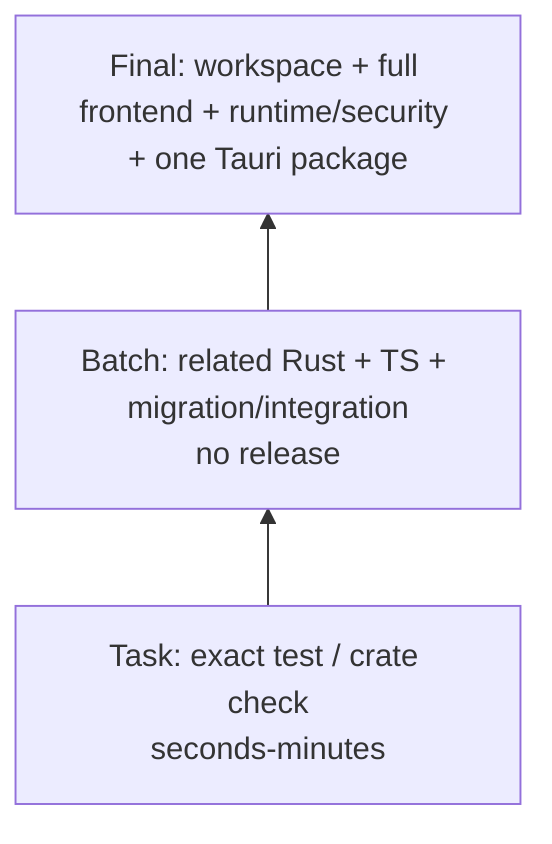

# Creative OS 构建缓存与存储复用方案

## 1. 当前基线（2026-08-04）

| 项目 | 实测 |
|---|---:|
| 可用磁盘 | 约 34 GiB（卷使用率 83%） |
| `node_modules` | 1.0 GiB |
| `.next` | 882 MiB |
| `target` | 15 GiB，最近仍在使用 |
| `.cargo-target-shared` | 7.8 GiB，历史 Agent Core 缓存 |
| `~/.cargo/registry` | 1.3 GiB |
| `~/.npm` | 4.7 GiB |
| Worktree | 主工作区 + 1 个 Agent Runtime 审计 worktree |
| Docker/sccache/ccache | 当前 PATH 均未找到 |
| Toolchain | Rust 1.96.0；Node 22.23.2；npm 10.9.8；package-lock 存在 |

磁盘风险为**高**：两个 Rust缓存已约22.8GiB。实施不得创建第三套target，也不得无授权删除任一现有缓存。

## 2. 单一工作区与分支

- 默认所有 Batch 在一个唯一的 Creative OS 集成分支、主工作区顺序执行。
- 实施开始前检查 `git worktree list --porcelain`。当前审计 worktree 未由其 owner 安全移除前，禁止新建辅助worktree。
- 上限：含主工作区总计2个；辅助worktree合并后立即由owner确认干净再删除。
- 禁止clone/copy目录、复制node_modules/target/用户数据。辅助worktree只做Rust-only解耦任务。

## 3. Cargo策略

统一环境：

```bash
export CARGO_TARGET_DIR="/Users/ldh/Downloads/project/AiNative/Natives/target"
export CARGO_BUILD_JOBS=2
export CARGO_INCREMENTAL=0
export RUST_TEST_THREADS=2
```

选择主 `target` 是因为它是当前最新、最大且默认命令已复用的缓存；`.cargo-target-shared` 保留只读，避免再次编译第三份。所有worktree也指向同一绝对路径。

- 同时只允许一个Cargo进程；共享target能复用但并发只会锁等待和增大峰值。
- Task级只 `cargo check -p natives` 或精准test；Batch级相关crate；workspace check/test仅必要批次和Final。
- Debug贯穿Task/Batch。Release/Tauri仅Final一次，仍使用同一target的release子目录并先确认至少15GiB可用。
- 不自行安装sccache/ccache，不修改全局Rust环境。
- 禁止 `cargo clean`。若证实单个artifact损坏，先记录错误/大小/工具链并请求用户授权；优先隔离具体子目录，不全盘删。

## 4. Node/Next策略

项目使用npm和`package-lock.json`，不得切pnpm/yarn。

依赖检查：

```bash
test -d node_modules
npm ls --depth=0
git diff -- package.json package-lock.json
```

首次安装仅在依赖缺失时：`npm ci`。锁文件/依赖被当前Batch有意修改时，由该Batch唯一一次运行 `npm install` 并审查lock diff；普通Batch不安装。

- 前端任务只在主工作区，复用现有node_modules；辅助worktree不得安装/复制/symlink依赖，避免隐藏真实路径问题。
- `.next`仅主工作区串行复用。禁止并发`next build`、`perf:check`、typecheck写入共享`.next/types`；审计已实际观察到并发竞争。
- Task级运行特定tsx test/typecheck（必要时）；Batch末才lint/相关tests；需要静态export的跨层Batch才build。
- 禁止 `rm -rf .next node_modules`。Next正常build自行更新cache；中间`out/.app/.dmg`不生成。

## 5. Docker缓存与资源命名

当前环境无docker executable，因此任何Docker Batch只有在独立、受控、具Docker Desktop的验证环境才能通过门禁。

- 复用已有基础/测试镜像和BuildKit cache；固定fixture tag：`natives-creative-test:<fixture-version>`，不得每次随机tag。
- 容器：`natives-creative-test-<batch>-<runid>`；Compose project：`natives-creative-test-<batch>-<runid>`；network/volume同前缀。
- label至少 `ai.natives.test=true`、`ai.natives.test.run=<runid>`、`ai.natives.test.batch=<batch>`。
- 结束只按本次run id删除明确创建的container/network/temp volume；默认保留image/build cache供Final复用。
- 永不执行 `docker system prune`、`image prune -a`、`volume prune`、无scope stop/down；不使用 `down -v` 除非fixture显式拥有且测试要求。
- Docker context必须有`.dockerignore`排除node_modules、.next、target、.git、报告、包、用户数据和日志。Fixture必须小，不拉大型真实应用。

## 6. Fixture与用户数据

- SQLite：空库 + 每个历史版本的最小脱敏fixture；每份目标<10MiB，总计<100MiB。
- Runtime：静态HTML、最小Node HTTP、最小Compose、Python stdlib HTTP、小型测试binary；不复制完整用户项目。
- Browser：专用测试origin/profile/temp dir；不读写真实登录数据。
- 禁止复制`~/.natives`、生产DB、Docker volume、用户project、日志目录。
- 所有fixture资源含run id并在postcondition检查；失败时保留最小诊断日志，禁止无界dump。

## 7. 磁盘监控

Batch前后统一记录：

```bash
df -h .
du -sh node_modules .next target .cargo-target-shared 2>/dev/null || true
du -sh "$HOME/.cargo/registry" "$HOME/.cargo/git" "$HOME/.npm" 2>/dev/null || true
git worktree list --porcelain
docker system df 2>/dev/null || true
```

阈值：

- 可用空间<20GiB：停止Release/Docker build与新worktree，只做读/小型精准test并报告。
- 单Batch target增长>3GiB、`.next`增长>1GiB、fixture/log增长>500MiB或总增长无法解释：停止下一Batch，定位crate/profile/context/log。
- 可用空间<12GiB：停止所有非必要构建；不得自行清理，向用户提交目录级证据和可恢复清理建议。

Batch报告记录开始/结束数值、delta、运行过的重型命令、遗留test resources。

## 8. 测试分层与缓存



- Cargo/Next/Docker重型命令错峰；没有两个Agent同时写共享cache。
- Final优先复用各Batch已经构建的fixture image和debug artifacts；只生成一次release package。
- 测试失败不通过无条件重装/清cache“修复”；先精准复跑和判断代码、环境、缓存。

## 9. 绝对禁止

`cargo clean`；`rm -rf target/.cargo-target-shared/node_modules/.next`；全局Docker prune；每Batch npm ci/install；每worktree target/node_modules；随机大镜像tag；完整仓库复制；真实用户数据fixture；每Batch `.app/.dmg`；无owner清理他人worktree/branch/cache。
