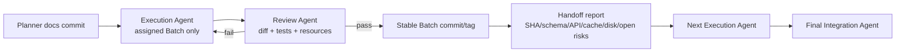

# Creative OS 执行矩阵

> 起始规则：每个 Batch 从前一 Batch 的 stable commit 开始；表中的“并行”仅表示文件/语义允许，仍受最多一个辅助 worktree、Cargo/Next 不并发约束。

## Batch 与 Task

| Batch | Task | 依赖 | 主要模块/高冲突文件 | 执行角色 | 可并行 | 定向测试 | 验收摘要 | 回滚 |
|---|---|---|---|---|---|---|---|---|
| B1 Registry | CR-101 identity resolver | docs commit | commands/adapters/runtime_store/db | Rust+DB | 否 | cross-source/browser identity | read不增行、无串源 | revert code；保留row审计 |
| B1 | CR-102 active CAS | CR-101 | `db.rs`,`runtime_store.rs`,stores | DB+Rust | 否 | two-connection CAS/migrations | 单active、0-row conflict | 回binary；不drop约束数据 |
| B1 | CR-103 profile upgrader | CR-102 | model/plan/db/runtime_store | Rust | 否 | v8–v14 plan fixtures | 旧plan可读、Compose分类正确 | 旧reader |
| B2 Operation | CR-201 journal/API/event | B1 | db/model/service/commands/TS DTO | Rust+Frontend | 否 | phase/crash/redaction | 所有mutation可追溯 | stop writer, keep table |
| B2 | CR-202 app lock/semaphore | CR-201 | service/commands/lib | Rust | 有限：可与CR-203 tests | cross-app timing/races | A不阻塞B、同app排他 | semaphore=1 fallback |
| B2 | CR-203 Renderer projection | CR-201/202 | hook/Workshop/creative UI | Frontend | 有限 | hook/event-gap/component | UI不假绿 | old derived busy flag |
| B3 Runtime | CR-301 owner/log/task ids | B2 | local runtime/logs/docker/adapters/store | Runtime | 否 | two instances/late events | live registry全runtime-id | dual-read old logs |
| B3 | CR-302 stop/restart/reconcile | CR-301 | lifecycle/runtime/docker/lib | Runtime+Test | 否 | TERM/PID/Compose/crash | 未释放不stopped | disable auto action |
| B3 | CR-303 static/preview compensation | CR-302 | http/browser/commands/lifecycle | Rust+Tauri | 否 | HTTP revoke/WebView faults | old URL失效、三态一致 | active-only legacy redirect |
| B4 Embed | CR-401 WebView spike | B3 | fixture/ADR/browser test seam | Tauri+Security | 是：CR-402 | profile/OAuth/10-window | backend/profile go-no-go | remove seam/fixture |
| B4 | CR-402 HTTP/CSP/body | B3 | `http_server.rs` | Rust Security | 是：CR-401 | 413/chunked/slow/CSP | memory/thread有界 | tune quotas |
| B4 | CR-403 capability/nav regression | CR-401 | capabilities/browser builder | Security | 否 | malicious invoke/navigation | Embed无main能力 | revert label config |
| B5 Window | CR-501 schema/API/event | B4 | db/model/store/commands/adapter | DB+Rust | 否 | backfill/event/migration | Surface/Endpoint/Window真实 | legacy Preview reader |
| B5 | CR-502 WebView backend/registry | CR-501 | browser/window/lib/commands | Tauri | 否 | multiwindow/focus/close/restart | object↔row 1:1 | legacy backend flag |
| B5 | CR-503 Dock/task switcher | CR-502 | Workshop/creative/hook/i18n | Frontend | 否 | UI/accessibility/event gap | 无假窗口 | old Browser panel flag |
| B6 Profile | CR-601 profile lifecycle | B5 | db/window/browser/settings UI | Tauri | 否 | isolate/persist/clear | 声明与证据一致 | legacy shared profile |
| B6 | CR-602 OAuth surface | CR-601 | window/security/commands/UI | Security+Tauri | 有限：CR-603 after types | allowlist/state/callback | 普通child不扩权 | disable OAuth surface |
| B6 | CR-603 file/new-window grants | CR-601 | grants/browser/dialog/UI | Tauri+Frontend | 有限 | deny/allow/path/large/cancel | 能力可审计 | disable individual grant |
| B7 Driver core | CR-701 service/probe/log | B5 | model/db/probe/log/frontend | Runtime | 否 | multi-service/degraded/logs | 服务/端点可观测 | single main compat |
| B7 | CR-702 existing drivers facade | CR-701 | adapters/local/docker/model/store | Senior Runtime | 否 | five-driver contract | 不退化、无双权威 | per-driver feature flag |
| B7 | CR-703 port lease/metrics | CR-702 | service/store/probe | Rust | 否 | port race/lease/release | 无TOCTOU假成功 | disable metrics, keep lease |
| B8 Managed | CR-801 Python | B7 | scan/plan/process/wizard | Runtime+Frontend | 否 | venv/path/health/cleanup | argv-only受管 | driver flag |
| B8 | CR-802 Binary | CR-801 | scan/plan/process/wizard/security | Runtime+Security | 否 | hash/symlink/TERM | 变更重批、资源释放 | driver flag |
| B9 Non-owned | CR-901 Attached local | B7 | profile/driver/registry/UI | Rust+Frontend | 有限 after common contract | disappear/recover/delete | 无stop外部资源 | driver flag |
| B9 | CR-902 Remote | B6/CR-901 contract | driver/origin/window/profile/UI | Security+Tauri | 有限 | capability/redirect/offline | Remote无Tauri能力 | driver flag |
| B10 Agent | CR-1001 proposal/Host gate | B6/B8/B9 | protocol/Gateway/Daemon/Host | Protocol+Rust | 否 | advert/handler/policy | Agent不能越权注册 | disable proposal tool |
| B10 | CR-1002 result→runtime→window | CR-1001 | Assistant/Creative/adapter/i18n | Frontend+Integration | 有限 after protocol | static/node/python/attached | ID贯穿、失败保proposal | result-card flag |
| B10 | CR-1003 Renderer convergence E2E | CR-1002 | Workshop/controllers/tests | Senior Frontend | 否 | full Creative frontend/E2E | 无重复入口/假状态 | revert extraction commit |

## 高冲突文件所有权

| 文件/域 | 触及 Batch | 规则 |
|---|---|---|
| `src-tauri/src/db.rs` | B1/B2/B5/B6/B7 | 每批只有一个 migration owner；版本只追加；后批从 stable SHA开始 |
| `runtime_store.rs` | B1/B3/B5/B7 | 严格串行；禁止并行重写状态机 |
| `adapters/mod.rs` | B1/B3/B7 | 严格串行；B7才引入driver facade |
| `local/runtime.rs`,`local/lifecycle.rs` | B3/B7/B8 | 同一Runtime Agent连续执行优先 |
| `commands/creative_app.rs` | B1/B2/B3/B5/B10 | 每批集成Agent独占 |
| `browser.rs`/window coordinator | B3–B6/B9 | B4 ADR先于B5实现；同批只一个WebView Agent |
| `http_server.rs` | B3/B4 | B3完成token route后，B4再做body/CSP |
| `WorkshopPage.tsx` | B2/B3/B5/B8/B9/B10 | 前端任务主工作区串行；按真实controller逐步抽离 |
| `model.rs`/TS DTO/i18n | 多批 | 先公共类型commit，再消费者；中英文同commit |

## 可安全并行组

1. B4 CR-401（独立WebView fixture/ADR）与 CR-402（HTTP server）：文件和状态权威分离；只允许一个辅助worktree，Cargo测试错峰。
2. B6 CR-602 与 CR-603：仅在CR-601及公共grant类型合并后，分别OAuth与文件能力；window coordinator最终由同一集成Agent合并。
3. B9 CR-901 与CR-902 driver实现：仅在non-owning contract落地后分文件；Remote仍等待B6。
4. B10 CR-1001合并协议后，Host validator与纯Renderer result card可并行；前端必须主工作区，因此实践中并行收益有限。

其余默认串行。并行收益小于缓存锁等待/冲突时立即退回串行。

## Agent 交接流程

每次交接必须含：base/final SHA、实际文件、migration、API、feature flags、测试命令/exit code、失败项、资源清理、磁盘前后、下一批禁止假设。
