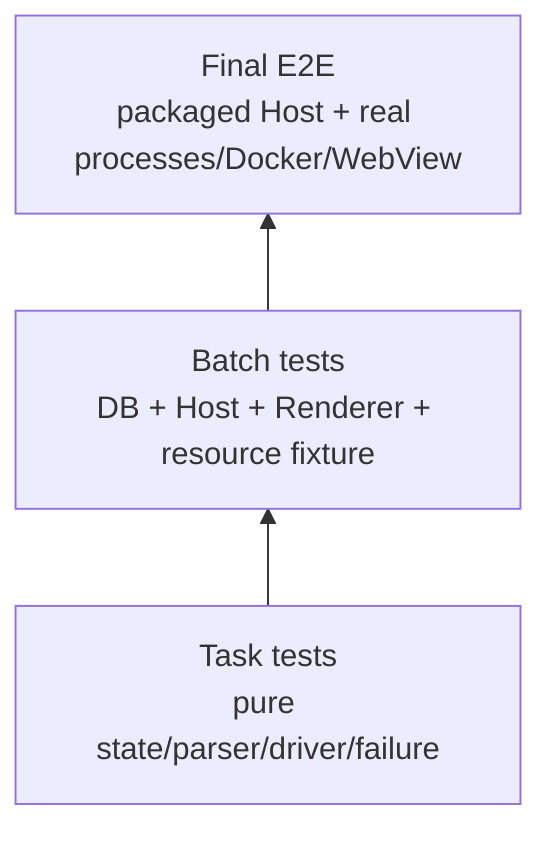

# Creative OS 最终整体集成测试计划

> 此阶段只验证 release-candidate，不开发新功能。已知当前环境无 Docker；没有具备 Docker/Tauri GUI 的受控环境时，相关条目必须标 BLOCKED，不能用 mock 冒充通过。

## 1. 进入条件与环境

- B1–B10 全部 stable commit/报告/门禁通过；工作树干净；无未合并feature flag分支。
- macOS目标版本、Tauri/WebKit版本、Rust/Node/npm、Docker Desktop版本记录。
- 使用唯一主worktree、主`target`、主node_modules；可用磁盘≥20GiB，正式Tauri build前建议≥15GiB额外余量。
- 测试DB/项目/profile/Docker均使用run-id fixture；不得读取真实`~/.natives`或用户登录数据。
- 先记录进程/端口/容器/window/磁盘基线，失败仍执行scope cleanup与postcheck。

## 2. 测试金字塔



Final不重复每个排列组合；复用Task/Batch证据，只补跨Batch生产链、真实资源和打包差异。

## 3. 静态与全仓门禁

串行执行并保存exit code：

```bash
rtk npm run typecheck
rtk npm run lint
rtk npm run test
rtk npm run build
rtk npm run perf:check
rtk npm run protocol:check
rtk npm run verify:native-engine
rtk cargo fmt --check
rtk cargo check --workspace
rtk cargo clippy --workspace --all-targets -- -D warnings
rtk cargo test --workspace
```

`npm run build`与`perf:check`不得并行。现基线两个`agent-core PERSISTENCE_FAILED`必须由owner修复并在Final全绿，不能归咎Creative或忽略。禁止删除/弱化测试。

## 4. Fixture清单

| Fixture | 用途 | 体积/安全 |
|---|---|---|
| empty/v8/v11/v12/v13/v14 DB | migration | 脱敏、每份<10MiB |
| ghost/collision/duplicate-active DB | repair/CAS | 合成数据 |
| static SPA | static route/Window | vendored，无网络 |
| Node tiny HTTP+WS | process/health/log | 无依赖或锁定依赖 |
| Compose 2-service | service/degraded/cleanup | 小基础镜像、loopback |
| Docker Run tiny HTTP | labels/port/cleanup | 复用同测试image |
| Python stdlib HTTP | Python driver | 不pip install |
| signed/unsigned tiny test binary | Binary policy | 项目构建fixture，不下载未知binary |
| attached fake server | non-owned语义 | 本地test process |
| remote fake origin/OAuth | origin/profile | 本地TLS/fake，不用真实账号 |
| malicious Embed page | capability/navigation/body | 无用户数据 |

## 5. 数据库迁移矩阵

覆盖：空库；各历史版逐级升级；直接升级；重复执行；事务中断后重启；非法JSON；幽灵identity；重复active；已有三源Application/Plan/Runtime/Preview；cleanup_failed/orphaned；未来plan version。

逐项断言：row count/ID/config不丢；source不串；一个active-like；backfill owner正确；old plan可读；Window/Profile/Service默认行不重复；失败不留下半schema；migration可安全重跑；用户无需重注册。

## 6. 生命周期与资源矩阵

对最终实际支持的每个managed driver执行：install/register→start→ready→open→logs→stop→restart→natural exit→delete→Host restart/reconcile。

故障场景：启动中stop；双start；health timeout；TERM ignore；port被抢；log reader失败；DB transition conflict；部分Compose up/down；Docker engine消失；Host SIGKILL；PID reuse；label冒充；volume/mount断开；cleanup retry。

每步核对：Application、Operation、RuntimeInstance、Service、Endpoint、Window、Profile、进程/PGID、container/project/network、port、URL、log/health task。只有所有owned resource postcondition通过才允许stopped/deleted。

## 7. 多应用并发

- A start时B start/stop/open；A长health不阻塞B stop。
- 同app重复start/start-stop/restart冲突；DB只有一active-like。
- 至少3个app同时运行、独立logs/endpoints/windows/profiles。
- 一个app crash/cleanup_failed不影响另一个；全局Docker/install semaphore可观测。
- watch/reconcile不饥饿；关闭一个window不停止其他runtime。

记录操作延迟、锁等待、task数、内存和端口；不只看UI按钮。

## 8. Window、Browser与Profile

打开两个app多个window；focus/minimize/restore/hide/resize/z-order/close；close后后台；stop后offline/close策略；crash状态；Host重启恢复策略；DB/WebView create/navigate/close故障。

Profile：两个app同origin cookie/localStorage/service worker隔离；持久重启；clear后不可恢复；legacy shared迁移；临时session销毁。OAuth：批准域、拒绝域、state mismatch、popup close/callback。Upload/download/clipboard/window.open：默认拒绝、一次/持久grant、路径逃逸、取消、大文件。

结论限定到实测OS/Tauri/WebKit；不得写“所有平台完全隔离”。

## 9. Driver验收

| Driver | 必测 |
|---|---|
| Workshop Static | sandbox/Bridge/发布热刷新不退化 |
| Local Static | instance URL，stop后旧URL 404/410 |
| Node | argv/cwd/env key/PGID/log/health/WS |
| Compose | 多service/health/project隔离/partial failure/no volume deletion |
| Docker Run | label/name/loopback port/stop/delete |
| Python | interpreter选择/缺环境/cleanup |
| Binary | canonical/hash/approval/替换/cleanup |
| Attached Local | probe/open；无stop/kill；delete仅记录 |
| Remote | origin/profile/window；无Tauri capability/stop |

只验收已经实施的driver；若某Batch按人工决策延期，产品/API必须明确不广告该能力。

## 10. 安全矩阵

- LaunchProfile：shell injection、executable/args混淆、cwd `..`/absolute/symlink escape、secret日志。
- Docker：privileged、host network、devices、docker socket、敏感bind、volume/image删除、label冒充。
- HTTP：Host/origin/traversal、encoded path、symlink、oversized/chunked/slow body、CSP。
- WebView：非法URL/data/file/tauri、自定义协议、Remote invoke、未批准redirect/OAuth/new-window。
- Runtime：PID reuse、错误PGID、其他app/container/project删除。
- Agent proposal：恶意shell/cwd/privileged/secret，绕过用户批准，直接SQLite/Docker/WebView。

所有拒绝测试还要断言零副作用、零secret、Operation有脱敏失败事实。

## 11. Agent生产链E2E

真实链：Renderer/Assistant→Host→UDS Daemon/Gateway→proposal→Host validator→用户批准→Application/Profile→Runtime→Endpoint→Window→Catalog/Dock。覆盖Static、Node、Python、Attached；拒绝/取消/Host失败；注册成功但启动失败可重试；ID从结果卡到DB/UI一致。正式Workshop发布仍只能由用户门禁。

## 12. 打包与安装（仅一次）

在其他测试全绿、空间足够后：

```bash
rtk npm run tauri:build
```

验证`.app/.dmg`、首次启动、旧版本升级、DB迁移、权限、HTTP server、selected WebView backend、profile data dir、Docker/Node/Python检测、sidecar、签名/安装。只保留最终交付产物；中间产物按已有项目策略处理，不`cargo clean`。

## 13. 性能、资源与磁盘

- 记录Daemon/Host idle与3 app运行内存、10window资源、event/operation延迟、health/log task数量。
- Progress/log/HTTP body有界；无listener/task/Child/container/port/window泄漏。
- 记录target/.next/node_modules/Docker system df/fixture/log前后；增长满足build策略阈值且可解释。

## 14. 通过标准

所有纳入P0关闭；P1达到Batch目标；三源/Workshop/旧DB不退化；一个active invariant；资源停止有证明；多窗/profile声明真实；Remote无能力；所有已广告driver通过；Agent不能绕Host；全仓命令全绿；Tauri package smoke通过；没有不受控target/node_modules/image/worktree；磁盘增长和遗留风险记录完整。

任何 BLOCKED/FAIL 都不能发布。环境缺Docker/Tauri GUI时最终状态是“等待环境验证”，不是PASS。
