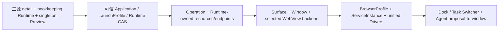

# Creative OS 分批实施总计划

> 计划基线：`deploy@9584c3c263c1e83b1066e4208e1ab2d678a9deeb`，2026-08-04。本文只编排开发，不代表任何 Batch 已实施。

## 1. 采用的事实材料

- `docs/audit/creative-os-code-map.md`
- `docs/audit/creative-os-issue-verification.md`
- `docs/audit/creative-os-target-architecture.md`
- `docs/audit/creative-os-upgrade-plan.md`
- `docs/audit/creative-os-verification-matrix.md`
- 权威约束：`docs/standards/`、ADR-0012/0013/0014/0016。

上述 5 份审计文件与本计划生成时均为工作区文档产物，尚未进入基线 commit；实施前必须先形成一个经用户确认的 docs-only commit。当前 Creative 核心源码相对审计 commit 无差异。已知基线：前端 756 tests 全绿，fmt/check/build/perf/protocol 通过；Creative Rust 有一个陈旧 schema 断言（期望 8、实际 14）；workspace 另有两个不属于 Creative 的 `agent-core PERSISTENCE_FAILED`。Docker executable 当前不可用。

## 2. 动态拆批结论

根据共同状态权威、数据库迁移、恢复语义、文件冲突和可回滚边界，形成 **10 个实施 Batch + 1 个最终集成阶段**。不是按 P0/P1 平均切割：前三批先建立 Registry→Operation→Runtime Owner 的因果链；Browser 先实验后建模；现有 driver 完成统一后才扩类型；Agent 闭环最后接入。

```mermaid
graph TD
  B1["B1 Registry 完整性"] --> B2["B2 Operation 与并发"]
  B2 --> B3["B3 Runtime Owner 与生命周期"]
  B3 --> B4["B4 Embed 安全与 WebView 决策"]
  B4 --> B5["B5 Surface / Window Shell"]
  B5 --> B6["B6 Browser Profile 与登录"]
  B5 --> B7["B7 Service / Driver 内核"]
  B7 --> B8["B8 Python / Binary"]
  B7 --> B9["B9 Attached / Remote"]
  B6 --> B10["B10 Agent 创建闭环"]
  B8 --> B10
  B9 --> B10
  B10 --> FI["Final Integration"]
```



### 领域演进



### 数据迁移顺序

```mermaid
sequenceDiagram
  participant V14 as Existing v14
  participant R as Registry migration
  participant O as Operation migration
  participant E as Endpoint/Window migration
  participant P as Profile/Service migration
  V14->>R: repair identity/backfill + active unique + plan schema
  R->>O: add operations; no destructive rewrite
  O->>E: add endpoints/surfaces/windows; legacy preview remains readable
  E->>P: add browser_profiles/services/leases
  P-->>P: driver-specific profile payloads are additive
  Note over R,P: 每次迁移同批包含 reader/writer/backfill/tests；禁止只落表不接生产
```

## 3. 全局不变量

1. 保留三源 detail、Workshop sandbox/Bridge、Agent draft/publish、现有 source id/config。
2. DB 是 Application/Operation/Runtime/Window 事实权威；Renderer 只投影事件/snapshot。
3. 一个 application 最多一个 active-like runtime；`cleanup_failed/orphaned` 在资源证明释放前也阻止新 start。
4. 每个 PID/PGID/container/project/port/log/health task/endpoint 都带 runtime id。
5. Close Window 与 Stop Runtime 分离；Stop 必须撤销 endpoint，Delete 必须证明 owned 资源和窗口处置。
6. Agent 只提交 versioned proposal；Host 校验和用户批准后才能注册/启动/开窗。
7. Workshop iframe 与 Embed 永不混用 capability；Remote 无 Tauri capability。
8. Migration additive、幂等、可从旧数据读取；任何无法证明的 active 资源置 orphaned，不自动杀或假 stopped。

## 4. Git、Agent 与构建总策略

- 实施前从最新 `origin/deploy` 创建唯一分支 `codex/creative-os-implementation-<YYYYMMDD-HHMMSS>-<id>`；不得直接在 deploy/main 开发，不复用或抢占其他 Agent 分支。
- 默认一个主工作区、一个长期集成分支，Batch 串行。每批由同一上下文的 Execution Agent 完成紧密 Task，再由 Review Agent 门禁。
- 同时最多 **2 个 worktree（含主工作区）**；当前已有审计 worktree，未由 owner 清理前禁止再建。辅助 worktree 仅允许 Rust-only、文件完全解耦的短任务。
- 所有 Cargo 命令显式使用 `/Users/ldh/Downloads/project/AiNative/Natives/target`；这是当前最新且已达 15 GiB 的缓存。历史 `.cargo-target-shared` 7.8 GiB 保留但不再写，也不得擅自删除。
- 辅助 worktree 不安装 Node 依赖；前端任务只在主工作区运行，复用 1.0 GiB `node_modules`。`.next` 仅由主工作区串行使用，禁止并发 `next build/perf:check`。
- `cargo clean`、删除 target/node_modules/.next、Docker prune、全局停止容器均禁止。Cargo 同时只运行一个进程，`CARGO_BUILD_JOBS=2 CARGO_INCREMENTAL=0`。

## 5. 通用 Batch 门禁

每批必须通过：diff 范围/secret/大文件检查；定向 unit+failure tests；相关 crate check/test；协议和 i18n 同步（如涉及）；新旧 DB/重复 migration；Workshop/Local/Docker legacy fixture；资源 postcondition；磁盘前后差；Batch 报告与 commit SHA。未过门禁不进入下一批。回滚只回滚本批 commit；additive migration 不删列/表，旧 reader 保留至少一个稳定发布周期。

# Batch 1：Registry 完整性与迁移基座

## 1. 本批目标

消除身份串源、双 active runtime 和静默状态冲突，形成后续 Operation/Owner 可依赖的数据库不变量。

## 2. 纳入本批的核查问题

#01、#06、#07、#34；同时修复 Compose backfill owner 分类和已知 schema test 陈旧断言。

## 3. 为什么这些任务必须放在同一批

它们共同修改 `db.rs/runtime_store.rs/adapters`，migration、resolver 和 CAS 任一单独上线都会留下不可运行中间态。

## 4. 前置条件

docs-only commit；脱敏 v8/v11/v12/v13/v14 小型 DB fixtures；确认是否存在幽灵 identity/重复 active 的只读统计。

## 5. 不在本批处理的内容

不改资源 owner、不做 Operation、Window、driver 扩展。

## 6. 任务清单

### Task CR-101：只读身份解析与幽灵行迁移

- 目标：Browser/read 路径不创建 identity；三源同 id 仍解析真实 source。
- 依据：#01 P0；前置依赖：无。
- 涉及模块：Host commands/adapters/store；预计文件：`commands/creative_app.rs`、`adapters/mod.rs`、`runtime_store.rs`、`db.rs`。
- 禁止修改：source detail 语义、用户项目、Workshop module id。
- 数据变化：只删除“无 source row、无 plan/runtime/preview 引用”的确认幽灵行；其余 quarantine/report。
- API 变化：Browser 优先接 application id，旧 source-id request 暂由 Host resolve。
- 实现步骤：失败 fixture→单 resolver→read/write API 分离→检测/backfill→兼容测试。
- 兼容策略：旧客户端/已注册 app 无需重注册。
- 单元/集成测试：跨 source collision、Browser show/close row count、真实三源 Catalog。
- 验收标准：任何 open/close/list 不新增 application；GitHub preview 绑定正确 id。
- 回滚方式：回滚代码；migration 只移除可证明幽灵行并先备份其 row JSON。
- 工作量：S；角色：Rust Backend + Database Agent。

### Task CR-102：Active Runtime/Plan DB CAS

- 目标：数据库保证单 active runtime/plan，所有迁移检查 affected rows。
- 依据：#06 P0/#07 P1；前置：CR-101。
- 文件：`db.rs`、`runtime_store.rs`、source stores、lifecycle matrix tests。
- 禁止修改：Runtime manager/resource cleanup。
- 数据变化：partial unique index、active plan invariant、必要 revision/expected status；重复 active 先 inspect/置 orphaned，禁止随意删除。
- API：typed conflict/not-found；旧错误字符串兼容映射一个版本。
- 实现：migration preflight→事务 CAS→统一 transition helper→两个 SQLite connection 并发测试。
- 验收：并发双 start 仅一个成功；0-row 不返回 Ok；migration 重跑幂等。
- 回滚：binary 可读新增索引/列；若约束影响旧数据，停止 migration并恢复 fixture，不 drop。
- 工作量：M；角色：Database Migration + Rust Backend Agent。

### Task CR-103：LaunchProfile v1 兼容升级器

- 目标：把 `startup_plans` 作为 versioned LaunchProfile 基座，修 Compose backfill owner。
- 依据：#34；前置：CR-102。
- 文件：`model.rs`、`runtime_store.rs`、`db.rs`、`local/plan.rs`。
- 禁止：提前加入 Python/Remote 字段大全。
- 数据/API：schema_version/driver_kind/ownership_mode 可空后 backfill；旧 JSON 读时升级，保存才写新版本。
- 测试：所有历史 plan fixture、unknown field、future version fail closed。
- 验收：旧 app summary/start plan 不变；Compose backfill 是 docker_compose。
- 回滚：保留旧 plan_json 原值和 reader。
- 工作量：M；角色：Rust Backend Agent。

## 7. Batch 内执行顺序

CR-101 → CR-102 → CR-103，严格串行。

## 8. 可并行与不可并行任务

不可并行，均触碰 `db.rs/runtime_store.rs` 和 migration version。

## 9. 构建产物复用方式

只用主 target；不安装 Node；cargo 不并发。

## 10. 测试命令

`cargo check -p natives`；`cargo test -p natives creative_app::runtime_store`；migration/adapter 精准测试；`npm run protocol:check`（若 wire error 变化）。

## 11. 磁盘增量检查

记录 target/fixtures 前后；fixtures 总量目标 <50 MiB。

## 12. Batch 完成定义

Registry invariants、旧 DB、三源 Catalog 全绿，无幽灵/重复 active。

## 13. Batch 交接内容

schema version、迁移报告、typed error、fixture 清单、commit SHA。

## 14. 进入下一 Batch 的门禁条件

CR-101~103 全部验收；陈旧 schema test 不再失败；用户数据无需重注册。

# Batch 2：Operation 事实与应用级并发

## 1. 本批目标

用最小 Operation journal 和 per-application lock 替换全局串行/前端 boolean 推断。

## 2. 纳入本批的核查问题

#04、#25、#31，并为 #02/#08/#10 提供补偿与恢复载体。

## 3. 为什么这些任务必须放在同一批

Operation schema、mutation API、事件和 Renderer busy 必须同批切换；只改锁会丢恢复事实，只加表会成为装饰。

## 4. 前置条件

Batch 1 stable commit。

## 5. 不在本批处理的内容

本批不重写 driver、不创建 Window。

## 6. 任务清单

### Task CR-201：Operation journal 与事件契约

- 目标：install/start/stop/restart/delete 有 operation id/phase/status/compensation。
- 依据：#25；前置：Batch 1。
- 文件：`db.rs`、`model.rs`、`service.rs`、commands、`src/lib/creative-app.ts`、tauri adapter、i18n。
- 禁止：通用工作流/DAG、持久化 secret/raw env。
- 数据：additive operations 表，带 redacted input/error/actor/timestamps。
- API：mutation 返回 operation id + current projection；旧 summary response 兼容一个版本。
- 实现：schema/store→phase helper→事件/snapshot→frontend DTO。
- 测试：每类 operation 成功/失败/崩溃 phase，脱敏。
- 验收：每个外部副作用可追到 operation；partial effect 有 compensating/failed。
- 回滚：停止新 writer但保留表/reader。
- 工作量：L；角色：Rust Backend + Frontend Agent（同一主工作区串行）。

### Task CR-202：Application-keyed lock 与全局资源限流

- 目标：不同 app 并行，同 app 排他；install/Docker 有有界 semaphore。
- 依据：#04；前置：CR-201。
- 文件：`service.rs`、commands、`lib.rs` watchdog、operation store。
- 禁止：按 Renderer id 加锁、用锁替代 DB CAS。
- API/数据：无新表；operation 记录 wait/running phase。
- 测试：A health 时 B stop；同 app start/stop race；watchdog starvation。
- 验收：跨 app 不被长 health 阻塞；同 app invariant 不破。
- 回滚：可临时降为全局 semaphore=1，但 DB CAS/Operation 不回滚。
- 工作量：M；角色：Rust Backend Agent。

### Task CR-203：Renderer Operation 投影

- 目标：busy/error/retry 来自 operation snapshot/event，Browser fire-and-forget 错误可见。
- 依据：#31；前置：CR-201/202。
- 文件：`useCreativeAppCatalog.ts`、`WorkshopPage.tsx`、Creative components、i18n。
- 禁止：在 Renderer 合成成功、重写后端状态。
- API：subscribe/snapshot；兼容旧 busyIds 作为 derived adapter。
- 测试：event gap reload、两 app并发、失败重试、unmount。
- 验收：UI与 operation/runtime事实一致。
- 回滚：feature flag 使用旧 busy projection，Host journal 保留。
- 工作量：M；角色：Frontend Agent。

## 7. Batch 内执行顺序

CR-201 → CR-202 → CR-203。

## 8. 可并行与不可并行任务

协议/DTO 合并后 CR-203 UI tests 可与 CR-202 的 Rust failure tests 并行；前端只能主工作区，故默认仍串行。

## 9. 构建产物复用方式

复用主 target/node_modules；不跑 Next build 直到批末。

## 10. 测试命令

Task运行相关Rust和Creative hook/component tests；Batch运行`cargo test -p natives creative_app`、`npm run typecheck`、`npm run lint`、`npm run test`及protocol check。

## 11. 磁盘增量检查

记录target/.next前后；禁止并发Next，operation fault日志必须有界。

## 12. Batch 完成定义

A/B跨app并发有证据，operation可恢复，Renderer不假绿。

## 13. Batch 交接内容

operation schema/API/event、锁语义、性能数据、feature flag和commit SHA。

## 14. 进入下一 Batch 的门禁条件

所有mutation已接journal且无旧路径绕过；三源旧操作回归通过。

# Batch 3：Runtime Owner 与可信生命周期

## 1. 本批目标

把 RuntimeInstance 从记账行提升为 PID/Docker/port/log/task/endpoint 的唯一 owner，并关闭 stop/restart/static/preview/crash P0。

## 2. 纳入本批的核查问题

#02、#03、#05、#08、#09、#10、#22。

## 3. 为什么这些任务必须放在同一批

资源 key、停止 postcondition、日志和恢复必须原子演进；只换 id 会让旧 task 串线，只改 stop 会继续依赖假 owner。

## 4. 前置条件

Batch 2 Operation 与 per-app lock。

## 5. 不在本批处理的内容

不做多窗口/Profile/新 driver。

## 6. 任务清单

### Task CR-301：Runtime-owned registry、cancel、logs

- 目标：所有 local/Docker resource event 和 registry 以 runtime id 为主键。
- 文件：`local/runtime.rs`、`local/logs.rs`、docker/adapters、`runtime_store.rs`、model/commands/frontend logs。
- 数据：owner_identity/resource ledger 完整化；旧 app 日志只读聚合。
- API：logs(runtime_id,cursor)，event 带 runtime id。
- 测试：连续两次运行、晚到 health/log、task cleanup、不同 app。
- 验收：没有 app-id keyed live resource map。
- 回滚：dual-read旧日志，禁止长期 dual-write。
- 工作量：L；角色：Rust Runtime Agent。

### Task CR-302：Stop/Restart/Reconcile 证明链

- 目标：cancel→TERM→timeout→KILL→wait/reap→port/container verify→stopped；失败 cleanup_failed/orphaned 且阻断 restart。
- 文件：local lifecycle/runtime、docker/install/adapters、lib watchdog、runtime store。
- 数据/API：resource identity（PID start time/executable/PGID；Docker labels/project/file）；typed CleanupReport。
- 测试：TERM ignore、PID reuse、Compose ps error、Docker restart、Host SIGKILL/reconcile、重复 stop。
- 验收：未验证释放绝不 stopped；未知资源不被杀。
- 回滚：关闭 auto-reconcile action，但不回旧假 stopped。
- 工作量：L；角色：Rust Runtime + Test Agent。

### Task CR-303：Static endpoint revoke 与 Preview 补偿

- 目标：static URL instance-scoped/revocable；WebView/DB show/close 四类失败一致。
- 文件：`http_server.rs`、commands/browser/runtime store/local lifecycle、Workshop Browser UI。
- 数据/API：短期 endpoint ledger/token；show/close typed outcome；正式 Endpoint 表在 Batch 5 backfill。
- 测试：stop 前200/后404或410；DB/create/navigate/close failure matrix；delete窗口。
- 验收：旧 URL停止后不可用；DB/WebView/BrowserState不分叉。
- 回滚：保持 token route与legacy URL read-only redirect仅在active时；不可恢复永久 URL。
- 工作量：M；角色：Rust Backend + Tauri WebView Agent。

## 7. Batch 内执行顺序

CR-301 → CR-302 → CR-303。

## 8. 可并行与不可并行任务

不可并行，三者共享runtime/lifecycle/http/browser的资源事实。

## 9. 构建产物复用方式

仅主工作区和主target；不安装依赖、不做release。

## 10. 测试命令

Task精准测试；批末Rust Creative suite、local HTTP tests和前端Browser tests；Docker可用时运行受控fixture。

## 11. 磁盘增量检查

重点监控日志/fixture；进程和容器fixture必须按test id清理。

## 12. Batch 完成定义

runtime id真实拥有全部资源，stop/restart/static/preview/crash语义通过。

## 13. Batch 交接内容

资源前中后证据、reconcile matrix、legacy日志策略、API和commit SHA。

## 14. 进入下一 Batch 的门禁条件

六个P0全部关闭；未验证释放不再写stopped，才能进入视觉/driver扩展。

# Batch 4：Embed 安全硬化与 WebView 技术决策

## 1. 本批目标

修复 HTTP/Embed 边界，并以真实 macOS/Tauri 实验决定多 Child 或 WebviewWindow；不猜 Cookie。

## 2. 纳入问题

#13/#14/#15 的验证前置，#26/#28，#27/#29 回归。

## 3. 同批原因

Window/Profile schema 必须建立在平台证据上；HTTP、navigation、capability是同一 Embed trust boundary。

## 4. 前置条件

Batch 3 完成；准备脱敏 WebView/OAuth/下载 fixture，并记录实际 OS、Tauri 与 WebKit 版本。

## 5. 不在本批处理的内容

不交付 Dock/Profile，不放宽普通 child 公网导航，不把单平台实验结论外推成跨平台保证。

## 6. 任务清单

### Task CR-401：多 WebView/Profile 平台 spike

- 目标：测多 labels/windows、cookie/localStorage/service worker、重启、清理、OAuth popup/callback、download/upload、10窗资源。
- 文件：小型 fixture/tests/ADR；生产 `browser.rs` 仅为可测试 seam 时最小改动。
- 禁止：拿实验结论冒充跨平台保证、复制真实 browser data。
- 验收：记录 OS/Tauri/WebKit版本、数据、A多Child/B WebviewWindow go/no-go；失败也算有效结论。
- 回滚：删除 fixture/seam；工作量 M；角色：Tauri WebView + Security Agent。

### Task CR-402：HTTP body/concurrency/CSP

- 目标：端点级 limit、413、bounded workers；Workshop/Local/Remote CSP分域。
- 文件：`http_server.rs`、security tests。
- 禁止：统一放宽 CSP、为附件保留万能64MiB JSON。
- 测试：Content-Length/chunked/slow clients、traversal/Host/origin、Vite fixture兼容。
- 验收：超限不分配完整body、线程/内存有界。
- 回滚：端点配额可调，不回无界线程/截断语义。
- 工作量 M；角色：Rust Security Agent。

### Task CR-403：Embed capability/navigation 回归门

- 目标：动态 labels 仍无 main capability；new-window/remote navigation fail closed。
- 文件：capabilities、browser builder、Tauri security test。
- 验收：恶意页面 invoke拒绝；普通 child只到批准 origin。
- 工作量 S；角色：Security Review Agent。

## 7. Batch 内执行顺序

CR-401 与 CR-402 可同时开始；CR-403 等 CR-401 固化 label/backend 方案后执行。

## 8. 可并行与不可并行任务

CR-401 与 CR-402 文件边界独立，可安全并行；CR-403 依赖 CR-401，不能提前。若用辅助 worktree，仅允许 CR-402 Rust-only，Cargo 测试仍错峰。

## 9. 构建产物复用方式

复用主 target；fixture/ADR 不建第二套依赖；WebView 实验与 HTTP Rust 测试串行占用构建资源。

## 10. 测试命令

定向运行 HTTP security tests、Tauri capability/navigation tests 与 WebView fixture；批末运行 Creative Rust suite、protocol check 和相关前端测试。

## 11. 磁盘增量检查

fixture 总增量 <200 MiB；记录 WebView data store 前后大小并只清理带测试标识的目录。

## 12. Batch 完成定义

HTTP 有界、Embed fail closed，且形成有实测数据的 backend/profile ADR。

## 13. Batch 交接内容

ADR、平台版本、原始测试数据、security regression matrix、commit SHA。

## 14. 进入下一 Batch 的门禁条件

无明确 backend/profile go/no-go 结论则 Batch 5/6 blocked；安全回归必须全绿。

# Batch 5：Surface、Endpoint 与多窗口 Shell

## 1. 本批目标

建立 ApplicationSurface/RuntimeEndpoint/WindowInstance，并用 Batch4选定 backend交付真实多窗、Dock、focus/minimize/restore/background。

## 2. 纳入本批的核查问题

#09/#11/#12/#30/#31/#32/#33。

## 3. 为什么这些任务必须放在同一批

表、Tauri registry、IPC事件和Renderer Shell必须闭环；禁止只建Window表或只做动画。

## 4. 前置条件

Batch 4 ADR 已批准，所选 backend/profile 结论可实现。

## 5. 不在本批处理的内容

只自动 backfill main surface；不做 BrowserProfile/OAuth，不改变 Runtime stop 语义。

## 6. 任务清单

### Task CR-501：Surface/Endpoint/Window schema与API

- 文件：db/model/store/commands/tauri adapter/protocol types。
- 数据：三张 additive表；旧 open_url→active main endpoint，旧 Preview兼容读；live label/default surface唯一。
- API：surface.list、window.open/focus/minimize/restore/close、snapshot/events。
- 测试：旧DB backfill、重复migration、event ack/failure。
- 验收：同app多window和remote无runtime关系可表达。
- 工作量 L；角色：Database + Rust Backend Agent。

### Task CR-502：选定 WebView backend 与 Window registry

- 文件：`browser.rs`及拆分window模块、commands/lib shutdown/reconcile。
- 禁止：单例state作为新权威、给Embed capability。
- 测试：两app同时显示、尺寸/focus/close失败、Host restart policy。
- 验收：每个Tauri对象对应WindowInstance；close≠stop。
- 工作量 L；角色：Tauri WebView Agent。

### Task CR-503：Dock/Task Switcher与Renderer拆缝

- 文件：Creative components、WorkshopPage、Catalog hook、i18n/styles。
- 目标：从window/runtime/operation投影Dock；抽出WindowShell controller，不做空包装。
- 测试：键盘/ARIA/小窗/深色/双app/后台/事件gap。
- 验收：无假窗口；Workshop/创作/导入能力保留。
- 工作量 L；角色：Frontend Agent。

## 7. Batch 内执行顺序

CR-501 → CR-502 → CR-503；公共类型先合并。

## 8. 可并行与不可并行任务

不可并行：schema/API、Host registry、Renderer shell 是同一状态链，提前并行会制造临时双权威。

## 9. 构建产物复用方式

复用主 Node、`.next` 与 target；批末才运行一次 Next build。

## 10. 测试命令

定向 migration/API/window registry/UI tests；批末 typecheck、lint、test、protocol check 与相关 Rust tests。

## 11. 磁盘增量检查

记录 DB fixtures、`.next`、target 前后增量；不得复制 WebView profile。

## 12. Batch 完成定义

Surface/Endpoint/WindowInstance 成为真实权威，多窗口、后台与旧 single preview 兼容通过。

## 13. Batch 交接内容

backend ADR、window 状态机、migration/API、UX 录屏或自动化证据、commit SHA。

## 14. 进入下一 Batch 的门禁条件

多窗口和后台语义必须真实，旧 single preview 可读且无 Renderer 假状态。

# Batch 6：BrowserProfile、登录与文件能力

## 1. 本批目标

按Batch4证据交付可解释的会话隔离/持久/清除，以及受控OAuth、upload/download/new-window/clipboard。

## 2. 纳入本批的核查问题

#13/#14/#15。

## 3. 为什么这些任务必须放在同一批

Profile 生命周期、OAuth 与文件/新窗口权限共享同一 WebView data store 和 grant 边界，拆开会形成不可解释的半隔离状态。

## 4. 前置条件

Batch 5 完成，Batch 4 已给出可执行的 profile 隔离结论。

## 5. 不在本批处理的内容

不扩展 RuntimeDriver，不复制真实登录数据；平台不能证明 per-profile 隔离时必须选择更强边界或明确 shared profile，不得标绿。

## 6. 任务清单

### Task CR-601：BrowserProfile生命周期

- 文件：db/browser/window coordinator/commands/settings UI。
- 数据：profile元数据和platform_store_key；绝不存cookie内容。
- API：create/list/assign/clear；clear有operation结果。
- 测试：两app隔离、重启持久、清理完成/失败、legacy shared profile迁移。
- 验收：产品文案与实验证据一致。
- 工作量 L；角色：Tauri WebView Agent。

### Task CR-602：OAuth临时Surface

- 目标：per-app/domain allowlist、临时窗口、loopback callback correlation。
- 禁止：放宽普通child到任意https。
- 测试：批准/拒绝域、state mismatch、popup close、cookie transfer按平台策略。
- 工作量 M；角色：Security + WebView Agent。

### Task CR-603：上传下载剪贴板与window.open权限

- 数据/API：per-app grants和download operation；用户选择路径。
- 测试：默认拒绝、一次/持久授权、路径逃逸、大文件、取消。
- 工作量 M；角色：Tauri + Frontend Agent。

## 7. Batch 内执行顺序

CR-601 → CR-602 / CR-603。

## 8. 可并行与不可并行任务

CR-602 与 CR-603 可在公共 grant 类型合并后有限并行；两者都碰 window coordinator 时默认串行。

## 9. 构建产物复用方式

仅复用主 target、Node 与选定 WebView fixture；不复制真实 profile。

## 10. 测试命令

运行 profile lifecycle、OAuth、grant/path security、window tests；批末运行相关 Rust/Frontend/protocol checks。

## 11. 磁盘增量检查

fixture profile 总量 <100 MiB；验证 clear 后目录与元数据均符合策略。

## 12. Batch 完成定义

隔离/持久/清除语义可证明，OAuth、上传下载、剪贴板和 window.open 均默认拒绝且可审计。

## 13. Batch 交接内容

平台隔离证据、grant matrix、profile migration、失败路径证据、commit SHA。

## 14. 进入下一 Batch 的门禁条件

clear 可证明、OAuth 不扩权、文件能力可审计；否则不得进入 Agent 闭环。

# Batch 7：Service 模型与现有 Driver 内核

## 1. 本批目标

在不扩类型前，把现有 Workshop Static/Local Static/Node/Compose/Run 迁到最小RuntimeDriver、ServiceInstance、typed health/log/endpoint与port lease。

## 2. 纳入本批的核查问题

#16/#17的基础、#18/#21/#22/#23/#24/#34。

## 3. 为什么这些任务必须放在同一批

多服务模型、driver contract和endpoint/health/log必须由现有driver证明；先加新driver会复制旧缺陷。

## 4. 前置条件

Batch 5 完成；可与 Batch 6 形成分支依赖，但在同一工作区仍按顺序执行。

## 5. 不在本批处理的内容

不加 Python/Binary/Remote driver，不保存高频 metrics 历史。

## 6. 任务清单

### Task CR-701：ServiceInstance与typed Probe/Logs

- 数据：service_instances，endpoint/service relation；旧单服务→main。
- API：service/endpoint list、log cursor/filter、readiness/liveness events。
- 测试：多服务Compose、optional degraded、required unhealthy、redirect限域、日志隔离。
- 工作量 L；角色：Rust Runtime Agent。

### Task CR-702：最小RuntimeDriver与现有五类迁移

- 文件：adapters/model/local/docker/runtime store；新增driver模块限真实实现。
- 契约：inspect/start/probe/stop/reconcile；prepare/log stream保持独立helper。
- 兼容：旧plan转v2内存，旧commands走facade；禁止双权威。
- 测试：driver contract matrix、start/stop/crash，现有五类不退化。
- 工作量 XL（按driver串行commit）；角色：Senior Rust Runtime Agent。

### Task CR-703：Port lease与按需资源快照

- 数据：operation-scoped短租约；不先存高频metrics历史。
- 测试：并发抢端口、失败释放、CPU/memory snapshot不可用降级。
- 工作量 M；角色：Rust Backend Agent。

## 7. Batch 内执行顺序

CR-701 → CR-702 → CR-703。

## 8. 可并行与不可并行任务

不可并行；高冲突 runtime/model/store 文件与五类 driver 迁移必须维持单一权威。

## 9. 构建产物复用方式

使用主 target；Docker fixture 复用已有镜像，禁止另建 Cargo target 或全局 prune。

## 10. 测试命令

五 driver contract matrix、migration、Rust/Frontend 相关测试；Docker fixture 仅在 Docker 可用环境运行。

## 11. 磁盘增量检查

记录 target、Docker fixture/image、日志前后增量；只清理带 test id 的资源。

## 12. Batch 完成定义

现有五类运行方式全部经统一 contract 通过 start/probe/stop/reconcile，typed service/endpoint/log 可用。

## 13. Batch 交接内容

driver 契约、旧 plan 命中率、Docker 证据、资源/性能数据、commit SHA。

## 14. 进入下一 Batch 的门禁条件

Docker fixture 与五 driver matrix 必须在具备 Docker 的环境全绿；当前无 Docker 环境不能宣告本批完成。

# Batch 8：Python 与 Binary 受管进程 Driver

## 1. 本批目标

交付 Python 与 Binary 两个 managed process driver。

## 2. 纳入本批的核查问题

#16/#19。

## 3. 为什么这些任务必须放在同一批

二者共享 ProcessDriver、进程组回收、端口、日志与导入向导；共同实现可避免复制安全和生命周期缺陷。

## 4. 前置条件

Batch 7 完成，ProcessDriver contract 已由现有 driver 验证。

## 5. 不在本批处理的内容

只支持明确批准的 WebUI 进程，不支持任意 shell/daemon 大全，不自动运行下载来的 binary。

## 6. 任务清单

### Task CR-801：Python WebUI Driver

- 文件：scanner/plan/process driver/validator/import wizard/i18n。
- 数据/API：versioned python profile（interpreter ref/module/args/cwd/env keys）；不保存secret值。
- 测试：venv/system interpreter、缺环境、CJK路径、health、PGID cleanup。
- 验收：argv-only、项目root内cwd、明确candidate。
- 工作量 M；角色：Rust Runtime + Frontend Agent。

### Task CR-802：Binary WebUI Driver

- 数据/API：executable canonical path/hash/approval/args；签名信息可选不伪造。
- 安全：不可执行/路径替换/hash变化需重批；不运行下载来的未知binary。
- 测试：hash变更、symlink、TERM ignore、端口/日志/cleanup。
- 工作量 M；角色：Rust Security/Runtime Agent。

## 7. Batch 内执行顺序

CR-801 → CR-802。

## 8. 可并行与不可并行任务

不可并行：共享 ProcessDriver 与 import wizard，先用 Python 路径验证，再加入 Binary 信任规则。

## 9. 构建产物复用方式

复用主 target 与 Node；无新依赖则不运行 npm install。

## 10. 测试命令

Python/Binary driver contract、安全、PGID cleanup、导入向导测试；批末回归旧 driver matrix。

## 11. 磁盘增量检查

fixtures 保持小型且不含真实用户项目；记录 venv/binary fixture 与 target 增量。

## 12. Batch 完成定义

两 driver 完整生命周期、安全、日志、health 与回滚通过，旧 driver 无退化。

## 13. Batch 交接内容

支持矩阵、拒绝矩阵、fixture 清单、生命周期证据、commit SHA。

## 14. 进入下一 Batch 的门禁条件

两 driver 全绿且旧 driver 全回归；任何 argv/path/hash 越权都阻塞。

# Batch 9：Attached Local 与 Remote 非受管应用

## 1. 本批目标

诚实表达 Attached Local 与 Remote “可检查/打开但 Natives 不拥有停止权”。

## 2. 纳入本批的核查问题

#16/#17。

## 3. 为什么这些任务必须放在同一批

两者共享 non-owned contract、UI 文案和删除语义，同时用不同 origin/profile 策略验证边界。

## 4. 前置条件

Batch 7 完成；Remote 路径还依赖 Batch 6 安全策略。

## 5. 不在本批处理的内容

不把 Remote 塞进 Workshop，不向外部服务发送 stop/kill，不授予 Remote Tauri capability。

## 6. 任务清单

### Task CR-901：Attached Local URL Driver

- 数据/API：ownership=attached、URL/origin/probe；无start/stop/delete外部资源动作。
- 测试：服务消失/恢复、端口复用、窗口独立、删除仅删记录。
- 工作量 M；角色：Rust Backend + Frontend Agent。

### Task CR-902：Remote URL Driver与Origin Policy

- 数据/API：ownership=remote、approved origins/surfaces/profile；永无Tauri capability。
- 测试：redirect、OAuth策略、download/new-window grant、离线、删除profile选择。
- 工作量 M；角色：Security + WebView Agent。

## 7. Batch 内执行顺序

先合并公共 non-owning contract，再执行 CR-901 / CR-902。

## 8. 可并行与不可并行任务

公共 model/wizard 合并后两项可按 driver 文件有限并行；共享文件和最终 UI 验证串行。

## 9. 构建产物复用方式

复用主 target/Node/WebView fixture；无需 Docker。

## 10. 测试命令

Attached/Remote driver contract、origin/navigation/capability、删除与服务消失恢复测试。

## 11. 磁盘增量检查

不复制远端内容或真实 profile；记录 fixture 与日志增量。

## 12. Batch 完成定义

非受管 ownership 在 DB/API/UI 一致，删除只删记录，Host 不停止外部资源。

## 13. Batch 交接内容

ownership matrix、origin policy、UI 证据、failure matrix、commit SHA。

## 14. 进入下一 Batch 的门禁条件

UI 不显示 Stop、Host 绝不杀外部服务、Remote 无法 invoke；任一失败即阻塞。

# Batch 10：Agent 提案到应用/窗口闭环与Renderer收敛

## 1. 本批目标

把Agent的versioned proposal经Host校验/用户批准转为Application→Profile→Runtime→Window，并收敛WorkshopPage跨域编排。

## 2. 纳入本批的核查问题

#20/#30及最终产品链。

## 3. 为什么这些任务必须放在同一批

协议Tool、Host gate、Registry和结果卡必须一起验收；只加Tool或按钮都是假闭环。

## 4. 前置条件

Batch 6、8、9 完成；versioned proposal 和 Host 权限边界已评审。

## 5. 不在本批处理的内容

不让 Agent 发布正式 Workshop、直接写 SQLite、管理 Docker/WebView 或自动批准。

## 6. 任务清单

### Task CR-1001：Versioned proposal协议与Host validator

- 文件：assistant-protocol、Gateway/Daemon creative tools、Host commands/validators。
- 数据/API：proposal schema/driver/profile/permission/risk；Operation redacted input。
- 测试：tool advertisement/handler/permission、cwd/shell/privileged Compose/secret拒绝。
- 工作量 L；角色：Protocol + Rust Backend Agent。

### Task CR-1002：用户批准、注册、启动、开窗结果卡

- 文件：assistant result card、Creative UI、tauri adapter/i18n。
- 兼容：复用draft/publish和Assistant组件；失败保留proposal，不伪装创建成功。
- 测试：Static/Node/Python/Attached路径，ID贯穿，拒绝/取消/Host失败。
- 工作量 L；角色：Frontend + Integration Agent。

### Task CR-1003：Renderer领域拆分与生产E2E

- 目标：把剩余import/browser/operation/window controller从WorkshopPage按真实边界拆出；不做空包装。
- 测试：Catalog/创作/导入/Dock/日志/Agent全链，性能/ARIA/i18n。
- 验收：无重复创建入口；UI全由真实实体驱动。
- 工作量 M；角色：Senior Frontend Agent。

## 7. Batch 内执行顺序

CR-1001 → CR-1002 → CR-1003；CR-1001 的协议 commit 是并行工作的共同基线。

## 8. 可并行与不可并行任务

协议 commit 后 Host validator 与纯 Renderer 结果卡可在文件不重叠时有限并行；辅助任务不得跑 npm，最终 CR-1003 串行整合。

## 9. 构建产物复用方式

复用主 target、Node、`.next`；Batch 级只做一次 Next build，不做 Tauri release。

## 10. 测试命令

protocol check、native engine、相关 Rust tests、全部前端 test/typecheck/lint/build 与 proposal 安全 matrix。

## 11. 磁盘增量检查

记录 protocol generated output、`.next`、target 与 UI artifacts 增量；禁止生成 release bundle。

## 12. Batch 完成定义

Agent proposal 经 Host 校验和用户批准后产生真实 application/profile/runtime/window，失败不伪装成功。

## 13. Batch 交接内容

release-candidate commit、proposal/permission matrix、E2E 证据、所有遗留与 Final 测试入口。

## 14. 进入下一 Batch 的门禁条件

协议、权限、四类代表性 driver、ID 贯穿和 Renderer 全链全部通过，才进入 Final Integration。

# 最终集成阶段

Final Integration 不开发新功能，只按 `creative-os-final-integration-test-plan.md` 在一个干净的release-candidate branch上验证：全量静态/Rust/Frontend、历史DB迁移、生命周期/并发、Window/Profile、所有已实现driver、安全、crash/reconcile、Tauri `.app/.dmg`一次。任何失败回到拥有该行为的Batch修复并重新过门禁，禁止在集成阶段堆补丁。

# 风险总表

| 风险 | 触发 | 影响 | 预防/信号 | 回滚 | 阶段 |
|---|---|---|---|---|---|
| migration失败 | 历史脏行/中断 | 无法启动/数据漂移 | 脱敏fixtures、事务、重复运行 | 旧binary读兼容；不drop | B1/B2/B5/B6/B7 |
| Runtime漂移 | 晚事件/资源未知 | 假运行/泄漏 | runtime-id ledger/postcondition | orphaned/停auto reconcile | B3 |
| start/stop竞态 | 并发操作 | 双实例 | DB CAS+app lock | Operation fail/compensate | B1–B3 |
| 旧应用兼容 | plan/schema升级 | 用户重注册 | read-upgrader/legacy fixtures | feature flag/旧reader | 全程 |
| WebView差异 | 平台API不同 | 多窗/profile失败 | B4 spike/version记录 | 选B backend或阻塞 | B4–B6 |
| Cookie不隔离 | shared data store | 跨app泄露 | 实验/明确shared策略 | WebviewWindow/process boundary | B4/B6 |
| OAuth受限 | popup/cookie/callback | 登录失败 | 临时surface/allowlist | 保持fail closed | B6 |
| Docker不可用 | 当前环境无CLI | Compose/Run未验收 | 独立有Docker环境门禁 | Batch保持未完成 | B7/Final |
| Node/Python差异 | 工具链/venv | 启动失败 | detector/fixture/显式选择 | profile回滚 | B7/B8 |
| 磁盘增长 | 重复target/build | 工作中断 | 前后du/34GiB阈值 | 停构建并请示，不clean | 全程 |
| Agent文件冲突 | 并行改核心文件 | merge错误 | 默认串行/one auxiliary | 回到上游SHA重做 | 全程 |
| cache损坏 | toolchain/target变化 | 假失败 | rustc/target记录、精准复跑 | 用户批准后仅隔离坏子目录 | 全程 |
| fixture未清理 | crash test | 进程/容器泄漏 | test-id labels/postcheck | 只清明确归属资源 | B3/Final |
| 安全过度放宽 | 为兼容改CSP/nav | host能力泄露 | deny regression/security review | 回滚批次 | B4/B6/B9 |
| 前后端不同步 | 协议分批 | UI假状态 | 同批类型生成/contract tests | 兼容adapter | B2/B5/B10 |

# 计划自审结论

- 10批由数据/状态/平台证据/文件冲突形成，无循环依赖。
- Migration与writer/reader/前端均同批，不产生“空表等待未来”的中间态。
- 六个P0在B1/B3关闭，视觉层从B5才开始。
- Workshop/三源/source detail/旧配置均保留，无重新注册要求。
- 每批独立commit、测试、报告、回滚；完整Tauri打包只在Final一次。
- 默认串行且只用一个Cargo target/node_modules；Docker/用户数据不复制、不全局清理。
