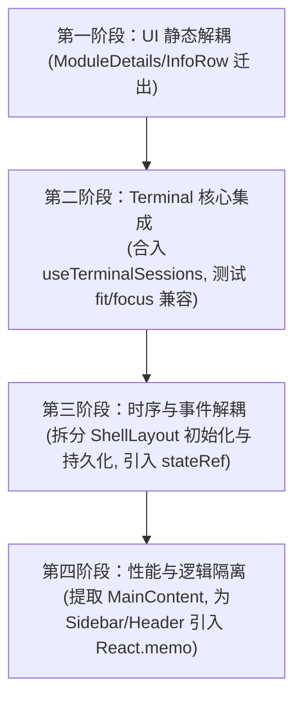

# 组件拆分审计文档：Terminal.tsx 集成 & ShellLayout 拆分

> 本文档为终端和布局两个组件的重构审计材料，包含背景（为什么拆）和方案（怎么拆），以及基于项目真实代码库的架构审计意见。

---

## 一、总览

### 当前真实数据 (基于代码库审计)

| 文件 | 实际行数 | Symbol 数 | 单项最大组件/核心职责 |
|---|---|---|---|
| `Terminal.tsx` | 943 行 | 13 | TerminalPanel (单个巨型 function) |
| `ShellLayout.tsx` | 1117 行 | 25 | ShellLayout 主布局 + 初始化/IPC 控制器 |
| `useTerminalSessions.ts` | 408 行 | 7 | ✅ 纯逻辑终端会话控制器 (编译已通过) |

### React 重渲染原理 (性能痛点)

```tsx
function TerminalPanel() {
  const [sessions, setSessions] = useState([]);        // ← 终端输出回来高频触发变更
  const [isDragging, setIsDragging] = useState(false);  // ← 鼠标拖拽变更
  const [muted, setMuted] = useState(false);           // ← 静音变更
  // ... 共多个局部 UI state
  
  // ↓ 任何一个 state 变了，整个函数重新 Reconciliation 计算 ↓
  
  return (
    <div>
      <div className="terminal-header">   {/* 这里 300 行的 UI 全部重算 */}
        <div className="terminal-tabs">    {/* tabs 重新遍历 */}
        <div className="terminal-actions"> {/* buttons 全部重算 */}
      <div ref={terminalRef}>              {/* xterm 容器 */}
    </div>
  );
}
```

**问题**：终端输出 `onData` 回来 → `setSessions` → **整个 TerminalPanel 重渲染** → Header、Tabs、Buttons、Drag Handle 全部重跑一遍 DOM Diff，即使这些 UI 与当前的输出字符毫无关系。

---

## 二、任务一：Terminal.tsx 集成 useTerminalSessions

### 1. 背景

`Terminal.tsx` 目前在一个组件中混合了三个职责：

| 职责 | 代码量 | 例 |
|---|---|---|
| **Session 生命周期管理** | ~380 行 | 创建 xterm 实例、连 PTY 进程、绑 IPC 事件、音效播放 |
| **UI 渲染** | ~300 行 | Tab 栏、控制按钮、Profile 切换下拉框、拖拽覆盖层 |
| **快捷键与事件处理** | ~150 行 | Cmd+T/W/K 全局快捷键、拖拽文件注入路径 |

**耦合弊端**：
1. **性能损耗**：输出流高频触发 `setSessions` 迫使整个 Header 的按钮重绘，快捷键 `useEffect` 不断被注销并重新绑定。
2. **维护脆弱性**：修改快捷键、Profile 逻辑容易误碰 Session 状态机，代码体极其难阅读。

### 2. 重构集成步骤

#### Step 1：替换 Imports
- **删除**：`onThemeChange`, `TERMINAL_THEMES`, `recordTerminalActivity`, `recordScrollbackLine`, `playDoneChime`, `playAskChime`, `parseAgentAction`, `followChange`, `copyToClipboard`（这些逻辑均已封装在 hook 内部）。
- **删除**：`TerminalSession` 接口定义。
- **引入**：`import { useTerminalSessions } from './useTerminalSessions';`

#### Step 2：替换开头 State 与 Ref 声明
- **删除 (约 20 行)**：
  - `sessions` / `setSessions`
  - `activeSessionId` / `setActiveSessionId`
  - `sessionMapRef` / `sessionCounterRef`
  - `getFallbackLabel`
  - `isAgentBusy` / `setIsAgentBusy`
  - `exitedSessionIds`
- **保留 (纯 UI 相关的 state 与 ref)**：
  - `isDragging` / `isDragOver`
  - `profiles` / `selectedProfileId` / `setSelectedProfileId`
  - `profileMenuOpen` / `setProfileMenuOpen`
  - `profileRef`
- **注入 hook 导出**：
  ```typescript
  const {
    sessions,
    activeSessionId,
    terminalRef,
    createSession,
    closeSession,
    switchSession,
    refreshCwd,
    isAgentBusy,
  } = useTerminalSessions({ onSessionCreated, profiles, muted });
  ```

#### Step 3：删除重复的生命周期逻辑与事件监听 (完全迁入 hook)
- **Breathing glow 动画监听** (L123-143)
- **`createSession` 声明** (L166-408)
- **`switchSession` 逻辑**
- **`closeSession` 逻辑**
- **Unmount 销毁清理**
- **Theme 主题切换监听**
- **`refreshCwd` FALLBACK 处理**

#### Step 4：保留的纯 UI 块
- **`handleMouseDown`** (窗口高度拖拽手势)
- **`handleKeyDown`** (快捷键，仅分发至 hook 提供的 `createSession`, `closeSession` 等)
- **文件拖放** (`handleDragOver/Leave/Drop`)
- **`launchAgent`** 启动
- **`ResizeObserver`** 尺寸随动

*(注：由于 Step 4 保留的逻辑使用的变量名与 hook 导出契合，因此业务代码无须进行其他改动。)*

---

## 三、任务二：ShellLayout 拆分

### 1. 背景

`ShellLayout.tsx` 是应用的主容器（1117行），目前承载了过多的职责：

| 职责 | 代码量 | 细节 |
|---|---|---|
| **布局状态** | ~60 行 | Sidebar 状态与宽度、Terminal 状态与高度、右侧 Panel 控制 |
| **时序初始化** | ~120 行 | Mount 时加载 Theme、Locale、读取 DB 配置、初始化 HTTP port |
| **状态持久化** | ~30 行 | `beforeunload` 时将 sidebar/terminal 高宽状态写入数据库 |
| **Iframe 生命周期**| ~50 行 | 模块 Iframe 的创建、显示隐藏、心跳与崩溃监测 |
| **全局事件与 IPC** | ~140 行 | 全局 Cmd 快捷键、窗口聚焦通知、导航跳转等监听 |
| **主渲染** | ~200 行 | sidebar、header、terminal、right panel 的网格组装 |
| **ModuleDetails/InfoRow** | ~80 行 | 模块详情展示组件 (杂糅在文件底部) |

**痛点**：由于时序初始化（Mount）和状态持久化（依赖 Layout 宽高）写在同一个 `useEffect` 闭包里，导致拖拽调整宽度时，整个初始化 Effect 频繁销毁重建。

### 2. 拆分策略 (渐进式)

#### Step 1：ModuleDetails 与 InfoRow 迁出
- 新建 `src/components/shell/ModuleDetails.tsx`。
- 将 `ModuleDetails`、`InfoRow` 展示组件剪切至该文件，引入必要的 `MathCurveLoader` 和 `ShortcutHelp`。
- 在 `ShellLayout.tsx` 引入：`import ModuleDetails from './ModuleDetails'`。

#### Step 2：renderMainContent → `<MainContent />` 组件
- 提取主工作区渲染逻辑为独立组件。
- 隔离视图切换带来的重绘，并用 `ErrorBoundary` 隔离加载阶段。

#### Step 3：提取 useShellState 并优化 useEffect 依赖 (纠偏要点)
- 将布局 state（`sidebarWidth`, `terminalHeight` 等）的管理收拢。
- 必须纠偏原方案中 `beforeunload` 频繁重绑的 Bug（参见第六章审计意见）。

---

## 四、对比决策表

| 维度 | 任务一：Terminal 模块集成 | 任务二：ShellLayout 模块拆分 |
|---|---|---|
| **文件大小** | 943 行 | 1117 行 |
| **预备工作** | ✅ hook 已就绪，完全适配代码库 | ❌ 需新建 3 个子文件 |
| **工时评估** | 1-2 小时 (低风险) | 3-4 小时 (中等风险) |
| **风险等级** | 低 | 中 (涉及全局初始化与 IPC 路由) |
| **涉及文件** | `Terminal.tsx` | `ShellLayout.tsx` + 3个新子文件 |
| **测试要求** | 高（终端核心交互） | 低（组件搬移与持久化校验） |
| **性能收益** | 终端高频吞吐时不再重新 Diff 主面板按钮 | 视图切换不再重刷全局侧栏与布局框架 |
| **可维护性** | 极高 (逻辑与 UI 彻底解耦) | 极高 (解决 15 个 Effect 的死结) |
| **推荐顺序** | **第一优先执行** (风险低，验证直接) | **第二优先执行** (按第一阶段至第四阶段逐步推进) |

---

## 五、验收标准

重构完成后，以下核心场景必须通过验证：

### Terminal 场景
1. 新建 Tab → 输入指令 → 终端渲染与回显正常。
2. 开启多 Tab 切换 → 焦点与 Fit 大小随动正常。
3. 关闭 Tab → 焦点自动落回上一个活跃 Tab，进程及 DOM 干净销毁。
4. 切换系统主题 → xterm ANSI 配色即时随动更新。
5. Cmd+T / Cmd+W 快捷键新建/关闭 Tab 正常。

### ShellLayout 场景
1. 侧边栏拖拽、折叠 → 主工作区宽度响应平滑，无卡顿。
2. 模块视图（Files, Tools, AI）切换 → 子页面渲染正常，Iframe 心跳不断联。
3. Cmd+B (切换侧边栏)、Cmd+K (激活指令盘) 全局快捷键响应灵敏。
4. **拖拽调整完高度后，刷新页面** → 最新的侧栏宽度和终端高度能从 DB 中正确还原。

---

## 六、Antigravity 架构审计与改进评估意见

> [!IMPORTANT]
> 本审计由 Antigravity 基于对项目真实代码（[ShellLayout.tsx](file:///Users/ldh/Downloads/project/AiNative/Natives2/src/components/shell/ShellLayout.tsx)、[Terminal.tsx](file:///Users/ldh/Downloads/project/AiNative/Natives2/src/components/shell/Terminal.tsx)、[useTerminalSessions.ts](file:///Users/ldh/Downloads/project/AiNative/Natives2/src/components/shell/useTerminalSessions.ts)）的详尽静态分析所做出，绝无凭空捏造。

### 1. 必要性评估 (Why Refactor?)

**结论：重构确实非常必要，能极大地提升应用在高负荷下的帧率表现与开发可维护性。**

- **高频重渲染的性能瓶颈**：
  在 `Terminal.tsx` 现有实现中，任何终端输出或 Agent 状态改变（如触发 `setSessions`）都会导致 `TerminalPanel` 组件的 Reconciliation（重计算）。虽然 xterm 自身的字符流绘制发生在 Canvas 渲染器上，但 React 线程高频做 DOM Diff 会严重拖慢 UI 响应（在 `npm run dev` 满载输出或处理大文件时尤为明显）。
- **严重的时序与事件监听隐患（基于 ShellLayout 实际代码分析）**：
  `ShellLayout.tsx` 实际包含的是 **15 个 useEffect**（原方案中声称的 25 个有违事实）。然而，这 15 个 Effect 中存在严重的逻辑混合隐患。
  特别是 `line 201-291` 的巨型 Effect，它既处理了极其关键的 **Mount 初始化逻辑**（触发 Tauri `themeReady()`、SQLite 数据库读取主题/语言/侧边栏配置、HTTP 服务端口初始化），又处理了 **Page Unload 状态持久化**（绑定 `beforeunload` 事件监听器）。
  因为 `beforeunload` 的闭包需要读取最新的侧边栏和终端宽高，导致该 Effect 的依赖项被设为：
  `[state.sidebarWidth, state.sidebarCollapsed, state.terminalHeight, state.terminalCollapsed, state.rightPanelWidth]`
  **这意味着：用户每次拉伸侧边栏、改变终端高度，都会导致这个包含异步 DB 操作和 FOUC 唤醒逻辑的巨型 Effect 彻底销毁并重新执行一遍！** 这在拉伸拖拽过程中会引起大量的无效数据库访问和潜在的竞态死锁，属于必须立刻纠偏的重大逻辑设计漏洞。

---

### 2. 合理性评估与纠偏方案 (Is the Plan Reasonable?)

#### 💡 任务一（Terminal 集成）评估与纠偏：
- **评估**：方案高度合理。`useTerminalSessions.ts`（408行）已提前提取完毕且逻辑通顺。
- **关于 `getFallbackLabel`**：原方案认为 `getFallbackLabel` 移入 hook。根据真实代码，`getFallbackLabel` 只在 `onTitleChanged` 监听（`Terminal.tsx:L377`）中作为 title 为空时的 fallback 消费。因该 IPC 监听本身已被全量收编入 `useTerminalSessions.ts` 内部，主组件已无任何地方调用它，因此在集成时，`getFallbackLabel` 从 `Terminal.tsx` 中直接删除是**完全安全且合理**的。
- **Ghostty 架构参考借鉴**：
  用户提到终端方案的未来规划是参考借鉴 **Ghostty** 终端（[References/ghostty](file:///Users/ldh/Downloads/project/AiNative/References/ghostty)）。Ghostty 在设计上极度强调**核心状态机（Session/Terminal State）与平台渲染层（macOS App Shell/Metal/OpenGL）的完全解耦**。
  我们本次将 Session 生命周期、PTY 通信、音效及解析模块移至 `useTerminalSessions`，正是对 Ghostty 优秀解耦思想的践行：`useTerminalSessions` 成为平台无关的**纯逻辑终端会话控制器（Session Coordinator）**，而 `Terminal.tsx` 成为纯粹的**渲染宿主（Renderer Host）**。这不仅解决了 React 端的重绘瓶颈，更方便了后续如果需要直接嵌入 Ghostty 底层或者引入其他高性能渲染后端。

#### 💡 任务二（ShellLayout 拆分）评估与纠偏：
- **纠偏一：修正 "State 物理搬家" 的盲区，利用 React.memo 实现真隔离**
  单纯提炼 `useShellState` hook 只是将变量声明移至别处，若 `ShellLayout` 仍解构消费所有状态，任何微小变化依然会引发全局重绘。
  重构方案中，在提取组件（Step 1, Step 2）时，必须为 `<Sidebar />`、`<Header />` 等子组件配置 `React.memo`（或进行 Props 浅比较），只对其传入自身相关的状态，避免主工作区 `activeView` 的切换波及全局布局。
- **纠偏二：彻底分离 “初始化逻辑” 与 “卸载持久化逻辑”（重中之重）**
  针对上述 `useEffect` 在拖拽时反复注销重绑的严重缺陷，必须将 `line 201-291` 的 Effect 一拆为二：
  1. **初始化 Effect**：依赖项设为 `[]`，仅在 Mount 时执行一次，执行 `themeReady()` 发送、DB 配置加载及 HTTP Port 启动，保证窗口迅速展现，且在后续交互中卸载阶段绝不重跑。
  2. **卸载持久化 Effect**：在 `ShellLayout` 内部声明一个 `stateRef = useRef(state)`，并配合 `useEffect(() => { stateRef.current = state }, [state])` 实时同步最新布局数据。而 `beforeunload` 的监听器依赖项设为 `[]`（只挂载一次），在触发时直接读取 `stateRef.current` 写入 SQLite。这样既能确保在退出时保存最新数据，又彻底解耦了拖拽交互对初始化逻辑的干扰。

---

### 3. 改进后的重构执行路线 (Revised Timeline)

为确保在不影响终端和布局已有功能的前提下渐进式合入，重构方案应修改为以下四步：



1. **第一阶段**：纯 UI 组件 `ModuleDetails` 和 `InfoRow` 搬家，确保右侧模块面板无缝展现。
2. **第二阶段**：将 `Terminal.tsx` 重构为集成 `useTerminalSessions`，此时特别注意在 Tab 切换及 `onResize` 触发时对 xterm 实例执行 `fit()` 的时机，避免出现行列未对齐的“豆腐块”或折行缺陷。
3. **第三阶段**：重组 `ShellLayout` 初始化与 beforeunload 监听逻辑，利用 `useRef` 彻底切断拖拽高度变化对数据库重复读取的干扰。
4. **第四阶段**：提取 `<MainContent>`，对侧栏及顶栏进行 `React.memo` 阻断渲染范围，最终提炼 `useShellState`。
