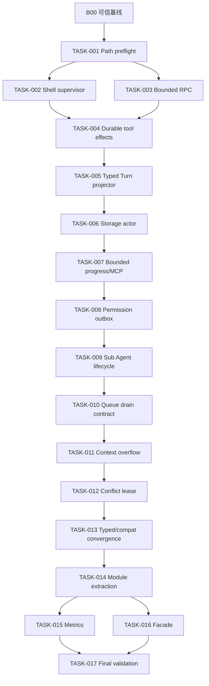
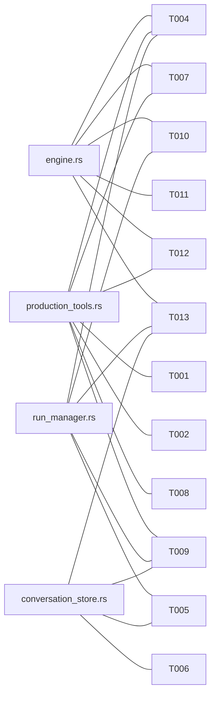

# Natives Agent Runtime 问题依赖与文件冲突分析

> 基线：`deploy@9584c3c263c1e83b1066e4208e1ab2d678a9deeb`。状态和证据来自 `docs/audit/natives-agent-issues.json`；本文件只编排实施依赖，不改变审计结论。

## 1. 形成批次前的结论

问题不能按目录平均分配。当前存在三条强依赖链：

1. `Path preflight → Tool effect durable commit → Typed Turn projector → Resume`。
2. `Durable transaction commands → Storage actor → Progress/Permission/Sub Agent actors`。
3. `可靠性语义稳定 → Context/Scheduler/Typed compat 收敛 → 物理拆分 → Facade`。

`engine.rs`、`production_tools.rs`、`run_manager.rs`、`production.rs`、`conversation_store.rs` 是状态机和事务接缝，不允许多个 Agent 同时改写。

## 2. 问题实施依赖表

字段缩写：协议 `Y/N`；数据库 `M`=迁移、`W`=读写行为、`N`=无；并行 `Y/L/N`=可/有限/不可。

| 问题 | 风险 | 模块/状态 | 协议 | DB | 前置 | 后续影响 | 主要文件 | 并行 | 合并建议 |
|---|---|---|---:|---:|---|---|---|---:|---|
| A01 | P2 | Core/Run/Tool 结构 | N | N | B01–J04 行为稳定 | SDK、可维护性 | `engine.rs`; `run_manager.rs`; `production_tools.rs` | N | TASK-014 单独做纯移动 |
| A02 | P1 | Interaction/Run authority | L | W | Storage command | Permission/Sub Agent | `interaction_store.rs`; `run_manager.rs` | N | 与 J04 合并 TASK-008 |
| A03 | P2 | Runtime 入口 | N | N | Typed/Lineage 稳定 | Facade | `run_manager.rs`; `cli_runtime_bridge.rs` | N | 与 B01/B02/J01 合并 TASK-013 |
| B01 | P2 | Message/Transcript | L | W | Projector | Compat 删除、Facade | `engine.rs`; `production.rs`; `conversation_store.rs` | N | Projector保真后由 TASK-013 收口 |
| B02 | P2 | Legacy persistence | N | W | Projector | Schema 清理 | `conversation_store.rs`; `production.rs` | N | 与 B01 同任务，保留一次发布兼容窗 |
| C01 | P3 | Turn | N | W | 无 | 所有 Core 任务 | `engine.rs` | Y | 已解决，仅回归保护 |
| C02 | P1 | Queue/Turn safe point | N | W | Durable actors | Context policy | `engine.rs`; `prompt_queue_store.rs`; `run_manager.rs` | N | TASK-010 原子收紧 lease/ack/drain |
| C03 | P1 | Context/Snapshot | N | W | Projector、Queue | Typed convergence | `context.rs`; `compaction.rs`; `engine.rs` | N | 与 I03 合并 TASK-011 |
| C04 | P3 | Provider/Tool final | N | N | 无 | Scheduler | `engine.rs` | Y | 已解决，所有 Provider fixture 回归 |
| D01 | P2 | Gateway registry | N | N | Tool facts | Scheduler | `capability-gateway/lib.rs` | L | 与 D02 合并 TASK-012 |
| D02 | P1 | Scheduler/Conflict | N | W | Effect/Storage authority | Tool吞吐 | `engine.rs`; `manifest.rs`; `production_tools.rs` | N | TASK-012 跨 Run lease |
| D03 | P0 | Ledger/Tool | Y | M | N01 | Resume、Checkpoint | `side_effect_ledger.rs`; `production_tools.rs` | N | 与 D04/F02/G01/G02 原子处理 |
| D04 | P0 | Tool fact/uncertain | Y | M | N01 | Resume | `engine.rs`; `production_tools.rs`; stores | N | TASK-004，不拆 completed/uncertain |
| D05 | P2 | Hook/Tool | L | W | Effect commit | Tool结果 | `hooks.rs`; `engine.rs` | N | 纳入 TASK-004 的调用 ID/结算契约 |
| E01 | P3 | Sub Agent security | N | N | 无 | E02–E04 | `subagents.rs` | Y | 已解决，作为 TASK-009 安全回归 |
| E02 | P1 | Sub Agent budget | L | M | Storage actor、Permission | Resume | `subagents.rs`; `production_tools.rs` | N | 与 E03/E04/N05 合并 TASK-009 |
| E03 | P1 | Sub Agent failure | N | W | E02 reservation | Parent policy | `subagents.rs`; watcher | N | TASK-009：接线或删除 |
| E04 | P1 | Sub Agent create | N | W | Permission/outbox | Orphan cleanup | `production_tools.rs`; `run_manager.rs` | N | TASK-009 创建补偿 |
| F01 | P1 | SQLite/async runtime | N | W | B02/B03 transaction command | Progress/Permission | `storage/mod.rs`; stores | N | TASK-006 先于所有 actor 改造 |
| F02 | P0 | Event/Projection transaction | Y | M | N01 | Resume、Projector | `event_log.rs`; `conversation_store.rs`; `production.rs` | N | Tool facts在 TASK-004，Turn投影在 TASK-005 |
| F03 | P3 | Event sequence | N | W | 无 | 所有事件任务 | `event_seq.rs` | Y | 已解决，保持单调唯一测试 |
| F04 | P1 | Fault test | N | N | fault hooks/commands | 全部验收 | tests | L | TASK-000 定义，TASK-017 完成 |
| G01 | P0 | Checkpoint/Ledger cursor | Y | M | D03 | Resume | `production.rs`; `checkpoint.rs` | N | TASK-004 写真实 ledger watermark |
| G02 | P0 | Resume | Y | W | D03/D04/F02/G01/N02 | 自动恢复 | `run_manager.rs`; `production_tools.rs` | N | TASK-004+005 共同关闭 |
| G03 | P2 | Retry/Continue | L | W | Snapshot/Projector | Public API | `run_manager.rs`; `production.rs` | N | TASK-013 明确 snapshot lineage |
| G04 | P2 | Fork/Branch | L | W | Projector | Public API | `conversation_store.rs`; `run_manager.rs` | N | TASK-013 明确资源继承 |
| H01 | P1 | Event criticality | Y | W | Tool commit | Replay | `engine.rs`; `event_log.rs` | N | critical fact 纳入 TASK-004；metrics 后置 |
| H02 | P1 | Event/Projection | Y | M | Tool/Turn commit | Storage actor | `event_log.rs`; `production.rs`; stores | N | TASK-004/005 后 TASK-006 |
| H03 | P1 | Progress/Resource | N | W | Storage actor、Shell | MCP/UI | `engine.rs`; `production_tools.rs` | N | Shell资源在 TASK-002；通道在 TASK-007 |
| H04 | P2 | Metrics | N | N | 模块拆分 | Production ops | new metrics modules | L | TASK-015，禁止高基数标签 |
| I01 | P2 | Provider block conversion | N | N | Typed transcript | Facade | `routing.rs`; adapters | N | TASK-013 |
| I02 | P2 | Provider attempt audit | L | W | Tool/Turn事实 | Billing audit | `engine.rs`; adapters; event types | N | TASK-013，不引入自动副作用重试 |
| I03 | P1 | Context overflow | N | W | Projector、Queue | Provider稳定性 | `engine.rs`; `context.rs` | N | 与 C03 合并 TASK-011 |
| J01 | P2 | Tool/runtime bypass | N | N | Typed compat | SDK | `cli_runtime_bridge.rs`; `run_manager.rs` | N | TASK-013 capability matrix |
| J02 | P0 | Shell process | N | N | N01 后避免同改 production_tools | Progress | `process_supervisor.rs`; terminal tools | L | TASK-002，可与 RPC 并行 |
| J03 | P1 | MCP cancel/progress | N | W | Storage actor、Progress | Resource cleanup | `mcp_runtime.rs`; `production_tools.rs` | N | TASK-007 |
| J04 | P1 | Permission | L | M | Storage actor | Sub Agent | `interaction_store.rs`; `rpc.rs`; `production_tools.rs` | N | TASK-008 |
| K01 | P2 | Public crate | N | N | B06、拆分 | SDK | `agent-core/lib.rs`; Cargo metadata | L | 与 K02/L03 合并 TASK-016 |
| K02 | P2 | Agent facade | N | N | Core API 稳定 | Ecosystem | `facade.rs`; examples | L | TASK-016，不复制 Pi Session |
| L01 | P1 | Validation | N | N | 无/全部 | Release | CI/scripts | L | TASK-000 基线、TASK-017 终验 |
| L02 | P1 | Test层级 | N | N | 各生产改造 | Release | tests | L | 每任务故障测试 + TASK-017 |
| L03 | P2 | Release成熟度 | N | N | Facade稳定 | SDK发布 | Cargo metadata/CI | L | TASK-016；本轮不执行 publish |
| N01 | P0 | PathScope/Checkpoint | N | N | 无 | 所有 Tool effect | `gateway/lib.rs`; `production_tools.rs`; `checkpoint.rs` | N | 第一项 TASK-001 |
| N02 | P0 | Turn projection crash-gap | N | M | Tool fact contract | Resume/Typed | `production.rs`; `conversation_store.rs`; projector | N | TASK-005 |
| N03 | P2 | FK判断 | N | W | Projector | Migration可靠性 | `conversation_store.rs` | N | 纳入 TASK-005 |
| N04 | P1 | RPC frame | N | N | Baseline | Final production test | `rpc.rs`; `client.rs` | Y | TASK-003，与 Shell 并行 |
| N05 | P1 | Child scope metadata | N | W | Permission/Sub Agent reservation | Isolation | `production_tools.rs`; stores | N | TASK-009 |
| N06 | P1 | Snapshot backfill | N | W | Projector | Resume | `conversation_store.rs`; `run_manager.rs` | N | TASK-005，不静默跳过 |

## 3. 实施依赖图

只有两组安全并行：`TASK-002 || TASK-003`、`TASK-015 || TASK-016`。其余并行收益不足以抵消核心文件冲突。

## 4. 文件冲突图

| 任务 | 主要修改文件 | 冲突任务 | 能否并行 | 建议顺序 |
|---|---|---|---|---|
| 001 Path | `gateway/lib.rs`; `production_tools.rs`; `checkpoint.rs` | 002/004/007/009/012 | 否 | 最先 |
| 002 Shell | `process_supervisor.rs`; `production_tools.rs` | 001/007 | 与003 | 001后 |
| 003 RPC | `rpc.rs`; `client.rs` | 008 | 与002 | 001后 |
| 004 Effects | `engine.rs`; `production_tools.rs`; ledger/event/checkpoint/run_manager | 005–013 多数 | 否 | 安全批次后独占主工作区 |
| 005 Projector | `conversation_store.rs`; `production.rs`; `run_manager.rs`; stores | 004/006/013 | 否 | 004后 |
| 006 Storage | `storage/**`; all stores | 005/007/008/009 | 否 | 005后 |
| 007 Progress | `engine.rs`; `production_tools.rs`; `mcp_runtime.rs` | 008/009/012 | 否 | 006后 |
| 008 Permission | `interaction_store.rs`; `rpc.rs`; `production_tools.rs` | 009/010 | 否 | 007后 |
| 009 Sub Agent | `subagents.rs`; `production_tools.rs`; `run_manager.rs` | 010/012/013 | 否 | 008后 |
| 010 Queue | `engine.rs`; `prompt_queue_store.rs`; `run_manager.rs` | 011/013 | 否 | 009后 |
| 011 Context | `engine.rs`; `context.rs`; `production.rs` | 012/013 | 否 | 010后 |
| 012 Scheduler | `engine.rs`; `gateway`; `production_tools.rs` | 013 | 否 | 011后 |
| 013 Typed/compat | `engine.rs`; `production.rs`; `run_manager.rs`; `conversation_store.rs` | 014 | 否 | 012后 |
| 014 Split | 三个巨型控制器 | 015/016 | 否 | 所有语义改造后 |
| 015 Metrics | 新 metrics 模块、runtime装配 | 轻微 | 与016有限并行 | 014后主工作区 |
| 016 Facade | `agent-core/lib.rs/facade.rs`; examples | 轻微 | 与015有限并行 | 014后受控Worktree |

## 5. 原子改造与延期

必须原子完成：

- TASK-004：ledger intent/settlement、Tool fact、uncertain、checkpoint watermark、resume gate。
- TASK-005：Turn event、typed rows、block order、tool pair、watermark、restart replay。
- TASK-008：Permission decision、event/outbox、waiter delivery、重复响应。
- TASK-009：child session/run/reservation、failure compensation、budget settlement。

延期到可靠性门槛以后：

- 公开 Facade、发布元数据、Metrics adapter、物理大文件拆分。
- 不新增插件系统、Pi Runtime、TUI/CLI 重写或新数据库权威。
- 不为“整洁”提前引入通用 Transaction Bus、万能 TurnPolicy 或多实现 factory。
