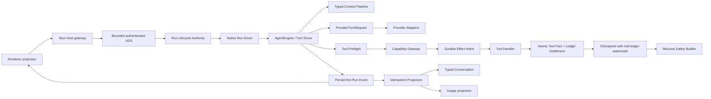

# Natives Agent Runtime 升级实施方案

> 依据：`docs/audit/natives-agent-problem-verification.md` 与 `docs/audit/natives-agent-issues.json`。  
> 原则：先修可证明的 P0 不变量，再做性能/模块化；不以“拆文件”代替可靠性。

# 升级目标

1. 消除 Gateway 前置 I/O，保证项目路径/权限校验是所有 Tool 副作用与 Checkpoint 的唯一前门。
2. 让 side-effect intent、completion/uncertain、Tool fact、Checkpoint watermark 和 Resume decision 可关联、可审计、可故障恢复。
3. 让 committed Turn event 能幂等、事务地投影为完整 Typed Conversation，并在重启后自动收敛。
4. 修复 Shell pipe drain、Progress 背压和同步 SQLite 对 async executor 的阻塞。
5. 收敛 Legacy/compatibility，保持一个 Native Agent Loop、一个 Run terminal authority、一个 Tool Gateway。
6. 在上述基础上提供最小 Rust facade；不复制 Pi Runtime/Session/CLI。

# 非目标

- 不嵌入或启动 Pi TypeScript Runtime。
- 不用 Pi Session 替换 Natives Conversation/Run/Turn/Event。
- 不推倒 Tauri、UDS、Daemon、SQLite、Credential Broker、Capability Gateway。
- 不在可靠性 Phase 内开发插件市场、Provider plugin ABI、TUI 或新的 UI 产品语义。
- 不机械拆分 6000 行文件；只有稳定事务/领域边界才抽模块。
- 不把 `provider-adapters`、`capability-gateway`、Daemon 或 Renderer 归入 `agent-core`。

# 架构原则

1. Renderer 只投影 Daemon authority，不生成持久事件或 sequence。
2. RunManager 仍是唯一 Run lifecycle terminal committer。
3. AgentEngine 是 Turn、Provider attempt、Tool batch 和 context 的唯一执行 loop。
4. Provider Adapter 只处理 wire；所有 native provider turn 只接受 `ProviderTurnRequest`。
5. Gateway 负责 schema/path/permission classification/timeout/output/cancel；Core 不复制 Registry。
6. Tool handler 之前先有 durable intent；不确定外部结果默认阻止自动 Resume。
7. SQLite Event 是执行事实源；Conversation/Usage/Renderer 是可重建投影。
8. 所有增长边界可量化：RPC frame、Progress channel、event replay page、tool output、artifact、并发。
9. Compat runtime 显式声明能力降级，不用兼容路径稀释 Native 不变量。

# 目标架构



# 分阶段路线

| Phase | 目标 | 前置 | 退出门槛 |
|---|---|---|---|
| 0 | 固定事实、能力和故障基线 | 无 | 当前 call chain/issue JSON/测试命令有可追溯结果 |
| 1 | P0 trust/recovery 修复 | Phase 0 | 路径、Ledger、Turn projection、Shell 四组故障测试通过 |
| 2 | P1 并发与 durability | Phase 1 | DB 不阻塞 async worker；Progress 有界；permission/subagent crash-safe |
| 3 | Native 主链和 compat 收敛 | Phase 2 | 非 compat production 无 EngineMessage/legacy provider/tool bypass |
| 4 | 按稳定边界拆模块 | Phase 3 | 行为无变化，所有 contract/fault tests 通过 |
| 5 | 最小 Rust SDK facade | Phase 4 | 外部示例单 crate 可运行；不建立第二 authority |
| 6 | 生态能力（可选） | Phase 5 + 真实需求 | 有明确第三方使用者和版本兼容预算 |

# 每阶段详细任务

## Phase 0：建立事实基线

- 对应：L01、L02、F04。
- 保留本次三个审计产物为一次性事实材料；权威进度仍更新 `NATIVE_ENGINE_FULL_REMEDIATION.md`。
- 资源空闲后一次执行：fmt、workspace check/test、typecheck/lint/test、protocol/native verifier；记录 exit code，不反复运行。
- 固定 Native、fixture、legacy seam、CLI compatibility 能力矩阵。
- 为下列 crash point 建测试名称但不先大改实现：
  1. effect intent 前；2. handler 返回后；3. ledger completed 前；4. ToolCompleted event 前；5. TurnCompleted 后；6. assistant message 后；7. 部分 tool result 后；8. checkpoint cursor 前；9. permission resolved 后；10. queue ack 前。

验收：任何“已通过”都有命令和 exit code；未运行明确标为未验证。

## Phase 1：生产信任和恢复闭环

### UPG-001：Checkpoint 只接受 Gateway 已验证路径

- 对应问题：N01。
- 当前行为：`production_tools` 从 raw input 提取 path 并在 `gateway.execute` 前读 before image。
- 目标行为：Gateway 提供最小的 `prepare/resolve_paths` 结果；Checkpoint 只接收 canonical project-relative path；permission 可在 preflight 后、handler 前完成。
- 涉及模块：`capability-gateway/src/lib.rs`、路径工具共享 helper、`production_tools.rs`、`checkpoint.rs`。
- 建议新增模块：无；优先复用 Gateway 现有 canonical resolver。
- 收敛入口：删除 `production_tools::extract_write_paths` 的信任职责；它最多做工具特定字段定位，不做校验。
- 数据/协议/DB：无协议变更；现有 checkpoint 中 absolute path 标记 invalid，Resume 不自动使用。
- 实施：
  1. 先写 absolute/`..`/symlink escape 测试，断言没有任何 `std::fs::read`/snapshot row。
  2. 把 path resolution 提到 Gateway handler 前，并返回受控值。
  3. Checkpoint 拒绝 absolute path；再次检查 `strip_prefix(project_root)`。
  4. apply_patch 多路径一次性全部 preflight，任一失败时不读、不写、不 ledger start。
- 回滚：恢复旧调用顺序会重新开放 P0，不允许功能级回滚；只能回滚整个 commit。
- 风险：Gateway prepare API 扩张。控制为单一已有实现，不引入通用 workflow engine。
- 验收：N01 三条测试 + 所有 builtin write tool 测试通过。

### UPG-002：建立 durable side-effect commit protocol

- 对应：D03、D04、G01、G02、F02。
- 当前行为：started/completed/uncertain 分散写；mark uncertain 丢错误；cursor 是 event sequence。
- 目标行为：
  - side-effecting Tool 在 handler 前必须有 `planned/started` row。
  - Ledger row 有单调 `ledger_sequence`、`idempotency_key`、`external_reference`、`replay_contract`。
  - handler 返回后，Ledger settlement 和 ToolCompleted fact 在同一 store command/transaction 中提交，或有 durable outbox 可确定补偿。
  - settlement 无法持久时，Run 进入 durable `blocked_uncertain`；不得生成 resumable checkpoint。
  - Checkpoint 存真实 ledger watermark，Resume 只扫描 watermark 之后和所有未 terminal started 项。
- 涉及：`side_effect_ledger.rs`、`event_log.rs`、`event_seq.rs`、`production_tools.rs`、`engine.rs`、`checkpoint.rs`、`run_manager.rs`、migration、protocol error/decision。
- 建议新增：`storage/tool_effect_commit.rs`，属于 Daemon storage transaction，不进入 Core/Gateway。
- 数据结构：
  - `side_effect_record.ledger_sequence INTEGER NOT NULL`，`UNIQUE(run_id, ledger_sequence)`；
  - `replay_contract`（never/confirm/idempotent）；
  - `settlement_event_id`；
  - Run 可增加 `recovery_state=blocked_uncertain`，或使用已有可表达的 durable decision，不在 Renderer 合成。
- 协议：Resume response 保留 Safe/Confirm/Blocked；新增稳定 reason code，不泄露 input。
- 兼容：旧 row 没有可靠 cursor 时 `legacy_unverifiable`，只允许人工确认/Blocked，不推断 safe。
- 实施：先 migration+store contract；再本地工具；再 MCP/network/shell；最后 checkpoint/resume。
- 故障测试：每个上述 crash point kill 进程，重启后断言 Blocked 或已完成且不重放。
- 回滚：migration additive；旧读取器忽略新列。功能 flag 可关闭 auto-resume，但不能跳过 intent。
- 验收：`Tool succeeded → event append fail → daemon kill → resume` 永远不再次执行 handler。

### UPG-003：Turn Event 幂等投影为 Typed Conversation

- 对应：N02、F02、H02、B01。
- 当前：Run 结束后同步 replay 并分多事务 INSERT。
- 目标：`TurnCompleted` 是 projector 触发条件；一次事务 upsert turn、assistant、tool results、blocks、watermark。Daemon start 和每次 subscribe 前可补投影；重复投影零副作用。
- 涉及：`conversation_store.rs`、`event_log.rs`、`production.rs`、`run_manager.rs`、migration。
- 新增：`conversation_projector.rs`（Daemon 内部）；不要把 SQLite 放进 agent-core。
- DB：`projection_watermark(projector, run_id, event_sequence/event_id)` 或等价；message insert 使用 stable id + 内容一致性检查，禁止静默覆盖冲突。
- 兼容：旧 delta-only event 仍走只读 compat projector；新 typed Turn 必须有 MessageCompleted canonical content。
- 实施：
  1. 把 `append_single_assistant_turn` 改为接受 transaction。
  2. assistant + N result 单事务。
  3. 进程启动扫描 watermark 后 committed turns；遇坏 event 将对应 run 标不可恢复，而非跳过。
  4. ProductionRuntime 不再承担唯一投影时机，只负责触发/等待关键 projector 完成。
- 验收：8 个 kill point 后 reload `AgentMessage` 与 event-derived canonical transcript 完全一致，下一 Provider Request 含完整 Tool pair。

### UPG-004：Shell 持续 drain 与安全截断

- 对应：J02、H03。
- 当前：退出后才 read pipes；字节切 `str`。
- 目标：spawn 后立刻两个 reader task；有界 byte ring；progress bounded；cancel kill+wait+join readers；UTF-8 lossy/char-boundary 安全。
- 涉及：`capability-gateway/src/process_supervisor.rs`、terminal tool tests、`production_tools.rs` progress adapter。
- 新增：无，优先在 supervisor 内最小修复。
- 数据/协议：Progress 添加 `dropped_bytes` 可延后到 Phase 2；本阶段至少本地计数和 truncated=true。
- 测试：10MB stdout、10MB stderr、交错输出、CJK/emoji cap、foreground/background、cancel、timeout、daemon drop。
- 验收：无 hang/panic/orphan；task registry quiet。

## Phase 2：存储、背压、权限和子 Agent

### UPG-005：Storage Actor 隔离同步 SQLite

- 对应：F01、H02、H04。
- 最小方案：单 bounded writer actor + `spawn_blocking`，保留 SQLite 单 writer；只在读负载证明确有需要时加 read pool。
- 不先替换 rusqlite/引入数据库框架。
- Store command 按事务域：run lifecycle、event+usage projection、tool effect settlement、conversation turn projection、queue/interaction。
- 验收：Tokio worker 不直接持 `Mutex<Connection>`；10 并发 run benchmark p99/queue depth 可观测；actor queue 满时 fail closed/backpressure。

### UPG-006：Bounded Progress Pipeline

- 对应：H03、J03。
- 将 terminal/MCP/subagent producer 都接入固定消息数+字节数 channel；合并同 stream chunk；late update 拒绝；记录 dropped/merged bytes。
- Progress 是展示事件，不得阻止 Tool settlement；关键 ToolCompleted 不与其共用可耗尽队列。
- 验收：100MB producer 下 RSS 有界；Result 后 event 数不增长；Renderer 断开不影响 handler。

### UPG-007：Permission Outbox 与幂等响应

- 对应：A02、J04。
- interaction CAS response + PermissionResponded outbox 同事务；live waiter 按 id 消费，失败可由轮询/重连恢复。
- 同内容重复响应返回原 decision；冲突内容返回 stable conflict；过期/重启 fail closed。
- 验收：重复 allow 不重复执行；event append failure 不允许 handler 抢跑。

### UPG-008：Sub Agent durable reservation 和创建补偿

- 对应：E02、E03、E04、N05。
- 顺序：resolve immutable child scope → hooks → durable reservation → transaction create session/run → start；任一步失败释放/关闭。
- 预算按 child usage event 持久增量；重启 rehydrate depth/concurrency/task/token/tool counts。
- FailurePolicy 要么真实实现三种，要么只保留 Isolate；不得继续暴露无效选项。
- ProjectIdentity 保存真实 id/version/path；Credential 只保存 key id/lease binding，不复制 secret。
- 验收：三层嵌套、重启、父 cancel、budget exceeded、hook deny、DB failure 无 orphan/越权。

### UPG-009：Bounded RPC 和订阅背压

- 对应：N04、F03。
- 握手/RPC frame 限制；超大参数/附件走 artifact reference；每连接 session 精确清理，不按 client_id 清除所有并发 session。
- replay 分页；broadcast lag 进入 cursor replay。
- 验收：超限帧断开且内存有界；并发同 client sessions 互不误删。

## Phase 3：生产主链收敛

### UPG-010：Typed Message/Provider 兼容层隔离

- 对应：B01、B02、I01、A03。
- `EngineMessage`、legacy provider method、delta-only history 进入 `compat`；Native Production 只能调用 typed entry。
- conversion 对 Thinking signature/Image/Custom 明确 preserve/drop/error，不隐式拼字符串。
- CLI runtime 保留为 capability-degraded adapter，不冒充 Native Core。
- 验收：非 compat production `rg EngineMessage` 为 0；所有 native provider 调用只有 `stream_turn(ProviderTurnRequest)`。

### UPG-011：Context Overflow 和 Turn Policy

- 对应：C03、I03。
- 增加小型 `TurnPolicy`，只决定 stop/compact/model config/input drain；不拥有 Run lifecycle、Provider wire 或 DB。
- overflow 每用户输入最多一次 compact retry；NothingToCompact 直接明确失败。
- token estimator 可由 Adapter/profile 提供，默认保守估算。
- 验收：不同 Provider overflow fixture 同行为；无无限重试。

### UPG-012：跨 Run Tool conflict lease

- 对应：D02。
- Daemon scheduler registry 按 conflict_key/exclusive 声明 lease；Gateway 提供 capability，Core 请求调度，不按工具名硬编码。
- Permission 在批次执行前完成 preflight，避免 side-effect 工具抢跑。
- Result 源序；Completed 真实完成序。
- 验收：相同 key 跨 Run 不并发；不同 key ParallelSafe 可并行；cancel 全释放。

# Phase 4：核心模块拆分

只在上面 API 稳定后实施：

| 当前文件 | 目标边界 | 保留 |
|---|---|---|
| `engine.rs` | `engine/turn_driver.rs`、`provider_attempt.rs`、`tool_batch.rs`、`outcome.rs` | AgentEngine facade、EngineProvider/ToolRuntime stable traits |
| `run_manager.rs` | `run/lifecycle.rs`、`run/commands.rs`、`run/recovery.rs`、`runtime_dispatch.rs` | RunManager facade 和 sole terminal authority |
| `production_tools.rs` | `tools/preflight.rs`、`local.rs`、`mcp.rs`、`subagent.rs`、`progress.rs` | PermissionGatedTools facade |
| `conversation_store.rs` | `conversation/repository.rs`、`projector.rs`、`snapshot.rs` | SQLite authority in Daemon |
| `rpc.rs` | transport/auth/dispatch/domain handlers | assistant-protocol wire source |

禁止只移动代码不减少依赖；每个拆分 commit 必须行为等价且可独立回滚。

# Phase 5：公开 SDK

只有 Phase 1–4 完成后评估 `natives-agent-runtime` facade：

```rust
let runtime = AgentRuntime::builder()
    .provider(provider)
    .tool(read_tool)
    .tool(write_tool)
    .event_store(InMemoryEventStore::new())
    .build()?;

let run = runtime.prompt("...").await?;
```

Facade 复用 AgentEngine，不复制 loop；生产 Daemon adapter 仍是正式 durable authority。提供 InMemorySession/FakeProvider 只用于嵌入和测试，不宣称 crash-safe。Crate 补 license/repository/rust-version/semver/SBOM/release smoke。

# Phase 6：插件与生态能力

仅在有真实外部使用者时提供 Tool/Provider/Storage/OTel adapter。Gateway policy 和 assistant-protocol versioning 不允许由插件绕过。MCP 已是工具生态入口，优先复用，不创建重复 plugin runtime。

# 数据和协议迁移

1. Migration 全部 additive；新列 nullable/backfill 后再收紧。
2. 旧 checkpoint 的 cursor 标 `legacy_unverifiable`，不能假装真实 Ledger watermark。
3. Turn projector 以 stable message/event id 去重，内容冲突 fail closed。
4. `blocked_uncertain` 如不新增 Run status，可先作为 resume decision + error code；Renderer 只展示 Daemon 事实。
5. 新 protocol 字段必须在 `assistant-protocol` 生成 frontend binding，不手改 generated types。
6. compatibility 读取器至少保留一个发布周期和命中指标；不双写两套事实。

# 测试策略

## 合同测试

- Provider：StopReason、Usage/cache、Thinking/Image/Tool ID、Retry-After、ContextOverflow。
- Tool：JSON/Schema、preflight、permission、hook、cancel/timeout/cleanup、同 ID pairing。
- Event：critical checked、sequence、persist-first、terminal single authority。

## 故障注入

每个 crash point 使用子进程 + SQLite 临时库，不只 Fake 返回错误：

1. intent commit 前 kill；2. handler 返回后 kill；3. Ledger settlement 前 kill；4. ToolCompleted 前 kill；5. TurnCompleted 后 kill；6. assistant insert 后 kill；7. tool result 中途 kill；8. checkpoint cursor 前 kill；9. permission response 后 kill；10. queue message insert/ack 之间 kill。

再覆盖 SQLITE_FULL、BUSY、I/O error、corrupt event JSON、migration mismatch、WAL checkpoint failure。

## 并发/资源

- 10 Run 并发 event/queue/tool。
- 100MB terminal progress，RSS 和 queue depth 有界。
- 相同/不同 conflict key。
- parent + nested child cancel/restart/budget。
- UDS oversized frame、broadcast lag、Renderer reconnect。

## 最终命令

资源空闲且共享 target 时只执行一次：

```bash
rtk cargo fmt --check
rtk cargo check --workspace
rtk cargo test --workspace
rtk cargo clippy --workspace --all-targets -- -D warnings
rtk npm run typecheck
rtk npm run lint
rtk npm run test
rtk npm run perf:check
rtk npm run protocol:check
rtk npm run verify:native-engine
```

真实 Provider smoke 仅在 secret/网络可用时单独记录，不作为本地无 key 的伪通过。

# 故障注入策略

- Store 接口增加测试专用 failpoint，不在生产暴露字符串环境开关。
- 子进程测试通过 barrier 文件/pipe 精确 kill，不用随机 sleep。
- 每个测试验证 DB facts、event replay、conversation reload、Resume decision、handler invocation count 五项。
- 任何 side effect test 使用临时目录/本地 fake server，不访问用户真实项目或外部服务。

# 发布策略

1. Phase 1 以小 commit 合入，每个 P0 可独立回滚。
2. DB migration 先 additive 读兼容，再写新事实；一个稳定发布后收紧。
3. auto-resume 默认关闭，直到 crash matrix 全绿。
4. Phase 2 性能改动提供同设备前后 p50/p95/p99、RSS、queue depth。
5. SDK/生态作为独立版本里程碑，不与 runtime P0 混发。

# 回滚策略

- Path trust fix、intent-first、bounded frame 属安全修复，不提供回旧行为 flag。
- 新 projector 可在故障时停止后台投影，但不能回到丢失错误的静默路径；保留事件事实供修复。
- Storage actor 可回滚到 `spawn_blocking` 单写实现，不回到 async worker 同步 SQL。
- 新 protocol 字段 additive；旧 Renderer 忽略。
- Migration 不删列/表；回滚 binary 可继续读取旧字段。

# 风险

- 把 ToolCompleted 与 Ledger 事务化可能跨 crate：事务实现必须留在 Daemon store，Core 只请求 commit，不依赖 rusqlite。
- Projector 转换若处理 legacy event 不当会重复消息：必须先有 watermark/idempotency content check。
- Storage actor 若无界会把锁问题换成队列问题：必须 bounded 且分 critical/noncritical。
- Cross-run conflict 若范围过宽会降低吞吐：只用 Gateway 声明的 key，默认 sequential 不等于全局 exclusive。
- SDK 过早公开会冻结 legacy API：Phase 5 必须后置。

# 验收标准

Phase 1 完成必须同时满足：

- 被 Gateway 拒绝的路径在 checkpoint/ledger/handler 中零 I/O；absolute/`..`/symlink 全覆盖。
- Tool 成功后任意指定 DB/crash failure，Resume 不自动再次调用 handler。
- Checkpoint cursor 是可查询的 Ledger watermark，不是 event sequence。
- committed Turn 在任意 projector crash point 后能从 event 幂等恢复为完整 AgentMessage/tool pairs。
- 10MB stdout/stderr 不 hang；Unicode 不 panic；cancel 后 child wait/reap。

Phase 2 完成必须同时满足：

- async runtime 无直接 `Mutex<Connection>` 阻塞路径。
- Progress/RPC/storage queue 均有固定上限和超限语义。
- Permission 同响应幂等、冲突响应拒绝、事件失败不抢跑。
- Sub Agent 重启后预算连续，失败无 orphan，FailurePolicy 行为真实。

Phase 3–5 门槛：

- 非 compat production `EngineMessage` 引用为 0。
- 所有 native provider/tool 调用只有统一入口。
- ContextOverflow 每输入最多恢复一次。
- 外部示例只依赖一个 facade crate；不需要理解 SQLite/Daemon 内部。
- 全量命令有真实 exit code，未运行项不写“通过”。
