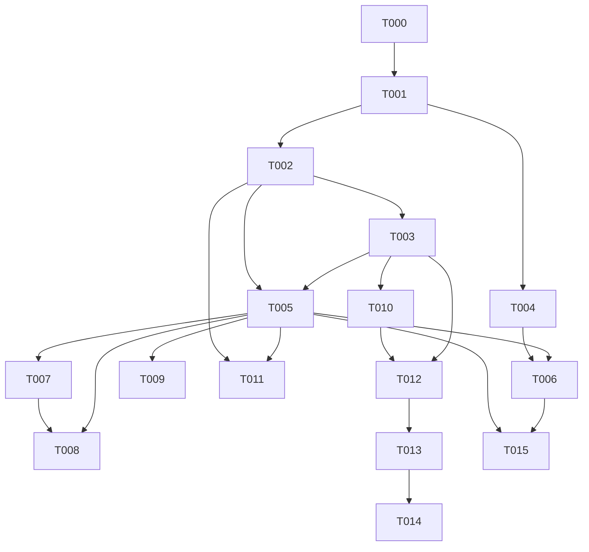

# Natives Agent Runtime 可执行升级任务

> 顺序即依赖顺序。TASK-001–004 是进入任何新 Agent 功能开发前的合并门槛。

## TASK-000：冻结基线与一次性全量验证

- 优先级：P1
- 对应问题：L01、L02、F04
- 前置任务：无
- 涉及文件：CI workflow、测试脚本、`NATIVE_ENGINE_FULL_REMEDIATION.md`（唯一权威进度源）
- 修改内容：资源空闲后用共享 target 跑一次完整命令；建立 native/compat/test capability matrix；列出 10 个 crash point。
- 禁止事项：不反复 `cargo test --workspace`；不把旧报告当本次结果；不新增进度快照。
- 测试：fmt/check/test/clippy、typecheck/lint/test、protocol/native verifier。
- 验收标准：每条命令记录 commit、时间、exit code、失败日志；真实 Provider 未运行明确标注。
- 回滚方式：仅文档/CI，可直接回滚。
- 预计复杂度：S

## TASK-001：把路径校验移到 Checkpoint I/O 之前

- 优先级：P0
- 对应问题：N01
- 前置任务：TASK-000
- 涉及文件：`crates/capability-gateway/src/lib.rs`、路径 policy helper、`src-agent-daemon/src/production_tools.rs`、`src-agent-daemon/src/checkpoint.rs`
- 修改内容：复用 Gateway canonical resolver；Tool preflight 返回 canonical project-relative write paths；Checkpoint 只接受该值。删除 raw path 的信任判断。
- 禁止事项：不在 Core 复制 PathScope；不靠 `contains("..")`；不在 Gateway deny 前读取文件。
- 测试：absolute、`..`、symlink escape、不存在路径、多文件 apply_patch、权限 deny；断言 fs read/checkpoint/handler 次数均为 0。
- 验收标准：所有拒绝路径在 checkpoint 表和 artifact 中无记录；合法路径 before/after 正确。
- 回滚方式：整个安全 commit 回滚；不提供关闭校验的 feature flag。
- 预计复杂度：M

## TASK-002：实现 Tool Effect 原子结算与真实 Ledger Cursor

- 优先级：P0
- 对应问题：D03、D04、G01、G02、F02
- 前置任务：TASK-001
- 涉及文件：`side_effect_ledger.rs`、`event_log.rs`、`event_seq.rs`、`production_tools.rs`、`engine.rs`、`checkpoint.rs`、`run_manager.rs`、storage migration、assistant protocol resume/error 类型
- 修改内容：增加 ledger_sequence/replay_contract/idempotency/external reference；新增 Daemon store command 原子提交 Ledger settlement + Tool fact/outbox；Checkpoint 写真实 ledger watermark；durable uncertain 写失败时禁止 resumable checkpoint。
- 禁止事项：不让 agent-core 依赖 rusqlite；不把 event sequence 继续冒充 ledger cursor；不自动重放 external/unknown。
- 测试：handler 返回后、completed 写前、ToolCompleted 写前、checkpoint 前逐点 kill；重启后 invocation count 恰为 1，Resume 为 Blocked/Confirm。
- 验收标准：任一 side-effect started 记录都有 terminal 或被恢复器判 uncertain；无法证明 safe 时自动 Resume 为 0 次。
- 回滚方式：migration additive；可关闭 auto-resume，不能跳过 intent-first。
- 预计复杂度：XL

## TASK-003：建立 Typed Turn 幂等 Conversation Projector

- 优先级：P0
- 对应问题：N02、F02、H02、B01、N06
- 前置任务：TASK-002 的 event/store transaction contract
- 涉及文件：`conversation_store.rs`、新 `conversation_projector.rs`、`event_log.rs`、`production.rs`、`run_manager.rs`、migration
- 修改内容：TurnCompleted 触发 projector；单事务 upsert turn+assistant+tool results+blocks+watermark；启动恢复所有 committed typed turn；坏 event 隔离对应 run。
- 禁止事项：不静默跳过 deserialize 错误；不以 message id 冲突代表“已完成”；不双写两套真相。
- 测试：assistant insert 后/每个 tool result 后/commit 前 kill；重复 projector；内容冲突；partial Turn；legacy delta-only。
- 验收标准：event-derived canonical transcript 与 reload AgentMessage 相等；下一 Provider request 保留完整 tool pair。
- 回滚方式：保留 run_event；停止 projector 后可用修复版本重跑，不删除 watermark。
- 预计复杂度：L

## TASK-004：修复 Shell Pipe Drain、Unicode 截断和资源回收

- 优先级：P0
- 对应问题：J02、H03
- 前置任务：TASK-001（可与 TASK-002/003 并行，但独立分支）
- 涉及文件：`crates/capability-gateway/src/process_supervisor.rs`、terminal handler/tests、`production_tools.rs`
- 修改内容：spawn 后并发 drain stdout/stderr；使用有界 byte ring；安全 UTF-8 lossy/char boundary；cancel/timeout kill+wait+join reader。
- 禁止事项：不继续“退出后 read_to_end”；不使用任意 byte offset 切 `str`；不遗忘后台 child。
- 测试：10MB stdout/stderr、交错、CJK/emoji、background、cancel/timeout race、cleanup failed、registry quiet。
- 验收标准：无 hang/panic/orphan；Result 后无迟到 completed；RSS 有界。
- 回滚方式：独立 supervisor commit 可回滚；旧实现不得用于 production。
- 预计复杂度：L

## TASK-005：将同步 SQLite 移入 Bounded Storage Actor

- 优先级：P1
- 对应问题：F01、H02、H04
- 前置任务：TASK-002、TASK-003 已定义事务 command
- 涉及文件：`storage/mod.rs`、新 `storage/actor.rs`、所有 async store caller、event/queue/interaction/checkpoint stores
- 修改内容：单 bounded writer actor 在 blocking thread 执行 rusqlite；按事务域提供 command；读路径先 `spawn_blocking`，有数据后再评估 read pool。
- 禁止事项：不直接引入 ORM；不创建无界 DB queue；不先做多 writer。
- 测试：10 Run 并发、queue full、actor crash、shutdown drain、DB busy；记录 p50/p95/p99 和 Tokio stall。
- 验收标准：production async function 不直接锁 `Mutex<Connection>`；queue 满时关键写 fail closed，非关键 progress 可丢且计数。
- 回滚方式：回到单 `spawn_blocking` writer adapter，不回到 async worker 同步 SQL。
- 预计复杂度：XL

## TASK-006：Progress 全链路有界化

- 优先级：P1
- 对应问题：H03、J03
- 前置任务：TASK-004、TASK-005
- 涉及文件：`production_tools.rs`、ToolProgressSink、MCP callback、Sub Agent progress、protocol 可选 dropped 字段、Renderer projection
- 修改内容：固定消息/字节容量；同 stream 合并；late drop；dropped_bytes 指标；关键 result 使用独立可靠路径。
- 禁止事项：不让 Progress 持久失败使 Tool Result 丢失；不引入完整 scheduler 重写。
- 测试：100MB producer、慢 EventStore、Renderer 断连、cancel、result late update。
- 验收标准：RSS/queue 固定上限；Result 后 progress event 为 0；dropped bytes 可查询。
- 回滚方式：可关闭实时 progress，保留最终 output；不能回无界 channel。
- 预计复杂度：M

## TASK-007：Permission Decision Outbox 与幂等响应

- 优先级：P1
- 对应问题：A02、J04
- 前置任务：TASK-005
- 涉及文件：`interaction_store.rs`、`production_tools.rs`、`run_manager.rs` permission API、RPC tests、migration（如需 outbox）
- 修改内容：CAS decision + event outbox 同事务；waiter 按 id 拉取/唤醒；相同重复响应返回原 decision，冲突响应拒绝；过期 fail closed。
- 禁止事项：不先置 resolved 再 best-effort 唤醒；Renderer 不直接改变 Run/Tool 状态。
- 测试：双击 allow、allow/deny race、断连、daemon restart、event failure、timeout/cancel。
- 验收标准：每个 permission id 最多一次有效 decision，每个 Tool handler 最多调用一次。
- 回滚方式：保留旧 interaction columns；新 outbox additive。
- 预计复杂度：L

## TASK-008：Sub Agent Durable Reservation 与失败策略

- 优先级：P1
- 对应问题：E02、E03、E04、N05
- 前置任务：TASK-005、TASK-007
- 涉及文件：`agent-core/src/subagents.rs`、`production_tools.rs`、`subagent_store.rs`、`run_manager.rs`、migration、subagent integration tests
- 修改内容：先 scope/hook/preflight，再 durable reserve，事务创建 session/run；持久 budget/depth/count；usage 增量结算；真实实现或移除 FailFast/RequireAll；修正 project identity。
- 禁止事项：不存 credential secret；不在 create_run 后才检查 quota；不忽略 scope persist error。
- 测试：三层 nested、重启 rehydrate、父 cancel、hook deny、quota deny、token/tool overrun、三 failure policies、DB failure。
- 验收标准：无 orphan session/run；child 权限/allowlist/path/key 只收紧；重启不重置预算。
- 回滚方式：可暂时仅暴露 Isolate；durable reservation 数据保留。
- 预计复杂度：XL

## TASK-009：Bounded UDS Frame 与 Session 精确清理

- 优先级：P1
- 对应问题：N04
- 前置任务：TASK-005（可独立提前）
- 涉及文件：`src-agent-daemon/src/rpc.rs`、Host daemon client、protocol transport tests
- 修改内容：握手/RPC 最大帧；超限断开；大 payload 用 artifact ref；断开仅删除当前 session token，不按 client_id 清掉并发连接。
- 禁止事项：不依赖 JSON parse 后才检查大小；不放宽 socket/token auth。
- 测试：无换行大帧、边界帧、并发同 client sessions、invalid UTF-8/JSON、slowloris。
- 验收标准：分配有界、合法 session 不被同 client 另一断连误删。
- 回滚方式：上限可配置但有安全默认；不能设无限。
- 预计复杂度：M

## TASK-010：Context Overflow 有界恢复

- 优先级：P1
- 对应问题：C03、I03、I02
- 前置任务：TASK-003
- 涉及文件：provider adapter error mapping、`agent-core/src/engine.rs`/小型 TurnPolicy、context/compaction tests
- 修改内容：统一 ContextOverflow；每用户输入最多一次 compact retry；NothingToCompact 明确失败；attempt 记录 provider request id。
- 禁止事项：不无限压缩/重试；不把 provider wire 放 Core；不把普通 400 都归 overflow。
- 测试：OpenAI/Anthropic/Gemini fixtures、cancel during compaction、summary failure、tool pairing、KV-cache prefix。
- 验收标准：每输入 Provider overflow 恢复次数 ≤1；无 tool 重放。
- 回滚方式：关闭 overflow auto-retry，返回明确错误。
- 预计复杂度：M

## TASK-011：跨 Run Conflict Lease 与完成顺序事件

- 优先级：P1
- 对应问题：D02
- 前置任务：TASK-002、TASK-005
- 涉及文件：Gateway capability、Core tool batch、Daemon scheduler registry、events/tests
- 修改内容：Daemon 按 Gateway conflict_key/exclusive 获取 lease；permission 全批 preflight；parallel completed 按真实完成序，result 按源序。
- 禁止事项：不按工具名硬编码并发分类；不把 Gateway 变 Agent loop；不让一个 permission ask 后其他 side-effect 抢跑。
- 测试：同/异 key 跨 Run、Sequential/Exclusive 混批、one failure、cancel、permission ask。
- 验收标准：相同 key 最大并发 1；异 key ParallelSafe 实际并发；lease 无泄漏。
- 回滚方式：全工具退回 sequential 安全模式。
- 预计复杂度：L

## TASK-012：Typed/Legacy 与 Compatibility Runtime 收敛

- 优先级：P2
- 对应问题：A03、B01、B02、I01、J01、N03
- 前置任务：TASK-003、TASK-010
- 涉及文件：`agent-core/src/engine.rs`、新/现有 compat module、`production.rs`、`routing.rs`、CLI runtime capability、conversation fixture adapter
- 修改内容：EngineMessage 和 legacy provider API 只留 compat；Native production typed-only；明确 block 降级；fixture 显式模式，不按 ID 前缀猜测；CLI runtime 标 capability degraded。
- 禁止事项：不直接删除旧 DB reader；不嵌入 Pi；不改变 Run terminal authority。
- 测试：typed round-trip、legacy migration、Thinking/Image/Custom、CLI/native capability matrix。
- 验收标准：非 compat production `EngineMessage` 引用 0；所有 Native provider/tool 统一入口。
- 回滚方式：保留只读 compat reader 一个发布周期。
- 预计复杂度：L

## TASK-013：按领域边界拆分巨型控制器

- 优先级：P2
- 对应问题：A01、A02、D05
- 前置任务：TASK-001–012
- 涉及文件：`engine.rs`、`run_manager.rs`、`production_tools.rs`、`conversation_store.rs`、`rpc.rs`
- 修改内容：按 Turn driver、provider attempt、tool batch、lifecycle、recovery、projector、transport/auth/dispatch 抽取；保持 facade 和公共 trait。
- 禁止事项：不机械按行拆；不增加只有一个实现的 factory；不跨 crate 移动 authority。
- 测试：现有 contract/fault 全量；git diff 不改变 protocol/db behavior。
- 验收标准：每个新模块有单一状态域；依赖方向符合 layering standard；行为快照一致。
- 回滚方式：每个域单独 commit，可逐一回滚。
- 预计复杂度：XL

## TASK-014：增加最小 Rust AgentRuntime Facade

- 优先级：P2
- 对应问题：K01、K02、L03
- 前置任务：TASK-013 和全量可靠性门通过
- 涉及文件：新 facade crate/agent-core public API、examples、release CI、Cargo metadata
- 修改内容：builder、prompt、subscribe、steer/follow_up、abort/wait；InMemorySession/EventStore/FakeProvider；Daemon adapter；license/repository/rust-version/semver/SBOM。
- 禁止事项：不建立第二 loop；InMemory 不宣称 crash-safe；不复制 Pi Session/CLI/TUI。
- 测试：外部临时 crate 只依赖 facade；两工具 quick start；Daemon adapter conformance。
- 验收标准：`cargo package` dry-run；example 可运行；Facade 与 Daemon 使用同 AgentEngine contract。
- 回滚方式：Facade 新 crate 独立删除，不影响 production Daemon。
- 预计复杂度：L

## TASK-015：Runtime Metrics Sink

- 优先级：P2
- 对应问题：H04、H03、F01
- 前置任务：TASK-005、TASK-006
- 涉及文件：Daemon runtime metrics、可选 OTel adapter、测试 exporter
- 修改内容：Run/Turn/Provider/Tool latency、queue wait、DB append、checkpoint、resume/retry、uncertain、dropped progress、usage/cost。
- 禁止事项：不让 agent-core 依赖 OTel SDK；不记录 secret/tool raw input。
- 测试：一次 fixture Run 断言 12 项指标存在且 label cardinality 有界。
- 验收标准：指标可查询；run_id 不作为无限 cardinality 默认 label。
- 回滚方式：No-op sink 可保留，但生产默认至少有内部计数。
- 预计复杂度：M

## 依赖图

## 第一轮合并门槛

只有 TASK-001–004 全部满足以下条件，才允许进入新的 Agent feature Goal：

- 路径拒绝发生在任何 Checkpoint I/O 前。
- 副作用任意 crash point 后不自动重复执行。
- committed Turn 可从 event 完整恢复至 Provider history。
- Shell 大输出/Unicode/cancel 无 hang、panic、orphan。
- RunManager 仍是唯一 terminal authority；UI/RPC/DB 产品模型未被绕开。
